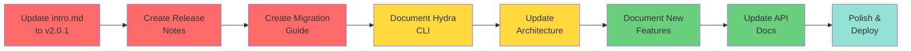

# Documentation Update - Quick Start Guide

**🎯 Goal:** Update Docusaurus docs from v1.7.6 to v2.0.1  
**⏱️ Time:** 6 weeks (76-95 hours)  
**📊 Files:** 49+ files to update/create

---

## 🚀 Getting Started (5 Minutes)

### 1. Review Current State
```bash
cd /mnt/d/Users/Simon/OneDrive/Documents/GitHub/IGN_LIDAR_HD_DATASET

# Check what needs updating
grep -r "1\.7\.[0-9]" website/docs/ --include="*.md" | wc -l
# Expected: 20+ files with v1.7.x references

# Check codebase version
grep "version" pyproject.toml | head -1
# Expected: version = "2.0.1"
```

### 2. Set Up Workspace
```bash
# Install documentation dependencies
cd website
npm install

# Test current build
npm run build

# Start dev server (for previewing changes)
npm run start
# Opens http://localhost:3000
```

### 3. Create Tracking Board
```bash
# Option 1: Use GitHub Issues
# Create milestone: "Documentation v2.0.1 Update"
# Create issues from DOCUSAURUS_UPDATE_PLAN.md checklist

# Option 2: Use GitHub Projects
# Create project board with columns: To Do, In Progress, Review, Done
# Add cards for each week's tasks
```

---

## 📅 Week-by-Week Quick Reference

### **Week 1: Critical Foundation** ⚠️ MUST DO FIRST

**Priority Files (6):**
1. ✅ `intro.md` - Update version to 2.0.1
2. ✅ `release-notes/v2.0.0.md` - CREATE NEW
3. ✅ `release-notes/v2.0.1.md` - CREATE NEW
4. ✅ `architecture.md` - Complete rewrite
5. ✅ `guides/migration-v1-to-v2.md` - CREATE NEW
6. ✅ Add migration banner to intro.md

**Quick Commands:**
```bash
# Update intro.md version
sed -i 's/Version 1\.7\.6/Version 2.0.1/g' website/docs/intro.md

# Create release notes files
touch website/docs/release-notes/v2.0.0.md
touch website/docs/release-notes/v2.0.1.md
touch website/docs/guides/migration-v1-to-v2.md

# Check progress
git status
```

**Deliverable:** Users see v2.0.1 as current version and know how to migrate.

---

### **Week 2: CLI & Configuration** ⚠️ CRITICAL

**Priority Files (5):**
1. ✅ `guides/hydra-cli.md` - CREATE NEW
2. ✅ `api/cli.md` - Major update for dual CLI
3. ✅ `guides/configuration-system.md` - CREATE NEW
4. ✅ `api/configuration.md` - Complete rewrite

**Quick Commands:**
```bash
# Create new guides
touch website/docs/guides/hydra-cli.md
touch website/docs/guides/configuration-system.md

# Check for old CLI patterns
grep -r "ign-lidar-hd enrich" website/docs/

# Preview Hydra configs
ls -la ign_lidar/configs/
cat ign_lidar/configs/config.yaml
```

**Deliverable:** Complete CLI documentation for both legacy and Hydra systems.

---

### **Week 3: New Features** 🆕

**Priority Files (5):**
1. ✅ `features/boundary-aware.md` - CREATE NEW
2. ✅ `features/tile-stitching.md` - CREATE NEW
3. ✅ `features/multi-architecture.md` - CREATE NEW
4. ✅ `features/enriched-laz-only.md` - CREATE NEW
5. ✅ `guides/unified-pipeline.md` - CREATE NEW

**Quick Commands:**
```bash
# Create features directory if needed
mkdir -p website/docs/features

# Create new feature docs
touch website/docs/features/boundary-aware.md
touch website/docs/features/tile-stitching.md
touch website/docs/features/multi-architecture.md
touch website/docs/features/enriched-laz-only.md
touch website/docs/guides/unified-pipeline.md
```

**Deliverable:** All v2.0 features documented with examples.

---

### **Week 4: API Updates** 📚

**Priority Files (10):**
1. ✅ `api/core-module.md` - CREATE NEW
2. ✅ `api/preprocessing-module.md` - CREATE NEW
3. ✅ `api/config-module.md` - CREATE NEW
4. ✅ `api/io-module.md` - CREATE NEW
5. ✅ `api/processor.md` - Update import paths
6. ✅ `api/features.md` - Add new features
7. ✅ `api/gpu-api.md` - Add chunked processing

**Quick Commands:**
```bash
# Create new API docs
touch website/docs/api/core-module.md
touch website/docs/api/preprocessing-module.md
touch website/docs/api/config-module.md
touch website/docs/api/io-module.md

# Find old import patterns
grep -r "from ign_lidar import" website/docs/
```

**Deliverable:** Complete API reference for v2.0 architecture.

---

### **Week 5: Guides & Workflows** 📖

**Priority Files (8):**
1. ✅ `guides/quick-start.md` - Update for v2.0
2. ✅ `guides/basic-usage.md` - Update workflows
3. ✅ `workflows.md` - Rewrite for unified pipeline
4. ✅ `guides/complete-workflow.md` - Update examples
5. ✅ `guides/gpu-acceleration.md` - Add v2.0 content

**Quick Commands:**
```bash
# Check which guides need updating
ls -la website/docs/guides/

# Preview workflow docs
cat website/docs/workflows.md | head -50
```

**Deliverable:** All user guides updated with v2.0 workflows.

---

### **Week 6: Polish & Deploy** ✨

**Tasks:**
- Update reference docs
- Fix all cross-references
- Update diagrams
- Test all examples
- Final QA
- Deploy to production

**Quick Commands:**
```bash
# Final validation
cd website

# Build documentation
npm run build

# Check for broken links
npx broken-link-checker http://localhost:3000 -ro

# Search functionality test
npm run serve
# Test search for "Hydra", "boundary-aware", "v2.0"

# Deploy (when ready)
npm run deploy
```

**Deliverable:** Complete, tested, deployed v2.0.1 documentation.

---

## 🎯 Critical Path (Must Complete in Order)



---

## 📝 Daily Workflow Template

### Morning (Planning)
```bash
# 1. Pull latest changes
git pull origin main

# 2. Check today's task from plan
cat DOCUSAURUS_UPDATE_PLAN.md | grep "Week X: Day Y"

# 3. Start dev server for preview
cd website
npm run start &
```

### During Work (Editing)
```bash
# 4. Edit documentation file
code website/docs/[filename].md

# 5. Preview changes at http://localhost:3000

# 6. Test code examples
python examples/test_example.py

# 7. Check for broken links
npx markdown-link-check website/docs/[filename].md
```

### Evening (Review)
```bash
# 8. Build to catch errors
npm run build

# 9. Commit changes
git add website/docs/[filename].md
git commit -m "docs: update [filename] for v2.0.1"

# 10. Push to branch
git push origin docs-update-v2.0.1

# 11. Update tracking (GitHub issue/project board)
```

---

## 🔍 Quality Checks Before Committing

### Checklist for Each File
- [ ] Version references updated (no v1.7.x)
- [ ] Import paths correct (`from ign_lidar.core import ...`)
- [ ] CLI commands use correct syntax
- [ ] Code examples tested
- [ ] Links work (internal and external)
- [ ] Spelling checked
- [ ] Diagrams render (if any)
- [ ] Mobile-friendly (preview in mobile view)

### Quick Validation Commands
```bash
# Check version references
grep -n "1\.7" website/docs/[filename].md

# Check import patterns
grep -n "from ign_lidar import" website/docs/[filename].md

# Check broken links
npx markdown-link-check website/docs/[filename].md

# Spell check (if aspell installed)
aspell check website/docs/[filename].md
```

---

## 🚨 Common Issues & Solutions

### Issue: Build Fails
```bash
# Check error message
npm run build 2>&1 | tee build-errors.log

# Common fixes:
# 1. Missing frontmatter
# 2. Broken markdown syntax
# 3. Invalid mermaid diagrams
# 4. Unescaped special characters
```

### Issue: Search Not Finding New Content
```bash
# Clear search index
rm -rf website/.docusaurus

# Rebuild
npm run build
```

### Issue: Diagrams Not Rendering
```bash
# Validate mermaid syntax at:
# https://mermaid.live/

# Common issues:
# - Missing graph type (graph TB, flowchart LR, etc.)
# - Syntax errors in node definitions
# - Invalid arrows
```

### Issue: Links Broken After Restructure
```bash
# Find all links to a file
grep -r "guides/old-filename" website/docs/

# Update with new path
sed -i 's|guides/old-filename|guides/new-filename|g' website/docs/**/*.md
```

---

## 📊 Progress Tracking

### Simple Progress Counter
```bash
# Count completed files
TOTAL_FILES=49
COMPLETED=$(find website/docs -name "*.md" -newer .docs-update-start | wc -l)
PERCENT=$((COMPLETED * 100 / TOTAL_FILES))

echo "Progress: $COMPLETED/$TOTAL_FILES files ($PERCENT%)"
```

### Create Progress Marker
```bash
# Mark start time
touch .docs-update-start

# Check progress anytime
find website/docs -name "*.md" -newer .docs-update-start -exec echo "✅ {}" \;
```

---

## 🎉 Quick Wins (Do These First!)

These give immediate visible results:

### 1. Update Version Badge (5 min)
```bash
# Edit intro.md
sed -i 's/Version 1\.7\.6/Version 2.0.1/g' website/docs/intro.md
git commit -am "docs: update version to 2.0.1"
```

### 2. Add Migration Banner (10 min)
Add to top of `intro.md`:
```markdown
:::tip Major Update: v2.0.1
Complete architecture overhaul with Hydra CLI! See [Migration Guide](/guides/migration-v1-to-v2).
:::
```

### 3. Create Empty Files (5 min)
```bash
# Create all new files so they appear in navigation
touch website/docs/release-notes/v2.0.0.md
touch website/docs/release-notes/v2.0.1.md
touch website/docs/guides/migration-v1-to-v2.md
touch website/docs/guides/hydra-cli.md
# ... etc
```

---

## 📞 Getting Help

### Resources
- **Full Plan:** `DOCUSAURUS_UPDATE_PLAN.md`
- **Audit Report:** `DOCUSAURUS_AUDIT_REPORT.md`
- **Example Update:** `DOCS_UPDATE_EXAMPLE.md`
- **Task Checklist:** `DOCS_UPDATE_CHECKLIST.md`

### Documentation
- Docusaurus: https://docusaurus.io/docs
- Markdown Guide: https://www.markdownguide.org/
- Mermaid Diagrams: https://mermaid.js.org/

### Code References
- Hydra configs: `ign_lidar/configs/`
- New modules: `ign_lidar/core/`, `ign_lidar/features/`, etc.
- Changelog: `CHANGELOG.md`
- Current README: `README.md` (accurate for v2.0.1)

---

## 🎯 Success = These 3 Things

1. **User sees v2.0.1 as current version** ✅
2. **User can find Hydra CLI docs** ✅
3. **User can migrate from v1.x** ✅

Everything else supports these three goals!

---

**Ready to Start?**

```bash
# Step 1: Create working branch
git checkout -b docs-update-v2.0.1

# Step 2: Start with Week 1, Day 1
# Open: DOCUSAURUS_UPDATE_PLAN.md
# Follow: Week 1 tasks

# Step 3: Make first commit
# Update intro.md version as first task

# Let's go! 🚀
```
