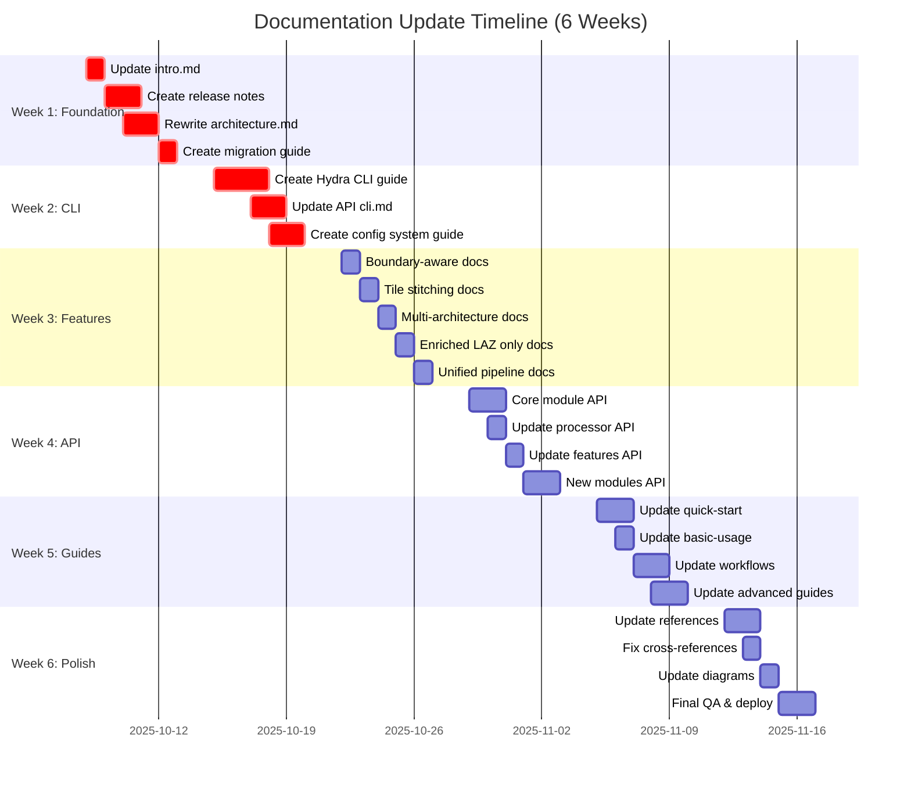
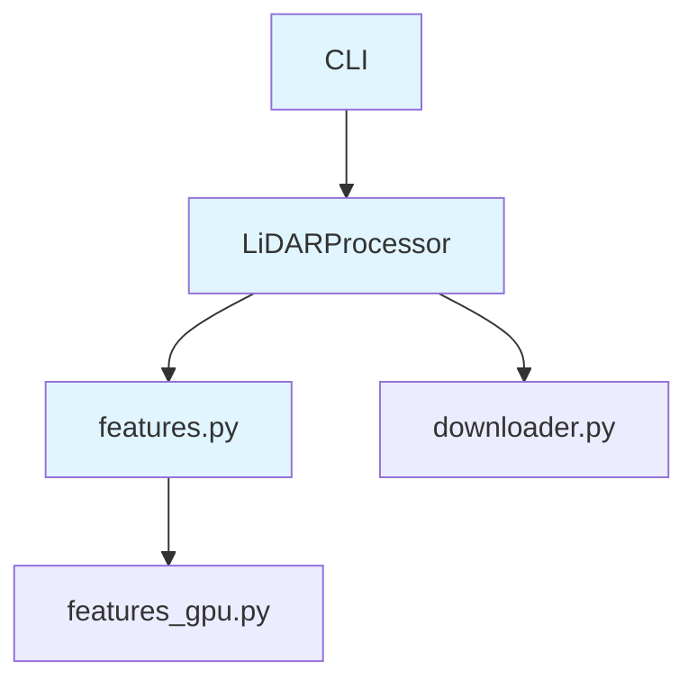
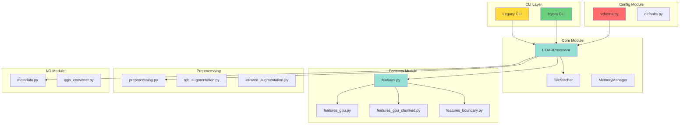

# Documentation Update Visual Roadmap

**Project:** IGN LiDAR HD Documentation v2.0.1 Update  
**Timeline:** 6 Weeks  
**Scope:** 49+ files  

---

## 🗺️ High-Level Roadmap



---

## 📊 File Status Dashboard

### Legend
- 🔴 **Not Started** - 0% complete
- 🟡 **In Progress** - 1-99% complete  
- 🟢 **Complete** - 100% complete
- ⭐ **Critical Path** - Must complete first

---

## Week 1: Critical Foundation ⭐

| File | Status | Priority | Owner | Est. Time |
|------|--------|----------|-------|-----------|
| `intro.md` | 🔴 | CRITICAL ⭐ | - | 60 min |
| `release-notes/v2.0.0.md` | 🔴 | CRITICAL ⭐ | - | 90 min |
| `release-notes/v2.0.1.md` | 🔴 | CRITICAL ⭐ | - | 45 min |
| `architecture.md` | 🔴 | CRITICAL ⭐ | - | 90 min |
| `guides/migration-v1-to-v2.md` | 🔴 | CRITICAL ⭐ | - | 90 min |

**Week 1 Total:** 6 hours

---

## Week 2: CLI & Configuration ⭐

| File | Status | Priority | Owner | Est. Time |
|------|--------|----------|-------|-----------|
| `guides/hydra-cli.md` | 🔴 | CRITICAL ⭐ | - | 90 min |
| `api/cli.md` | 🔴 | CRITICAL ⭐ | - | 90 min |
| `guides/configuration-system.md` | 🔴 | CRITICAL ⭐ | - | 75 min |
| `api/configuration.md` | 🔴 | CRITICAL ⭐ | - | 75 min |

**Week 2 Total:** 5.5 hours

---

## Week 3: New Features

| File | Status | Priority | Owner | Est. Time |
|------|--------|----------|-------|-----------|
| `features/boundary-aware.md` | 🔴 | HIGH | - | 60 min |
| `features/tile-stitching.md` | 🔴 | HIGH | - | 60 min |
| `features/multi-architecture.md` | 🔴 | HIGH | - | 60 min |
| `features/enriched-laz-only.md` | 🔴 | HIGH | - | 45 min |
| `guides/unified-pipeline.md` | 🔴 | HIGH | - | 60 min |

**Week 3 Total:** 4.75 hours

---

## Week 4: API Updates

| File | Status | Priority | Owner | Est. Time |
|------|--------|----------|-------|-----------|
| `api/core-module.md` | 🔴 | HIGH | - | 75 min |
| `api/preprocessing-module.md` | 🔴 | MEDIUM | - | 45 min |
| `api/config-module.md` | 🔴 | MEDIUM | - | 45 min |
| `api/io-module.md` | 🔴 | MEDIUM | - | 45 min |
| `api/processor.md` | 🔴 | MEDIUM | - | 45 min |
| `api/features.md` | 🔴 | MEDIUM | - | 30 min |
| `api/gpu-api.md` | 🔴 | MEDIUM | - | 30 min |
| `api/datasets.md` | 🔴 | MEDIUM | - | 30 min |

**Week 4 Total:** 5.75 hours

---

## Week 5: Guides & Workflows

| File | Status | Priority | Owner | Est. Time |
|------|--------|----------|-------|-----------|
| `guides/quick-start.md` | 🔴 | HIGH | - | 45 min |
| `guides/basic-usage.md` | 🔴 | HIGH | - | 60 min |
| `workflows.md` | 🔴 | HIGH | - | 60 min |
| `guides/complete-workflow.md` | 🔴 | MEDIUM | - | 45 min |
| `guides/gpu-acceleration.md` | 🔴 | MEDIUM | - | 30 min |
| `guides/preprocessing.md` | 🔴 | MEDIUM | - | 20 min |
| `tutorials/custom-features.md` | 🔴 | MEDIUM | - | 30 min |

**Week 5 Total:** 4.5 hours

---

## Week 6: Polish & Deploy

| Category | Status | Tasks | Est. Time |
|----------|--------|-------|-----------|
| Reference docs | 🔴 | 7 files × 15 min | 1.75 hrs |
| Cross-references | 🔴 | Link validation | 1 hr |
| Diagrams | 🔴 | 5 diagrams | 2 hrs |
| Testing | 🔴 | All examples | 2 hrs |
| QA | 🔴 | Full review | 2 hrs |
| Deployment | 🔴 | Build & deploy | 1 hr |

**Week 6 Total:** 9.75 hours

---

## 📈 Progress Tracking

### Overall Progress

```
█░░░░░░░░░ 0/49 files (0%)

Target: 49+ files
Completed: 0
In Progress: 0
Not Started: 49
```

### By Priority

```
CRITICAL (⭐):  ░░░░░░░░░░ 0/9 files
HIGH:          ░░░░░░░░░░ 0/15 files
MEDIUM:        ░░░░░░░░░░ 0/17 files
LOW:           ░░░░░░░░░░ 0/8 files
```

### By Week

```
Week 1: ░░░░░░░░░░ 0/6 files (0%)
Week 2: ░░░░░░░░░░ 0/4 files (0%)
Week 3: ░░░░░░░░░░ 0/5 files (0%)
Week 4: ░░░░░░░░░░ 0/8 files (0%)
Week 5: ░░░░░░░░░░ 0/7 files (0%)
Week 6: ░░░░░░░░░░ 0/19 items (0%)
```

---

## 🎯 Milestones

### Milestone 1: Version Visible (End of Week 1)
- ✅ intro.md shows v2.0.1
- ✅ Release notes published
- ✅ Migration guide available
- ✅ Architecture documented

**Success Metric:** Users see v2.0.1 on landing page

---

### Milestone 2: CLI Documented (End of Week 2)
- ✅ Hydra CLI fully documented
- ✅ Legacy CLI still documented
- ✅ Configuration system explained
- ✅ Examples for both CLIs

**Success Metric:** Users can use Hydra CLI from docs

---

### Milestone 3: Features Complete (End of Week 3)
- ✅ All new features documented
- ✅ Code examples for each feature
- ✅ Visual diagrams added
- ✅ Use cases explained

**Success Metric:** Users can use all v2.0 features

---

### Milestone 4: API Reference Complete (End of Week 4)
- ✅ All modules documented
- ✅ Import paths correct
- ✅ API examples tested
- ✅ Code snippets work

**Success Metric:** Developers can use v2.0 API

---

### Milestone 5: Guides Updated (End of Week 5)
- ✅ All workflows updated
- ✅ Quick start works
- ✅ Advanced guides complete
- ✅ Tutorials updated

**Success Metric:** Users can complete workflows

---

### Milestone 6: Production Ready (End of Week 6)
- ✅ All links working
- ✅ All examples tested
- ✅ Build succeeds
- ✅ Deployed to production

**Success Metric:** Documentation live and error-free

---

## 🔥 Burndown Chart (Update Weekly)

```
Files
Remaining
  49 ┤                                                      
  45 ┤                                                      
  40 ┤                                                      
  35 ┤                                                      
  30 ┤                                            
  25 ┤                                  
  20 ┤                        
  15 ┤              
  10 ┤    
   5 ┤
   0 └──────┴──────┴──────┴──────┴──────┴──────
     Week1  Week2  Week3  Week4  Week5  Week6

Current: 49 files (Start)
Target:   0 files (End of Week 6)
```

---

## 🎨 Architecture Evolution Diagram

### Before (v1.7.6)



### After (v2.0.1)



---

## 📱 Feature Coverage Matrix

| Feature | Documentation | Examples | Diagrams | Tests |
|---------|--------------|----------|----------|-------|
| **Hydra CLI** | 🔴 | 🔴 | 🔴 | 🔴 |
| **Boundary-Aware** | 🔴 | 🔴 | 🔴 | 🔴 |
| **Tile Stitching** | 🔴 | 🔴 | 🔴 | 🔴 |
| **Multi-Architecture** | 🔴 | 🔴 | 🔴 | 🔴 |
| **Enriched LAZ Only** | 🔴 | 🔴 | 🔴 | 🔴 |
| **Unified Pipeline** | 🔴 | 🔴 | 🔴 | 🔴 |
| **Corruption Recovery** | 🔴 | 🔴 | 🔴 | 🔴 |
| **GPU Chunking** | 🔴 | 🔴 | 🔴 | 🔴 |

Legend:
- 🔴 Not Started
- 🟡 In Progress
- 🟢 Complete

---

## 🚀 Deployment Pipeline


---

## 📞 Communication Schedule

| Week | Milestone | Communication |
|------|-----------|---------------|
| Week 1 | Foundation | "v2.0.1 docs in progress - foundation complete" |
| Week 2 | CLI Docs | "Hydra CLI now documented!" |
| Week 3 | Features | "All v2.0 features documented" |
| Week 4 | API | "Complete API reference available" |
| Week 5 | Guides | "All guides updated for v2.0.1" |
| Week 6 | Launch | "🎉 Complete v2.0.1 documentation released!" |

---

## 🎯 Daily Stand-up Template

### Questions to Answer
1. **Yesterday:** What docs did I complete?
2. **Today:** What docs will I work on?
3. **Blockers:** Any issues preventing progress?
4. **Help Needed:** Need review, input, or assistance?

### Example Entry
```
Date: October 8, 2025
Yesterday: Created release notes for v2.0.0 and v2.0.1
Today: Will rewrite architecture.md
Blockers: Need diagram for module interactions
Help Needed: Review release notes before committing
```

---

## 📊 Quality Metrics Dashboard

### Target Metrics

| Metric | Target | Current | Status |
|--------|--------|---------|--------|
| Files Updated | 49 | 0 | 🔴 0% |
| Code Examples Tested | 100% | 0% | 🔴 0% |
| Broken Links | 0 | ? | ⚪ Unknown |
| Build Success | Yes | ? | ⚪ Unknown |
| Load Time | <5s | ? | ⚪ Unknown |
| Search Coverage | >95% | ? | ⚪ Unknown |

---

## 🎉 Success Visualization

### When Complete, We'll Have:

```
✅ Version 2.0.1 visible everywhere
✅ Dual CLI system fully documented
✅ New modular architecture explained
✅ All 7 new features documented
✅ Complete API reference
✅ Migration guide for v1.x users
✅ 49+ updated/new documentation files
✅ 0 broken links
✅ All code examples tested
✅ Production deployment complete
```

---

**Update this file weekly to track progress!**

**Last Updated:** October 8, 2025  
**Status:** Planning Phase  
**Next Milestone:** Week 1 Foundation
