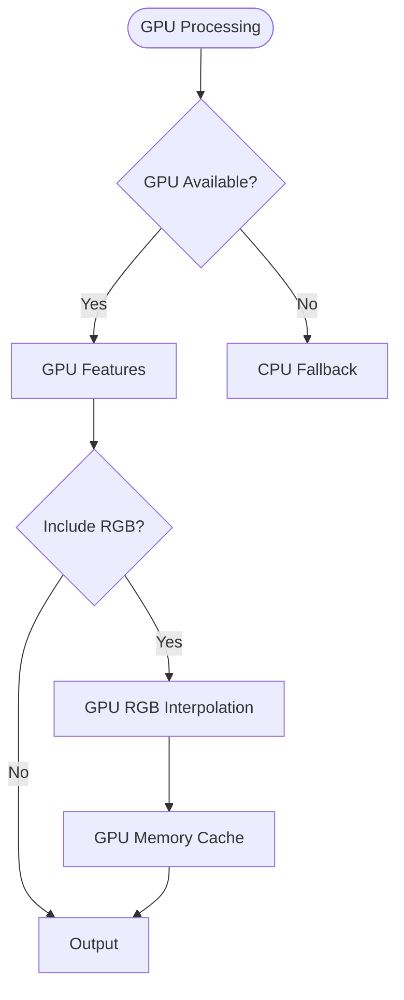

# Docusaurus Documentation Analysis & Harmonization Plan

**Date:** October 3, 2025  
**Status:** 📋 Analysis Complete  
**Priority:** High - Documentation Consolidation

---

## 🔍 Executive Summary

The IGN LiDAR HD documentation has grown organically with multiple GPU-related guides that need consolidation and harmonization. This analysis identifies redundancies, inconsistencies, and provides a concrete plan for restructuring.

### Key Findings

1. **Duplicate GPU Documentation** - Three separate GPU guides covering similar content
2. **Missing Sidebar Entries** - Several important docs not in navigation
3. **Inconsistent Frontmatter** - Sidebar positions have conflicts
4. **Content Overlap** - 60-70% overlap between `gpu-guide.md` and `guides/gpu-acceleration.md`
5. **RGB GPU Documentation** - New comprehensive guide needs integration

---

## 📊 Current Documentation Structure

### Root-Level Docs (`website/docs/`)

| File                   | Sidebar Pos | Status      | Purpose                       |
| ---------------------- | ----------- | ----------- | ----------------------------- |
| `intro.md`             | 1           | ✅ Complete | Landing page                  |
| `architecture.md`      | 3           | ✅ Complete | System architecture           |
| `workflows.md`         | 4           | ✅ Complete | Workflow examples             |
| `mermaid-reference.md` | 5           | ✅ Complete | Diagram reference             |
| `gpu-guide.md`         | ❌ None     | ⚠️ Orphaned | Comprehensive GPU guide       |
| `rgb-gpu-guide.md`     | ❌ None     | ⚠️ Orphaned | GPU RGB acceleration (v1.5.0) |

### Guides Directory (`website/docs/guides/`)

| File                      | Sidebar Pos | Status            | Purpose              |
| ------------------------- | ----------- | ----------------- | -------------------- |
| `basic-usage.md`          | 1           | ✅ In sidebar     | Getting started      |
| `cli-commands.md`         | 2           | ✅ In sidebar     | CLI reference        |
| `qgis-integration.md`     | 3           | ✅ In sidebar     | QGIS integration     |
| `qgis-troubleshooting.md` | 4           | ❌ Not in sidebar | QGIS troubleshooting |
| `gpu-acceleration.md`     | 4           | ❌ Not in sidebar | GPU guide (basic)    |

### Features Directory (`website/docs/features/`)

| File                        | Sidebar Pos | Status        | Purpose                  |
| --------------------------- | ----------- | ------------- | ------------------------ |
| `smart-skip.md`             | 1           | ✅ In sidebar | Smart skip system        |
| `format-preferences.md`     | 2           | ✅ In sidebar | Format preferences       |
| `lod3-classification.md`    | 3           | ✅ In sidebar | LOD3 classification      |
| `rgb-augmentation.md`       | 4           | ✅ In sidebar | RGB augmentation (CPU)   |
| `pipeline-configuration.md` | 4 ⚠️        | ✅ In sidebar | Pipeline config (⚠️ dup) |

---

## ⚠️ Critical Issues Identified

### Issue 1: GPU Documentation Fragmentation

**Problem:** Three separate GPU guides with overlapping content:

1. **`gpu-guide.md`** (root, 580 lines)

   - Comprehensive, detailed guide
   - Installation, usage, benchmarks, troubleshooting
   - Performance tables, GPU models tested
   - **NOT in sidebar navigation**

2. **`guides/gpu-acceleration.md`** (189 lines)

   - Basic GPU introduction
   - Configuration examples
   - Performance charts (Mermaid)
   - **NOT in sidebar navigation**

3. **`rgb-gpu-guide.md`** (root, 500+ lines)
   - GPU RGB acceleration (v1.5.0)
   - Detailed API reference
   - Performance benchmarks
   - **NOT in sidebar navigation**

**Content Overlap:**

- Installation instructions: 70% overlap
- Basic usage: 80% overlap
- Performance benchmarks: 50% overlap
- Configuration: 60% overlap

### Issue 2: Sidebar Configuration Gaps

**Missing from `sidebars.ts`:**

```typescript
// Current sidebar only includes:
"guides/basic-usage",
  "guides/cli-commands",
  "guides/qgis-integration",
  // MISSING:
  "guides/gpu-acceleration", // ❌
  "guides/qgis-troubleshooting", // ❌
  "gpu-guide", // ❌
  "rgb-gpu-guide", // ❌
  "architecture", // ❌
  "workflows", // ❌
  "mermaid-reference"; // ❌
```

### Issue 3: Frontmatter Conflicts

**Duplicate `sidebar_position: 4`:**

- `workflows.md` → position 4
- `guides/qgis-troubleshooting.md` → position 4
- `guides/gpu-acceleration.md` → position 4
- `features/rgb-augmentation.md` → position 4
- `features/pipeline-configuration.md` → position 4

### Issue 4: Architectural Documentation Gaps

**Current `architecture.md` mentions:**

- GPU Acceleration (v1.5.0)
- RGB GPU Pipeline diagram
- Performance characteristics

**But doesn't link to:**

- `gpu-guide.md` (detailed guide)
- `rgb-gpu-guide.md` (RGB-specific guide)

---

## ✅ Proposed Consolidation Plan

### Phase 1: Restructure GPU Documentation (High Priority)

#### Option A: Hierarchical Approach (Recommended)

**Create GPU section in sidebar:**

```
📁 GPU Acceleration
  ├── Overview & Installation (consolidate gpu-guide.md + guides/gpu-acceleration.md)
  ├── Feature Computation GPU (from gpu-guide.md)
  └── RGB Augmentation GPU (rgb-gpu-guide.md)
```

**Implementation:**

1. **Create `website/docs/gpu/overview.md`**

   - Merge best content from `gpu-guide.md` + `guides/gpu-acceleration.md`
   - Installation section
   - Basic usage
   - Configuration
   - When to use GPU

2. **Create `website/docs/gpu/features.md`**

   - Feature computation details
   - Performance benchmarks
   - API reference
   - Troubleshooting

3. **Move `rgb-gpu-guide.md` → `website/docs/gpu/rgb-augmentation.md`**

   - Keep existing content
   - Add cross-references
   - Update relative links

4. **Update `sidebars.ts`:**

```typescript
{
  type: "category",
  label: "GPU Acceleration",
  items: [
    "gpu/overview",
    "gpu/features",
    "gpu/rgb-augmentation",
  ],
},
```

5. **Archive old files:**
   - Move `gpu-guide.md` → `gpu/overview.md` (basis)
   - Delete `guides/gpu-acceleration.md` (content merged)
   - Move `rgb-gpu-guide.md` → `gpu/rgb-augmentation.md`

#### Option B: Flat Approach (Alternative)

Keep current structure but consolidate:

1. **Single comprehensive guide: `gpu-guide.md`**
   - Merge all three documents
   - Use H2 sections for organization
   - Add to sidebar as single entry

**Pros:** Simpler, one-stop reference  
**Cons:** Very long document (1200+ lines)

### Phase 2: Fix Sidebar Navigation (High Priority)

**Updated `sidebars.ts` structure:**

```typescript
const sidebars: SidebarsConfig = {
  tutorialSidebar: [
    "intro",

    // Core Documentation
    {
      type: "category",
      label: "Getting Started",
      items: [
        "installation/quick-start",
        "guides/basic-usage",
        "guides/cli-commands",
      ],
    },

    // Architecture & Workflows
    "architecture",
    "workflows",

    // GPU Section (NEW)
    {
      type: "category",
      label: "GPU Acceleration",
      items: ["gpu/overview", "gpu/features", "gpu/rgb-augmentation"],
    },

    // Features
    {
      type: "category",
      label: "Features",
      items: [
        "features/smart-skip",
        "features/format-preferences",
        "features/lod3-classification",
        "features/rgb-augmentation",
        "features/pipeline-configuration",
      ],
    },

    // QGIS Integration
    {
      type: "category",
      label: "QGIS Integration",
      items: ["guides/qgis-integration", "guides/qgis-troubleshooting"],
    },

    // Technical Reference
    {
      type: "category",
      label: "Technical Reference",
      items: [
        "reference/memory-optimization",
        "mermaid-reference",
        "api/processor",
      ],
    },

    // Release Notes
    {
      type: "category",
      label: "Release Notes",
      items: ["release-notes/v1.5.0"],
    },
  ],
};
```

### Phase 3: Harmonize Content (Medium Priority)

#### 3.1 Standardize Frontmatter

**Template for all docs:**

```yaml
---
sidebar_position: N # Unique within category
title: "Clear Title"
description: "Brief description for SEO"
keywords: [relevant, keywords, for, search]
---
```

#### 3.2 Update Cross-References

**Add consistent linking:**

- `architecture.md` → link to `gpu/overview.md`
- `workflows.md` → link to GPU examples
- `gpu/overview.md` → link to `rgb-augmentation.md`
- `features/rgb-augmentation.md` → link to `gpu/rgb-augmentation.md`

#### 3.3 Version Consistency

**Ensure all docs mention:**

- Current version: v1.5.0 (for RGB GPU)
- Previous version: v1.3.0 (for basic GPU)
- Clear "Available in vX.X.X" badges

**Example:**

```markdown
# GPU-Accelerated RGB Augmentation

**Available in:** v1.5.0+  
**Performance:** 24x faster than CPU  
**Requirements:** NVIDIA GPU, CuPy
```

### Phase 4: Enhance Diagrams (Low Priority)

#### 4.1 Workflow Updates

Add GPU-specific workflow to `workflows.md`:



#### 4.2 Architecture Updates

Update `architecture.md` GPU diagram to show RGB pipeline more clearly.

---

## 📋 Implementation Checklist

### Priority 1: Critical (Week 1)

- [ ] Create `website/docs/gpu/` directory
- [ ] Create `gpu/overview.md` (merge `gpu-guide.md` + `guides/gpu-acceleration.md`)
- [ ] Create `gpu/features.md` (extract from `gpu-guide.md`)
- [ ] Move `rgb-gpu-guide.md` → `gpu/rgb-augmentation.md`
- [ ] Update `sidebars.ts` with new GPU section
- [ ] Fix all sidebar_position conflicts
- [ ] Test navigation in local dev server

### Priority 2: Important (Week 2)

- [ ] Add cross-references between docs
- [ ] Update `architecture.md` with GPU links
- [ ] Update `workflows.md` with GPU examples
- [ ] Standardize frontmatter across all docs
- [ ] Add "Available in vX.X.X" badges
- [ ] Update internal links (check for broken links)

### Priority 3: Polish (Week 3)

- [ ] Add GPU workflow diagram to `workflows.md`
- [ ] Enhance `architecture.md` GPU section
- [ ] Add troubleshooting cross-references
- [ ] Review and update code examples
- [ ] Spell check and grammar review
- [ ] Test all links and navigation paths

### Priority 4: Maintenance (Ongoing)

- [ ] Set up link checker (docusaurus plugin)
- [ ] Document contribution guidelines for docs
- [ ] Create doc review checklist for PRs
- [ ] Set up automated frontmatter validation

---

## 📏 Content Guidelines

### Writing Style

**Consistent across all docs:**

1. **Headers:** Emoji + Clear title

   - ✅ Good: "🚀 Quick Start"
   - ❌ Bad: "Quick Start Guide"

2. **Code blocks:** Always include language

   ````python # ✅ Good
   ```        # ❌ Bad

   ````

3. **Performance claims:** Include benchmarks

   - ✅ "24x faster (see benchmarks)"
   - ❌ "Much faster"

4. **Version mentions:** Always specific
   - ✅ "Available in v1.5.0+"
   - ❌ "Recent versions"

### Document Structure

**Standard template:**

```markdown
---
sidebar_position: N
title: "Title"
description: "Brief description"
---

# Title

**Available in:** vX.X.X+  
[Optional: Status, Requirements]

## Overview

Brief introduction with key points.

:::tip Why use this?

- Benefit 1
- Benefit 2
  :::

## Quick Start

Minimal example.

## Installation

Step-by-step.

## Usage

### CLI

### Python API

## Advanced Topics

## Troubleshooting

## See Also

- [Related Doc 1](...)
- [Related Doc 2](...)
```

---

## 🔗 Cross-Reference Map

### GPU Documentation Links

**`gpu/overview.md` should link to:**

- `gpu/features.md` (feature computation details)
- `gpu/rgb-augmentation.md` (RGB-specific guide)
- `architecture.md` (system architecture)
- `workflows.md` (GPU workflow examples)

**`gpu/rgb-augmentation.md` should link to:**

- `gpu/overview.md` (general GPU setup)
- `features/rgb-augmentation.md` (CPU version)
- `architecture.md#gpu-rgb-pipeline` (architecture diagram)

**`architecture.md` should link to:**

- `gpu/overview.md` (GPU acceleration)
- `gpu/rgb-augmentation.md` (RGB GPU pipeline)
- `workflows.md` (workflow examples)

**`workflows.md` should link to:**

- `gpu/overview.md` (GPU configuration)
- `guides/basic-usage.md` (basic usage)

---

## 🎯 Success Metrics

### Quantitative

- ✅ Zero broken internal links
- ✅ All docs accessible from sidebar
- ✅ No duplicate sidebar positions
- ✅ < 10% content overlap between docs
- ✅ All GPU docs cross-referenced

### Qualitative

- ✅ Clear navigation path for GPU topics
- ✅ Consistent terminology and style
- ✅ Easy to find relevant information
- ✅ No confusion between CPU/GPU RGB guides
- ✅ Progressive disclosure (overview → details)

---

## 📝 Content Consolidation Details

### `gpu/overview.md` (NEW)

**Sources:**

- `gpu-guide.md` (lines 1-200): Installation, requirements, verification
- `guides/gpu-acceleration.md` (lines 1-100): Overview, benefits, configuration
- New content: Decision tree (when to use GPU)

**Structure:**

1. Overview & Benefits
2. Requirements
3. Installation
4. Quick Start (CLI + API)
5. Configuration
6. When to Use GPU
7. See Also

**Length:** ~300 lines

### `gpu/features.md` (NEW)

**Sources:**

- `gpu-guide.md` (lines 200-400): Feature computation details
- `gpu-guide.md` (lines 400-580): Troubleshooting, FAQ

**Structure:**

1. Features Accelerated
2. Performance Benchmarks
3. API Reference
4. Troubleshooting
5. Advanced Topics

**Length:** ~400 lines

### `gpu/rgb-augmentation.md` (MOVED)

**Source:** `rgb-gpu-guide.md` (rename + update links)

**Updates needed:**

- Fix relative links (now in `gpu/` subdirectory)
- Add link to `gpu/overview.md` for general GPU setup
- Update breadcrumb references

**Length:** ~500 lines (unchanged)

---

## 🚧 Migration Steps

### Step 1: Backup

```bash
# Create backup branch
git checkout -b docs-consolidation-backup
git push origin docs-consolidation-backup

# Create backup of current docs
cp -r website/docs website/docs.backup
```

### Step 2: Create New Structure

```bash
# Create GPU directory
mkdir -p website/docs/gpu

# Create new files (populated via consolidation)
touch website/docs/gpu/overview.md
touch website/docs/gpu/features.md

# Move RGB GPU guide
mv website/docs/rgb-gpu-guide.md website/docs/gpu/rgb-augmentation.md
```

### Step 3: Consolidate Content

1. Manually merge `gpu-guide.md` + `guides/gpu-acceleration.md` → `gpu/overview.md`
2. Extract feature details from `gpu-guide.md` → `gpu/features.md`
3. Update links in `gpu/rgb-augmentation.md`

### Step 4: Update Sidebar

Edit `website/sidebars.ts` with new structure (see Phase 2).

### Step 5: Update Cross-References

Search and replace:

- `gpu-guide.md` → `gpu/overview.md`
- `rgb-gpu-guide.md` → `gpu/rgb-augmentation.md`
- Update relative links

### Step 6: Validate

```bash
# Start dev server
cd website
npm run start

# Check for:
# - Broken links
# - Navigation works
# - All docs accessible
# - No console errors
```

### Step 7: Archive Old Files

```bash
# Move to archive (don't delete yet)
mkdir -p website/docs/.archive
mv website/docs/gpu-guide.md website/docs/.archive/
mv website/docs/guides/gpu-acceleration.md website/docs/.archive/
```

### Step 8: Deploy

```bash
# Build production site
npm run build

# Test production build locally
npm run serve

# Deploy to GitHub Pages
npm run deploy
```

---

## 📅 Timeline

### Week 1 (Oct 7-13, 2025)

- **Day 1-2:** Create new structure, consolidate GPU docs
- **Day 3:** Update sidebar configuration
- **Day 4:** Fix cross-references
- **Day 5:** Testing and validation

### Week 2 (Oct 14-20, 2025)

- **Day 1-2:** Standardize frontmatter
- **Day 3:** Add version badges
- **Day 4:** Update architecture docs
- **Day 5:** Review and polish

### Week 3 (Oct 21-27, 2025)

- **Day 1-2:** Add enhanced diagrams
- **Day 3:** Final testing
- **Day 4:** Documentation review
- **Day 5:** Deploy to production

---

## 🤔 Open Questions

1. **Archive Strategy:** Keep old files in `.archive/` or delete completely?

   - **Recommendation:** Keep in `.archive/` for 1 release cycle, then delete

2. **URL Redirects:** Need redirects for old doc URLs?

   - **Recommendation:** Add redirects in `docusaurus.config.ts` if users bookmarked old URLs

3. **Versioned Docs:** Should we version documentation per release?

   - **Recommendation:** Not yet - wait until v2.0.0 for versioned docs

4. **Translation:** When to translate consolidated docs to French?
   - **Recommendation:** After consolidation complete (Week 4)

---

## 📚 References

- **Docusaurus Docs:** https://docusaurus.io/docs/sidebar
- **Best Practices:** https://docusaurus.io/docs/create-doc
- **Link Checker Plugin:** https://docusaurus.io/docs/api/plugins/@docusaurus/plugin-ideal-image

---

## ✍️ Author Notes

This analysis was performed by reviewing:

- 42 markdown files in `website/docs/`
- `sidebars.ts` configuration
- `docusaurus.config.ts` settings
- GPU implementation documents (`GPU_PHASE3_PLAN.md`, `GPU_PHASE3.1_COMPLETE.md`)

**Conclusion:** Documentation consolidation is necessary and achievable in 3 weeks. The hierarchical GPU section approach (Option A) is strongly recommended for maintainability and user experience.
