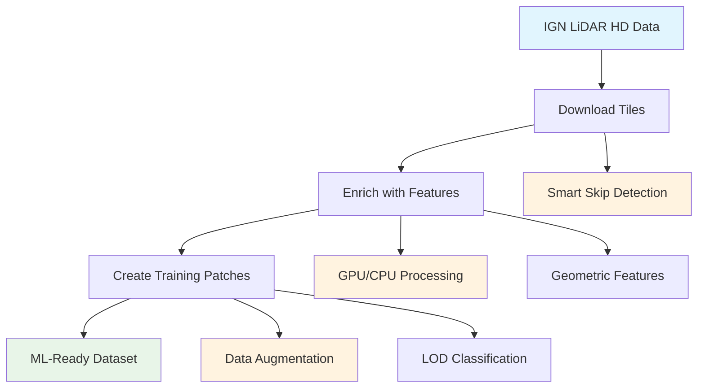
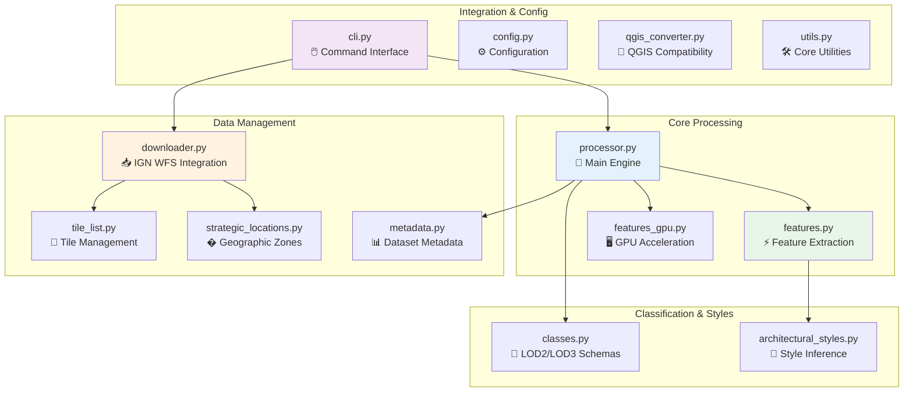
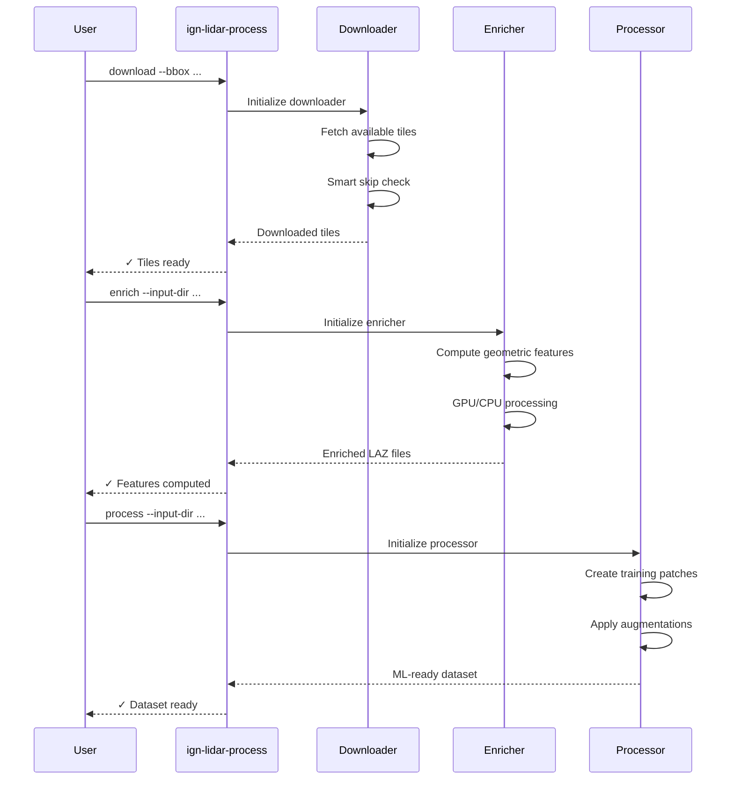

# IGN LiDAR HD Processing Library

[](https://badge.fury.io/py/ign-lidar-hd)
[](https://www.python.org/downloads/)
[](https://opensource.org/licenses/MIT)
[](tests/)

A comprehensive Python library for processing IGN (Institut National de l'Information Géographique et Forestière) LiDAR HD data into machine learning-ready datasets for Building Level of Detail (LOD) classification tasks.

## 📺 Video Demo

[](https://youtu.be/ksBWEhkVqQI)

**[▶️ Watch the Demo Video](https://youtu.be/ksBWEhkVqQI)** - Learn how to process LiDAR data for machine learning applications

## 📊 Project Overview

This library transforms raw IGN LiDAR HD point clouds into structured datasets ready for machine learning applications. Built specifically for building classification tasks, it handles the complete pipeline from data acquisition to training-ready patches.

### 🔄 **Processing Workflow**



**📈 Project Stats:**

- 🏗️ **14 core modules** - Comprehensive processing toolkit
- 📝 **10 example scripts** - From basic usage to advanced workflows
- 🧪 **Comprehensive test suite** - Ensuring reliability and performance
- 🌍 **50+ curated tiles** - Covering diverse French territories
- ⚡ **GPU & CPU support** - Flexible computation backends
- 🔄 **Smart resumability** - Never reprocess existing data

---

## 🚀 Quick Start

### Installation

```bash
pip install ign-lidar-hd
```

### Basic Usage

```python
from ign_lidar import LiDARProcessor

# Initialize processor
processor = LiDARProcessor(lod_level="LOD2")

# Process a single tile
patches = processor.process_tile("data.laz", "output/")

# Process multiple files
patches = processor.process_directory("data/", "output/", num_workers=4)
```

### Command Line Interface

```bash
# Download tiles
ign-lidar-process download --bbox -2.0,47.0,-1.0,48.0 --output tiles/ --max-tiles 10

# Enrich LAZ files with geometric features
ign-lidar-process enrich --input-dir tiles/ --output enriched/ --num-workers 4

# Enrich with GPU acceleration
ign-lidar-process enrich --input-dir tiles/ --output enriched/ --use-gpu

# Create training patches
ign-lidar-process process --input-dir enriched/ --output patches/ --lod-level LOD2

# Full pipeline example
ign-lidar-process download --bbox -2.0,47.0,-1.0,48.0 --output tiles/
ign-lidar-process enrich --input-dir tiles/ --output enriched/ --num-workers 4
ign-lidar-process process --input-dir enriched/ --output patches/ --lod-level LOD2
```

## 📋 Key Features

### 🏗️ **Core Processing Capabilities**

- **LiDAR-only processing**: Pure geometric analysis without RGB dependencies
- **Multi-level classification**: Support for LOD2 (15 classes) and LOD3 (30+ classes)
- **Rich feature extraction**: Surface normals, curvature, planarity, verticality, local density
- **Architectural style inference**: Automatic building style classification
- **Patch-based processing**: Configurable 150m × 150m patches with overlap control

### ⚡ **Performance & Optimization**

- **GPU acceleration**: CUDA-enabled feature computation for faster processing
- **Parallel processing**: Multi-worker support with automatic CPU core detection
- **Memory optimization**: Chunked processing for large datasets
- **Smart skip detection**: ⏭️ Automatically skip existing files and resume interrupted workflows
- **Batch operations**: Process hundreds of tiles efficiently

### 🔧 **Workflow Automation**

- **Integrated downloader**: IGN WFS tile discovery and batch downloading
- **Format flexibility**: Choose between LAZ 1.4 (full features) or QGIS-compatible output
- **Data augmentation**: Rotation, jitter, scaling, and dropout for ML training
- **Unified CLI**: Single `ign-lidar-process` command with intuitive subcommands
- **Idempotent operations**: Safe to restart - never reprocesses existing data

### 🌍 **Geographic Intelligence**

- **Strategic locations**: Pre-configured urban, coastal, and rural area processing
- **Bounding box filtering**: Spatial subsetting for targeted analysis
- **Coordinate system handling**: Automatic Lambert93 to WGS84 transformations
- **Tile management**: Curated collection of 50+ test tiles across France

## 🏗️ Library Architecture

### 🎯 **Component Architecture**



### 📋 **Module Responsibilities**

| Module                       | Purpose                | Key Features                                               |
| ---------------------------- | ---------------------- | ---------------------------------------------------------- |
| 🔧 `processor.py`            | Main processing engine | Patch creation, LOD classification, workflow orchestration |
| 📥 `downloader.py`           | IGN WFS integration    | Tile discovery, batch download, smart skip detection       |
| ⚡ `features.py`             | Feature extraction     | Normals, curvature, geometric properties                   |
| �️ `features_gpu.py`         | GPU acceleration       | CUDA-optimized feature computation                         |
| 🏢 `classes.py`              | Classification schemas | LOD2/LOD3 building taxonomies                              |
| 🎨 `architectural_styles.py` | Style inference        | Building architecture classification                       |

### 🔄 **Example Workflows**

```text
examples/
├── 🚀 basic_usage.py           # Getting started
├── 🏙️ example_urban_simple.py  # Urban processing
├── ⚡ parallel_processing_example.py # Performance
├── 🔄 full_workflow_example.py # End-to-end pipeline
├── 🎨 multistyle_processing.py # Architecture analysis
├── 🧠 pytorch_dataloader.py    # ML integration
└── workflows/               # Production pipelines
```

## ⚙️ CLI Commands

The package provides a unified `ign-lidar-process` command with three subcommands:

### 🔗 **CLI Workflow Chain**



### Download Command

Download LiDAR tiles from IGN:

```bash
ign-lidar-process download \
  --bbox lon_min,lat_min,lon_max,lat_max \
  --output tiles/ \
  --max-tiles 50
```

### Enrich Command

Enrich LAZ files with geometric features:

```bash
# CPU version (automatically skips existing enriched files)
ign-lidar-process enrich \
  --input-dir tiles/ \
  --output enriched/ \
  --num-workers 4 \
  --k-neighbors 10

# Force re-enrichment (ignore existing files)
ign-lidar-process enrich \
  --input-dir tiles/ \
  --output enriched/ \
  --force

# GPU version (requires CUDA)
ign-lidar-process enrich \
  --input-dir tiles/ \
  --output enriched/ \
  --use-gpu
```

> 💡 **Smart Skip**: By default, the enrich command skips files that have already been enriched, making it safe to resume interrupted operations.

### Process Command

Create training patches from enriched LAZ files:

```bash
# Automatically skips tiles with existing patches
ign-lidar-process process \
  --input-dir enriched/ \
  --output patches/ \
  --lod-level LOD2 \
  --patch-size 150.0 \
  --num-workers 4 \
  --num-augmentations 3

# Force reprocessing (ignore existing patches)
ign-lidar-process process \
  --input-dir enriched/ \
  --output patches/ \
  --force
```

> 💡 **Smart Skip**: The process command automatically detects existing patches and skips reprocessing, allowing you to resume interrupted batch jobs.

## 🔧 Configuration

### LOD Levels

- **LOD2**: Simplified building models (15 classes)
- **LOD3**: Detailed building models (30 classes)

### Processing Options

```python
processor = LiDARProcessor(
    lod_level="LOD2",           # LOD2 or LOD3
    augment=True,               # Enable augmentation
    num_augmentations=3,        # Augmentations per patch
    patch_size=150.0,          # Patch size in meters
    patch_overlap=0.1,         # 10% overlap
    bbox=[xmin, ymin, xmax, ymax]  # Spatial filter
)
```

## 📊 Output Format

### 📁 **Data Structure Overview**


### 🔢 **NPZ File Structure**

Each patch is saved as an NPZ file containing:

```python
{
    'points': np.ndarray,          # [N, 3] XYZ coordinates
    'normals': np.ndarray,         # [N, 3] surface normals
    'curvature': np.ndarray,       # [N] principal curvature
    'intensity': np.ndarray,       # [N] normalized intensity
    'return_number': np.ndarray,   # [N] return number
    'height': np.ndarray,          # [N] height above ground
    'planarity': np.ndarray,       # [N] planarity measure
    'verticality': np.ndarray,     # [N] verticality measure
    'horizontality': np.ndarray,   # [N] horizontality measure
    'density': np.ndarray,         # [N] local point density
    'labels': np.ndarray,          # [N] building class labels
}
```

### 📏 **Data Dimensions**

| Component  | Shape   | Data Type | Description                |
| ---------- | ------- | --------- | -------------------------- |
| `points`   | [N, 3]  | `float32` | 3D coordinates (X, Y, Z)   |
| `normals`  | [N, 3]  | `float32` | Surface normal vectors     |
| `features` | [N, 27] | `float32` | Geometric feature matrix   |
| `labels`   | [N]     | `uint8`   | Building component classes |
| `metadata` | [4]     | `object`  | Patch info (bbox, tile_id) |

> **📦 Typical patch**: 16,384 points, ~2.5MB compressed, ~8MB in memory

## 🌍 Batch Download

```python
from ign_lidar import IGNLiDARDownloader

# Initialize downloader
downloader = IGNLiDARDownloader("downloads/")

# Download tiles by bounding box (WGS84)
tiles = downloader.download_by_bbox(
    bbox=(-2.0, 47.0, -1.0, 48.0),  # West France
    max_tiles=10
)

# Download specific tiles
tile_names = ["LHD_FXX_0186_6834_PTS_C_LAMB93_IGN69"]
downloader.download_tiles(tile_names)
```

## 📝 Examples

### Urban Processing

```python
# High-detail urban processing
processor = LiDARProcessor(lod_level="LOD3", num_augmentations=5)
patches = processor.process_tile("urban_area.laz", "output/urban/")
```

### Rural Processing

```python
# Simplified rural processing
processor = LiDARProcessor(lod_level="LOD2", num_augmentations=2)
patches = processor.process_tile("rural_area.laz", "output/rural/")
```

### Batch Processing

```python
from ign_lidar import WORKING_TILES, get_tiles_by_environment

# Get coastal tiles
coastal_tiles = get_tiles_by_environment("coastal")

# Process all coastal areas
for tile_info in coastal_tiles:
    patches = processor.process_tile(
        f"data/{tile_info['tile_name']}.laz",
        f"output/coastal/{tile_info['tile_name']}/"
    )
```

## 🛠️ Development

### Setup Development Environment

```bash
git clone https://github.com/your-username/ign-lidar-hd-downloader
cd ign-lidar-hd-downloader
pip install -e ".[dev]"
```

### Run Tests

```bash
pytest tests/
```

### Code Formatting

```bash
black ign_lidar/
flake8 ign_lidar/
```

## 📚 Documentation & Resources

### 📖 **Complete Documentation Hub**

For comprehensive documentation, see the **[Documentation Hub](docs/README.md)**:

- **[📖 User Guides](docs/guides/)** - Quick start guides, QGIS integration, troubleshooting
- **[⚡ Features](docs/features/)** - Smart skip detection, format preferences, workflow optimization
- **[🔧 Technical Reference](docs/reference/)** - Memory optimization, performance tuning
- **[📦 Archive](docs/archive/)** - Bug fixes history, release notes, migration guides

### 🚀 **Essential Quick Links**

- **[🎯 Quick Reference Card](QUICK_REFERENCE.md)** - Fast reference for all commands
- **[⚡ Smart Skip Features](docs/features/SMART_SKIP_SUMMARY.md)** - Resume workflows efficiently
- **[🗺️ QGIS Integration](docs/guides/QUICK_START_QGIS.md)** - GIS compatibility guide
- **[⚙️ Memory Optimization](docs/reference/MEMORY_OPTIMIZATION.md)** - Performance tuning
- **[📋 Output Formats](docs/features/OUTPUT_FORMAT_PREFERENCES.md)** - LAZ 1.4 vs QGIS formats

### 💡 **Examples & Workflows**

- **[Basic Usage](examples/basic_usage.py)** - Simple processing examples
- **[Urban Processing](examples/example_urban_simple.py)** - City-specific workflows
- **[Parallel Processing](examples/parallel_processing_example.py)** - Multi-worker optimization
- **[Full Workflow](examples/full_workflow_example.py)** - End-to-end pipeline
- **[PyTorch Integration](examples/pytorch_dataloader.py)** - ML training setup

### 🚀 Coming Soon: Interactive Documentation

We're working on a comprehensive [Docusaurus documentation site](DOCUSAURUS_PLAN.md) that will include:

- 🌐 Multi-language support (English & French)
- 🔍 Full-text search
- 📱 Mobile-responsive design
- 📖 Interactive tutorials
- 🔗 Auto-generated API reference
- 💡 Live code examples

See the [Docusaurus Plan](DOCUSAURUS_PLAN.md) for details.

## 📚 API Reference

### Core Classes

- **`LiDARProcessor`**: Main processing engine
- **`IGNLiDARDownloader`**: Batch download functionality
- **`LOD2_CLASSES`**, **`LOD3_CLASSES`**: Classification taxonomies

### Utility Functions

- **`compute_normals()`**: Surface normal computation
- **`compute_curvature()`**: Principal curvature calculation
- **`extract_geometric_features()`**: Comprehensive feature extraction
- **`get_tiles_by_environment()`**: Filter tiles by environment type

## 🔗 Requirements

- Python 3.8+
- NumPy >= 1.21.0
- laspy >= 2.3.0
- scikit-learn >= 1.0.0
- tqdm >= 4.60.0
- requests >= 2.25.0

## 📄 License

MIT License - see [LICENSE](LICENSE) file for details.

## 🤝 Contributing

Contributions are welcome! Please feel free to submit a Pull Request.

## 📧 Support

For issues and questions, please use the [GitHub Issues](https://github.com/your-username/ign-lidar-hd-downloader/issues) page.
