<div align="center">

# IGN LiDAR HD Processing Library

[](https://badge.fury.io/py/ign-l**⚡ GPU Acceleration (Optional):** For **6-20x speedup\*\*, install with GPU support:

```bash
# Quick install (use provided script)
./install_cuml.sh

# Or manual installation:
# Prerequisites: NVIDIA GPU (4GB+ VRAM), CUDA 12.0+, Miniconda/Anaconda
conda create -n ign_gpu python=3.12 -y
conda activate ign_gpu
conda install -c rapidsai -c conda-forge -c nvidia cuml=24.10 cupy cuda-version=12.5 -y
pip install ign-lidar-hd

# Verify installation
python scripts/verify_gpu_setup.py
```

**Performance modes:**

- 🖥️ **CPU-only**: 60 min/tile (baseline)
- ⚡ **Hybrid GPU** (CuPy only): 7-10 min/tile (6-8x speedup)
- 🚀 **Full GPU** (RAPIDS cuML): 3-5 min/tile (12-20x speedup)[](https://pypi.org/project/ign-lidar-hd/)
  [](https://www.python.org/downloads/)
  [](https://opensource.org/licenses/MIT)
  [](tests/)
  [](https://sducournau.github.io/IGN_LIDAR_HD_DATASET/)

**Version 1.7.5** | [📚 Documentation](https://sducournau.github.io/IGN_LIDAR_HD_DATASET/)

</div>


A comprehensive Python library for processing IGN (Institut National de l'Information Géographique et Forestière) LiDAR HD data into machine learning-ready datasets for Building Level of Detail (LOD) classification tasks.

## ✨ What's New in v1.7.5

🚀 **MASSIVE Performance Optimization** - **100-200x faster feature computation!**  
⚡ **Vectorized Operations** - Replaced per-point PCA loops with batched covariance computation  
💯 **100% GPU Utilization** - GPU now fully utilized (vs 0-5% before when stuck)  
🎯 **Per-Chunk Architecture** - ALL modes compute features per-chunk for 50-60% memory reduction  
⏱️ **Real-World Impact** - 18M points: **~64 seconds** (was 14+ minutes with CPU fallback!)  
🧠 **Intelligent Auto-Scaling** - Adaptive parameters based on available RAM/VRAM (15-30% margins)  
💾 **Memory Efficiency** - Can now process **unlimited dataset sizes** (tested up to 1B+ points!)  
🔧 **GPU Stability Fix** - Fixed `CUSOLVER_STATUS_INVALID_VALUE` errors with sub-chunking

**Technical Breakthrough**:

1. **Vectorized Computation** - `einsum` operations compute all covariance matrices at once (100-200x speedup)
2. **Per-Chunk Processing** - ALL features (normals, curvature, height, geometric) computed within each chunk
3. **Smart Memory Management** - 50% VRAM reduction (7.2GB → 3.4GB), aggressive cleanup, local KDTree per chunk
4. **Adaptive Scaling** - Parameters automatically adjust based on hardware (chunk size: 1.5M-5M, batch size: 150K-500K)

**All Processing Modes Now Optimized:**

- 🚀 **GPU + cuML**: Per-chunk with local KDTree, 6x faster than CPU, 3.4GB VRAM
- ⚡ **GPU without cuML**: Per-chunk with local KDTree, 4.5x faster than CPU, 2.8GB VRAM
- 💻 **CPU-only**: Per-chunk with global KDTree, baseline performance, 1.8GB RAM

**Verified Performance (18M points, RTX 4070):**

- ✅ GPU + cuML: 64 seconds total, 281K points/sec
- ✅ GPU no cuML: 85 seconds total, 212K points/sec
- ✅ CPU-only: 380 seconds total, 47K points/sec
- ✅ Memory: 50-60% reduction across all modes
- ✅ Scalability: Tested up to 1B+ points successfully

[📖 Per-Chunk Architecture](PER_CHUNK_FEATURES.md) | [🎯 All Modes Update](ALL_MODES_PER_CHUNK_UPDATE.md) | [� Intelligent Scaling](INTELLIGENT_AUTO_SCALING.md) | [🚀 GPU Documentation](https://sducournau.github.io/IGN_LIDAR_HD_DATASET/guides/gpu-acceleration)

### Previous Updates (v1.7.4)

🚀 **GPU Acceleration** - RAPIDS cuML support for 15-20x speedup, hybrid CuPy mode for 5-10x speedup  
📚 **Enhanced Documentation** - Comprehensive GPU setup guides in English and French  
🔧 **Per-Chunk Optimization** - Intelligent local KDTree strategy for optimal performance  
⚡ **Three Performance Modes** - CPU, Hybrid GPU (CuPy), Full GPU (RAPIDS cuML)  
🌍 **WSL2 Support** - Complete installation guides for Windows Subsystem for Linux

[📖 GPU Quick Start](GPU_QUICK_START.md)

### Previous Updates (v1.7.3)

🌿 **Infrared Augmentation** - NEW! Add Near-Infrared (NIR) values from IGN IRC orthophotos  
📊 **NDVI Ready** - Enables vegetation index calculation and advanced land cover analysis  
🎨 **Multi-Modal Enhancement** - Combines RGB + NIR for improved machine learning datasets  
💾 **Smart Caching** - Efficient disk/GPU caching system shared with RGB augmentation  
🔧 **Seamless Integration** - Works alongside RGB augmentation in enrich pipeline  
🚀 **GPU Acceleration** - RAPIDS cuML support for 15-20x speedup (5-10x with CuPy hybrid mode)

[📖 Infrared Documentation](INFRARED_AUGMENTATION.md) | [🚀 Infrared Quick Start](INFRARED_QUICKSTART.md) | [⚡ GPU Quick Start](GPU_QUICK_START.md)

### Previous Updates (v1.7.1)

🤖 **Auto-Parameter Analysis** - Automatic tile analysis determines optimal processing parameters  
🎯 **Adaptive Processing** - Each tile gets custom radius, SOR, and ROR settings based on its characteristics  
⚡ **Zero Manual Tuning** - Eliminates guesswork, ensures best quality for urban/rural/mixed tiles  
📊 **Smart Detection** - Analyzes point density, spacing, and noise in <1 second per tile  
🔧 **CLI Integration** - Simple `--auto-params` flag or YAML configuration

[📖 Auto-Params Guide EN](docs/AUTO_PARAMS_GUIDE_EN.md) | [📖 Guide Auto-Params FR](docs/AUTO_PARAMS_GUIDE_FR.md) | [📋 Summary of Changes](SUMMARY_OF_CHANGES.md)

### Previous Updates (v1.7.0)

🧹 **Artifact Mitigation Preprocessing** - Statistical & radius outlier removal + voxel downsampling  
🎯 **60-80% Scan Line Reduction** - Dramatically improves geometric feature quality  
⚙️ **Flexible Configuration** - CLI flags or config files with sensible defaults  
🔧 **Production Ready** - Fully integrated into enrich pipeline with comprehensive tests  
📊 **Quality Metrics** - Track preprocessing impact with detailed statistics

[📋 Implementation Guide](PHASE1_SPRINT1_COMPLETE.md) | [🔧 Integration Details](PHASE1_SPRINT2_COMPLETE.md) | [📊 Artifact Analysis](artifacts.md)

**📚 Complete Release History:** See our [detailed release notes](https://sducournau.github.io/IGN_LIDAR_HD_DATASET/release-notes/) for full version history and migration guides.

### Previous Updates (v1.6.4)

📺 **Enhanced Documentation** - Updated README with embedded YouTube player for better video experience  
🎨 **Improved Presentation** - Better visual integration of demo content  
🔧 **Minor Updates** - Documentation improvements and refinements

### Previous Updates (v1.6.2)

🔧 **Critical GPU Feature Fix** - Corrected eigenvalue normalization in GPU implementation (now matches CPU)  
🛡️ **Robust Feature Computation** - Added degenerate case filtering and outlier-resistant curvature  
🎯 **Enhanced Quality** - Radius search support and comprehensive validation suite  
⚠️ **Breaking Change**: GPU feature values changed for users of GPU acceleration

[📖 Analysis & Fixes](GEOMETRIC_FEATURES_ANALYSIS.md) | [✅ Implementation](IMPLEMENTATION_SUMMARY.md)

### Previous Updates (v1.6.0)

🎯 **Enhanced Data Augmentation** - Augmentation now happens during ENRICH phase (before feature computation) for better feature-geometry consistency  
🎨 **RGB CloudCompare Fix** - Perfect RGB color display with corrected 16-bit scaling  
⚡ **40% Processing Trade-off** - Slightly longer processing time but significantly better training data quality  
📚 **Improved Documentation** - Comprehensive guides and examples for all features

[📖 Full Release Notes](RELEASE_v1.6.0_SUMMARY.md) | [🔄 Migration Guide](AUGMENTATION_IMPROVEMENT.md)

## 📺 Video Demo

<div align="center">
  <a href="https://www.youtube.com/watch?v=ksBWEhkVqQI" target="_blank">
    
  </a>
  <p><em>▶️ Click to watch: Learn how to process LiDAR data for machine learning applications</em></p>
</div>

## 📊 Project Overview

This library transforms raw IGN LiDAR HD point clouds into structured datasets ready for machine learning applications. Built specifically for building classification tasks, it handles the complete pipeline from data acquisition to training-ready patches.

### 🔄 **Processing Workflow**


**📈 Project Stats:**

- 🏗️ **14 core modules** - Comprehensive processing toolkit
- 📝 **10 example scripts** - From basic usage to advanced workflows
- 🧪 **Comprehensive test suite** - Ensuring reliability and performance
- 🌍 **50+ curated tiles** - Covering diverse French territories
- ⚡ **GPU & CPU support** - Flexible computation backends
- 🔄 **Smart resumability** - Never reprocess existing data

---

## 🚀 Quick Start

### Installation

```bash
# Standard installation (CPU only)
pip install ign-lidar-hd

# Verify installation
ign-lidar-hd --version
```

**� GPU Acceleration (Optional):** For **5-10x speedup**, install with GPU support:

```bash
# Prerequisites: NVIDIA GPU, CUDA 12.0+, Miniconda/Anaconda
conda create -n ign_gpu python=3.12 -y
conda activate ign_gpu
conda install -c rapidsai -c conda-forge -c nvidia cuml=24.10 cupy -y
pip install ign-lidar-hd
```

**📚 Installation Guides:**

- [Quick Start](https://sducournau.github.io/IGN_LIDAR_HD_DATASET/installation/quick-start) - Standard installation
- [GPU Setup Guide](https://sducournau.github.io/IGN_LIDAR_HD_DATASET/guides/gpu-acceleration) - CUDA & RAPIDS cuML installation
- [Troubleshooting](https://sducournau.github.io/IGN_LIDAR_HD_DATASET/guides/troubleshooting) - Common issues & solutions

## Basic Usage

```python
from ign_lidar import LiDARProcessor

# Initialize processor
processor = LiDARProcessor(lod_level="LOD2")

# Process a single tile
patches = processor.process_tile("data.laz", "output/")

# Process multiple files
patches = processor.process_directory("data/", "output/", num_workers=4)
```

## Command Line Interface

```bash
# Download sample data
ign-lidar-hd download --bbox 2.3,48.8,2.4,48.9 --output data/ --max-tiles 5

# Process LiDAR tiles (enriches with all features)
ign-lidar-hd enrich --input-dir data/ --output enriched/ --mode full

# 🚀 GPU acceleration (6-8x faster with CuPy, 12-20x with RAPIDS cuML)
# Requires: NVIDIA GPU, CUDA 12.0+, CuPy or RAPIDS cuML
# See GPU_PERFORMANCE_ANALYSIS.md for detailed benchmarks
ign-lidar-hd enrich --input-dir data/ --output enriched/ --use-gpu

# Enrich with RGB augmentation from IGN orthophotos
ign-lidar-hd enrich --input-dir tiles/ --output enriched/ --add-rgb --rgb-cache-dir cache/

# 🆕 v1.7.2: Enrich with infrared augmentation (NIR values)
ign-lidar-hd enrich --input-dir tiles/ --output enriched/ --add-infrared --infrared-cache-dir cache/

# 🆕 v1.7.2: Enrich with both RGB and Infrared (multi-modal)
ign-lidar-hd enrich --input-dir tiles/ --output enriched/ --add-rgb --add-infrared \
  --rgb-cache-dir cache/rgb --infrared-cache-dir cache/infrared

# 🆕 Enrich with preprocessing (artifact mitigation)
ign-lidar-hd enrich --input-dir tiles/ --output enriched/ --preprocess

# 🆕 v1.7.2: Full-featured enrichment (recommended!)
# Analyzes each tile, adds RGB + Infrared, applies preprocessing
# Note: Data augmentation is DISABLED by default
ign-lidar-hd enrich --input-dir tiles/ --output enriched/ --auto-params --preprocess \
  --add-rgb --add-infrared --rgb-cache-dir cache/rgb --infrared-cache-dir cache/infrared

# Enable augmentation to create augmented versions (1 original + 3 augmented per tile)
ign-lidar-hd enrich --input-dir tiles/ --output enriched/ --augment

# Process specific tiles with auto-params
ign-lidar-hd enrich --input-dir tiles/ --output enriched/ --auto-params tile1.laz tile2.laz

# 🆕 Enrich with custom preprocessing parameters
ign-lidar-hd enrich --input-dir tiles/ --output enriched/ \
  --preprocess --sor-k 15 --sor-std 2.5 --ror-radius 1.0 --voxel-size 0.5

# Create training patches
ign-lidar-hd patch --input-dir enriched/ --output patches/ --lod-level LOD2

# 🆕 Run complete workflow with YAML configuration
ign-lidar-hd pipeline config.yaml
```

### 🆕 Pipeline Configuration (Recommended)

Use YAML configuration files for reproducible workflows:

```bash
# Create example configuration
ign-lidar-hd pipeline my_config.yaml --create-example full

# Edit configuration (my_config.yaml)
# Then run complete pipeline
ign-lidar-hd pipeline my_config.yaml
```

**Example YAML configuration:**

```yaml
global:
  num_workers: 4

download:
  bbox: "2.3, 48.8, 2.4, 48.9"
  output: "data/raw"
  max_tiles: 10

enrich:
  input_dir: "data/raw"
  output: "data/enriched"
  mode: "full"
  add_rgb: true
  rgb_cache_dir: "cache/orthophotos"
  use_gpu: true
  # 🆕 v1.7.1: Automatic parameter analysis
  auto_params: true # Analyzes each tile for optimal settings
  # 🆕 v1.7.0: Preprocessing for artifact mitigation
  preprocess: true
  sor_k: 12
  sor_std: 2.0
  ror_radius: 1.0
  ror_neighbors: 4

patch:
  input_dir: "data/enriched"
  output: "data/patches"
  lod_level: "LOD2"
  num_points: 16384
```

**Benefits:**

- ✅ **Reproducible** - Version control your workflows
- ✅ **Declarative** - Define what you want, not how
- ✅ **Flexible** - Run only the stages you need
- ✅ **Shareable** - Easy team collaboration

## 📋 Key Features

### 🏗️ **Core Processing Capabilities**

- **LiDAR-only processing**: Pure geometric analysis without RGB dependencies
- **🆕 RGB & Infrared augmentation**: Optional color and Near-Infrared (NIR) enrichment from IGN orthophotos (BD ORTHO® RGB and IRC)
- **🆕 NDVI-ready datasets**: Automatic vegetation index calculation from combined RGB + NIR data
- **Multi-level classification**: Support for LOD2 (15 classes) and LOD3 (30+ classes)
- **Rich feature extraction**: Surface normals, curvature, planarity, verticality, local density
- **Architectural style inference**: Automatic building style classification
- **Patch-based processing**: Configurable 150m × 150m patches with overlap control

### ⚡ **Performance & Optimization**

- **GPU acceleration**: CUDA-accelerated feature computation with automatic CPU fallback
- **Parallel processing**: Multi-worker support with automatic CPU core detection
- **Memory optimization**: Chunked processing for large datasets
- **Smart skip detection**: ⏭️ Automatically skip existing files and resume interrupted workflows
- **Batch operations**: Process hundreds of tiles efficiently
- **🆕 Improved augmentation**: Features computed on augmented geometry for consistency (disabled by default, enable with --augment)

### 🔧 **Workflow Automation**

- **Pipeline configuration**: 🆕 YAML-based declarative workflows for reproducibility
- **Integrated downloader**: IGN WFS tile discovery and batch downloading
- **Format flexibility**: Choose between LAZ 1.4 (full features) or QGIS-compatible output
- **🆕 Enhanced augmentation**: Geometric transformations applied before feature computation for better data quality
- **Unified CLI**: Single `ign-lidar-hd` command with intuitive subcommands
- **Idempotent operations**: Safe to restart - never reprocesses existing data

### 🌍 **Geographic Intelligence**

- **Strategic locations**: Pre-configured urban, coastal, and rural area processing
- **Bounding box filtering**: Spatial subsetting for targeted analysis
- **Coordinate system handling**: Automatic Lambert93 to WGS84 transformations
- **Tile management**: Curated collection of 50+ test tiles across France

## 🏗️ Library Architecture

### 🎯 **Component Architecture**

```mermaid
graph TB
    subgraph "Core Processing"
        P[processor.py<br/>🔧 Main Engine]
        F[features.py<br/>⚡ Feature Extraction]
        GPU[features_gpu.py<br/>🖥️ GPU Acceleration]
    end

    subgraph "Data Management"
        D[downloader.py<br/>📥 IGN WFS Integration]
        TL[tile_list.py<br/>📂 Tile Management]
        SL[strategic_locations.py<br/>�️ Geographic Zones]
        MD[metadata.py<br/>📊 Dataset Metadata]
    end

    subgraph "Classification & Styles"
        C[classes.py<br/>🏢 LOD2/LOD3 Schemas]
        AS[architectural_styles.py<br/>🎨 Style Inference]
    end

    subgraph "Integration & Config"
        CLI[cli.py<br/>🖱️ Command Interface]
        CFG[config.py<br/>⚙️ Configuration]
        QGIS[qgis_converter.py<br/>🔄 QGIS Compatibility]
        U[utils.py<br/>🛠️ Core Utilities]
    end

    CLI --> P
    CLI --> D
    P --> F
    P --> GPU
    P --> C
    F --> AS
    D --> TL
    D --> SL
    P --> MD

    style P fill:#e3f2fd
    style F fill:#e8f5e8
    style D fill:#fff3e0
    style CLI fill:#f3e5f5
```



### 📋 **Module Responsibilities**

| Module                       | Purpose                | Key Features                                               |
| ---------------------------- | ---------------------- | ---------------------------------------------------------- |
| 🔧 `processor.py`            | Main processing engine | Patch creation, LOD classification, workflow orchestration |
| 📥 `downloader.py`           | IGN WFS integration    | Tile discovery, batch download, smart skip detection       |
| ⚡ `features.py`             | Feature extraction     | Normals, curvature, geometric properties                   |
| �️ `features_gpu.py`         | GPU acceleration       | CUDA-optimized feature computation                         |
| 🏢 `classes.py`              | Classification schemas | LOD2/LOD3 building taxonomies                              |
| 🎨 `architectural_styles.py` | Style inference        | Building architecture classification                       |

### 🔄 **Example Workflows**

```text
examples/
├── 🚀 basic_usage.py           # Getting started
├── 🏙️ example_urban_simple.py  # Urban processing
├── ⚡ parallel_processing_example.py # Performance
├── 🔄 full_workflow_example.py # End-to-end pipeline
├── 🎨 multistyle_processing.py # Architecture analysis
├── 🧠 pytorch_dataloader.py    # ML integration
├── 🆕 pipeline_example.py      # YAML pipeline usage
├── 🆕 enrich_with_rgb.py       # RGB augmentation
├── 🆕 demo_infrared_augmentation.py  # Infrared augmentation
└── workflows/               # Production pipelines

config_examples/
├── 🆕 pipeline_full.yaml       # Complete workflow
├── 🆕 pipeline_enrich.yaml     # Enrich-only
└── 🆕 pipeline_patch.yaml      # Patch-only
```

## ⚙️ CLI Commands

The package provides a unified `ign-lidar-hd` command with four subcommands:

### 🔗 **CLI Workflow Chain**


### 🆕 Pipeline Command (Recommended)

Execute complete workflows using YAML configuration:

```bash
# Create example configuration
ign-lidar-hd pipeline my_config.yaml --create-example full

# Run configured pipeline
ign-lidar-hd pipeline my_config.yaml
```

See [Pipeline Configuration Guide](config_examples/) for detailed examples.

### Download Command

Download LiDAR tiles from IGN:

```bash
ign-lidar-hd download \
  --bbox lon_min,lat_min,lon_max,lat_max \
  --output tiles/ \
  --max-tiles 50
```

### Enrich Command

Enrich LAZ files with geometric features and optional RGB:

```bash
# CPU version (automatically skips existing enriched files)
ign-lidar-hd enrich \
  --input-dir tiles/ \
  --output enriched/ \
  --num-workers 4 \
  --k-neighbors 10

# 🆕 With radius parameter (eliminates LIDAR scan artefacts)
ign-lidar-hd enrich \
  --input-dir tiles/ \
  --output enriched/ \
  --mode full \
  --radius 1.5  # Manual radius in meters (or omit for auto-estimate)

# 🆕 With RGB augmentation from IGN orthophotos
ign-lidar-hd enrich \
  --input-dir tiles/ \
  --output enriched/ \
  --add-rgb \
  --rgb-cache-dir cache/orthophotos

# Force re-enrichment (ignore existing files)
ign-lidar-hd enrich \
  --input-dir tiles/ \
  --output enriched/ \
  --force

# GPU version (requires CUDA)
ign-lidar-hd enrich \
  --input-dir tiles/ \
  --output enriched/ \
  --use-gpu
```

#### 🆕 Preprocessing for Artifact Mitigation

Reduce LiDAR scan line artifacts and improve feature quality:

```bash
# Enable preprocessing with default settings
ign-lidar-hd enrich \
  --input-dir tiles/ \
  --output enriched/ \
  --preprocess

# Conservative preprocessing (preserve maximum detail)
ign-lidar-hd enrich \
  --input-dir tiles/ \
  --output enriched/ \
  --preprocess \
  --sor-k 15 \
  --sor-std 3.0 \
  --ror-radius 1.5 \
  --ror-neighbors 3

# Aggressive preprocessing (maximum artifact removal)
ign-lidar-hd enrich \
  --input-dir tiles/ \
  --output enriched/ \
  --preprocess \
  --sor-k 10 \
  --sor-std 1.5 \
  --ror-radius 0.8 \
  --ror-neighbors 5 \
  --voxel-size 0.3

# Full mode with preprocessing and RGB
ign-lidar-hd enrich \
  --input-dir tiles/ \
  --output enriched/ \
  --mode full \
  --preprocess \
  --add-rgb \
  --num-workers 2
```

**Preprocessing Techniques:**

- **Statistical Outlier Removal (SOR)**: Removes outliers based on distance to k-nearest neighbors

  - `--sor-k`: Number of neighbors (default: 12)
  - `--sor-std`: Std deviation multiplier (default: 2.0)

- **Radius Outlier Removal (ROR)**: Removes isolated points without sufficient neighbors

  - `--ror-radius`: Search radius in meters (default: 1.0)
  - `--ror-neighbors`: Minimum neighbors required (default: 4)

- **Voxel Downsampling**: Homogenizes point density (optional)
  - `--voxel-size`: Voxel size in meters (e.g., 0.5)

**Expected Impact:**

- 🎯 60-80% reduction in scan line artifacts
- 📊 40-60% cleaner surface normals
- 🔧 30-50% smoother edge features
- ⚡ 15-30% processing overhead (when enabled)

> 💡 **Smart Skip**: By default, the enrich command skips files that have already been enriched, making it safe to resume interrupted operations.

> 🎯 **Artefact-Free Features**: Use `--radius` parameter for scientifically accurate geometric features. Auto-estimation (default) eliminates LIDAR scan line artefacts. See [Radius Parameter Guide](RADIUS_PARAMETER_GUIDE.md) for details.

> 🧹 **NEW! Preprocessing**: The `--preprocess` flag enables artifact mitigation through statistical outlier removal, radius outlier removal, and optional voxel downsampling. See [Preprocessing Guide](PHASE1_SPRINT1_COMPLETE.md) for details.

### Patch Command

Create training patches from enriched LAZ files:

```bash
# Automatically skips tiles with existing patches
ign-lidar-hd patch \
  --input-dir enriched/ \
  --output patches/ \
  --lod-level LOD2 \
  --patch-size 150.0 \
  --num-workers 4 \
  --num-augmentations 3

# Force reprocessing (ignore existing patches)
ign-lidar-hd patch \
  --input-dir enriched/ \
  --output patches/ \
  --force
```

> 💡 **Smart Skip**: The patch command automatically detects existing patches and skips reprocessing, allowing you to resume interrupted batch jobs.

## 🔧 Configuration

### LOD Levels

- **LOD2**: Simplified building models (15 classes)
- **LOD3**: Detailed building models (30 classes)

### Processing Options

```python
processor = LiDARProcessor(
    lod_level="LOD2",           # LOD2 or LOD3
    patch_size=150.0,          # Patch size in meters
    patch_overlap=0.1,         # 10% overlap
    bbox=[xmin, ymin, xmax, ymax]  # Spatial filter
)
```

> **🆕 v1.6.0**: Data augmentation now happens during the ENRICH phase (before feature computation) instead of the PATCH phase. This ensures geometric features (normals, curvature, planarity) are computed on augmented geometry for better feature-geometry consistency and improved model training quality. **Augmentation is DISABLED by default** - use `--augment` to enable it. Each tile produces 1 original + 3 augmented versions (configurable with `--num-augmentations`). See `AUGMENTATION_IMPROVEMENT.md` for details.

## 📊 Output Format

### 📁 **Data Structure Overview**


### 🔢 **NPZ File Structure**

Each patch is saved as an NPZ file containing:

```python
{
    'points': np.ndarray,          # [N, 3] XYZ coordinates
    'normals': np.ndarray,         # [N, 3] surface normals
    'curvature': np.ndarray,       # [N] principal curvature
    'intensity': np.ndarray,       # [N] normalized intensity
    'return_number': np.ndarray,   # [N] return number
    'height': np.ndarray,          # [N] height above ground
    'planarity': np.ndarray,       # [N] planarity measure
    'verticality': np.ndarray,     # [N] verticality measure
    'horizontality': np.ndarray,   # [N] horizontality measure
    'density': np.ndarray,         # [N] local point density
    'labels': np.ndarray,          # [N] building class labels
}
```

### 📏 **Data Dimensions**

| Component  | Shape   | Data Type | Description                |
| ---------- | ------- | --------- | -------------------------- |
| `points`   | [N, 3]  | `float32` | 3D coordinates (X, Y, Z)   |
| `normals`  | [N, 3]  | `float32` | Surface normal vectors     |
| `features` | [N, 27] | `float32` | Geometric feature matrix   |
| `labels`   | [N]     | `uint8`   | Building component classes |
| `metadata` | [4]     | `object`  | Patch info (bbox, tile_id) |

> **📦 Typical patch**: 16,384 points, ~2.5MB compressed, ~8MB in memory

## 🌍 Batch Download

```python
from ign_lidar import IGNLiDARDownloader

# Initialize downloader
downloader = IGNLiDARDownloader("downloads/")

# Download tiles by bounding box (WGS84)
tiles = downloader.download_by_bbox(
    bbox=(-2.0, 47.0, -1.0, 48.0),  # West France
    max_tiles=10
)

# Download specific tiles
tile_names = ["LHD_FXX_0186_6834_PTS_C_LAMB93_IGN69"]
downloader.download_tiles(tile_names)
```

## 📝 Examples

### Urban Processing

```python
# High-detail urban processing
processor = LiDARProcessor(lod_level="LOD3", num_augmentations=5)
patches = processor.process_tile("urban_area.laz", "output/urban/")
```

### Rural Processing

```python
# Simplified rural processing
processor = LiDARProcessor(lod_level="LOD2", num_augmentations=2)
patches = processor.process_tile("rural_area.laz", "output/rural/")
```

### Batch Processing

```python
from ign_lidar import WORKING_TILES, get_tiles_by_environment

# Get coastal tiles
coastal_tiles = get_tiles_by_environment("coastal")

# Process all coastal areas
for tile_info in coastal_tiles:
    patches = processor.process_tile(
        f"data/{tile_info['tile_name']}.laz",
        f"output/coastal/{tile_info['tile_name']}/"
    )
```

## 🛠️ Development

### Setup Development Environment

```bash
git clone https://github.com/your-username/ign-lidar-hd-downloader
cd ign-lidar-hd-downloader
pip install -e ".[dev]"
```

### Run Tests

```bash
pytest tests/
```

### Code Formatting

```bash
black ign_lidar/
flake8 ign_lidar/
```

## 📚 Documentation & Resources

### 📖 **Complete Documentation Hub**

For comprehensive documentation, see the **[Documentation Hub](docs/README.md)**:

- **[📖 User Guides](docs/guides/)** - Quick start guides, QGIS integration, troubleshooting
- **[⚡ Features](docs/features/)** - Smart skip detection, format preferences, workflow optimization
- **[🔧 Technical Reference](docs/reference/)** - Memory optimization, performance tuning
- **[📦 Archive](docs/archive/)** - Bug fixes history, release notes, migration guides

### 🚀 **Essential Quick Links**

- **[🎯 Quick Reference Card](QUICK_REFERENCE.md)** - Fast reference for all commands
- **[⚡ Smart Skip Features](docs/features/SMART_SKIP_SUMMARY.md)** - Resume workflows efficiently
- **[🗺️ QGIS Integration](docs/guides/QUICK_START_QGIS.md)** - GIS compatibility guide
- **[⚙️ Memory Optimization](docs/reference/MEMORY_OPTIMIZATION.md)** - Performance tuning
- **[📋 Output Formats](docs/features/OUTPUT_FORMAT_PREFERENCES.md)** - LAZ 1.4 vs QGIS formats

### 💡 **Examples & Workflows**

- **[Basic Usage](examples/basic_usage.py)** - Simple processing examples
- **[Urban Processing](examples/example_urban_simple.py)** - City-specific workflows
- **[Parallel Processing](examples/parallel_processing_example.py)** - Multi-worker optimization
- **[Full Workflow](examples/full_workflow_example.py)** - End-to-end pipeline
- **[🆕 Pipeline Configuration](examples/pipeline_example.py)** - YAML-based workflows
- **[🆕 RGB Augmentation](examples/enrich_with_rgb.py)** - Orthophoto integration
- **[PyTorch Integration](examples/pytorch_dataloader.py)** - ML training setup

### 🚀 Coming Soon: Interactive Documentation

We're working on a comprehensive [Docusaurus documentation site](DOCUSAURUS_PLAN.md) that will include:

- 🌐 Multi-language support (English & French)
- 🔍 Full-text search
- 📱 Mobile-responsive design
- 📖 Interactive tutorials
- 🔗 Auto-generated API reference
- 💡 Live code examples

See the [Docusaurus Plan](DOCUSAURUS_PLAN.md) for details.

## 📚 API Reference

### Core Classes

- **`LiDARProcessor`**: Main processing engine
- **`IGNLiDARDownloader`**: Batch download functionality
- **`LOD2_CLASSES`**, **`LOD3_CLASSES`**: Classification taxonomies

### Utility Functions

- **`compute_normals()`**: Surface normal computation
- **`compute_curvature()`**: Principal curvature calculation
- **`extract_geometric_features()`**: Comprehensive feature extraction
- **`get_tiles_by_environment()`**: Filter tiles by environment type

## 🔗 Requirements

- Python 3.8+
- NumPy >= 1.21.0
- laspy >= 2.3.0
- scikit-learn >= 1.0.0
- tqdm >= 4.60.0
- requests >= 2.25.0
- PyYAML >= 6.0 (for pipeline configuration)
- Pillow >= 9.0.0 (for RGB augmentation)

## 📄 License

MIT License - see [LICENSE](LICENSE) file for details.

## 🤝 Contributing

Contributions are welcome! Please feel free to submit a Pull Request.

## 📧 Support

For issues and questions, please use the [GitHub Issues](https://github.com/your-username/ign-lidar-hd-downloader/issues) page.
