<div align="center">

# IGN LiDAR HD Processing Library

[](https://badge.fury.io/py/ign-lidar-hd)
[](https://pypi.org/project/ign-lidar-hd/)
[](https://www.python.org/downloads/)
[](https://opensource.org/licenses/MIT)
[](tests/)
[](https://sducournau.github.io/IGN_LIDAR_HD_DATASET/)

**Version 2.1.2** | [📚 Documentation](https://sducournau.github.io/IGN_LIDAR_HD_DATASET/)


**A comprehensive Python library for processing IGN LiDAR HD data into machine learning-ready datasets for Building Level of Detail (LOD) classification tasks.**

[Quick Start](#-quick-start) • [Features](#-key-features) • [Documentation](https://sducournau.github.io/IGN_LIDAR_HD_DATASET/) • [Examples](#-examples) • [API Reference](#-api-reference)

</div>

## 📋 Table of Contents

- [Overview](#-overview)
- [What's New](#-whats-new)
- [Quick Start](#-quick-start)
- [Key Features](#-key-features)
- [Usage Guide](#-usage-guide)
- [Library Architecture](#-library-architecture)
- [Output Format](#-output-format)
- [Examples](#-examples)
- [Documentation](#-documentation--resources)
- [Development](#-development)
- [Requirements](#-requirements)
- [License & Support](#-license--support)

---

## 📊 Overview

This library transforms raw IGN (Institut National de l'Information Géographique et Forestière) LiDAR HD point clouds into structured datasets ready for machine learning applications. Built specifically for building classification tasks, it handles the complete pipeline from data acquisition to training-ready patches.

### 📺 Video Demo

<div align="center">
  <a href="https://www.youtube.com/watch?v=ksBWEhkVqQI" target="_blank">
    
  </a>
  <p><em>▶️ Click to watch: Learn how to process LiDAR data for machine learning applications</em></p>
</div>

### 🔄 Processing Workflow


### 📈 Project Stats

- 🏗️ **14 core modules** - Comprehensive processing toolkit
- 📝 **10 example scripts** - From basic usage to complex workflows
- 🧪 **Comprehensive test suite** - Ensuring reliability and performance
- 🌍 **50+ curated tiles** - Covering diverse French territories
- ⚡ **GPU & CPU support** - Flexible computation backends
- 🔄 **Smart resumability** - Never reprocess existing data

---

## ✨ What's New (v2.1.1)

- **Bug Fixes:** Fixed planarity feature computation formula and preprocessing stitching for boundary features
- **Improved Validation:** Enhanced feature validation and artifact detection at tile boundaries
- **Code Quality:** Repository cleanup and better code organization
- **Documentation:** Updated documentation and improved examples

**Previous Release (v2.1.0):**

- **Feature Validation:** Automatic detection of geometric feature artifacts at tile boundaries
- **French Documentation:** Complete French i18n structure (73 files)
- **Hybrid Model Support:** Optimized LOD3 hybrid model training configurations
- **Enhanced Documentation:** Training commands reference and workflow guides

See [CHANGELOG.md](CHANGELOG.md) for full details and previous releases.

---

## 🚀 Quick Start

### Installation

#### Standard Installation (CPU Only)

```bash
pip install ign-lidar-hd
ign-lidar-hd --version  # Verify installation
```

#### GPU Acceleration (Optional - 6-20x Speedup)

For optimal performance, install with GPU support:

```bash
# Quick install using provided script
./install_cuml.sh

# Or manual installation
# Prerequisites: NVIDIA GPU (4GB+ VRAM), CUDA 12.0+, Miniconda/Anaconda
conda create -n ign_gpu python=3.12 -y
conda activate ign_gpu
conda install -c rapidsai -c conda-forge -c nvidia cuml=24.10 cupy cuda-version=12.5 -y
pip install ign-lidar-hd

# Verify GPU setup
python scripts/verify_gpu_setup.py
```

**📚 Detailed Installation Guides:**

- [Standard Installation](https://sducournau.github.io/IGN_LIDAR_HD_DATASET/installation/quick-start)
- [GPU Setup Guide](GPU_SETUP.md) - Local detailed guide for CuPy and RAPIDS cuML
- [Online GPU Guide](https://sducournau.github.io/IGN_LIDAR_HD_DATASET/guides/gpu-acceleration)
- [Troubleshooting](https://sducournau.github.io/IGN_LIDAR_HD_DATASET/guides/troubleshooting)

### Quick Example

```bash
# 1. Download sample data
ign-lidar-hd download --bbox 2.3,48.8,2.4,48.9 --output data/ --max-tiles 5

# 2. Enrich with features (GPU accelerated if available)
ign-lidar-hd enrich --input-dir data/ --output enriched/ --mode full --use-gpu

# 3. Create training patches
ign-lidar-hd patch --input-dir enriched/ --output patches/ --lod-level LOD2
```

**Python API:**

```python
from ign_lidar import LiDARProcessor

# Initialize processor
processor = LiDARProcessor(lod_level="LOD2")

# Process a single tile
patches = processor.process_tile("data.laz", "output/")

# Process multiple files
patches = processor.process_directory("data/", "output/", num_workers=4)
```

---

## 📋 Key Features

### 🏗️ Core Processing

- **Pure LiDAR processing** - Geometric analysis without RGB dependencies
- **RGB & Infrared augmentation** - Optional color and Near-Infrared (NIR) from IGN orthophotos
- **NDVI-ready datasets** - Automatic vegetation index calculation (RGB + NIR)
- **Multi-level classification** - LOD2 (15 classes) and LOD3 (30+ classes) support
- **Rich features** - Surface normals, curvature, planarity, verticality, local density
- **Architectural styles** - Automatic building style inference
- **Preprocessing** - Artifact mitigation (60-80% scan line reduction)
- **Auto-parameters** - Intelligent tile analysis for optimal processing

### ⚡ Performance & Optimization

- **GPU acceleration** - CUDA-accelerated with RAPIDS cuML (6-20x speedup)
- **Parallel processing** - Multi-worker support with CPU core detection
- **Memory optimization** - Per-chunk architecture, 50-60% memory reduction
- **Smart skip detection** - Resume interrupted workflows automatically
- **Batch operations** - Process hundreds of tiles efficiently
- **Scalable** - Tested up to 1B+ points

### 🔧 Workflow Automation

- **Pipeline configuration** - YAML-based declarative workflows
- **Integrated downloader** - IGN WFS tile discovery and batch downloading
- **Format flexibility** - LAZ 1.4 (full features) or QGIS-compatible output
- **CLI** - Single `ign-lidar-hd` command with intuitive subcommands
- **Idempotent operations** - Safe to restart, never reprocesses existing data

### 🌍 Geographic Intelligence

- **Strategic locations** - Pre-configured urban, coastal, and rural areas
- **Bounding box filtering** - Spatial subsetting for targeted analysis
- **Coordinate handling** - Automatic Lambert93 ↔ WGS84 transformations
- **Tile management** - Curated collection of 50+ test tiles across France

---

## 📖 Usage Guide

### Command Line Interface

The library provides a `ign-lidar-hd` command with four main subcommands:

#### 1. Download Command

Download LiDAR tiles from IGN:

```bash
# Download by bounding box
ign-lidar-hd download --bbox 2.3,48.8,2.4,48.9 --output data/ --max-tiles 10

# Download specific tiles
ign-lidar-hd download --tiles tile1.laz tile2.laz --output data/
```

#### 2. Enrich Command

Enrich LAZ files with geometric features:

```bash
# Basic enrichment
ign-lidar-hd enrich --input-dir data/ --output enriched/ --mode full

# GPU-accelerated enrichment
ign-lidar-hd enrich --input-dir data/ --output enriched/ --use-gpu

# Full-featured enrichment (recommended)
ign-lidar-hd enrich \
  --input-dir data/ \
  --output enriched/ \
  --mode full \
  --use-gpu \
  --auto-params \
  --preprocess \
  --add-rgb --rgb-cache-dir cache/rgb \
  --add-infrared --infrared-cache-dir cache/infrared

# Custom preprocessing
ign-lidar-hd enrich \
  --input-dir data/ \
  --output enriched/ \
  --preprocess \
  --sor-k 15 --sor-std 2.5 \
  --ror-radius 1.0 --ror-neighbors 4 \
  --voxel-size 0.5
```

**Preprocessing Options:**

- `--preprocess` - Enable artifact mitigation
- `--sor-k` - Statistical outlier removal: number of neighbors (default: 12)
- `--sor-std` - SOR: std deviation multiplier (default: 2.0)
- `--ror-radius` - Radius outlier removal: search radius in meters (default: 1.0)
- `--ror-neighbors` - ROR: minimum neighbors required (default: 4)
- `--voxel-size` - Voxel downsampling size in meters (optional)

**Augmentation Options:**

- `--add-rgb` - Add RGB colors from IGN orthophotos
- `--add-infrared` - Add NIR values from IGN IRC orthophotos
- `--augment` - Enable geometric augmentation (disabled by default)
- `--num-augmentations` - Number of augmented versions (default: 3)

#### 3. Patch Command

Create training patches from enriched files:

```bash
# Create patches
ign-lidar-hd patch \
  --input-dir enriched/ \
  --output patches/ \
  --lod-level LOD2 \
  --patch-size 150.0 \
  --num-workers 4
```

#### 4. Verify Command

Verify features in enriched LAZ files:

```bash
# Verify a single file
ign-lidar-hd verify --input enriched/file.laz

# Verify all files in a directory
ign-lidar-hd verify --input-dir enriched/

# Quick check with sample display
ign-lidar-hd verify --input enriched/file.laz --show-samples

# Batch verification (first 10 files)
ign-lidar-hd verify --input-dir enriched/ --max-files 10

# Quiet mode (summary only)
ign-lidar-hd verify --input-dir enriched/ --quiet
```

**Verification Features:**

- ✅ RGB values (presence, ranges, diversity)
- ✅ NIR/infrared values
- ✅ Geometric features (linearity, planarity, sphericity, anisotropy, roughness)
- ✅ Value range validation [0, 1]
- ✅ Anomaly detection (default values, out-of-range)
- ✅ Statistical distributions and sample point display

#### 5. Pipeline Command (Recommended)

Execute complete workflows using YAML configuration:

```bash
# Create example configuration
ign-lidar-hd pipeline config.yaml --create-example full

# Run configured pipeline
ign-lidar-hd pipeline config.yaml
```

**Example YAML Configuration:**

```yaml
global:
  num_workers: 4

download:
  bbox: "2.3, 48.8, 2.4, 48.9"
  output: "data/raw"
  max_tiles: 10

enrich:
  input_dir: "data/raw"
  output: "data/enriched"
  mode: "full"
  use_gpu: true
  auto_params: true
  preprocess: true
  add_rgb: true
  add_infrared: true
  rgb_cache_dir: "cache/rgb"
  infrared_cache_dir: "cache/infrared"

patch:
  input_dir: "data/enriched"
  output: "data/patches"
  lod_level: "LOD2"
  num_points: 16384
```

### Python API

#### Basic Usage

```python
from ign_lidar import LiDARProcessor

# Initialize processor
processor = LiDARProcessor(
    lod_level="LOD2",
    patch_size=150.0,
    patch_overlap=0.1
)

# Process single tile
patches = processor.process_tile("input.laz", "output/")

# Process directory
patches = processor.process_directory("input_dir/", "output_dir/", num_workers=4)
```

#### Batch Download

```python
from ign_lidar import IGNLiDARDownloader

# Initialize downloader
downloader = IGNLiDARDownloader("downloads/")

# Download by bounding box (WGS84)
tiles = downloader.download_by_bbox(
    bbox=(-2.0, 47.0, -1.0, 48.0),
    max_tiles=10
)

# Download specific tiles
tile_names = ["LHD_FXX_0186_6834_PTS_C_LAMB93_IGN69"]
downloader.download_tiles(tile_names)
```

#### Configuration

```python
# LOD Levels
processor = LiDARProcessor(lod_level="LOD2")  # 15 classes
processor = LiDARProcessor(lod_level="LOD3")  # 30+ classes

# Processing Options
processor = LiDARProcessor(
    lod_level="LOD2",
    patch_size=150.0,          # Patch size in meters
    patch_overlap=0.1,         # 10% overlap
    bbox=[xmin, ymin, xmax, ymax]  # Spatial filter
)
```

---

## 🏗️ Library Architecture

### Component Architecture

```mermaid
graph TB
    subgraph "Core Processing"
        P[processor.py<br/>🔧 Main Engine]
        F[features.py<br/>⚡ Feature Extraction]
        GPU[features_gpu.py<br/>🖥️ GPU Acceleration]
    end

    subgraph "Data Management"
        D[downloader.py<br/>📥 IGN WFS Integration]
        TL[tile_list.py<br/>📂 Tile Management]
        SL[strategic_locations.py<br/>🗺️ Geographic Zones]
        MD[metadata.py<br/>📊 Dataset Metadata]
    end

    subgraph "Classification & Styles"
        C[classes.py<br/>🏢 LOD2/LOD3 Schemas]
        AS[architectural_styles.py<br/>🎨 Style Inference]
    end

    subgraph "Integration & Config"
        CLI[cli.py<br/>🖱️ Command Interface]
        CFG[config.py<br/>⚙️ Configuration]
        QGIS[qgis_converter.py<br/>🔄 QGIS Compatibility]
        U[utils.py<br/>🛠️ Core Utilities]
    end

    CLI --> P
    CLI --> D
    P --> F
    P --> GPU
    P --> C
    F --> AS
    D --> TL
    D --> SL
    P --> MD

    style P fill:#e3f2fd
    style F fill:#e8f5e8
    style D fill:#fff3e0
    style CLI fill:#f3e5f5
```



### Module Responsibilities

| Module                       | Purpose                | Key Features                                               |
| ---------------------------- | ---------------------- | ---------------------------------------------------------- |
| 🔧 `processor.py`            | Main processing engine | Patch creation, LOD classification, workflow orchestration |
| 📥 `downloader.py`           | IGN WFS integration    | Tile discovery, batch download, smart skip detection       |
| ⚡ `features.py`             | Feature extraction     | Normals, curvature, geometric properties                   |
| 🖥️ `features_gpu.py`         | GPU acceleration       | CUDA-optimized feature computation                         |
| 🏢 `classes.py`              | Classification schemas | LOD2/LOD3 building taxonomies                              |
| 🎨 `architectural_styles.py` | Style inference        | Building architecture classification                       |

### Example Workflows

```text
examples/
├── 🚀 basic_usage.py                      # Getting started
├── 🏙️ example_urban_simple.py            # Urban processing
├── ⚡ parallel_processing_example.py       # Performance optimization
├── 🔄 full_workflow_example.py            # End-to-end pipeline
├── 🎨 multistyle_processing.py            # Architecture analysis
├── 🧠 pytorch_dataloader.py               # ML integration
├── 🆕 pipeline_example.py                 # YAML pipeline usage
├── 🆕 enrich_with_rgb.py                  # RGB augmentation
├── 🆕 demo_infrared_augmentation.py       # Infrared augmentation
└── workflows/                             # Production pipelines

config_examples/
├── 🆕 pipeline_full.yaml                  # Complete workflow
├── 🆕 pipeline_enrich.yaml                # Enrich-only
└── 🆕 pipeline_patch.yaml                 # Patch-only
```

---

## 📦 Output Format

### Data Structure


### NPZ File Structure

Each patch is saved as an NPZ file containing:

```python
{
    'points': np.ndarray,          # [N, 3] XYZ coordinates
    'normals': np.ndarray,         # [N, 3] surface normals
    'curvature': np.ndarray,       # [N] principal curvature
    'intensity': np.ndarray,       # [N] normalized intensity
    'return_number': np.ndarray,   # [N] return number
    'height': np.ndarray,          # [N] height above ground
    'planarity': np.ndarray,       # [N] planarity measure
    'verticality': np.ndarray,     # [N] verticality measure
    'horizontality': np.ndarray,   # [N] horizontality measure
    'density': np.ndarray,         # [N] local point density
    'labels': np.ndarray,          # [N] building class labels
    # Optional (with augmentation):
    'red': np.ndarray,             # [N] RGB red channel
    'green': np.ndarray,           # [N] RGB green channel
    'blue': np.ndarray,            # [N] RGB blue channel
    'infrared': np.ndarray,        # [N] NIR values
}
```

### Data Dimensions

| Component  | Shape    | Data Type | Description                |
| ---------- | -------- | --------- | -------------------------- |
| `points`   | [N, 3]   | `float32` | 3D coordinates (X, Y, Z)   |
| `normals`  | [N, 3]   | `float32` | Surface normal vectors     |
| `features` | [N, 27+] | `float32` | Geometric feature matrix   |
| `labels`   | [N]      | `uint8`   | Building component classes |
| `metadata` | [4]      | `object`  | Patch info (bbox, tile_id) |

> **📦 Typical patch**: 16,384 points, ~2.5MB compressed, ~8MB in memory

---

## 📝 Examples

### Urban Processing

```python
# High-detail urban processing
from ign_lidar import LiDARProcessor

processor = LiDARProcessor(lod_level="LOD3", num_augmentations=5)
patches = processor.process_tile("urban_area.laz", "output/urban/")
```

### Rural Processing

```python
# Simplified rural processing
processor = LiDARProcessor(lod_level="LOD2", num_augmentations=2)
patches = processor.process_tile("rural_area.laz", "output/rural/")
```

### Batch Processing

```python
from ign_lidar import WORKING_TILES, get_tiles_by_environment

# Get coastal tiles
coastal_tiles = get_tiles_by_environment("coastal")

# Process all coastal areas
for tile_info in coastal_tiles:
    patches = processor.process_tile(
        f"data/{tile_info['tile_name']}.laz",
        f"output/coastal/{tile_info['tile_name']}/"
    )
```

### PyTorch Integration

```python
from torch.utils.data import Dataset, DataLoader
import numpy as np
import glob

class LiDARPatchDataset(Dataset):
    def __init__(self, patch_dir):
        self.patch_files = glob.glob(f"{patch_dir}/**/*.npz", recursive=True)

    def __len__(self):
        return len(self.patch_files)

    def __getitem__(self, idx):
        data = np.load(self.patch_files[idx])
        points = data['points']
        features = np.concatenate([
            data['normals'],
            data['curvature'][:, None],
            data['intensity'][:, None]
        ], axis=1)
        labels = data['labels']
        return points, features, labels

# Create dataloader
dataset = LiDARPatchDataset("patches/")
dataloader = DataLoader(dataset, batch_size=32, shuffle=True)
```

---

## 📚 Documentation & Resources

### Complete Documentation Hub

For comprehensive documentation, see the **[Documentation Hub](docs/README.md)**:

- **[📖 User Guides](docs/guides/)** - Quick start guides, QGIS integration, troubleshooting
- **[⚡ Features](docs/features/)** - Smart skip detection, format preferences, workflow optimization
- **[🔧 Technical Reference](docs/reference/)** - Memory optimization, performance tuning
- **[📦 Archive](docs/archive/)** - Bug fixes history, release notes, migration guides

### Essential Quick Links

- **[🎯 Quick Reference Card](QUICK_REFERENCE.md)** - Fast reference for all commands
- **[⚡ Smart Skip Features](docs/features/SMART_SKIP_SUMMARY.md)** - Resume workflows efficiently
- **[🗺️ QGIS Integration](docs/guides/QUICK_START_QGIS.md)** - GIS compatibility guide
- **[⚙️ Memory Optimization](docs/reference/MEMORY_OPTIMIZATION.md)** - Performance tuning
- **[📋 Output Formats](docs/features/OUTPUT_FORMAT_PREFERENCES.md)** - LAZ 1.4 vs QGIS formats

### Examples & Workflows

- **[Basic Usage](examples/basic_usage.py)** - Simple processing examples
- **[Urban Processing](examples/example_urban_simple.py)** - City-specific workflows
- **[Parallel Processing](examples/parallel_processing_example.py)** - Multi-worker optimization
- **[Full Workflow](examples/full_workflow_example.py)** - End-to-end pipeline
- **[Pipeline Configuration](examples/pipeline_example.py)** - YAML-based workflows
- **[RGB Augmentation](examples/enrich_with_rgb.py)** - Orthophoto integration
- **[PyTorch Integration](examples/pytorch_dataloader.py)** - ML training setup

---

## 🛠️ Development

### Setup Development Environment

```bash
git clone https://github.com/sducournau/IGN_LIDAR_HD_DATASET
cd IGN_LIDAR_HD_DATASET
pip install -e ".[dev]"
```

### Run Tests

```bash
pytest tests/
```

### Code Formatting

```bash
black ign_lidar/
flake8 ign_lidar/
```

---

## 🔗 Requirements

- Python 3.8+
- NumPy >= 1.21.0
- laspy >= 2.3.0
- scikit-learn >= 1.0.0
- tqdm >= 4.60.0
- requests >= 2.25.0
- PyYAML >= 6.0 (for pipeline configuration)
- Pillow >= 9.0.0 (for RGB augmentation)

**Optional (for GPU acceleration):**

- CUDA >= 12.0
- CuPy >= 12.0.0
- RAPIDS cuML >= 24.10 (recommended for best performance)

---

## 📚 API Reference

### Core Classes

- **`LiDARProcessor`**: Main processing engine for tile and directory processing
- **`IGNLiDARDownloader`**: Batch download functionality from IGN WFS service
- **`LOD2_CLASSES`**, **`LOD3_CLASSES`**: Classification taxonomies

### Utility Functions

- **`compute_normals()`**: Surface normal computation
- **`compute_curvature()`**: Principal curvature calculation
- **`extract_geometric_features()`**: Comprehensive feature extraction
- **`get_tiles_by_environment()`**: Filter tiles by environment type

---

## 📄 License & Support

### License

MIT License - see [LICENSE](LICENSE) file for details.

### Contributing

Contributions are welcome! Please feel free to submit a Pull Request.

### Support

For issues and questions, please use the [GitHub Issues](https://github.com/sducournau/IGN_LIDAR_HD_DATASET/issues) page.

---

<div align="center">

**Made with ❤️ for the LiDAR and Machine Learning communities**

[⬆ Back to top](#ign-lidar-hd-processing-library)

</div>
