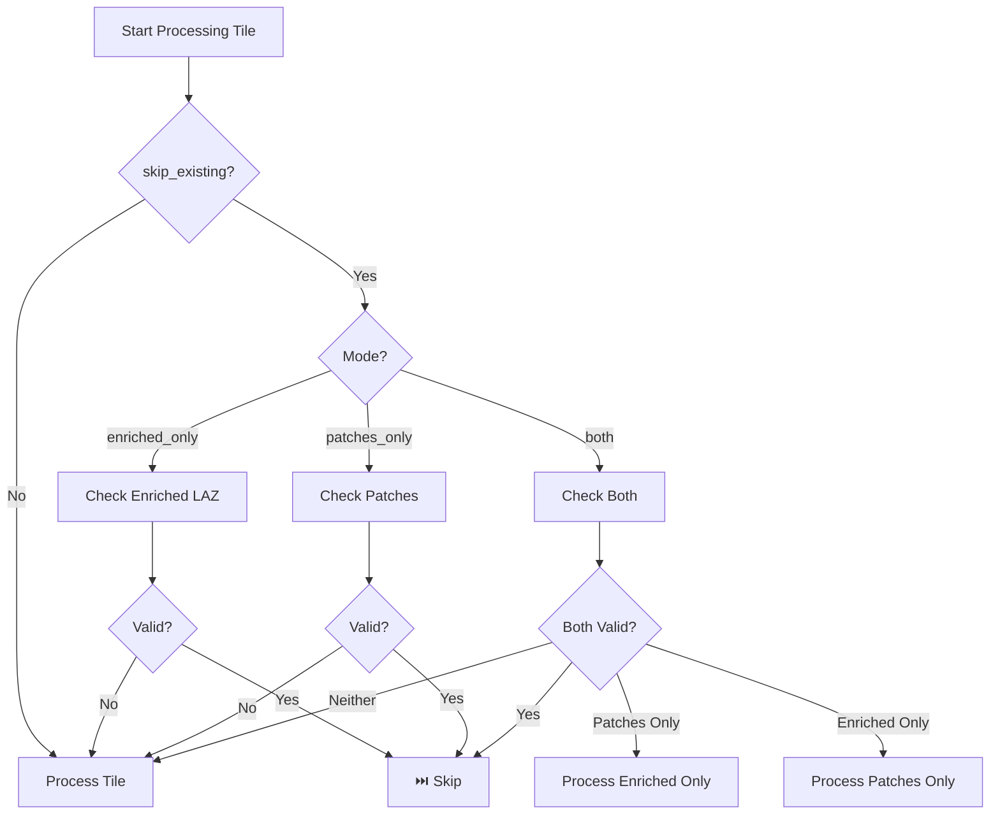

# Intelligent Skip System

## Overview

The **Intelligent Skip System** is a sophisticated optimization feature that automatically detects and skips processing of tiles that have already been fully or partially processed. This dramatically speeds up re-runs and partial processing scenarios.

## Key Features

### 1. **Complete Skip Detection**

Automatically skips tiles when all expected outputs already exist and are valid:

- ✅ All patches generated (with augmentation support)
- ✅ Enriched LAZ files created (if enabled)
- ✅ Content validation passed (not corrupted)

### 2. **Partial Skip Optimization**

Intelligently handles scenarios where only some outputs exist:

- If enriched LAZ exists but patches are missing → Only generate patches
- If patches exist but enriched LAZ is missing → Only generate enriched LAZ
- Saves significant computation time by avoiding redundant processing

### 3. **Deep Content Validation**

Goes beyond simple file existence checks:

- **File integrity**: Validates file size and loadability
- **Data completeness**: Checks for required arrays (coords, labels, features)
- **Shape validation**: Ensures coordinate and label dimensions match
- **Feature validation**: Verifies enriched LAZ contains expected extra dimensions (normals, RGB, NIR, NDVI, etc.)

### 4. **Automatic Recovery**

Intelligently handles corrupted or incomplete outputs:

- Detects corrupted patch files
- Identifies missing expected patches
- Validates feature completeness in enriched LAZ
- Automatically reprocesses when validation fails

## Processing Modes

### Mode: `patches_only` (Default)

**Behavior**: Only generates ML-ready patches

- ✅ Checks for existing patches
- ✅ Validates patch content (coords, labels, features)
- ⏭️ Skips if valid patches exist

### Mode: `enriched_only`

**Behavior**: Only creates enriched LAZ files

- ✅ Checks for existing enriched LAZ
- ✅ Validates enriched LAZ features (normals, RGB, NIR, NDVI, geometric features)
- ⏭️ Skips if valid enriched LAZ exists

### Mode: `both`

**Behavior**: Creates both patches AND enriched LAZ

- ✅ Checks for both outputs
- ✅ Validates completeness of each
- ⏭️ **Full skip**: If BOTH exist and are valid
- 🔄 **Partial skip**: If only one exists, generates the missing one
- 🔄 **Reprocess**: If either is corrupted or incomplete

## Skip Messages

### Complete Skip Messages

```
⏭️  LHD_FXX_0649_6863.laz: Both enriched LAZ (125.3 MB) and 24 patches exist, skipping
⏭️  LHD_FXX_0649_6863.laz: Valid enriched LAZ exists (125.3 MB, 15 features), skipping
⏭️  LHD_FXX_0649_6863.laz: 24/24 patches valid, skipping
```

### Partial Processing Messages

```
🔄 LHD_FXX_0649_6863.laz: Enriched LAZ exists but patches missing, processing patches only
🔄 LHD_FXX_0649_6863.laz: 24 patches exist but enriched LAZ missing, processing enriched LAZ only
```

### Reprocessing Messages

```
🔄 LHD_FXX_0649_6863.laz: Enriched LAZ invalid (Missing features: ['normal_x', 'curvature']), reprocessing
🔄 LHD_FXX_0649_6863.laz: 4 corrupted patches detected, reprocessing
🔄 LHD_FXX_0649_6863.laz: Only 18/24 patches valid (missing 6), reprocessing
```

## Validation Details

### Patch Validation

For each patch file, the system validates:

#### NPZ Format

- ✅ File loads without errors
- ✅ Contains 'coords' or 'points' array
- ✅ Contains 'labels' array
- ✅ Coordinate and label dimensions match
- ✅ Arrays are not empty

#### HDF5 Format

- ✅ File opens without errors
- ✅ Contains 'coords' and 'labels' datasets
- ✅ Coordinate and label dimensions match
- ✅ Datasets are not empty

#### PyTorch Format

- ✅ File loads without errors
- ✅ Contains 'coords' and 'labels' tensors
- ✅ Tensor dimensions match
- ✅ Tensors are not empty

#### LAZ Format

- ✅ File loads without errors
- ✅ Contains X, Y, Z coordinates
- ✅ Point cloud is not empty

### Enriched LAZ Validation

For enriched LAZ files, validates:

#### Core Features (Always Required)

- ✅ `normal_x`, `normal_y`, `normal_z` - Surface normals
- ✅ `curvature` - Surface curvature
- ✅ `height` - Height above local minimum

#### Optional Features (Based on Configuration)

- ✅ `RGB` - RGB colors (if `include_rgb=True`)
- ✅ `NIR` - Near-infrared (if `include_infrared=True`)
- ✅ `NDVI` - Normalized Difference Vegetation Index (if `compute_ndvi=True`)
- ✅ Geometric features: `planarity`, `linearity`, `sphericity`, `verticality` (if `include_extra_features=True`)

## Usage Examples

### Example 1: Initial Processing

```bash
# First run - processes all tiles
ign-lidar-hd process --input data/ --output output/ --mode both
```

```
🔄 LHD_FXX_0649_6863.laz: No outputs found, full processing
🔄 LHD_FXX_0649_6864.laz: No outputs found, full processing
...
```

### Example 2: Re-run (All Valid)

```bash
# Second run - skips all tiles (already processed)
ign-lidar-hd process --input data/ --output output/ --mode both
```

```
⏭️  LHD_FXX_0649_6863.laz: Both enriched LAZ (125.3 MB) and 24 patches exist, skipping
⏭️  LHD_FXX_0649_6864.laz: Both enriched LAZ (118.7 MB) and 20 patches exist, skipping
...
```

### Example 3: Partial Processing

```bash
# Add enriched LAZ to existing patches
ign-lidar-hd process --input data/ --output output/ --mode both
```

```
🔄 LHD_FXX_0649_6863.laz: 24 patches exist but enriched LAZ missing, processing enriched LAZ only
⏭️  LHD_FXX_0649_6864.laz: Both enriched LAZ and patches exist, skipping
...
```

### Example 4: Recovery from Corruption

```bash
# Automatic detection and recovery
ign-lidar-hd process --input data/ --output output/ --mode both
```

```
🔄 LHD_FXX_0649_6863.laz: 4 corrupted patches detected, reprocessing
⏭️  LHD_FXX_0649_6864.laz: All outputs valid, skipping
...
```

## Performance Benefits

### Time Savings

- **Complete skip**: ~100% faster (no processing)
- **Partial skip**: 40-60% faster (skip enrichment OR patch generation)
- **Validation overhead**: <1% (minimal cost for checking)

### I/O Savings

- Avoids re-reading large LAZ files (100MB-2GB each)
- Eliminates redundant feature computation
- Prevents duplicate writes

### Use Cases

1. **Interrupted Runs**: Resume processing after interruption
2. **Configuration Changes**: Re-run with different patch parameters
3. **Mode Switching**: Switch between `patches_only`, `enriched_only`, and `both`
4. **Debugging**: Test specific tiles without reprocessing entire dataset
5. **Incremental Updates**: Add new tiles to existing output directory

## Configuration

### Enable/Disable Skip

```python
processor = LiDARProcessor(
    # ... other params ...
)

# Skip enabled by default in process_tile()
result = processor.process_tile(
    laz_file=tile_path,
    output_dir=output_path,
    skip_existing=True,  # Default: True
)

# Force reprocessing
result = processor.process_tile(
    laz_file=tile_path,
    output_dir=output_path,
    skip_existing=False,  # Force reprocess
)
```

### Skip Checker Configuration

```python
from ign_lidar.core.skip_checker import PatchSkipChecker

checker = PatchSkipChecker(
    output_format='npz',          # Or 'hdf5', 'torch', 'laz'
    architecture='pointnet++',     # Target architecture
    num_augmentations=3,           # Number of augmented versions
    augment=True,                  # Augmentation enabled
    validate_content=True,         # Enable deep validation
    min_file_size=1024,            # Minimum file size (bytes)
    only_enriched_laz=False,       # Check for enriched LAZ only
)
```

## Implementation Details

### Skip Decision Flow



### File Structure

```
output/
├── enriched/                        # Enriched LAZ files
│   ├── LHD_FXX_0649_6863_enriched.laz
│   └── LHD_FXX_0649_6864_enriched.laz
├── LHD_FXX_0649_6863_pointnet++_patch_0000.npz
├── LHD_FXX_0649_6863_pointnet++_patch_0001.npz
├── LHD_FXX_0649_6863_pointnet++_patch_0000_aug1.npz  # If augment=True
└── ...
```

## API Reference

### PatchSkipChecker

```python
class PatchSkipChecker:
    def should_skip_tile(
        self,
        tile_path: Path,
        output_dir: Path,
        expected_patches: Optional[int] = None,
        save_enriched: bool = False,
        include_rgb: bool = False,
        include_infrared: bool = False,
        compute_ndvi: bool = False,
        include_extra_features: bool = False,
    ) -> Tuple[bool, Dict[str, any]]:
        """
        Check if tile should be skipped.

        Returns:
            (should_skip, skip_info)
        """
```

### Skip Reasons

| Reason                            | Description              | Action              |
| --------------------------------- | ------------------------ | ------------------- |
| `enriched_laz_exists_valid`       | Valid enriched LAZ found | ⏭️ Skip             |
| `both_enriched_and_patches_exist` | Both outputs valid       | ⏭️ Skip             |
| `complete_and_valid`              | All patches valid        | ⏭️ Skip             |
| `enriched_exists_but_no_patches`  | Need patches             | 🔄 Process patches  |
| `patches_exist_but_no_enriched`   | Need enriched LAZ        | 🔄 Process enriched |
| `enriched_laz_invalid`            | Missing features         | 🔄 Reprocess        |
| `corrupted_patches_detected`      | Bad patch files          | 🔄 Reprocess        |
| `incomplete_patches`              | Missing patches          | 🔄 Reprocess        |
| `no_patches_found`                | No outputs               | 🔄 Process          |

## Best Practices

### 1. Always Use Skip in Production

```python
# ✅ Good - Use skip for efficiency
processor.process_tile(laz_file, output_dir, skip_existing=True)

# ❌ Bad - Wastes time reprocessing
processor.process_tile(laz_file, output_dir, skip_existing=False)
```

### 2. Handle Partial Processing

```python
# When switching from patches_only to both mode:
# 1. First run creates patches only
processor = LiDARProcessor(processing_mode='patches_only')
processor.process_folder(input_dir, output_dir)

# 2. Second run adds enriched LAZ (patches skipped automatically)
processor = LiDARProcessor(processing_mode='both')
processor.process_folder(input_dir, output_dir)
```

### 3. Monitor Skip Statistics

```python
result = processor.process_tile(laz_file, output_dir)

if result.get('skipped', False):
    print(f"Skipped: {result['skip_reason']}")
    print(f"Skip info: {result['skip_info']}")
else:
    print(f"Processed: {result['num_patches']} patches in {result['processing_time']:.1f}s")
```

### 4. Force Reprocessing When Needed

```python
# Force reprocessing after configuration changes
processor = LiDARProcessor(
    include_extra_features=True,  # Changed setting
    # ... other params ...
)

# Force reprocess all tiles
for tile in tiles:
    processor.process_tile(tile, output_dir, skip_existing=False)
```

## Troubleshooting

### Issue: Tiles Not Being Skipped

**Symptoms**: All tiles reprocess even though outputs exist

**Possible Causes**:

1. `skip_existing=False` explicitly set
2. Output directory path changed
3. Architecture or format changed (different file names)
4. Validation failing (files corrupted)

**Solution**:

```python
# Enable debug logging
import logging
logging.basicConfig(level=logging.DEBUG)

# Check skip decision
should_skip, info = processor.skip_checker.should_skip_tile(
    tile_path, output_dir,
    save_enriched=True,
    include_rgb=True,
    # ... match your config ...
)
print(f"Skip: {should_skip}, Reason: {info.get('reason')}")
```

### Issue: Partial Skip Not Working

**Symptoms**: Both enriched LAZ and patches regenerated when only one is missing

**Cause**: Validation failing for existing output

**Solution**: Check validation errors in logs

```
🔄 tile.laz: Enriched LAZ invalid (Missing features: ['ndvi']), reprocessing
```

Fix configuration to match expected features:

```python
processor = LiDARProcessor(
    compute_ndvi=True,  # Match what was expected
    # ... other params ...
)
```

## Future Enhancements

Planned improvements:

- [ ] Cache validation results (avoid repeated checks)
- [ ] Parallel validation (speed up large folders)
- [ ] Hash-based integrity checks (cryptographic validation)
- [ ] Database of processed tiles (faster lookups)
- [ ] Resume from checkpoint (mid-tile interruption)

## See Also

- [Processing Pipeline](./workflows.md)
- [Configuration Guide](./guides/configuration.md)
- [Performance Optimization](./guides/performance.md)
