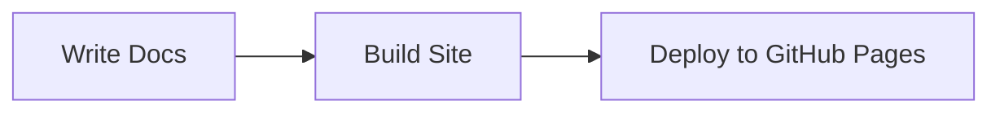

# Documentation Website

This website is built using [Docusaurus](https://docusaurus.io/), a modern static website generator with full Mermaid diagram support.

**Live Site**: <https://sducournau.github.io/IGN_LIDAR_HD_DATASET/>

## 🚀 Quick Start

### Installation

```bash
cd docs
npm install
```

### Local Development

```bash
npm start
```

This command starts a local development server and opens up a browser window. Most changes are reflected live without having to restart the server.

### Build

```bash
npm run build
```

This command generates static content into the `build` directory and can be served using any static content hosting service.

## 🌐 Deployment

### Automatic Deployment

The website is automatically deployed to GitHub Pages using GitHub Actions whenever changes are pushed to the `main` branch:

1. **Trigger**: Automatically on push to `main` branch when `docs/**` files change
2. **Build**: Uses Node.js 20 to build the Docusaurus site
3. **Deploy**: Deploys to GitHub Pages

### Manual Deployment

You can also deploy manually from your local machine:

```bash
cd docs
GIT_USER=<your-username> npm run deploy
```

## 📊 Features

### Mermaid Diagrams

Full support for interactive Mermaid diagrams in documentation:



### Multi-language Support

Configured for English and French documentation with i18n support.

### Responsive Design

Fully responsive design that works across all devices.

## 🔧 Development

### Testing Changes

Always test your changes locally before pushing:

```bash
npm run build
npm run serve
```

### Adding Documentation

1. Create new `.md` files in the `docs/` directory
2. Update `sidebars.ts` to include new pages in navigation
3. Use Mermaid diagrams for visual explanations
4. Follow the established style guide with emoji icons

### Translation

See [translation_tools/README.md](translation_tools/README.md) for translation workflows.

## 🔗 Resources

- **Docusaurus Documentation**: <https://docusaurus.io/>
- **Mermaid Documentation**: <https://mermaid.js.org/>
- **Main Project**: [../README.md](../README.md)

---

*Documentation website for IGN LiDAR HD v2.4.2*
