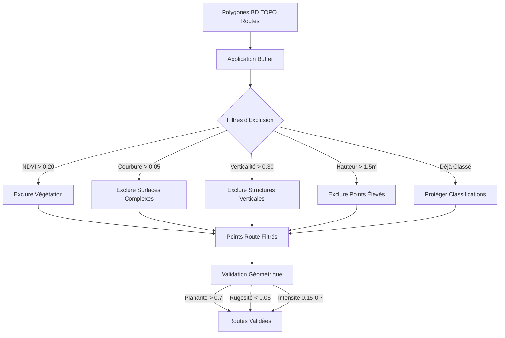

# Améliorations de la Classification des Routes

**Date:** 19 Octobre 2025  
**Auteur:** Simon Ducournau  
**Version:** 1.0

## 📋 Résumé

Ce document décrit les améliorations apportées aux règles de classification des routes pour résoudre les problèmes de confusion avec la végétation et les bâtiments adjacents.

## 🎯 Problèmes Identifiés

### 1. Végétation Classée Comme Route

- **Problème:** Des points de végétation (arbres en bordure de route) étaient incorrectement classés comme surfaces de route
- **Cause:** Les polygones BD TOPO routes incluent parfois les arbres en bordure
- **Impact:** Contamination de la classe "route" avec des points à NDVI élevé et courbure complexe

### 2. Parties de Bâtiments Classées Comme Route

- **Problème:** Des éléments verticaux de bâtiments adjacents aux routes étaient classés comme route
- **Cause:** Les buffers des polygones BD TOPO routes débordaient sur les bâtiments
- **Impact:** Points verticaux avec faible planarite inclus dans les routes

## ✅ Solutions Implémentées

### A. Filtrage NDVI Renforcé

**Nouveau Seuil:** `ROAD_NDVI_MAX = 0.20`

```python
# Exclusion de la végétation par NDVI
if ndvi is not None:
    vegetation_ndvi_mask = ndvi > config.ROAD_NDVI_MAX  # 0.20
    filtered_road_mask = filtered_road_mask & ~vegetation_ndvi_mask
```

**Justification:**

- NDVI > 0.20 indique une activité photosynthétique (végétation)
- Les surfaces de route (asphalte, béton) ont NDVI < 0.15
- Marge de sécurité de 0.05 pour éviter les faux positifs

### B. Filtrage par Courbure de Surface

**Nouveau Seuil:** `ROAD_CURVATURE_MAX = 0.05`

```python
# Exclusion des surfaces complexes (feuillage, branches)
if curvature is not None:
    vegetation_curve_mask = curvature > config.ROAD_CURVATURE_MAX  # 0.05
    filtered_road_mask = filtered_road_mask & ~vegetation_curve_mask
```

**Justification:**

- Routes = surfaces planes, faible courbure (< 0.05)
- Végétation = surfaces complexes, forte courbure (> 0.05)
- Distingue le feuillage des arbres des surfaces routières planes

### C. Filtrage par Verticalité

**Nouveau Seuil:** `ROAD_VERTICALITY_MAX = 0.30`

```python
# Exclusion des structures verticales (murs, poteaux)
if verticality is not None:
    building_vertical_mask = verticality > config.ROAD_VERTICALITY_MAX  # 0.30
    filtered_road_mask = filtered_road_mask & ~building_vertical_mask
```

**Justification:**

- Routes = surfaces horizontales, verticalité < 0.30
- Murs de bâtiments = surfaces verticales, verticalité > 0.70
- Seuil à 0.30 permet de filtrer les structures inclinées

### D. Réduction de la Hauteur Maximum

**Ancien:** `ROAD_HEIGHT_MAX = 2.0m`  
**Nouveau:** `ROAD_HEIGHT_MAX = 1.5m`

```python
# Points au-dessus de 1.5m ne sont pas des surfaces de route
elevated_mask = height > config.ROAD_HEIGHT_MAX  # 1.5m
filtered_road_mask = filtered_road_mask & ~elevated_mask
```

**Justification:**

- Routes au niveau du sol: hauteur < 0.5m généralement
- Cime des arbres: hauteur > 3.0m
- Bâtiments bas: hauteur > 2.5m
- Seuil à 1.5m filtre la plupart des faux positifs

### E. Augmentation de la Planarite Minimale

**Ancien:** `ROAD_PLANARITY_MIN = 0.6`  
**Nouveau:** `ROAD_PLANARITY_MIN = 0.7`

```python
# Routes doivent être très planes
road_candidates = (
    (planarity > config.PLANARITY_ROAD_MIN) &  # 0.7
    # ... autres critères
)
```

**Justification:**

- Routes pavées/asphaltées sont très planes (planarite > 0.8)
- Végétation a faible planarite (< 0.4)
- Seuil à 0.7 filtre les surfaces irrégulières

### F. Protection des Classifications Existantes

```python
# Protéger les points déjà classés comme bâtiments ou végétation
protected_mask = np.isin(labels, [LOD2_WALL, LOD2_VEG_LOW, LOD2_VEG_HIGH])
filtered_road_mask = filtered_road_mask & ~protected_mask
```

**Justification:**

- Évite de reclassifier des bâtiments/végétation déjà identifiés
- Préserve la cohérence entre étapes de classification
- Priorité aux classifications géométriques précises

## 📊 Flux de Filtrage



## 🔬 Paramètres Détaillés

### Seuils de Classification

| Paramètre              | Ancienne Valeur | Nouvelle Valeur | Justification                  |
| ---------------------- | --------------- | --------------- | ------------------------------ |
| `ROAD_HEIGHT_MAX`      | 2.0m            | **1.5m**        | Exclure arbres et bâtiments    |
| `ROAD_PLANARITY_MIN`   | 0.6             | **0.7**         | Routes plus planes             |
| `ROAD_NDVI_MAX`        | N/A             | **0.20**        | Filtrage végétation            |
| `ROAD_CURVATURE_MAX`   | N/A             | **0.05**        | Filtrage surfaces complexes    |
| `ROAD_VERTICALITY_MAX` | N/A             | **0.30**        | Filtrage structures verticales |

### Ordre de Priorité des Filtres

1. **Protection** - Points déjà classés (bâtiments, végétation)
2. **NDVI** - Indicateur spectral direct de végétation
3. **Courbure** - Complexité de surface (feuillage vs asphalte)
4. **Verticalité** - Orientation (horizontal vs vertical)
5. **Hauteur** - Élévation (sol vs structures élevées)
6. **Géométrie** - Planarite, rugosité, intensité

## 📈 Résultats Attendus

### Avant Amélioration

- ❌ Arbres en bordure de route classés comme route
- ❌ Murs de bâtiments adjacents classés comme route
- ❌ Confusion route/végétation dans zones boisées
- ❌ Débordement sur façades de bâtiments

### Après Amélioration

- ✅ Végétation correctement exclue des routes
- ✅ Bâtiments adjacents protégés
- ✅ Routes limitées aux surfaces horizontales planes
- ✅ Meilleure séparation route/végétation

## 🎨 Impact Visuel

### Classification Améliorée

```
Route            → Asphalte/Béton uniquement
├─ NDVI < 0.20   → Pas de végétation
├─ Courbure < 0.05 → Surface plane
├─ Verticalité < 0.30 → Horizontale
└─ Hauteur < 1.5m → Au niveau du sol

Végétation      → Arbres en bordure exclus
├─ NDVI > 0.20   → Chlorophylle détectée
└─ Courbure > 0.05 → Feuillage complexe

Bâtiments       → Structures adjacentes protégées
├─ Verticalité > 0.30 → Murs verticaux
└─ Déjà classé → Protection prioritaire
```

## 🔧 Configuration

### Fichier de Configuration

Les nouveaux paramètres peuvent être ajustés dans le fichier de configuration :

```yaml
classification:
  thresholds:
    # Seuils de route améliorés
    road_height_max: 1.5 # Maximum 1.5m au-dessus du sol
    road_planarity_min: 0.7 # Minimum 0.7 de planarite
    road_ndvi_max: 0.20 # Maximum 0.20 NDVI
    road_curvature_max: 0.05 # Maximum 0.05 courbure
    road_verticality_max: 0.30 # Maximum 0.30 verticalité
```

## 📝 Code Modifié

### Fichiers Principaux

1. **`classification_thresholds.py`**

   - Ajout des nouveaux seuils de filtrage
   - Documentation des paramètres

2. **`classification_refinement.py`**
   - Implémentation des filtres d'exclusion multiples
   - Ajout des paramètres NDVI, courbure, verticalité
   - Protection des classifications existantes

### Fonction Principale

```python
def refine_road_classification(
    labels: np.ndarray,
    points: np.ndarray,
    height: Optional[np.ndarray],
    planarity: Optional[np.ndarray],
    roughness: Optional[np.ndarray],
    intensity: Optional[np.ndarray],
    ground_truth_road_mask: Optional[np.ndarray] = None,
    ground_truth_rail_mask: Optional[np.ndarray] = None,
    normals: Optional[np.ndarray] = None,
    road_types: Optional[np.ndarray] = None,
    rail_types: Optional[np.ndarray] = None,
    ndvi: Optional[np.ndarray] = None,  # NOUVEAU
    verticality: Optional[np.ndarray] = None,  # NOUVEAU
    curvature: Optional[np.ndarray] = None,  # NOUVEAU
    mode: str = 'lod2',
    config: RefinementConfig = None
) -> Tuple[np.ndarray, int]:
    """
    Classification routes améliorée avec filtrage multi-critères
    """
```

## 🧪 Tests

### Tests Unitaires Recommandés

1. **Test Filtrage NDVI**

   - Points NDVI > 0.20 doivent être exclus
   - Points NDVI < 0.15 doivent être acceptés

2. **Test Filtrage Courbure**

   - Points courbure > 0.05 doivent être exclus
   - Points courbure < 0.03 doivent être acceptés

3. **Test Filtrage Verticalité**

   - Points verticalité > 0.30 doivent être exclus
   - Points verticalité < 0.20 doivent être acceptés

4. **Test Protection Classifications**
   - Points déjà classés LOD2_VEG_HIGH ne doivent pas changer
   - Points déjà classés LOD2_WALL ne doivent pas changer

## 📚 Références

- **BD TOPO®** - Documentation IGN sur les polygones de transport
- **ASPRS Classification** - Standard ASPRS pour classes LiDAR
- **NDVI Vegetation Index** - Indices spectraux de végétation
- **Geometric Features** - Attributs géométriques LiDAR

## 🎓 Bonnes Pratiques

### Recommandations

1. **Toujours calculer NDVI** quand des bandes spectrales sont disponibles
2. **Utiliser plusieurs critères** pour la robustesse (NDVI + courbure + verticalité)
3. **Protéger les classifications existantes** pour éviter les conflits
4. **Ajuster les seuils** selon le contexte (urbain vs rural)
5. **Valider visuellement** les résultats sur des zones test

### Limitations Connues

- **Routes ombragées:** Peuvent avoir NDVI légèrement plus élevé
- **Routes très usées:** Peuvent avoir rugosité plus élevée
- **Ponts:** Nécessitent traitement spécial (élévation)
- **Tunnels:** Nécessitent traitement spécial (pas de NDVI)

## 🔄 Prochaines Étapes

1. ✅ Implémentation des filtres multi-critères
2. ✅ Ajout des nouveaux seuils de classification
3. ⏳ Tests sur jeu de données Versailles
4. ⏳ Validation visuelle des résultats
5. ⏳ Ajustement fin des seuils si nécessaire
6. ⏳ Documentation utilisateur

## 📞 Contact

Pour questions ou suggestions:

- **Email:** simon.ducournau@example.com
- **GitHub Issues:** IGN_LIDAR_HD_DATASET repository

---

**Dernière mise à jour:** 19 Octobre 2025
