# Rules Framework Architecture

> **Visual guide to the IGN LiDAR HD Rules Framework (v3.2.0)**  
> System architecture, data flow, and component interactions

---

## 📐 System Architecture

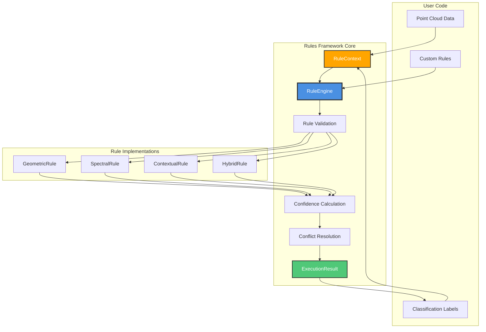

---

## 🔄 Data Flow: Sequential Execution

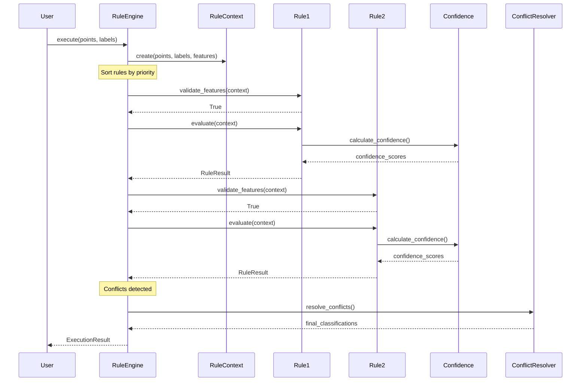

---

## 🏗️ Hierarchical Execution Flow

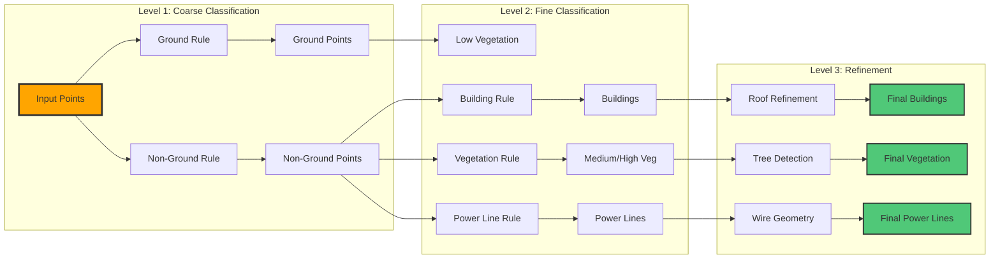

---

## 🎯 Component Relationships

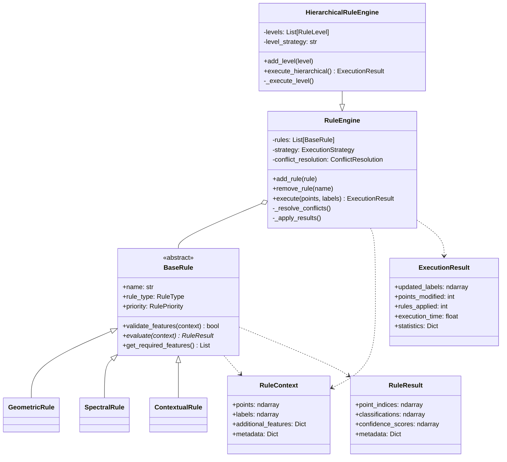

---

## 🔢 Confidence Calculation Pipeline

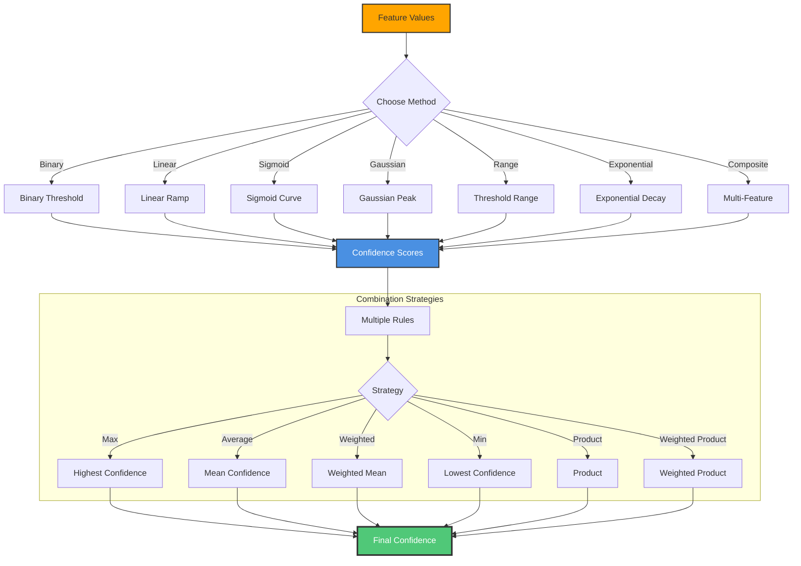

---

## 🔀 Conflict Resolution Strategies

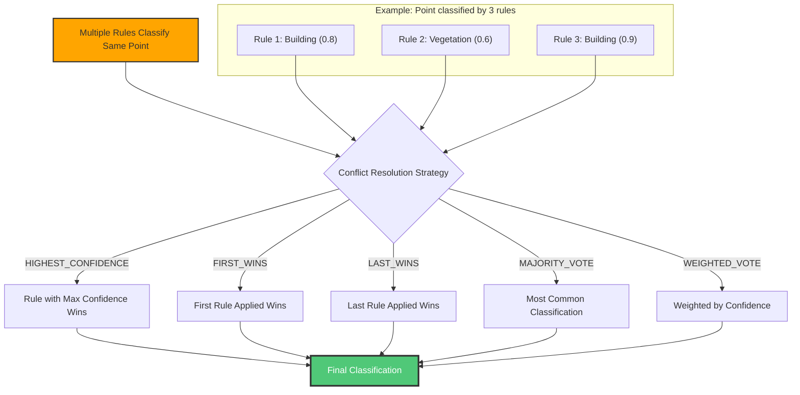

---

## 📊 Rule Execution States

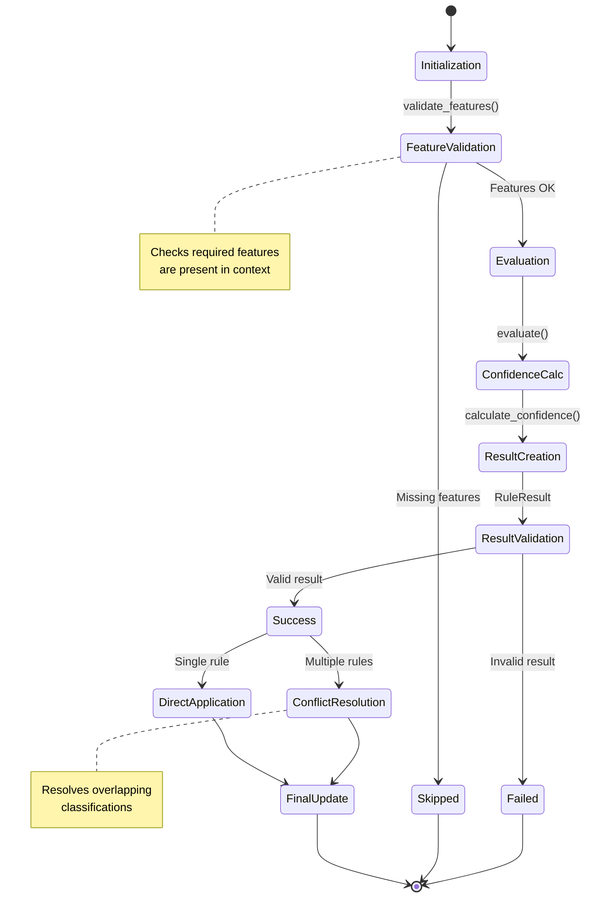

---

## 🏢 Module Organization

```
ign_lidar/core/classification/rules/
│
├── __init__.py              # Public API exports (40+ items)
│   ├── BaseRule
│   ├── RuleEngine
│   ├── HierarchicalRuleEngine
│   ├── RuleContext, RuleResult, ExecutionResult
│   ├── All enums and dataclasses
│   └── All functions from submodules
│
├── base.py                  # Core abstractions (513 lines)
│   ├── BaseRule (abstract)
│   ├── RuleEngine
│   ├── HierarchicalRuleEngine
│   ├── Dataclasses: RuleContext, RuleResult, ExecutionResult, RuleLevel
│   └── Enums: RuleType, RulePriority, ExecutionStrategy, etc.
│
├── validation.py            # Feature/result validation (339 lines)
│   ├── validate_rule_context()
│   ├── validate_rule_result()
│   ├── validate_feature_array()
│   ├── check_required_features()
│   └── FeatureRequirements dataclass
│
├── confidence.py            # Confidence calculations (347 lines)
│   ├── calculate_confidence() - 7 methods
│   ├── combine_confidences() - 6 strategies
│   └── ConfidenceMethod enum
│
└── hierarchy.py             # Multi-level execution (346 lines)
    ├── HierarchicalRuleEngine (enhanced)
    ├── RuleLevel dataclass
    └── Level execution strategies
```

---

## 🚀 Execution Performance Model

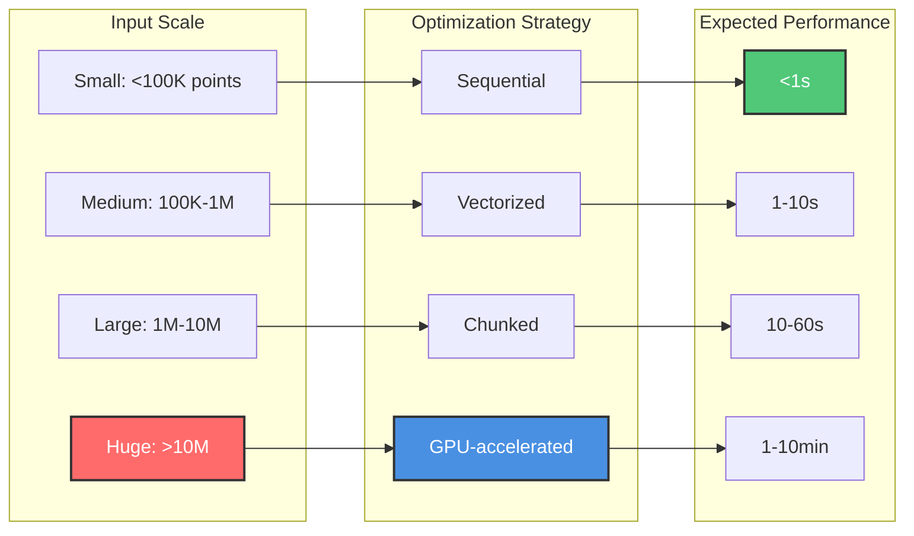

---

## 🔧 Typical Usage Patterns

### Pattern 1: Simple Sequential Classification

```
User creates rules → Engine sorts by priority → Sequential execution →
Confidence calculation → Conflict resolution → Updated labels
```

### Pattern 2: Hierarchical Classification

```
Level 1 (Coarse): Ground/Non-ground separation →
Level 2 (Medium): Building/Veg/Other detection →
Level 3 (Fine): Detailed sub-classification →
Final refinement → Updated labels
```

### Pattern 3: Multi-Feature Hybrid

```
Geometric features → Geometric rules →
Spectral features → Spectral rules →
Spatial context → Contextual rules →
Confidence combination → Conflict resolution → Updated labels
```

---

## 💡 Design Principles

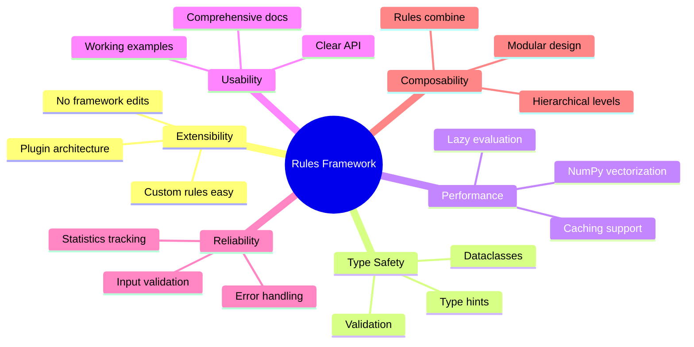

---

## 📈 Confidence Score Visualization

```
Binary Method:
          1.0 ┤     ████████████
              │     █
              │     █
          0.0 ┼█████
              ├─────┬─────┬─────
              0   threshold  max

Linear Method:
          1.0 ┤         ████████
              │       ██
              │     ██
          0.0 ┼█████
              ├─────┬─────┬─────
              0   threshold  max

Sigmoid Method:
          1.0 ┤        ███████
              │      ██
              │    ██
              │  ██
          0.0 ┼██
              ├─────┬─────┬─────
              0   threshold  max

Gaussian Method:
          1.0 ┤      ███
              │    ███████
              │  ███     ███
          0.0 ┼██         ██
              ├─────┬─────┬─────
              0   threshold  max
```

---

## 🎯 Integration Points

### With Existing Classification Pipeline

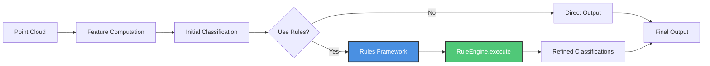

### With Ground Truth Data

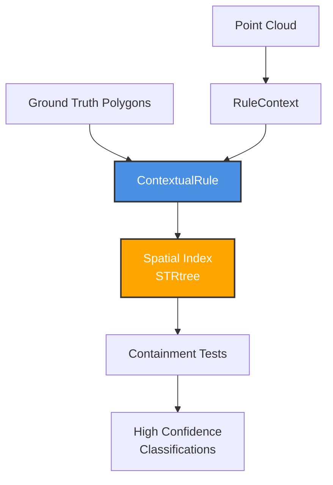

---

## 🔍 Debugging & Monitoring

### Execution Statistics Flow

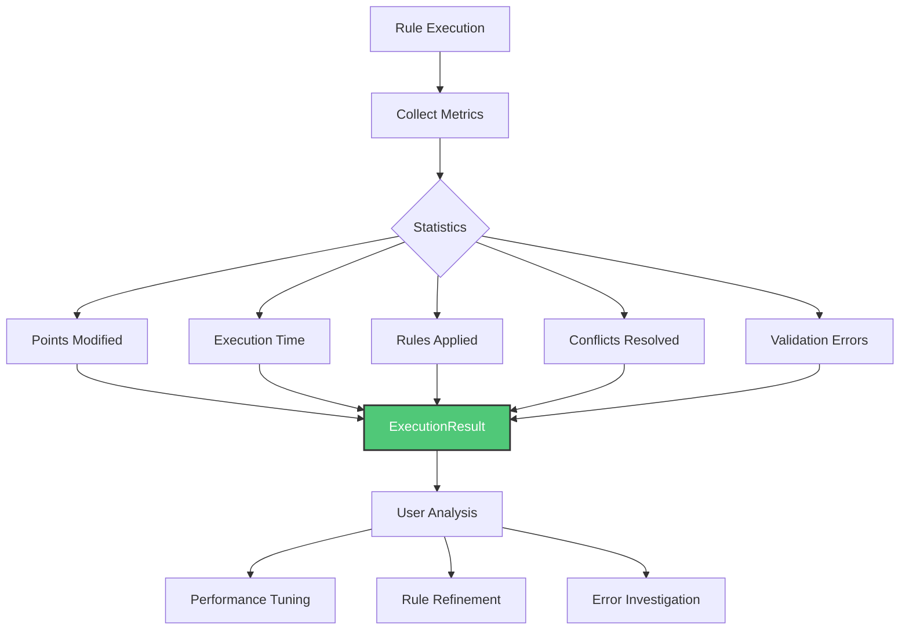

---

## 📚 Learning Path Flow

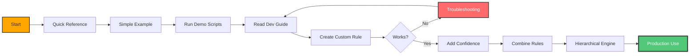

---

## 🎓 Documentation Map

```
📚 Rules Framework Documentation

├── RULES_FRAMEWORK_QUICK_REFERENCE.md
│   └── One-page reference for rapid development
│
├── RULES_FRAMEWORK_DEVELOPER_GUIDE.md (this file)
│   ├── Complete API documentation
│   ├── Step-by-step tutorials
│   ├── Best practices
│   └── Troubleshooting
│
├── RULES_FRAMEWORK_ARCHITECTURE.md
│   ├── Visual diagrams (this file)
│   ├── Component relationships
│   └── Data flow charts
│
├── examples/README_RULES_EXAMPLES.md
│   ├── Usage examples
│   ├── Code walkthroughs
│   └── Real-world scenarios
│
└── examples/demo_*.py
    ├── demo_custom_geometric_rule.py
    ├── demo_hierarchical_rules.py
    └── demo_confidence_scoring.py
```

---

## 🔗 Related Documentation

- **Quick Reference**: `RULES_FRAMEWORK_QUICK_REFERENCE.md` - One-page API reference
- **Developer Guide**: `RULES_FRAMEWORK_DEVELOPER_GUIDE.md` - Comprehensive documentation
- **Examples Guide**: `examples/README_RULES_EXAMPLES.md` - Working code examples
- **Demo Scripts**: `examples/demo_*.py` - Executable demonstrations
- **Project Summary**: `PROJECT_CONSOLIDATION_SUMMARY.md` - Overall consolidation status

---

## 📞 Support & Resources

- **Documentation**: [sducournau.github.io/IGN_LIDAR_HD_DATASET](https://sducournau.github.io/IGN_LIDAR_HD_DATASET/)
- **Issues**: [github.com/sducournau/IGN_LIDAR_HD_DATASET/issues](https://github.com/sducournau/IGN_LIDAR_HD_DATASET/issues)
- **Source Code**: `ign_lidar/core/classification/rules/`

---

**Version**: 3.2.1 | **Date**: October 23, 2025 | **License**: MIT
