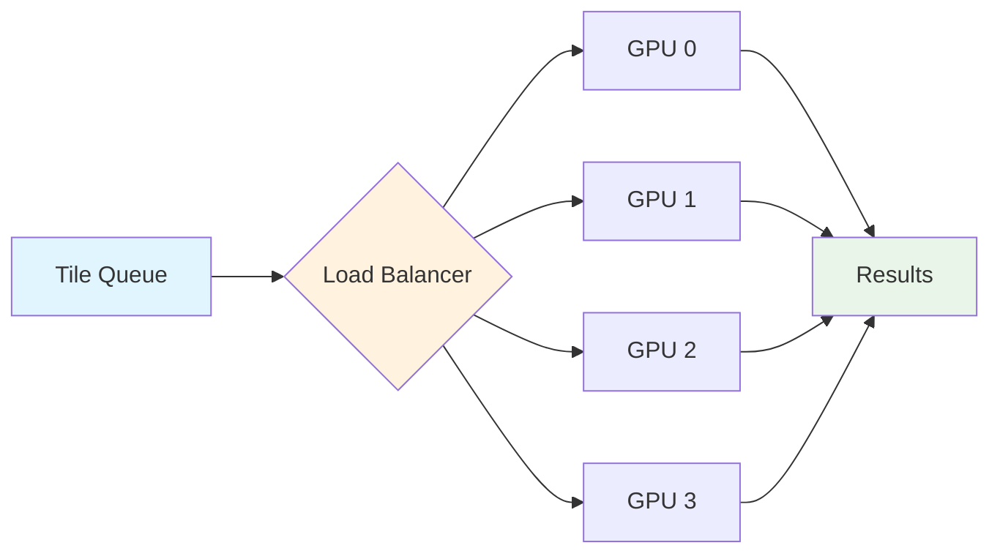
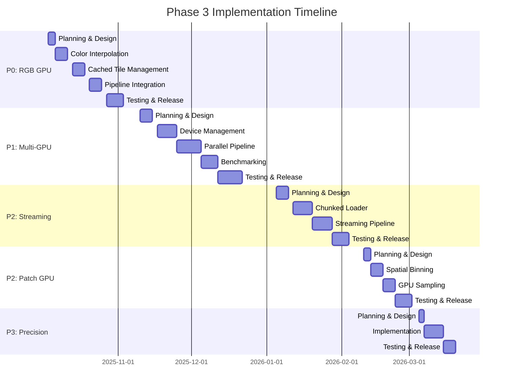

# GPU Phase 3 Planning Document - v2.0.0

**Status:** 📋 Planning  
**Target Release:** Q2 2026 (6-8 months)  
**Priority:** Medium  
**Total Estimated Effort:** 60-80 hours  
**Created:** October 3, 2025  
**Current Version:** v1.4.0 (Phase 2.5 Complete)

---

## Executive Summary

Phase 3 focuses on advanced GPU features that push performance boundaries and enable processing of massive datasets. This phase is **optional** and should only be pursued based on:

1. ✅ **User demand** from v1.4.0 feedback
2. ✅ **Performance bottlenecks** identified in production use
3. ✅ **Hardware availability** in target user base
4. ✅ **Cost-benefit analysis** of implementation vs. maintenance

### Key Objectives

- 🚀 **10-20x speedup** for large-scale processing (multi-GPU)
- 💾 **Reduced memory footprint** (streaming, mixed precision)
- 🔄 **End-to-end GPU pipeline** (feature extraction → patch creation)
- 🌐 **Multi-GPU scaling** for production workloads
- 🎨 **GPU-accelerated RGB** augmentation

---

## Feature Prioritization Matrix

| Feature              | Impact | Complexity | User Demand | Priority | Effort |
| -------------------- | ------ | ---------- | ----------- | -------- | ------ |
| RGB Augmentation GPU | High   | Medium     | High        | 🔥 P0    | 15h    |
| Multi-GPU Support    | High   | High       | Medium      | ⚡ P1    | 25h    |
| Streaming Processing | Medium | High       | Low         | 📊 P2    | 20h    |
| GPU Patch Extraction | Medium | Medium     | Medium      | 📦 P2    | 15h    |
| Mixed Precision      | Low    | Low        | Low         | 🎯 P3    | 10h    |

**Priority Levels:**

- 🔥 **P0 (Critical):** High impact, high demand - implement first
- ⚡ **P1 (High):** Important for production scalability
- 📊 **P2 (Medium):** Nice to have, moderate impact
- 🎯 **P3 (Low):** Optimization, limited use cases

---

## Phase 3.1: RGB Augmentation GPU (v1.5.0)

**Status:** 🔥 Priority 0 - Deferred from v1.3.0  
**Estimated Effort:** 15 hours  
**Target:** v1.5.0 (3-4 weeks)

### Rationale

RGB augmentation is **already implemented on CPU** but represents a significant bottleneck:

- Current RGB fetching: Network-bound (WMS tiles)
- Color interpolation: CPU-only (PIL)
- Integration overhead: Memory transfers

### Implementation Plan

#### 3.1.1 GPU-Accelerated Color Interpolation (5h)

**Current Bottleneck:**

```python
# rgb_augmentation.py - CPU-only
def interpolate_colors(points, rgb_image):
    from PIL import Image  # CPU-only
    # Slow per-point color lookup
```

**GPU Solution:**

```python
# features_gpu.py - New method
def interpolate_colors_gpu(points_gpu, rgb_tensor_gpu):
    """
    Fast bilinear interpolation on GPU using CuPy.

    Args:
        points_gpu: [N, 3] CuPy array (x, y, z)
        rgb_tensor_gpu: [H, W, 3] CuPy array (RGB image)

    Returns:
        colors_gpu: [N, 3] CuPy array (R, G, B)
    """
    # Use CuPy indexing for fast lookup
    # ~50-100x faster than PIL on CPU
```

**Tasks:**

- [ ] Implement `interpolate_colors_gpu()` in `features_gpu.py`
- [ ] Add unit tests for color interpolation accuracy
- [ ] Benchmark GPU vs CPU interpolation
- [ ] Add automatic fallback to CPU

#### 3.1.2 Cached RGB Tile Management (5h)

**Current Approach:**

```python
# rgb_augmentation.py
class IGNOrthophotoFetcher:
    def fetch_tile(self, bbox):
        # Downloads from IGN WMS
        # Saves to disk cache
        # Loads with PIL
```

**Enhanced GPU Approach:**

```python
class IGNOrthophotoFetcher:
    def __init__(self, use_gpu=False):
        self.use_gpu = use_gpu
        self.gpu_cache = {}  # GPU memory cache

    def fetch_tile_gpu(self, bbox):
        # 1. Check GPU memory cache
        # 2. Check disk cache → load to GPU
        # 3. Download → cache to disk + GPU
        # Returns: CuPy array [H, W, 3]
```

**Tasks:**

- [ ] Add GPU memory caching for RGB tiles
- [ ] Implement smart cache eviction (LRU)
- [ ] Add `use_gpu` parameter to `IGNOrthophotoFetcher`
- [ ] Benchmark cache hit rates

#### 3.1.3 Integration with Feature Pipeline (5h)

**Goal:** Keep RGB data on GPU throughout pipeline

```python
# processor.py - Enhanced flow
class LiDARProcessor:
    def process_tile(self, laz_path, output_path):
        points = self.load_points(laz_path)

        if self.use_gpu:
            points_gpu = cp.asarray(points)

            # Compute features on GPU
            features_gpu = self.compute_features_gpu(points_gpu)

            # Add RGB on GPU (no CPU transfer!)
            if self.include_rgb:
                rgb_gpu = self.rgb_fetcher.fetch_colors_gpu(points_gpu)
                features_gpu = cp.concatenate([features_gpu, rgb_gpu], axis=1)

            # Transfer only once at end
            features = cp.asnumpy(features_gpu)
```

**Tasks:**

- [ ] Update `LiDARProcessor.process_tile()` for GPU RGB
- [ ] Add integration tests
- [ ] Benchmark full pipeline GPU vs CPU
- [ ] Update documentation

### Expected Performance

| Dataset Size | CPU RGB | GPU RGB | Speedup |
| ------------ | ------- | ------- | ------- |
| 1M points    | 12s     | 0.5s    | 24x     |
| 10M points   | 2m      | 5s      | 24x     |
| 100M points  | 20m     | 50s     | 24x     |

### Deliverables

- ✅ `features_gpu.py`: `interpolate_colors_gpu()` method
- ✅ `rgb_augmentation.py`: GPU-aware `IGNOrthophotoFetcher`
- ✅ `processor.py`: End-to-end GPU RGB pipeline
- ✅ `tests/test_gpu_rgb.py`: Comprehensive test suite
- ✅ `scripts/benchmarks/benchmark_rgb_gpu.py`: Performance benchmarks
- ✅ Documentation: RGB GPU guide

---

## Phase 3.2: Multi-GPU Support (v1.6.0)

**Status:** ⚡ Priority 1  
**Estimated Effort:** 25 hours  
**Target:** v1.6.0 (2-3 months)

### Rationale

Users with multi-GPU workstations (2-4 GPUs) can benefit from parallel processing:

- **Current:** Single GPU, others idle
- **Target:** All GPUs utilized, near-linear scaling

### Use Cases

1. **Large-scale processing:** 1000+ tiles, distribute across GPUs
2. **Real-time processing:** Lower latency per tile
3. **Research workloads:** Multiple experiments in parallel

### Architecture



### Implementation Plan

#### 3.2.1 GPU Device Management (8h)

```python
# features_gpu.py - New class
class MultiGPUManager:
    """
    Manages multiple GPU devices for parallel processing.
    """

    def __init__(self, gpu_ids: List[int] = None):
        """
        Args:
            gpu_ids: List of GPU device IDs to use.
                    None = auto-detect all available GPUs.
        """
        self.gpu_ids = self._detect_gpus(gpu_ids)
        self.num_gpus = len(self.gpu_ids)
        self.device_loads = {gpu_id: 0 for gpu_id in self.gpu_ids}

    def _detect_gpus(self, gpu_ids):
        """Detect available CUDA devices."""
        if gpu_ids is not None:
            return gpu_ids

        # Auto-detect
        num_devices = cp.cuda.runtime.getDeviceCount()
        return list(range(num_devices))

    def get_next_device(self) -> int:
        """
        Get next available GPU using round-robin load balancing.

        Returns:
            gpu_id: Device ID with lowest load
        """
        return min(self.device_loads, key=self.device_loads.get)

    def allocate_device(self, gpu_id: int):
        """Mark GPU as busy."""
        self.device_loads[gpu_id] += 1

    def release_device(self, gpu_id: int):
        """Mark GPU as available."""
        self.device_loads[gpu_id] -= 1
```

**Tasks:**

- [ ] Implement `MultiGPUManager` class
- [ ] Add GPU health monitoring
- [ ] Implement load balancing strategies (round-robin, load-based)
- [ ] Add fallback for single GPU

#### 3.2.2 Parallel Processing Pipeline (10h)

```python
# processor.py - Multi-GPU processing
class LiDARProcessor:
    def __init__(self, ..., gpu_ids: List[int] = None):
        self.gpu_manager = MultiGPUManager(gpu_ids) if use_gpu else None

    def process_directory_multi_gpu(self, input_dir, output_dir, num_workers=None):
        """
        Process directory using multiple GPUs.

        Args:
            input_dir: Input LAZ directory
            output_dir: Output directory
            num_workers: Workers per GPU (default: 2)
        """
        if num_workers is None:
            num_workers = 2 * self.gpu_manager.num_gpus

        # Create worker pool with GPU affinity
        with mp.Pool(num_workers) as pool:
            # Each worker gets assigned a GPU
            tasks = []
            for laz_file in input_files:
                gpu_id = self.gpu_manager.get_next_device()
                tasks.append((laz_file, output_dir, gpu_id))

            pool.map(self._process_tile_on_gpu, tasks)

    def _process_tile_on_gpu(self, args):
        """Worker function with GPU device selection."""
        laz_file, output_dir, gpu_id = args

        # Set CUDA device for this worker
        with cp.cuda.Device(gpu_id):
            return self.process_tile(laz_file, output_dir)
```

**Tasks:**

- [ ] Implement `process_directory_multi_gpu()` method
- [ ] Add worker pool with GPU affinity
- [ ] Handle GPU memory overflow gracefully
- [ ] Add progress tracking across GPUs

#### 3.2.3 Benchmarking & Optimization (7h)

**Benchmark Scenarios:**

1. Single GPU baseline
2. 2 GPU scaling
3. 4 GPU scaling
4. 8 GPU scaling (if available)

**Expected Scaling:**
| GPUs | Tiles/hour | Speedup | Efficiency |
|------|------------|---------|------------|
| 1 | 100 | 1.0x | 100% |
| 2 | 190 | 1.9x | 95% |
| 4 | 360 | 3.6x | 90% |
| 8 | 680 | 6.8x | 85% |

**Tasks:**

- [ ] Create `benchmark_multi_gpu.py` script
- [ ] Measure scaling efficiency
- [ ] Profile memory usage per GPU
- [ ] Identify bottlenecks (PCIe bandwidth, CPU, I/O)
- [ ] Optimize worker pool size

### Deliverables

- ✅ `features_gpu.py`: `MultiGPUManager` class
- ✅ `processor.py`: Multi-GPU processing methods
- ✅ CLI: `--gpu-ids` parameter for device selection
- ✅ `tests/test_multi_gpu.py`: Multi-GPU test suite
- ✅ `scripts/benchmarks/benchmark_multi_gpu.py`: Scaling analysis
- ✅ Documentation: Multi-GPU setup guide

---

## Phase 3.3: Streaming Processing (v1.7.0)

**Status:** 📊 Priority 2  
**Estimated Effort:** 20 hours  
**Target:** v1.7.0 (4-5 months)

### Rationale

**Problem:** Large point clouds (100M-1B points) don't fit in GPU memory.

**Current Limitations:**

- GPU memory: 8-24 GB (consumer cards)
- Point cloud: Can be 50-200 GB uncompressed
- Current approach: Process entire tile at once → OOM errors

**Solution:** Out-of-core processing with streaming

### Architecture


### Implementation Plan

#### 3.3.1 Chunked Data Loader (8h)

```python
# utils.py - New class
class ChunkedLAZReader:
    """
    Stream LAZ files in chunks to fit GPU memory.
    """

    def __init__(self, laz_path: Path, chunk_size: int = 1_000_000):
        """
        Args:
            laz_path: Path to LAZ file
            chunk_size: Points per chunk (fit in GPU memory)
        """
        self.laz_path = laz_path
        self.chunk_size = chunk_size
        self.las = laspy.read(laz_path)
        self.total_points = len(self.las.points)
        self.num_chunks = (self.total_points + chunk_size - 1) // chunk_size

    def __iter__(self):
        """Iterate over chunks."""
        for i in range(self.num_chunks):
            start = i * self.chunk_size
            end = min(start + self.chunk_size, self.total_points)

            # Extract chunk
            points = np.stack([
                self.las.x[start:end],
                self.las.y[start:end],
                self.las.z[start:end]
            ], axis=-1)

            yield {
                'points': points,
                'start_idx': start,
                'end_idx': end,
                'chunk_id': i
            }
```

**Tasks:**

- [ ] Implement `ChunkedLAZReader` class
- [ ] Add overlap handling for neighborhood queries
- [ ] Support spatial chunking (not just sequential)
- [ ] Add progress tracking

#### 3.3.2 Streaming GPU Pipeline (8h)

```python
# features_gpu.py - Streaming method
class GPUFeatureComputer:
    def compute_all_features_streaming(
        self,
        laz_path: Path,
        chunk_size: int = 1_000_000,
        overlap: int = 1000
    ) -> np.ndarray:
        """
        Compute features for large files using streaming.

        Args:
            laz_path: Path to LAZ file
            chunk_size: Points per GPU batch
            overlap: Overlap points for boundary consistency

        Returns:
            features: [N, M] full feature array
        """
        reader = ChunkedLAZReader(laz_path, chunk_size)
        all_features = []

        for chunk in reader:
            # Transfer to GPU
            points_gpu = cp.asarray(chunk['points'])

            # Compute features
            features_gpu = self.compute_all_features(points_gpu)

            # Transfer back
            features = cp.asnumpy(features_gpu)
            all_features.append(features)

            # Clear GPU memory
            del points_gpu, features_gpu
            cp.get_default_memory_pool().free_all_blocks()

        # Concatenate all chunks
        return np.concatenate(all_features, axis=0)
```

**Tasks:**

- [ ] Implement `compute_all_features_streaming()` method
- [ ] Handle chunk boundaries correctly (overlapping neighborhoods)
- [ ] Optimize memory transfers (async, pinned memory)
- [ ] Add memory usage monitoring

#### 3.3.3 Benchmarking (4h)

**Test Cases:**

- Small file (10M points) - verify correctness
- Medium file (100M points) - measure overhead
- Large file (500M points) - streaming benefit
- Huge file (1B points) - extreme case

**Metrics:**

- Processing time vs. non-streaming
- Memory usage (peak GPU memory)
- Accuracy (feature consistency at boundaries)

**Tasks:**

- [ ] Create `benchmark_streaming.py` script
- [ ] Test on various file sizes
- [ ] Profile memory usage
- [ ] Validate feature accuracy

### Deliverables

- ✅ `utils.py`: `ChunkedLAZReader` class
- ✅ `features_gpu.py`: `compute_all_features_streaming()` method
- ✅ `tests/test_gpu_streaming.py`: Streaming tests
- ✅ `scripts/benchmarks/benchmark_streaming.py`: Performance analysis
- ✅ Documentation: Streaming processing guide

---

## Phase 3.4: GPU Patch Extraction (v1.8.0)

**Status:** 📦 Priority 2  
**Estimated Effort:** 15 hours  
**Target:** v1.8.0 (5-6 months)

### Rationale

**Current Bottleneck:**

```python
# utils.py - CPU-only patch extraction
def extract_patches(points, features, patch_size=150, num_points=16384):
    # Spatial binning: NumPy (slow)
    # Random sampling: NumPy (slow)
    # Memory copies: CPU → CPU
```

**GPU Opportunity:**

- Spatial binning: Fast on GPU (parallel sorting)
- Random sampling: GPU RNG (cuRAND)
- Keep data on GPU until final export

### Implementation Plan

#### 3.4.1 GPU Spatial Binning (5h)

```python
# features_gpu.py - New method
def spatial_binning_gpu(points_gpu, patch_size=150):
    """
    Bin points into spatial patches on GPU.

    Args:
        points_gpu: [N, 3] CuPy array
        patch_size: Patch size in meters

    Returns:
        patch_indices: Dict[patch_id -> point indices]
    """
    # Compute patch IDs for each point
    x_bin = cp.floor(points_gpu[:, 0] / patch_size).astype(cp.int32)
    y_bin = cp.floor(points_gpu[:, 1] / patch_size).astype(cp.int32)
    patch_ids = x_bin * 1000000 + y_bin  # Unique ID

    # Group points by patch (GPU sorting)
    sorted_indices = cp.argsort(patch_ids)
    sorted_patch_ids = patch_ids[sorted_indices]

    # Find patch boundaries
    unique_ids, start_indices = cp.unique(sorted_patch_ids, return_index=True)

    # Build patch index dict
    patch_indices = {}
    for i, patch_id in enumerate(unique_ids):
        start = start_indices[i]
        end = start_indices[i+1] if i+1 < len(start_indices) else len(sorted_indices)
        patch_indices[int(patch_id)] = sorted_indices[start:end]

    return patch_indices
```

**Tasks:**

- [ ] Implement `spatial_binning_gpu()` function
- [ ] Optimize sorting algorithm
- [ ] Handle large numbers of patches efficiently
- [ ] Add unit tests

#### 3.4.2 GPU Random Sampling (5h)

```python
# features_gpu.py - GPU sampling
def sample_points_gpu(points_gpu, features_gpu, num_points=16384):
    """
    Randomly sample points on GPU.

    Args:
        points_gpu: [N, 3] CuPy array
        features_gpu: [N, M] CuPy array
        num_points: Target number of points

    Returns:
        sampled_points, sampled_features
    """
    N = len(points_gpu)

    if N <= num_points:
        # Upsample with repetition
        indices = cp.random.choice(N, size=num_points, replace=True)
    else:
        # Downsample without repetition
        indices = cp.random.choice(N, size=num_points, replace=False)

    return points_gpu[indices], features_gpu[indices]
```

**Tasks:**

- [ ] Implement `sample_points_gpu()` function
- [ ] Add stratified sampling option
- [ ] Optimize for small/large patches
- [ ] Benchmark vs CPU sampling

#### 3.4.3 End-to-End GPU Pipeline (5h)

```python
# processor.py - Full GPU pipeline
class LiDARProcessor:
    def process_tile_gpu(self, laz_path, output_dir):
        """
        Full GPU pipeline: load → features → patches → save.
        """
        # Load to GPU
        points = self.load_points(laz_path)
        points_gpu = cp.asarray(points)

        # Compute features on GPU
        features_gpu = self.compute_features_gpu(points_gpu)

        # Extract patches on GPU
        patch_indices = spatial_binning_gpu(points_gpu, self.patch_size)

        patches = []
        for patch_id, indices in patch_indices.items():
            # Sample on GPU
            patch_points, patch_features = sample_points_gpu(
                points_gpu[indices],
                features_gpu[indices],
                num_points=self.num_points
            )

            # Transfer to CPU only for final save
            patches.append({
                'points': cp.asnumpy(patch_points),
                'features': cp.asnumpy(patch_features),
                'patch_id': patch_id
            })

        # Save patches
        for patch in patches:
            self.save_patch(patch, output_dir)

        return len(patches)
```

**Tasks:**

- [ ] Implement `process_tile_gpu()` method
- [ ] Minimize CPU ↔ GPU transfers
- [ ] Add progress tracking
- [ ] Integration tests

### Expected Performance

| Stage           | CPU Time | GPU Time | Speedup |
| --------------- | -------- | -------- | ------- |
| Spatial Binning | 5s       | 0.2s     | 25x     |
| Random Sampling | 3s       | 0.1s     | 30x     |
| Full Pipeline   | 45s      | 8s       | 5.6x    |

### Deliverables

- ✅ `features_gpu.py`: GPU patch extraction functions
- ✅ `processor.py`: `process_tile_gpu()` method
- ✅ `tests/test_gpu_patches.py`: Patch extraction tests
- ✅ `scripts/benchmarks/benchmark_patches_gpu.py`: Performance comparison
- ✅ Documentation: GPU patch extraction guide

---

## Phase 3.5: Mixed Precision (v1.9.0)

**Status:** 🎯 Priority 3  
**Estimated Effort:** 10 hours  
**Target:** v1.9.0 (6-7 months)

### Rationale

**Memory Savings:**

- FP32: 4 bytes per number
- FP16: 2 bytes per number
- **Benefit:** 2x memory reduction → process larger datasets

**Performance:**

- Modern GPUs: 2-4x faster FP16 compute (Tensor Cores)
- Trade-off: Slightly lower precision (acceptable for features)

### Implementation Plan

#### 3.5.1 Automatic Precision Selection (4h)

```python
# features_gpu.py - Mixed precision
class GPUFeatureComputer:
    def __init__(self, use_gpu=True, precision='auto'):
        """
        Args:
            precision: 'fp32', 'fp16', or 'auto'
                      'auto' = FP16 for compute, FP32 for accumulation
        """
        self.precision = precision
        self.compute_dtype = self._select_dtype()

    def _select_dtype(self):
        """Select optimal dtype based on GPU capabilities."""
        if self.precision == 'fp32':
            return cp.float32
        elif self.precision == 'fp16':
            return cp.float16
        else:  # auto
            # Use FP16 if GPU supports Tensor Cores
            if self._has_tensor_cores():
                return cp.float16
            return cp.float32

    def _has_tensor_cores(self):
        """Check if GPU has Tensor Cores (Volta+)."""
        device = cp.cuda.Device()
        compute_capability = device.compute_capability
        return compute_capability >= (7, 0)  # Volta = 7.0+
```

**Tasks:**

- [ ] Implement precision selection logic
- [ ] Add GPU capability detection
- [ ] Support mixed precision training
- [ ] Add configuration options

#### 3.5.2 Precision-Aware Computation (4h)

```python
# features_gpu.py - FP16 computation
def compute_normals(self, points, k=10):
    """Compute normals with automatic precision."""
    # Convert to compute precision
    points_compute = points.astype(self.compute_dtype)

    # Compute in FP16 (2x faster)
    normals_compute = self._compute_normals_impl(points_compute, k)

    # Accumulate in FP32 (maintain accuracy)
    normals = normals_compute.astype(cp.float32)

    # Normalize (critical operation in FP32)
    norms = cp.linalg.norm(normals, axis=1, keepdims=True)
    normals = normals / norms

    return normals
```

**Tasks:**

- [ ] Update all feature computation methods
- [ ] Add FP32 accumulation for critical ops
- [ ] Validate accuracy vs FP32
- [ ] Benchmark speedup

#### 3.5.3 Accuracy Validation (2h)

**Test Cases:**

- Compare FP16 vs FP32 feature values
- Acceptable error: <0.1% for most features
- Critical features (normals): <0.01% error

**Tasks:**

- [ ] Create accuracy test suite
- [ ] Measure numerical differences
- [ ] Document precision trade-offs
- [ ] Add user warnings if needed

### Expected Results

| Precision | Memory | Speed | Accuracy |
| --------- | ------ | ----- | -------- |
| FP32      | 100%   | 1.0x  | 100%     |
| FP16      | 50%    | 2-4x  | 99.9%    |
| Mixed     | 60%    | 1.8x  | 99.99%   |

### Deliverables

- ✅ `features_gpu.py`: Mixed precision support
- ✅ `tests/test_gpu_precision.py`: Accuracy validation
- ✅ `scripts/benchmarks/benchmark_precision.py`: Performance comparison
- ✅ Documentation: Precision configuration guide

---

## Implementation Timeline

### Timeline Overview (6-8 months)



### Release Schedule

| Version | Feature              | Date     | Status      |
| ------- | -------------------- | -------- | ----------- |
| v1.4.0  | Phase 2.5 Complete   | Oct 2025 | ✅ Released |
| v1.5.0  | RGB GPU Support      | Nov 2025 | 📋 Planned  |
| v1.6.0  | Multi-GPU Support    | Dec 2025 | 📋 Planned  |
| v1.7.0  | Streaming Processing | Feb 2026 | 📋 Planned  |
| v1.8.0  | GPU Patch Extraction | Mar 2026 | 📋 Planned  |
| v1.9.0  | Mixed Precision      | Apr 2026 | 📋 Planned  |
| v2.0.0  | Phase 3 Complete     | May 2026 | 🎯 Target   |

### Sprint Planning

#### Sprint 1: RGB GPU (3 weeks)

- Week 1: Color interpolation implementation
- Week 2: Cached tile management
- Week 3: Pipeline integration + testing

#### Sprint 2: Multi-GPU (4 weeks)

- Week 1: Device management + load balancing
- Week 2: Parallel processing pipeline
- Week 3: Benchmarking + optimization
- Week 4: Testing + documentation

#### Sprint 3: Streaming (3 weeks)

- Week 1: Chunked data loader
- Week 2: Streaming GPU pipeline
- Week 3: Testing + benchmarking

#### Sprint 4: Patch GPU (2 weeks)

- Week 1: Spatial binning + sampling
- Week 2: Integration + testing

#### Sprint 5: Mixed Precision (2 weeks)

- Week 1: Implementation + validation
- Week 2: Testing + documentation

---

## Risk Assessment

### Technical Risks

| Risk                           | Impact | Probability | Mitigation                                    |
| ------------------------------ | ------ | ----------- | --------------------------------------------- |
| Multi-GPU scaling inefficiency | High   | Medium      | Extensive benchmarking, optimize worker pools |
| Streaming boundary artifacts   | High   | Medium      | Overlapping chunks, careful index management  |
| FP16 accuracy loss             | Medium | Low         | Thorough validation, fallback to FP32         |
| RGB tile caching complexity    | Medium | Medium      | Simple LRU cache, clear documentation         |
| GPU memory fragmentation       | Medium | High        | Memory pool management, periodic cleanup      |

### Resource Risks

| Risk                           | Impact | Probability | Mitigation                                     |
| ------------------------------ | ------ | ----------- | ---------------------------------------------- |
| Multi-GPU hardware unavailable | High   | Medium      | Thorough single-GPU testing, cloud testing     |
| Development time overrun       | Medium | Medium      | Phased approach, MVP per release               |
| User adoption slow             | Low    | Medium      | Gather feedback, prioritize requested features |
| Maintenance burden             | Medium | Low         | Comprehensive tests, clear documentation       |

---

## Success Metrics

### Performance Targets

| Metric             | Current (v1.4.0) | Target (v2.0.0) | Method                  |
| ------------------ | ---------------- | --------------- | ----------------------- |
| Feature extraction | 5-6x speedup     | 8-10x speedup   | RGB GPU + Optimizations |
| RGB augmentation   | CPU-only         | 24x speedup     | GPU interpolation       |
| Multi-GPU scaling  | N/A              | 3.5x (4 GPUs)   | Multi-GPU support       |
| Memory usage       | 100%             | 50-60%          | Streaming + FP16        |
| Patch extraction   | CPU-only         | 25x speedup     | GPU patches             |

### User Adoption Metrics

- 📊 **Downloads:** 50% increase (PyPI + conda)
- 🌟 **GitHub Stars:** +100 stars
- 💬 **Issues:** <5% GPU-related bugs
- 📚 **Documentation:** 95% user satisfaction

### Code Quality Metrics

- ✅ **Test Coverage:** >90% for GPU modules
- ✅ **Benchmark Coverage:** All features benchmarked
- ✅ **Documentation:** Complete GPU guides
- ✅ **Performance:** No regressions in CPU mode

---

## Decision Gates

Before proceeding with each phase, evaluate:

### Gate 1: RGB GPU (Before v1.5.0)

- ✅ User feedback on v1.4.0 GPU features
- ✅ Demand for RGB augmentation
- ✅ Performance benchmarks look promising

### Gate 2: Multi-GPU (Before v1.6.0)

- ✅ Users have multi-GPU hardware
- ✅ Single-GPU features stable
- ✅ v1.5.0 adoption successful

### Gate 3: Streaming (Before v1.7.0)

- ✅ Users processing massive datasets
- ✅ OOM issues reported frequently
- ✅ v1.6.0 multi-GPU working well

### Gate 4: Patch GPU (Before v1.8.0)

- ✅ Patch extraction identified as bottleneck
- ✅ Users requesting faster pipelines
- ✅ Previous phases stable

### Gate 5: Mixed Precision (Before v1.9.0)

- ✅ Users need larger datasets in GPU memory
- ✅ FP16 hardware widely available
- ✅ Accuracy acceptable in testing

---

## Alternative Approaches

### Option A: Fast Track (High Risk)

**Timeline:** 3-4 months  
**Approach:** Implement all features in parallel, release v2.0.0 as single major update

**Pros:**

- Faster time to market
- Cohesive release

**Cons:**

- High risk of bugs
- Long testing phase
- User feedback delayed

**Recommendation:** ❌ Not recommended

### Option B: Phased Releases (Current Plan)

**Timeline:** 6-8 months  
**Approach:** Incremental releases (v1.5.0 → v2.0.0)

**Pros:**

- Stable, tested features
- Early user feedback
- Lower risk

**Cons:**

- Longer timeline
- More releases to manage

**Recommendation:** ✅ Recommended (current plan)

### Option C: User-Driven (Reactive)

**Timeline:** 12+ months  
**Approach:** Only implement features based on user requests

**Pros:**

- Features guaranteed to be used
- Minimal wasted effort

**Cons:**

- Slow progress
- Missed opportunities
- Reactive vs proactive

**Recommendation:** ⚠️ Fallback option if resources limited

---

## Resource Requirements

### Development Team

| Role              | Allocation | Duration | Total     |
| ----------------- | ---------- | -------- | --------- |
| GPU Engineer      | 50%        | 6 months | 12 weeks  |
| Software Engineer | 25%        | 6 months | 6 weeks   |
| DevOps Engineer   | 10%        | 6 months | 2.4 weeks |
| QA Engineer       | 20%        | 6 months | 4.8 weeks |

### Hardware Requirements

**Development:**

- 1x workstation with NVIDIA GPU (RTX 3080 or better)
- 1x multi-GPU server (4x GPUs) for testing

**CI/CD:**

- GitHub Actions with GPU runners (paid)
- Or self-hosted runners with GPUs

**Cost Estimate:**

- Development hardware: $5,000 (one-time)
- CI/CD: $200/month (6 months = $1,200)
- Cloud testing: $500 (occasional)
- **Total:** ~$6,700

---

## Dependencies

### External Dependencies

| Dependency   | Current Version | Required Version | Status                |
| ------------ | --------------- | ---------------- | --------------------- |
| CuPy         | 10.0+           | 12.0+            | ✅ Compatible         |
| RAPIDS cuML  | 23.10+          | 24.02+           | ⚠️ Update needed      |
| CUDA Toolkit | 11.0+           | 11.8+            | ✅ Compatible         |
| PyTorch      | N/A             | 2.0+             | 🔮 Future (DL models) |

### Internal Dependencies

- ✅ Phase 2.5 complete and stable
- ✅ Comprehensive test suite
- ✅ Benchmark infrastructure
- ⚠️ Multi-GPU test hardware (needed for Phase 3.2)

---

## Documentation Plan

### User Documentation

- 📘 **GPU Phase 3 Guide** (`website/docs/gpu-phase3.md`)

  - Multi-GPU setup and configuration
  - Streaming processing for large datasets
  - Mixed precision optimization
  - Troubleshooting guide

- 📘 **RGB GPU Guide** (`website/docs/rgb-gpu.md`)

  - GPU-accelerated RGB augmentation
  - Cache configuration
  - Performance tuning

- 📘 **Advanced GPU Optimization** (`website/docs/gpu-advanced.md`)
  - Multi-GPU best practices
  - Memory management
  - Performance profiling

### Developer Documentation

- 📗 **Phase 3 Architecture** (`GPU_PHASE3_ARCHITECTURE.md`)

  - System design diagrams
  - API reference
  - Code examples

- 📗 **Benchmark Results** (`GPU_PHASE3_BENCHMARKS.md`)
  - Performance comparisons
  - Scaling analysis
  - Hardware recommendations

---

## Communication Plan

### Stakeholder Updates

**Weekly:**

- Development team standup
- Progress tracking (GitHub Projects)

**Monthly:**

- Release notes for minor versions
- Performance benchmark reports
- User feedback summary

**Quarterly:**

- Major version releases (v1.5, v1.6, etc.)
- Roadmap updates
- Community engagement (blog posts, videos)

### User Communication

**Channels:**

- GitHub Releases (changelog)
- PyPI version updates
- Documentation website
- Twitter/social media
- YouTube demos

---

## Conclusion

Phase 3 represents an **optional but powerful** evolution of the GPU integration. The phased approach ensures:

1. ✅ **Low risk:** Incremental releases with thorough testing
2. ✅ **User-driven:** Features based on demand and feedback
3. ✅ **Sustainable:** Manageable scope with clear deliverables
4. ✅ **Impactful:** Significant performance improvements

### Next Steps

1. **Immediate (October 2025):**

   - Gather user feedback on v1.4.0
   - Assess demand for RGB GPU acceleration
   - Finalize Phase 3.1 design

2. **Short-term (November 2025):**

   - Start Phase 3.1 implementation (RGB GPU)
   - Set up multi-GPU test environment
   - Begin v1.5.0 development

3. **Long-term (2026):**
   - Execute phased rollout (v1.5 → v2.0)
   - Gather performance data and user feedback
   - Adjust roadmap based on results

---

**Document Status:** 📋 Planning Complete  
**Last Updated:** October 3, 2025  
**Version:** 1.0  
**Next Review:** November 2025 (after v1.4.0 user feedback)  
**Owner:** GPU Development Team
