# RGB Augmentation: Bringing Color to Your Point Clouds

We're excited to announce a major new feature for the IGN LiDAR HD Processing Library: **RGB Augmentation from IGN Orthophotos**! 🎨

This feature automatically enriches your LiDAR point clouds with RGB colors fetched directly from IGN's high-resolution orthophoto service, enabling multi-modal machine learning and enhanced visualization.

<!-- truncate -->

## What's New?

### 🎨 RGB Augmentation

Your LiDAR patches can now include RGB color information automatically extracted from IGN BD ORTHO® orthophotos at 20cm resolution:

```bash
# Simple command to add RGB colors
ign-lidar-hd patch \
  --input enriched_tiles/ \
  --output patches/ \
  --include-rgb \
  --rgb-cache-dir cache/
```

### 📦 Renamed Command: `process` → `patch`

For better clarity, we've renamed the `process` command to `patch`. Don't worry - the old command still works for backwards compatibility!

```bash
# New recommended command
ign-lidar-hd patch --input tiles/ --output patches/

# Old command (still works, shows deprecation warning)
ign-lidar-hd process --input tiles/ --output patches/
```

## Why RGB Augmentation?

### Multi-Modal Machine Learning

Combine geometric features with photometric information for better classification:

- **Improved accuracy**: Models can learn from both shape and color
- **Better generalization**: Color helps disambiguate similar geometries
- **Enhanced features**: 30+ geometric features + 3 color channels

### Better Visualization

Color-coded point clouds make analysis and debugging much easier:

```python
import numpy as np
import matplotlib.pyplot as plt
from mpl_toolkits.mplot3d import Axes3D

# Load patch with RGB
data = np.load('patch.npz')
points = data['points']
rgb = data['rgb']  # Normalized [0, 1]

# Visualize with true colors
fig = plt.figure(figsize=(12, 8))
ax = fig.add_subplot(111, projection='3d')
ax.scatter(points[:, 0], points[:, 1], points[:, 2], c=rgb, s=1)
plt.title('RGB-Augmented Point Cloud')
plt.show()
```

### Zero Manual Work

No need to:

- Download orthophotos manually
- Align images with point clouds
- Handle coordinate transformations
- Manage multiple data sources

Everything is automatic! The library:

1. Fetches orthophotos from IGN Géoplateforme WMS
2. Maps 3D points to 2D pixels automatically
3. Extracts and normalizes RGB values
4. Caches downloads for performance

## How It Works

```mermaid
flowchart TD
    A[LiDAR Point Cloud] --> B[Extract Bounding Box]
    B --> C{Orthophoto Cached?}
    C -->|Yes| E[Load from Cache]
    C -->|No| D[Fetch from IGN WMS]
    D --> F[Download & Cache]
    F --> E
    E --> G[Map 3D → 2D]
    G --> H[Extract RGB]
    H --> I[Normalize to 0-1]
    I --> J[Augmented Patch]

    style A fill:#e3f2fd
    style J fill:#e8f5e8
```



The system is smart about caching - orthophotos are downloaded once per tile and reused for all patches, making the process fast and efficient.

## Performance

### Speed Benchmarks

| Configuration        | Time per Patch | Notes                      |
| -------------------- | -------------- | -------------------------- |
| Geometry only        | 0.5-2s         | Baseline (no RGB)          |
| RGB (cached)         | 0.6-2.5s       | +0.1-0.5s (minimal impact) |
| RGB (first download) | 2-7s           | +2-5s (one-time cost)      |

With caching enabled (recommended!), the performance impact is minimal:

- **10-20x faster** than downloading every time
- **~500KB-2MB** cache size per tile
- **Automatic reuse** across patches from same tile

### Memory Impact

RGB augmentation adds only **~196KB per patch** (16,384 points × 3 colors × 4 bytes), which is negligible compared to the geometric features.

## Python API

### Basic Usage

```python
from pathlib import Path
from ign_lidar import LiDARProcessor

# Initialize with RGB support
processor = LiDARProcessor(
    lod_level="LOD2",
    include_rgb=True,
    rgb_cache_dir=Path("cache/")
)

# Process tiles
patches = processor.process_tile("enriched_tile.laz", "output/")

# Each patch now has RGB!
import numpy as np
data = np.load("output/patch_0001.npz")
print(data.keys())  # ['points', 'features', 'labels', 'rgb', 'metadata']
print(data['rgb'].shape)  # (N, 3) - normalized RGB [0, 1]
```

### Advanced: Direct RGB Augmentation

```python
from ign_lidar.rgb_augmentation import IGNOrthophotoFetcher

# Direct control over RGB fetching
fetcher = IGNOrthophotoFetcher(cache_dir=Path("cache/"))

# Fetch for specific bounding box
bbox = (x_min, y_min, x_max, y_max)  # Lambert 93
image = fetcher.fetch_orthophoto(bbox, tile_id="0123_4567")

# Augment points
import numpy as np
points = np.array([[x1, y1, z1], [x2, y2, z2]])
rgb = fetcher.augment_points_with_rgb(points, bbox, tile_id="0123_4567")
```

## Data Specifications

### IGN Service

- **Source**: IGN Géoplateforme WMS
- **Layer**: `HR.ORTHOIMAGERY.ORTHOPHOTOS`
- **Resolution**: 20cm per pixel
- **CRS**: EPSG:2154 (Lambert 93)
- **Coverage**: Metropolitan France
- **Format**: PNG (24-bit RGB)

### Output Format

Each NPZ patch now includes:

```python
{
    'points': np.ndarray,      # (N, 3) - X, Y, Z
    'features': np.ndarray,    # (N, 30+) - Geometric features
    'labels': np.ndarray,      # (N,) - Classification labels
    'rgb': np.ndarray,         # (N, 3) - RGB colors [0, 1]
    'metadata': dict           # Patch info
}
```

## Getting Started

### Installation

The RGB feature requires two additional packages:

```bash
pip install requests Pillow

# Or install with extras
pip install ign-lidar-hd[rgb]
```

### Quick Start

```bash
# 1. Download tiles (as usual)
ign-lidar-hd download --bbox -2.0,47.0,-1.0,48.0 --output tiles/

# 2. Enrich with features (as usual)
ign-lidar-hd enrich --input-dir tiles/ --output enriched/

# 3. Create patches WITH RGB (new!)
ign-lidar-hd patch \
  --input-dir enriched/ \
  --output patches/ \
  --include-rgb \
  --rgb-cache-dir cache/ \
  --lod-level LOD2
```

## Best Practices

### 1. Always Use Caching

```bash
# ✅ Good: With cache (fast)
ign-lidar-hd patch --include-rgb --rgb-cache-dir cache/

# ❌ Slow: No cache (downloads repeatedly)
ign-lidar-hd patch --include-rgb
```

Caching makes RGB augmentation 10-20x faster for subsequent patches.

### 2. Check RGB Statistics

```python
import numpy as np

data = np.load('patch.npz')
rgb = data['rgb']

print(f"RGB mean: {rgb.mean(axis=0)}")
print(f"RGB std: {rgb.std(axis=0)}")
print(f"RGB range: [{rgb.min():.3f}, {rgb.max():.3f}]")

# Values should be in [0, 1]
assert rgb.min() >= 0 and rgb.max() <= 1, "RGB not normalized!"
```

### 3. Handle Missing Dependencies Gracefully

```python
try:
    from ign_lidar.rgb_augmentation import IGNOrthophotoFetcher
    HAS_RGB = True
except ImportError:
    HAS_RGB = False
    print("Install 'requests' and 'Pillow' for RGB support")

processor = LiDARProcessor(
    include_rgb=HAS_RGB,
    rgb_cache_dir=Path("cache/") if HAS_RGB else None
)
```

## Backwards Compatibility

**Everything still works as before!**

- RGB augmentation is **opt-in** via `--include-rgb` flag
- Default behavior unchanged (no RGB)
- Old `process` command still works (with deprecation warning)
- Existing scripts continue to function without modifications

## Migration Guide

### Command Line

```bash
# Old workflow (still works)
ign-lidar-hd process --input tiles/ --output patches/

# New workflow (recommended)
ign-lidar-hd patch --input tiles/ --output patches/

# New workflow with RGB
ign-lidar-hd patch --input tiles/ --output patches/ --include-rgb
```

### Python API

```python
# Old code (still works)
processor = LiDARProcessor(lod_level="LOD2")
patches = processor.process_tile("tile.laz", "output/")

# New with RGB (opt-in)
processor = LiDARProcessor(
    lod_level="LOD2",
    include_rgb=True,  # NEW!
    rgb_cache_dir=Path("cache/")  # NEW!
)
patches = processor.process_tile("tile.laz", "output/")
```

## Use Cases

### 1. Building Material Classification

Use color to distinguish building materials:

- **Brick walls**: Red/brown tones
- **Concrete**: Gray tones
- **Glass windows**: Reflective/variable colors
- **Vegetation**: Green tones

### 2. Quality Control

Identify misalignments or processing errors by checking if colors match expected semantics:

```python
data = np.load('patch.npz')
rgb = data['rgb']
labels = data['labels']

# Roofs should be dark (tiles) or light (metal)
roof_colors = rgb[labels == ROOF_CLASS]
print(f"Roof colors: R={roof_colors[:, 0].mean():.2f}")
```

### 3. Multi-Modal Deep Learning

Train models on both geometry and photometry:

```python
import torch
import torch.nn as nn

class MultiModalNet(nn.Module):
    def __init__(self):
        super().__init__()
        self.geom_branch = nn.Linear(30, 64)
        self.rgb_branch = nn.Linear(3, 16)
        self.classifier = nn.Linear(80, 15)

    def forward(self, geometry, rgb):
        g = self.geom_branch(geometry)
        r = self.rgb_branch(rgb)
        combined = torch.cat([g, r], dim=-1)
        return self.classifier(combined)
```

## Documentation

Full documentation available:

- **[RGB Augmentation Guide](https://igndataset.dev/docs/features/rgb-augmentation)** - Complete guide with examples
- **[CLI Commands Reference](https://igndataset.dev/docs/guides/cli-commands)** - Updated command documentation
- **[API Reference](https://igndataset.dev/docs/api)** - Python API details

## What's Next?

We're continuously improving the library. Upcoming features:

- 🔧 Support for custom orthophoto sources
- 📊 RGB-based feature engineering
- 🎯 Pre-trained multi-modal models
- 🌍 Support for other WMS services

## Get Involved

- 🌟 [Star us on GitHub](https://github.com/sducournau/IGN_LIDAR_HD_DATASET)
- 🐛 [Report issues](https://github.com/sducournau/IGN_LIDAR_HD_DATASET/issues)
- 💬 [Join discussions](https://github.com/sducournau/IGN_LIDAR_HD_DATASET/discussions)
- 📖 [Read the docs](https://igndataset.dev/)

## Try It Now!

```bash
# Install/upgrade
pip install --upgrade ign-lidar-hd

# Install RGB dependencies
pip install requests Pillow

# Start using RGB augmentation
ign-lidar-hd patch \
  --input your_tiles/ \
  --output patches/ \
  --include-rgb \
  --rgb-cache-dir cache/
```

Happy processing! 🚀✨
