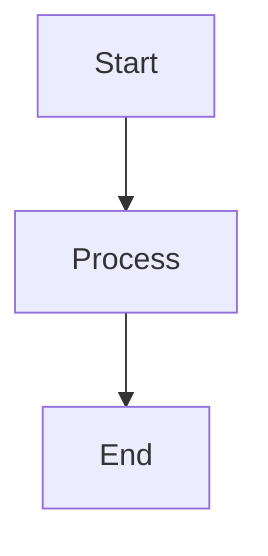
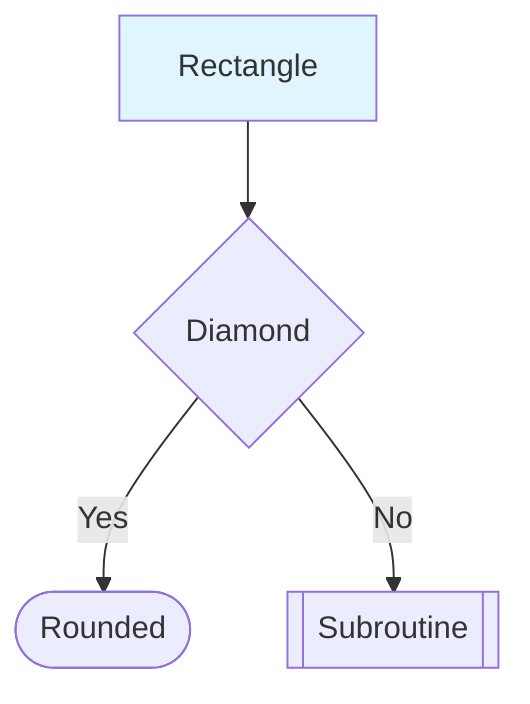

# Classification Module Architecture Diagrams

**Created:** October 23, 2025  
**Format:** Mermaid (.mmd)  
**Purpose:** Visual documentation of classification module architecture

---

## 📋 Overview

This directory contains Mermaid diagrams visualizing the structure and behavior of the classification module. These diagrams help developers understand:

- Module organization and dependencies
- Classification pipeline flow
- Building detection process
- Rules framework architecture
- Data transformations

---

## 📊 Available Diagrams

### 1. Module Structure Overview

**File:** `classification_module_structure.mmd`

**Description:** Shows the hierarchical organization of the classification module, including all submodules and their dependencies.

**Key Components:**

- Package root (schema, thresholds)
- Core classifiers (unified, hierarchical)
- Building module (detection, adaptive, clustering, fusion)
- Transport module (detection, enhancement)
- Rules framework (base, validation, confidence, hierarchy)

**Use Cases:**

- Understanding module organization
- Finding where functionality is located
- Planning new features
- Identifying dependencies

**Rendering:**

```bash
# In VS Code with Mermaid extension
# Or online at: https://mermaid.live/
```

---

### 2. Classification Pipeline Flow

**File:** `classification_pipeline_flow.mmd`

**Description:** Comprehensive flowchart showing the complete classification pipeline from input to output, covering all classification strategies.

**Strategies Covered:**

- **ASPRS:** Standard point cloud classification
- **LOD2:** Building-focused with roof/wall detection
- **LOD3:** Detailed building elements (windows, doors, etc.)
- **Comprehensive:** All levels combined
- **Adaptive:** Quality-based strategy selection

**Key Stages:**

1. Input validation
2. Feature engineering
3. Strategy selection
4. Classification execution
5. Post-processing
6. Confidence scoring
7. Result validation

**Use Cases:**

- Understanding end-to-end process
- Debugging classification issues
- Planning pipeline improvements
- Training new developers

---

### 3. Building Detection Flow

**File:** `building_detection_flow.mmd`

**Description:** Detailed flowchart of the building detection process across ASPRS, LOD2, and LOD3 modes.

**ASPRS Mode:**

- Ground filtering
- Planarity + height filtering
- Vegetation removal
- Ground truth refinement

**LOD2 Mode:**

- ASPRS detection base
- Spatial clustering by footprint
- Roof plane segmentation
- Wall detection
- Building ID assignment

**LOD3 Mode:**

- LOD2 detection base
- Spatial clustering at building level
- Element detection (windows, doors, balconies, chimneys)
- Validation and refinement
- Ground truth matching

**Use Cases:**

- Understanding building detection logic
- Debugging building classification
- Planning new building features
- Optimizing detection parameters

---

### 4. Rules Framework Architecture

**File:** `rules_framework_architecture.mmd`

**Description:** Comprehensive diagram of the hierarchical rule engine, showing validation, rule execution, confidence computation, and conflict resolution.

**Layers:**

1. **Input Layer:** Data and configuration
2. **Validation Layer:** Feature checking and quality assessment
3. **Hierarchical Engine:** Multi-level rule execution
4. **Rule Types:** Geometric, spectral, context rules
5. **Confidence Layer:** Score computation and combination
6. **Conflict Resolution:** Priority, confidence, hierarchical strategies

**Rule Categories:**

- **Geometric:** Planarity, verticality, height, shape
- **Spectral:** NDVI, intensity, color
- **Context:** Spatial, proximity, ground truth

**Confidence Strategies:**

- Weighted average
- Maximum
- Minimum
- Product

**Use Cases:**

- Understanding rule execution order
- Debugging rule conflicts
- Adding new rules
- Optimizing confidence scoring

---

### 5. Data Flow Pipeline

**File:** `data_flow_pipeline.mmd`

**Description:** Shows how data transforms through the classification pipeline, from raw LiDAR to final output.

**Stages:**

**1. Input:**

- Raw LiDAR: x, y, z, intensity, return_number

**2. Preprocessing:**

- Normalization: height = z - ground
- Feature computation: planarity, verticality, NDVI, curvature

**3. Classification:**

- Classification input: full feature set
- Classifier: strategy + thresholds + ground truth
- Logic: rule evaluation + thresholding
- Labels: class IDs per point

**4. Confidence:**

- Confidence computation: quality + agreement + consistency
- Scores: 0.0-1.0 per point

**5. Post-Processing:**

- Schema mapping: ID → name
- Statistics: counts + areas + confidence

**6. Output:**

- LAS/LAZ: classification field
- CSV: tabular format
- DataFrame: in-memory

**Use Cases:**

- Understanding data transformations
- Debugging data issues
- Planning feature additions
- Optimizing data flow

---

## 🎨 Rendering Diagrams

### In VS Code

**Option 1: Mermaid Preview Extension**

1. Install "Mermaid Preview" extension
2. Open `.mmd` file
3. Press `Ctrl+Shift+P` → "Mermaid: Preview Diagram"

**Option 2: Markdown Preview Enhanced**

1. Install "Markdown Preview Enhanced" extension
2. Embed diagram in markdown:
   ````markdown
   ```mermaid
   graph TD
       A --> B
   ```
   ````
3. Preview markdown file

### Online

**Mermaid Live Editor:**

1. Visit https://mermaid.live/
2. Copy diagram content
3. Paste in editor
4. Export as PNG/SVG/PDF

### In Documentation

**Docusaurus/MkDocs:**

````markdown
```mermaid
<paste diagram content>
```
````

````

**GitHub:**
```markdown
```mermaid
<paste diagram content>
````

````

---

## 🎯 Diagram Legend

### Colors

| Color | Module/Type | Hex Code |
|-------|-------------|----------|
| **Light Blue** | Schema/Input/Start | `#e1f5ff` |
| **Orange** | Core/Decisions | `#fff3e0` |
| **Purple** | Building Module | `#f3e5f5` |
| **Green** | Transport/Process | `#e8f5e9` |
| **Pink** | Rules Framework | `#fce4ec` |
| **Yellow** | Post-Processing | `#fff9c4` |
| **Dark Green** | Results/Output | `#c8e6c9` |
| **Red** | Errors | `#ffebee` |

### Shapes

| Shape | Meaning |
|-------|---------|
| **Rectangle** | Process/Module |
| **Diamond** | Decision Point |
| **Rounded Rectangle** | Start/End/Result |
| **Hexagon** | Alternative Process |

### Line Styles

| Style | Meaning |
|-------|---------|
| **Solid Arrow** `-->` | Primary flow |
| **Dashed Arrow** `-.->` | Optional/uses relationship |
| **Thick Line** | Main path |

---

## 📚 Using These Diagrams

### For New Developers

1. **Start with:** `classification_module_structure.mmd`
   - Understand overall organization
   - Locate key components

2. **Then review:** `classification_pipeline_flow.mmd`
   - Learn classification process
   - Understand strategies

3. **Deep dive:** Specific diagrams for your focus area
   - Building detection → `building_detection_flow.mmd`
   - Rules framework → `rules_framework_architecture.mmd`
   - Data transformations → `data_flow_pipeline.mmd`

### For Code Reviews

- Reference diagrams to explain changes
- Show where new code fits in architecture
- Illustrate data flow changes
- Demonstrate impact of modifications

### For Planning

- Use diagrams to identify integration points
- Plan new features by extending flows
- Identify optimization opportunities
- Design new modules consistently

### For Documentation

- Embed in developer guides
- Include in README files
- Use in presentations
- Add to architecture documentation

---

## 🔄 Maintaining Diagrams

### When to Update

**Module Structure Changes:**
- New modules added
- Dependencies change
- Imports reorganized
- Submodules added/removed

**Pipeline Changes:**
- New strategies added
- Stages modified
- Decision logic changes
- Error handling updated

**Building Detection Changes:**
- New modes added
- Detection logic modified
- Element types added
- Clustering algorithm changed

**Rules Framework Changes:**
- New rule types
- Confidence strategies modified
- Conflict resolution updated
- Validation logic changed

**Data Flow Changes:**
- New features added
- Output formats changed
- Preprocessing steps modified
- Export options added

### Update Process

1. **Identify change:** What aspect changed?
2. **Find diagram:** Which diagram(s) affected?
3. **Update content:** Modify Mermaid code
4. **Test rendering:** Verify diagram renders correctly
5. **Update legend:** If new colors/shapes used
6. **Update this README:** If new diagrams added

---

## 📖 Mermaid Resources

### Documentation
- Official docs: https://mermaid.js.org/
- Live editor: https://mermaid.live/
- Syntax reference: https://mermaid.js.org/intro/syntax-reference.html

### Tutorials
- Flowcharts: https://mermaid.js.org/syntax/flowchart.html
- Graph direction: TB (top-bottom), LR (left-right), etc.
- Styling: https://mermaid.js.org/syntax/flowchart.html#styling

### Tools
- VS Code extensions:
  - Mermaid Preview
  - Markdown Preview Enhanced
  - Mermaid Editor
- Online editor: https://mermaid.live/
- CLI tool: `npm install -g @mermaid-js/mermaid-cli`

---

## 🎓 Best Practices

### Diagram Design

1. **Keep it focused:** One diagram per concept
2. **Use consistent colors:** Follow color legend
3. **Add descriptions:** Explain complex nodes
4. **Limit size:** Split large diagrams into multiple views
5. **Use subgraphs:** Group related components

### Naming

1. **Node IDs:** Short, uppercase, descriptive (e.g., `BUILD_DETECT`)
2. **Labels:** Clear, with key details (e.g., `Building Detection\nASPRS Mode`)
3. **Subgraphs:** Descriptive names (e.g., `"Building Module"`)

### Styling

1. **Use color classes:** Define once, apply consistently
2. **Vary stroke width:** 2px normal, 3px important
3. **Line breaks:** Use `<br/>` for readability
4. **Spacing:** Use blank lines between sections

---

## 📊 Diagram Statistics

| Diagram | Nodes | Edges | Subgraphs | Lines |
|---------|-------|-------|-----------|-------|
| Module Structure | 24 | 28 | 5 | 95 |
| Pipeline Flow | 45 | 55 | 0 | 125 |
| Building Detection | 35 | 42 | 0 | 105 |
| Rules Framework | 50 | 60 | 7 | 160 |
| Data Flow | 20 | 25 | 6 | 90 |
| **Total** | **174** | **210** | **18** | **575** |

---

## ✅ Quick Reference

### View a Diagram
```bash
# In VS Code
code classification_module_structure.mmd
# Then: Ctrl+Shift+P → "Mermaid: Preview"

# Online
# Copy content to https://mermaid.live/
````

### Export as Image

```bash
# Using mermaid-cli
mmdc -i diagram.mmd -o diagram.png

# Online
# Use https://mermaid.live/ → Export → PNG/SVG/PDF
```

### Embed in Markdown

````markdown

````

### Common Syntax



---

**For questions or updates, refer to the main classification documentation or contact the module maintainers.**
