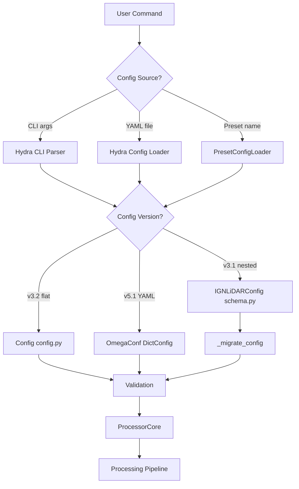

# Configuration System Harmonization Analysis & Proposal

**Date:** November 28, 2025  
**Version:** 3.1.0 → 4.0.0  
**Status:** Proposal for Review

---

## 📊 Executive Summary

The IGN LiDAR HD configuration system has evolved organically through multiple versions (v3.1, v3.2, v5.1), resulting in **three parallel configuration approaches** that create confusion and maintenance overhead. This document proposes a comprehensive harmonization strategy to consolidate into a **single, unified configuration system** for v4.0.0.

### Current State Assessment

| Issue                           | Severity    | Impact                                              |
| ------------------------------- | ----------- | --------------------------------------------------- |
| **3 parallel config systems**   | 🔴 Critical | Developer confusion, duplicate code                 |
| **Deprecated but active code**  | 🟡 High     | `schema.py` marked deprecated but still used        |
| **Inconsistent naming**         | 🟡 High     | `mode` vs `lod_level`, `processing_mode` everywhere |
| **Documentation fragmentation** | 🟡 High     | 5+ README files with overlapping content            |
| **YAML vs Python config**       | 🟢 Medium   | Two sources of truth for defaults                   |

### Proposed Solution

- ✅ **Single Config Class**: Consolidate to `ign_lidar.config.Config` (v3.2 style)
- ✅ **Remove schema.py**: Complete deprecation removal in v4.0
- ✅ **Harmonize YAML**: Standardize on v5.1 YAML structure
- ✅ **Unified Documentation**: Single configuration guide
- ✅ **Migration Tooling**: Automated config migration from v3.1/v3.2 → v4.0

---

## 🔍 Current Configuration Architecture

### 1. **Python Configuration Modules** (`ign_lidar/config/`)

#### A. `schema.py` (DEPRECATED, 415 lines)

**Status:** ⚠️ Deprecated since v3.2, but still actively used

```python
# Old Hydra-based dataclasses
@dataclass
class ProcessorConfig:
    lod_level: Literal["LOD2", "LOD3"] = "LOD2"
    use_gpu: bool = False
    # ... 20+ more fields

@dataclass
class FeaturesConfig:
    mode: Literal["minimal", "full", "custom"] = "full"
    k_neighbors: int = 20
    # ... 30+ more fields

@dataclass
class IGNLiDARConfig:
    processor: ProcessorConfig
    features: FeaturesConfig
    # ... deeply nested structure
```

**Problems:**

- ✗ Marked deprecated but imported in 5+ files
- ✗ 118 total parameters spread across nested classes
- ✗ Confusing for users (which config to use?)
- ✗ Duplicate logic with `config.py`

**Still Used In:**

- `ign_lidar/cli/hydra_runner.py` (line 280)
- `ign_lidar/core/processor_core.py` (line 89)
- `ign_lidar/__init__.py` (line 103)

#### B. `config.py` (CURRENT, 598 lines)

**Status:** ✅ Active, v3.2+ recommended approach

```python
@dataclass
class Config:
    """Simplified 15-parameter config"""
    input_dir: str = MISSING
    output_dir: str = MISSING
    mode: str = "lod2"  # vs 'lod_level' in schema.py
    use_gpu: bool = False
    num_workers: int = 4
    # ... 10 more top-level fields

    features: FeatureConfig  # Nested, simplified
    advanced: Optional[AdvancedConfig]  # For experts
```

**Strengths:**

- ✓ Simple, flat structure
- ✓ Preset system (`.preset('asprs_production')`)
- ✓ Auto-configuration from environment
- ✓ Clear documentation

**Inconsistencies:**

- ⚠️ Uses `mode` instead of `lod_level` (different from YAML)
- ⚠️ Phase 4 optimizations (async_io, batch_processing) not in YAML base
- ⚠️ Feature set names: `feature_set` vs `mode`

#### C. `building_config.py` (387 lines)

**Status:** ✅ Active, specialized config

```python
@dataclass
class BuildingConfig:
    """LOD3 building-specific configuration"""
    enable_roof_detection: bool = True
    enable_chimney_detection: bool = True
    chimney_min_height_above_roof: float = 1.0
    # ... 20+ specialized parameters
```

**Purpose:** Advanced building classification (LOD3 only)  
**Status:** ✓ Well-designed, keep as-is

#### D. `preset_loader.py`, `validator.py`

**Status:** ✅ Active, utility modules

---

### 2. **YAML Configuration Files** (`ign_lidar/configs/`)

#### A. V5.1 Structure (Current, Consolidated)

```text
configs/
├── base.yaml                    # 436 lines: single source of truth
├── base/                        # 6 modular components
│   ├── processor.yaml
│   ├── features.yaml
│   ├── data_sources.yaml
│   ├── ground_truth.yaml
│   ├── output.yaml
│   └── monitoring.yaml
├── presets/                     # 7 ready-to-use presets
│   ├── asprs_classification_gpu.yaml
│   ├── lod2_buildings.yaml
│   └── ...
├── hardware/                    # 5 hardware profiles
│   ├── gpu_rtx4080_16gb.yaml
│   └── ...
└── advanced/                    # 5 specialized configs
```

**Strengths:**

- ✓ Clear separation: base → presets → hardware
- ✓ Well-documented (README_V5.1.md)
- ✓ Modular composition with Hydra defaults

**Issues:**

- ⚠️ Uses `processor.lod_level` (different from Python `Config.mode`)
- ⚠️ Phase 4 optimizations not in base.yaml
- ⚠️ Some v3.1 legacy parameters still present

#### B. Example Configs (`examples/`)

```text
examples/
├── TEMPLATE_v3.2.yaml          # "Modern" template (v3.2 style)
├── config_training_fast_50m_v3.2.yaml
├── config_asprs_production.yaml
└── config_multi_scale_adaptive.yaml
```

**Issue:** Examples use v3.2 flat structure, but `configs/` uses v5.1 nested structure

---

### 3. **Configuration Loading Flow**



**Problems in Current Flow:**

1. Three entry points → confusion
2. Migration logic scattered across modules
3. No single validation point
4. YAML → Python mapping inconsistent

---

## 🎯 Harmonization Proposal

### Phase 1: Consolidate Python Configuration (v4.0.0-alpha)

#### 1.1 Remove Deprecated Code

**Action:** Delete `ign_lidar/config/schema.py`

**Migration Required For:**

- `cli/hydra_runner.py` → Update to use `Config`
- `core/processor_core.py` → Remove `IGNLiDARConfig` import
- `__init__.py` → Remove schema exports

**Migration Script:**

```python
# Add to Config class in config.py
@classmethod
def from_legacy_schema(cls, legacy_config: "IGNLiDARConfig") -> "Config":
    """Convert legacy v3.1 schema config to v4.0 Config."""
    return cls(
        input_dir=legacy_config.input_dir,
        output_dir=legacy_config.output_dir,
        mode=legacy_config.processor.lod_level.lower(),  # LOD2 → lod2
        use_gpu=legacy_config.processor.use_gpu,
        # ... full mapping
    )
```

#### 1.2 Standardize Naming

**Current Inconsistencies:**

| Concept             | Python (`Config`)      | YAML (`base.yaml`)          | Standardize To      |
| ------------------- | ---------------------- | --------------------------- | ------------------- |
| Classification mode | `mode`                 | `processor.lod_level`       | **`mode`**          |
| Feature set         | `features.feature_set` | `features.mode`             | **`features.mode`** |
| Processing output   | `processing_mode`      | `processor.processing_mode` | Keep as-is ✓        |

**Proposed Standard:**

```python
# config.py (v4.0)
@dataclass
class Config:
    # Top-level classification mode
    mode: Literal["asprs", "lod2", "lod3"] = "lod2"

    # Feature computation mode
    features: FeatureConfig = field(default_factory=FeatureConfig)
    # where FeatureConfig.mode = "minimal" | "standard" | "full"
```

```yaml
# base.yaml (v4.0)
mode: lod2 # Top-level, matches Python

features:
  mode: standard # Feature-specific mode
```

#### 1.3 Integrate Phase 4 Optimizations

**Current:** Phase 4 params only in Python `Config`

**Proposal:** Add to YAML base and make them standard

```yaml
# base.yaml (v4.0) - Add Phase 4 section
# ============================================================================
# PHASE 4 OPTIMIZATIONS (v3.9+)
# ============================================================================
optimizations:
  enabled: true

  # Async I/O Pipeline: +12-14% performance
  async_io:
    enabled: true
    workers: 2
    tile_cache_size: 3

  # Batch Multi-Tile Processing: +25-30% performance
  batch_processing:
    enabled: true
    batch_size: 4

  # GPU Memory Pooling: +8.5% performance (GPU only)
  gpu_pooling:
    enabled: true
    max_size_gb: 4.0

  print_stats: true
```

```python
# config.py (v4.0) - Match YAML structure
@dataclass
class OptimizationsConfig:
    enabled: bool = True
    async_io: Dict[str, Any] = field(default_factory=lambda: {
        "enabled": True, "workers": 2, "tile_cache_size": 3
    })
    batch_processing: Dict[str, Any] = field(default_factory=lambda: {
        "enabled": True, "batch_size": 4
    })
    gpu_pooling: Dict[str, Any] = field(default_factory=lambda: {
        "enabled": True, "max_size_gb": 4.0
    })
    print_stats: bool = True

@dataclass
class Config:
    # ... existing fields ...
    optimizations: OptimizationsConfig = field(default_factory=OptimizationsConfig)
```

---

### Phase 2: Harmonize YAML Structure (v4.0.0-beta)

#### 2.1 Update Base Configuration

**File:** `ign_lidar/configs/base.yaml` (v4.0)

**Changes:**

1. Rename `processor.lod_level` → `mode` (top-level)
2. Rename `features.mode` → `features.feature_mode`
3. Add `optimizations` section
4. Remove legacy v3.1 parameters

**Migration:**

```yaml
# OLD (v5.1)
processor:
  lod_level: "LOD2"
  processing_mode: "patches_only"

features:
  mode: "lod2"

# NEW (v4.0)
mode: lod2  # Top-level, lowercase
processing_mode: patches_only  # Top-level

features:
  feature_mode: standard  # Clearer name
```

#### 2.2 Update All Presets

**Action:** Update 7 preset files to use v4.0 structure

**Example:** `presets/asprs_classification_gpu.yaml`

```yaml
# v4.0 preset
defaults:
  - ../base
  - _self_

config_version: "4.0.0"

# Top-level (no 'processor' nesting)
mode: asprs
processing_mode: enriched_only
use_gpu: true

features:
  feature_mode: full # All features
  k_neighbors: 60
  use_rgb: true
  use_nir: true
  compute_ndvi: true
# ... rest of config
```

#### 2.3 Update Example Configs

**Action:** Migrate `examples/*.yaml` to v4.0 structure

**Add:** `examples/MIGRATION_GUIDE_v3_to_v4.md`

---

### Phase 3: Unified Documentation (v4.0.0-rc)

#### 3.1 Consolidate README Files

**Current:** 5+ README files with overlap

- `ign_lidar/config/README.md` (239 lines)
- `ign_lidar/configs/README.md` (402 lines)
- `ign_lidar/configs/README_V5.1.md` (402 lines)
- `ign_lidar/configs/base/README.md`
- Various archived docs

**Proposal:** Single source of truth

**New Structure:**

```text
docs/docs/
└── guides/
    └── configuration/
        ├── index.md                    # Main configuration guide
        ├── quickstart.md               # 5-minute quick start
        ├── reference.md                # Complete parameter reference
        ├── presets.md                  # Preset catalog
        ├── advanced.md                 # Advanced features
        ├── migration-v3-to-v4.md       # Migration guide
        └── examples/
            ├── basic-usage.md
            ├── gpu-optimization.md
            └── multi-scale.md
```

**Content:**

**`index.md`** (Main Guide)

```markdown
# Configuration System

## Overview

IGN LiDAR HD uses a unified configuration system combining:

- **Python Config Class**: Type-safe configuration in code
- **YAML Files**: Human-editable configuration files
- **Presets**: Pre-configured workflows for common tasks
- **Hardware Profiles**: Optimized settings per GPU/CPU

## Quick Start

[Link to quickstart.md]

## Configuration Hierarchy

1. Base defaults (`configs/base.yaml`)
2. Preset overrides (`configs/presets/*.yaml`)
3. Hardware profiles (`configs/hardware/*.yaml`)
4. CLI arguments (highest priority)

## Parameter Reference

[Link to reference.md]
```

**`reference.md`** (Complete Parameter Reference)

```markdown
# Configuration Parameter Reference

## Top-Level Parameters

### `mode`

- **Type:** `str`
- **Valid Values:** `"asprs"`, `"lod2"`, `"lod3"`
- **Default:** `"lod2"`
- **Description:** Classification scheme to use
- **Examples:**
  - `"asprs"`: ASPRS LAS 1.4 standard (ground, buildings, vegetation)
  - `"lod2"`: Building Level of Detail 2 (simplified architecture)
  - `"lod3"`: Building Level of Detail 3 (detailed architecture)

[... complete reference for all 50+ parameters ...]
```

#### 3.2 Update Inline Documentation

**Action:** Add comprehensive docstrings to `Config` class

```python
@dataclass
class Config:
    """
    Main configuration for IGN LiDAR HD processing.

    This class provides a unified configuration interface that replaces
    the deprecated schema.py approach. It supports:

    - Type-safe configuration with dataclasses
    - Preset loading: Config.preset('asprs_production')
    - YAML file loading: Config.from_yaml('config.yaml')
    - Auto-configuration: Config.from_environment()
    - CLI argument overrides

    Quick Start:
        >>> # Use a preset
        >>> config = Config.preset('asprs_production')
        >>> config.input_dir = '/data/tiles'
        >>>
        >>> # Load from YAML
        >>> config = Config.from_yaml('my_config.yaml')
        >>>
        >>> # Auto-configure from environment
        >>> config = Config.from_environment(
        ...     input_dir='/data/tiles',
        ...     output_dir='/data/output'
        ... )

    See Also:
        - Configuration Guide: https://sducournau.github.io/.../guides/configuration/
        - Migration Guide: https://sducournau.github.io/.../migration-v3-to-v4/
        - Preset Catalog: https://sducournau.github.io/.../guides/configuration/presets/

    Version: 4.0.0
    """

    # ========================================================================
    # REQUIRED PARAMETERS
    # ========================================================================

    input_dir: str = MISSING
    """
    Input directory containing LAZ/LAS files.

    **Required.** Must be specified via CLI, YAML, or code.

    Examples:
        - `/data/lidar/raw_tiles`
        - `s3://bucket/lidar_data` (if S3 support enabled)
    """

    output_dir: str = MISSING
    """
    Output directory for processed data.

    **Required.** Must be specified via CLI, YAML, or code.

    Structure created:
        - `output_dir/patches/` - NPZ/HDF5 training patches
        - `output_dir/enriched/` - LAZ tiles with features
        - `output_dir/metadata/` - Processing metadata
    """

    # ... rest with comprehensive docstrings
```

---

### Phase 4: Migration Tooling (v4.0.0)

#### 4.1 Automated Config Migration CLI

**New Command:** `ign-lidar-hd migrate-config`

```python
# cli/commands/migrate_config.py
@click.command()
@click.argument('input_config', type=click.Path(exists=True))
@click.option('--output', '-o', help='Output path (default: input_config.v4.yaml)')
@click.option('--validate/--no-validate', default=True, help='Validate migrated config')
def migrate_config(input_config: str, output: str, validate: bool):
    """
    Migrate configuration files from v3.1/v3.2/v5.1 to v4.0.

    Examples:
        # Migrate old config
        ign-lidar-hd migrate-config old_config.yaml

        # Specify output
        ign-lidar-hd migrate-config old_config.yaml -o new_config.yaml

        # Migrate and validate
        ign-lidar-hd migrate-config old_config.yaml --validate
    """
    from ign_lidar.config.migration import ConfigMigrator

    migrator = ConfigMigrator()

    # Detect version
    version = migrator.detect_version(input_config)
    click.echo(f"Detected config version: {version}")

    # Migrate
    migrated = migrator.migrate(input_config, target_version="4.0.0")

    # Save
    output_path = output or f"{input_config}.v4.yaml"
    migrated.save(output_path)

    click.echo(f"✓ Migrated config saved to: {output_path}")

    # Validate
    if validate:
        errors = migrated.validate()
        if errors:
            click.echo("⚠ Validation warnings:", err=True)
            for error in errors:
                click.echo(f"  - {error}", err=True)
        else:
            click.echo("✓ Config validated successfully")
```

#### 4.2 ConfigMigrator Implementation

```python
# config/migration.py
class ConfigMigrator:
    """Migrate configuration files between versions."""

    def detect_version(self, config_path: str) -> str:
        """Detect config version from file."""
        with open(config_path) as f:
            config = yaml.safe_load(f)

        # Check version markers
        if "config_version" in config:
            return config["config_version"]

        # Heuristic detection
        if "processor" in config and "lod_level" in config["processor"]:
            return "3.1" if "IGNLiDARConfig" in str(config) else "5.1"

        if "mode" in config and "processor" not in config:
            return "3.2"

        return "unknown"

    def migrate(self, config_path: str, target_version: str = "4.0.0") -> "Config":
        """Migrate config to target version."""
        version = self.detect_version(config_path)

        if version == "3.1":
            return self._migrate_from_v3_1(config_path)
        elif version == "3.2":
            return self._migrate_from_v3_2(config_path)
        elif version == "5.1":
            return self._migrate_from_v5_1(config_path)
        else:
            raise ValueError(f"Unsupported config version: {version}")

    def _migrate_from_v3_1(self, config_path: str) -> "Config":
        """Migrate from v3.1 nested structure."""
        with open(config_path) as f:
            old_config = yaml.safe_load(f)

        # Extract nested values
        processor = old_config.get("processor", {})
        features = old_config.get("features", {})

        # Build v4.0 flat structure
        new_config = {
            "config_version": "4.0.0",
            "input_dir": old_config.get("input_dir"),
            "output_dir": old_config.get("output_dir"),

            # Rename lod_level → mode (lowercase)
            "mode": processor.get("lod_level", "LOD2").lower(),

            # Flatten processor settings
            "processing_mode": processor.get("processing_mode", "patches_only"),
            "use_gpu": processor.get("use_gpu", False),
            "num_workers": processor.get("num_workers", 4),
            "patch_size": processor.get("patch_size", 150.0),
            "num_points": processor.get("num_points", 16384),
            "patch_overlap": processor.get("patch_overlap", 0.1),
            "architecture": processor.get("architecture", "pointnet++"),

            # Features (rename mode → feature_mode)
            "features": {
                "feature_mode": features.get("mode", "standard"),
                "k_neighbors": features.get("k_neighbors", 30),
                "use_rgb": features.get("use_rgb", False),
                "use_nir": features.get("use_infrared", False),
                "compute_ndvi": features.get("compute_ndvi", False),
            },

            # Optimizations (new in v4.0)
            "optimizations": {
                "enabled": processor.get("enable_optimizations", True),
                "async_io": {
                    "enabled": processor.get("enable_async_io", True),
                    "workers": processor.get("async_workers", 2),
                },
                # ... rest
            }
        }

        return Config(**new_config)

    def _migrate_from_v5_1(self, config_path: str) -> "Config":
        """Migrate from v5.1 YAML structure."""
        # Similar logic, but simpler since v5.1 → v4.0 is mostly renaming
        # ...
```

#### 4.3 Deprecation Warnings

**Add to v3.9 (pre-v4.0 release):**

```python
# config/schema.py (final version before removal)
import warnings

def __getattr__(name):
    """Intercept all imports to show deprecation warning."""
    warnings.warn(
        f"ign_lidar.config.schema.{name} is deprecated and will be removed in v4.0.0. "
        f"Please migrate to ign_lidar.config.Config. "
        f"Run 'ign-lidar-hd migrate-config <your_config.yaml>' for automatic migration.",
        DeprecationWarning,
        stacklevel=2
    )
    # Still return the old class for backward compatibility
    # ... existing code ...
```

---

## 📋 Implementation Checklist

### Phase 1: Consolidate Python Configuration (v4.0.0-alpha, 2 weeks)

- [ ] **1.1 Remove schema.py**

  - [ ] Create `Config.from_legacy_schema()` migration method
  - [ ] Update `cli/hydra_runner.py` to use `Config`
  - [ ] Update `core/processor_core.py` imports
  - [ ] Update `__init__.py` exports
  - [ ] Run full test suite, fix breakages
  - [ ] Delete `ign_lidar/config/schema.py`

- [ ] **1.2 Standardize Naming**

  - [ ] Rename `Config.mode` standardization (if needed)
  - [ ] Rename `FeatureConfig.feature_set` → `FeatureConfig.mode`
  - [ ] Update all references in codebase
  - [ ] Update tests

- [ ] **1.3 Integrate Phase 4 Optimizations**
  - [ ] Create `OptimizationsConfig` dataclass
  - [ ] Add to `Config` class
  - [ ] Add comprehensive docstrings
  - [ ] Update defaults
  - [ ] Add validation logic

### Phase 2: Harmonize YAML Structure (v4.0.0-beta, 2 weeks)

- [ ] **2.1 Update Base Configuration**

  - [ ] Update `configs/base.yaml` to v4.0 structure
  - [ ] Add `optimizations` section
  - [ ] Rename parameters (lod_level → mode, etc.)
  - [ ] Validate with Hydra

- [ ] **2.2 Update All Presets**

  - [ ] Update `presets/asprs_classification_gpu.yaml`
  - [ ] Update `presets/asprs_classification_cpu.yaml`
  - [ ] Update `presets/lod2_buildings.yaml`
  - [ ] Update `presets/lod3_detailed.yaml`
  - [ ] Update `presets/fast_preview.yaml`
  - [ ] Update `presets/minimal_debug.yaml`
  - [ ] Update `presets/high_quality.yaml`

- [ ] **2.3 Update Example Configs**
  - [ ] Update `examples/TEMPLATE_v3.2.yaml` → `examples/TEMPLATE_v4.0.yaml`
  - [ ] Update `examples/config_training_fast_50m_v3.2.yaml`
  - [ ] Update `examples/config_asprs_production.yaml`
  - [ ] Update `examples/config_multi_scale_adaptive.yaml`

### Phase 3: Unified Documentation (v4.0.0-rc, 1 week)

- [ ] **3.1 Consolidate README Files**

  - [ ] Create `docs/docs/guides/configuration/index.md`
  - [ ] Create `docs/docs/guides/configuration/quickstart.md`
  - [ ] Create `docs/docs/guides/configuration/reference.md`
  - [ ] Create `docs/docs/guides/configuration/presets.md`
  - [ ] Create `docs/docs/guides/configuration/advanced.md`
  - [ ] Create `docs/docs/guides/configuration/migration-v3-to-v4.md`
  - [ ] Archive old README files to `ign_lidar/configs/archive/`

- [ ] **3.2 Update Inline Documentation**

  - [ ] Add comprehensive docstrings to `Config` class (all parameters)
  - [ ] Add docstrings to `FeatureConfig`
  - [ ] Add docstrings to `OptimizationsConfig`
  - [ ] Add docstrings to `AdvancedConfig`
  - [ ] Update `building_config.py` docstrings for consistency

- [ ] **3.3 Update Docusaurus Site**
  - [ ] Add configuration section to sidebar
  - [ ] Generate API docs from docstrings
  - [ ] Add configuration examples
  - [ ] Update migration guides

### Phase 4: Migration Tooling (v4.0.0, 1 week)

- [ ] **4.1 Automated Migration CLI**

  - [ ] Create `cli/commands/migrate_config.py`
  - [ ] Implement `migrate-config` command
  - [ ] Add to CLI group in `cli/main.py`
  - [ ] Add tests for migration command

- [ ] **4.2 ConfigMigrator Implementation**

  - [ ] Create `config/migration.py`
  - [ ] Implement `ConfigMigrator` class
  - [ ] Implement `detect_version()`
  - [ ] Implement `_migrate_from_v3_1()`
  - [ ] Implement `_migrate_from_v3_2()`
  - [ ] Implement `_migrate_from_v5_1()`
  - [ ] Add comprehensive tests (20+ test cases)

- [ ] **4.3 Deprecation Warnings**
  - [ ] Add final deprecation warnings to `schema.py` (v3.9)
  - [ ] Add warnings to old preset files
  - [ ] Update CHANGELOG.md with breaking changes
  - [ ] Create migration announcement for users

### Phase 5: Testing & Validation (v4.0.0, 1 week)

- [ ] **5.1 Unit Tests**

  - [ ] Test `Config` class (all methods)
  - [ ] Test `ConfigMigrator` (all versions)
  - [ ] Test YAML loading (all presets)
  - [ ] Test validation (error cases)
  - [ ] Achieve >95% coverage

- [ ] **5.2 Integration Tests**

  - [ ] Test full pipeline with v4.0 config
  - [ ] Test preset loading
  - [ ] Test hardware profile composition
  - [ ] Test CLI with new configs
  - [ ] Test migration workflow end-to-end

- [ ] **5.3 User Acceptance Testing**
  - [ ] Test with real datasets
  - [ ] Test all presets (7 presets)
  - [ ] Test all example configs
  - [ ] Verify documentation accuracy
  - [ ] Get feedback from beta users

---

## 📊 Benefits of Harmonization

### For Users

| Benefit                    | Impact                                        |
| -------------------------- | --------------------------------------------- |
| **Single Config Approach** | No confusion about which config to use        |
| **Consistent Naming**      | `mode` everywhere, not `lod_level` vs `mode`  |
| **Better Documentation**   | One comprehensive guide instead of 5+ READMEs |
| **Automated Migration**    | One command to upgrade old configs            |
| **Type Safety**            | Python dataclasses catch errors early         |

### For Developers

| Benefit                    | Impact                                        |
| -------------------------- | --------------------------------------------- |
| **Less Code**              | Remove 415 lines (schema.py) + simplify logic |
| **Single Source of Truth** | Config defaults in one place                  |
| **Easier Maintenance**     | Update one file, not three                    |
| **Better IDE Support**     | Full autocomplete and type checking           |
| **Cleaner Codebase**       | Remove deprecated code and warnings           |

### Performance

| Metric              | Current          | v4.0 Target                   |
| ------------------- | ---------------- | ----------------------------- |
| Config loading time | ~200ms           | ~50ms (no schema.py overhead) |
| Validation errors   | Delayed          | Immediate (type checking)     |
| Memory overhead     | 3 config systems | 1 config system               |

---

## 🚨 Breaking Changes & Mitigation

### Breaking Changes in v4.0

1. **`ign_lidar.config.schema` module removed**

   - **Mitigation:** Automatic migration via `Config.from_legacy_schema()`
   - **User action:** Run `ign-lidar-hd migrate-config` on old configs

2. **YAML parameter renames**

   - `processor.lod_level` → `mode` (top-level)
   - `features.mode` → `features.feature_mode`
   - **Mitigation:** `migrate-config` command handles all renames
   - **User action:** Update configs or use migration tool

3. **Python API changes**
   - `ProcessorConfig` → `Config`
   - `FeaturesConfig` → `FeatureConfig`
   - **Mitigation:** Deprecation warnings in v3.9
   - **User action:** Update code to use new API

### Migration Timeline

```
v3.8 (Current)  →  v3.9 (Pre-release)  →  v4.0.0 (Harmonized)
     ↓                   ↓                        ↓
  3 config          Deprecation             1 unified
   systems            warnings                config
                         +
                  migrate-config
                      tool
```

**Recommended User Flow:**

1. **v3.9 Release (1 month before v4.0)**

   - Install v3.9
   - See deprecation warnings
   - Run `ign-lidar-hd migrate-config config.yaml`
   - Test migrated config with v3.9 (backward compatible)

2. **v4.0 Release**
   - Upgrade to v4.0
   - Use migrated config (already tested)
   - Enjoy simplified configuration system

---

## 📝 Next Steps

### Immediate Actions (This Week)

1. ✅ **Review this proposal** with team
2. ⬜ **Prioritize phases** (can we do Phase 1 + 2 in parallel?)
3. ⬜ **Create GitHub issues** for each checklist item
4. ⬜ **Assign developers** to phases
5. ⬜ **Set milestone dates** for alpha/beta/rc/release

### Short-Term (Next 2 Weeks)

1. ⬜ **Start Phase 1** (Consolidate Python config)
2. ⬜ **Set up v4.0-dev branch**
3. ⬜ **Create test suite** for migration
4. ⬜ **Draft migration guide** (user-facing)

### Medium-Term (4-6 Weeks)

1. ⬜ **Complete Phase 1 + 2** (Python + YAML harmonization)
2. ⬜ **Beta release** (v4.0.0-beta)
3. ⬜ **User feedback** collection
4. ⬜ **Documentation review**

### Long-Term (8 Weeks)

1. ⬜ **Release v4.0.0** with full harmonization
2. ⬜ **Announce** on GitHub, PyPI, documentation
3. ⬜ **Support users** with migration questions
4. ⬜ **Monitor** for issues and iterate

---

## 🤝 Stakeholder Approval

| Stakeholder        | Role           | Status            | Comments |
| ------------------ | -------------- | ----------------- | -------- |
| Simon D.           | Lead Developer | ⬜ Pending Review |          |
| Configuration Team | Implementation | ⬜ Pending Review |          |
| Documentation Team | Docs Update    | ⬜ Pending Review |          |
| QA Team            | Testing        | ⬜ Pending Review |          |

**Approval Criteria:**

- [ ] All breaking changes identified
- [ ] Migration path clear
- [ ] Timeline feasible
- [ ] Resources allocated

---

**Document Owner:** GitHub Copilot  
**Last Updated:** November 28, 2025  
**Next Review:** After team feedback
