# Ground Truth Classification

Automatically classify LiDAR point clouds using authoritative vector data from IGN's BD TOPO® database through WFS (Web Feature Service) integration.

---

## 🎯 Overview

Ground Truth Classification fetches and applies high-quality topographic data to label point clouds for:

- **Supervised machine learning** - Generate labeled training datasets
- **Quality assurance** - Validate classification results
- **Data enrichment** - Enhance point clouds with authoritative labels
- **Multi-class annotation** - Buildings, roads, water, vegetation, and more

### Data Sources

- **BD TOPO® V3** - IGN's national topographic database
- **WFS Services** - Real-time vector data fetching
- **GPU Acceleration** - Fast point-in-polygon classification
- **NDVI Refinement** - Vegetation classification improvement

---

## 🚀 Quick Start

### Basic Usage

```bash
# Generate training patches with ground truth labels
ign-lidar-hd process \
  input_dir=data/tiles/ \
  output_dir=output/labeled/ \
  data_sources.bd_topo.enabled=true \
  data_sources.bd_topo.features=[buildings,roads,water]
```

### With GPU Acceleration

```yaml
# config.yaml
data_sources:
  bd_topo:
    enabled: true
    features:
      - buildings
      - roads
      - water
      - vegetation
    use_gpu: true # Enable GPU-accelerated classification
    cache_dir: cache/ground_truth

processor:
  gpu_enabled: true
  gpu_batch_size: 8_000_000
```

---

## 📊 How It Works

### Workflow

```mermaid
flowchart TD
    A[LiDAR Tile] --> B[Compute Bounding Box]
    B --> C[Fetch BD TOPO® Data via WFS]
    C --> D[Buildings Layer]
    C --> E[Roads Layer]
    C --> F[Water Layer]
    C --> G[Vegetation Layer]

    D --> H[Point-in-Polygon Classification]
    E --> H
    F --> H
    G --> H

    H --> I{GPU Available?}
    I -->|Yes| J[GPU-Accelerated Classification]
    I -->|No| K[CPU Classification]

    J --> L[NDVI Refinement Optional]
    K --> L

    L --> M[Labeled Point Cloud]

    style A fill:#e1f5fe
    style M fill:#e8f5e8
    style J fill:#fff3e0
```



### Classification Process

1. **Bounding Box Calculation** - Determine tile extent in Lambert 93 (EPSG:2154)
2. **WFS Data Fetching** - Query BD TOPO® layers for vector features
3. **Geometry Processing** - Convert lines to polygons (roads), buffer features
4. **Point Classification** - Spatial join between points and vector geometries
5. **Priority Resolution** - Handle overlapping features (buildings > roads > vegetation)
6. **NDVI Refinement** - Optional vegetation classification improvement

---

## ⚙️ Configuration

### V5 Configuration

```yaml
# Complete ground truth configuration
data_sources:
  bd_topo:
    enabled: true

    # Features to fetch and classify
    features:
      buildings: true # Building footprints
      roads: true # Road segments
      water: true # Water surfaces
      vegetation: true # Vegetation zones

    # WFS Configuration
    wfs_url: "https://data.geopf.fr/wfs"
    max_features: 10000
    timeout: 30

    # Cache configuration (V5 - auto-uses input folder)
    cache_enabled: true
    cache_dir: null # null = auto-set to {input_dir}/cache/ground_truth
    use_global_cache: false # If true, uses config.cache_dir instead

    # Performance
    use_gpu: true

    # Classification parameters
    road_buffer: 2.5 # Road width buffer (meters)
    building_priority: 1 # Priority for overlapping features
    road_priority: 2
    water_priority: 3
    vegetation_priority: 4

  # NDVI refinement for vegetation
  ndvi:
    enabled: true
    infrared_band: nir # Use NIR band for NDVI
    vegetation_threshold: 0.3
    refine_low_vegetation: true
```

### Feature Layer Mapping

| Feature          | BD TOPO® Layer                     | ASPRS Class | Description         |
| ---------------- | ---------------------------------- | ----------- | ------------------- |
| `buildings`      | `BDTOPO_V3:batiment`               | 6           | Building structures |
| `roads`          | `BDTOPO_V3:troncon_de_route`       | 11          | Road surfaces       |
| `railways`       | `BDTOPO_V3:troncon_de_voie_ferree` | 10          | Railway tracks      |
| `water`          | `BDTOPO_V3:surface_hydrographique` | 9           | Water bodies        |
| `vegetation`     | `BDTOPO_V3:zone_de_vegetation`     | 3-5         | Vegetation zones    |
| `sports_terrain` | `BDTOPO_V3:terrain_de_sport`       | 41          | Sports facilities   |
| `cemeteries`     | `BDTOPO_V3:cimetiere`              | 42          | Cemeteries          |
| `power_lines`    | `BDTOPO_V3:ligne_electrique`       | 43          | Power lines         |

---

## 💻 Python API

### Basic Classification

```python
from ign_lidar.io.wfs_ground_truth import (
    IGNGroundTruthFetcher,
    fetch_ground_truth_for_tile,
)
from ign_lidar.core.modules.loader import load_laz_file

# Load LiDAR tile
lidar_data = load_laz_file("data/tile_0650_6860.laz")
points = lidar_data.points

# Compute bounding box (xmin, ymin, xmax, ymax)
bbox = (
    points[:, 0].min(),
    points[:, 1].min(),
    points[:, 0].max(),
    points[:, 1].max()
)

# Fetch ground truth
fetcher = IGNGroundTruthFetcher(
    cache_dir="cache/ground_truth",
    verbose=True
)

ground_truth = fetcher.fetch_all_features(
    bbox=bbox,
    include_roads=True,
    include_buildings=True,
    include_water=True,
    include_vegetation=True
)

# Classify points
labels = fetcher.label_points_with_ground_truth(
    points=points,
    ground_truth_features=ground_truth
)

print(f"Classified {len(labels)} points")
print(f"Unique classes: {set(labels)}")
```

### GPU-Accelerated Classification

```python
from ign_lidar.io.ground_truth_optimizer import GroundTruthOptimizer
import cupy as cp

# Initialize GPU optimizer
optimizer = GroundTruthOptimizer(
    use_gpu=True,
    gpu_batch_size=8_000_000,
    verbose=True
)

# Classify with GPU acceleration
labels_gpu = optimizer.classify_with_ground_truth(
    points=points,
    ground_truth_features=ground_truth,
    priority_order=['buildings', 'roads', 'water', 'vegetation']
)

# Performance comparison
print(f"GPU classification: {optimizer.gpu_time:.2f}s")
print(f"Speedup: {optimizer.cpu_time / optimizer.gpu_time:.1f}x")
```

### Generate Training Patches

```python
from ign_lidar.io.wfs_ground_truth import generate_patches_with_ground_truth

# Generate labeled patches for training
patches = generate_patches_with_ground_truth(
    tile_path="data/tile_0650_6860.laz",
    output_dir="output/training_patches",
    patch_size=100.0,          # 100m x 100m patches
    overlap=0.1,               # 10% overlap
    min_points_per_patch=1000, # Minimum points per patch
    include_features=[
        'buildings',
        'roads',
        'water',
        'vegetation'
    ],
    save_ground_truth=True,    # Save vector data
    cache_dir="cache/ground_truth"
)

print(f"Generated {len(patches)} training patches")
```

---

## 🎨 Advanced Features

### NDVI-Based Vegetation Refinement

Improve vegetation classification using Near-Infrared (NIR) data:

```yaml
data_sources:
  bd_topo:
    enabled: true
    features: [vegetation]

  ndvi:
    enabled: true
    infrared_band: nir
    vegetation_threshold: 0.3

    # Refinement settings
    refine_low_vegetation: true # Refine class 3
    refine_medium_vegetation: true # Refine class 4
    refine_high_vegetation: true # Refine class 5

    # NDVI calculation
    red_band_range: [600, 700] # nm
    nir_band_range: [750, 900] # nm
```

**How it works:**

```python
# NDVI = (NIR - Red) / (NIR + Red)
# Values: -1 to +1
# Vegetation typically: 0.2 to 0.8
# Dense vegetation: > 0.5

# Classification logic:
if ndvi > 0.5:
    class = HIGH_VEGETATION  # Class 5
elif ndvi > 0.3:
    class = MEDIUM_VEGETATION  # Class 4
elif ndvi > 0.1:
    class = LOW_VEGETATION  # Class 3
else:
    class = GROUND  # Class 2
```

### Multi-Priority Classification

Handle overlapping features with priority-based classification:

```python
from ign_lidar.io.wfs_ground_truth import IGNGroundTruthFetcher

fetcher = IGNGroundTruthFetcher()

# Define priority order (highest to lowest)
priority_config = {
    'buildings': 1,      # Buildings override everything
    'roads': 2,          # Roads override water/vegetation
    'railways': 2,       # Same priority as roads
    'water': 3,          # Water overrides vegetation
    'vegetation': 4,     # Lowest priority
}

# Classify with priorities
labels = fetcher.label_points_with_ground_truth(
    points=points,
    ground_truth_features=ground_truth,
    priority_order=priority_config
)
```

### Caching Strategy

Optimize repeated processing with intelligent caching. **V5 automatically caches in the input folder:**

```python
from pathlib import Path

# V5: Cache is automatically created in input_dir/cache/ground_truth
# No manual configuration needed when cache_dir=null

# Example 1: Automatic cache (recommended)
fetcher = IGNGroundTruthFetcher(
    cache_dir=None,  # Will auto-use {input_dir}/cache/ground_truth
    verbose=True
)

# Example 2: Custom cache location
cache_dir = Path("custom/cache/location")
cache_dir.mkdir(parents=True, exist_ok=True)

fetcher = IGNGroundTruthFetcher(
    cache_dir=cache_dir,
    verbose=True
)

# Example 3: Using configuration
# In config.yaml:
# data_sources:
#   bd_topo:
#     cache_enabled: true
#     cache_dir: null  # Auto-uses input folder
#     use_global_cache: false

fetcher = IGNGroundTruthFetcher(
    cache_dir=cache_dir,
    verbose=True
)

# First run: Fetches from WFS (slow)
ground_truth_1 = fetcher.fetch_all_features(bbox=bbox, use_cache=True)

# Second run: Loads from cache (fast)
ground_truth_2 = fetcher.fetch_all_features(bbox=bbox, use_cache=True)

# Force refresh
ground_truth_3 = fetcher.fetch_all_features(bbox=bbox, use_cache=False)
```

---

## 📈 Performance Optimization

### GPU Acceleration Benchmarks

| Dataset Size | CPU Time | GPU Time | Speedup |
| ------------ | -------- | -------- | ------- |
| 1M points    | 2.3s     | 0.3s     | 7.7x    |
| 5M points    | 11.5s    | 0.8s     | 14.4x   |
| 10M points   | 23.1s    | 1.4s     | 16.5x   |
| 50M points   | 115.2s   | 6.9s     | 16.7x   |

**Hardware**: RTX 4080 Super, 16GB VRAM

### Memory Management

```yaml
processor:
  # GPU settings for large tiles
  gpu_batch_size: 8_000_000 # Points per batch
  gpu_memory_target: 0.85 # Use 85% of VRAM

data_sources:
  bd_topo:
    # Optimize WFS requests
    max_features: 10000 # Features per request
    bbox_padding: 10.0 # Meters of padding
    simplify_tolerance: 0.5 # Simplify geometries
```

### Batch Processing

```python
from pathlib import Path
from ign_lidar.io.wfs_ground_truth import IGNGroundTruthFetcher

# Process multiple tiles
tiles = list(Path("data/tiles").glob("*.laz"))

fetcher = IGNGroundTruthFetcher(
    cache_dir="cache/ground_truth",
    verbose=False  # Reduce logging for batch
)

for tile_path in tiles:
    print(f"Processing {tile_path.name}...")

    # Fetch and classify
    labeled_data = fetch_ground_truth_for_tile(
        tile_path=str(tile_path),
        output_dir="output/labeled",
        include_features=['buildings', 'roads', 'water'],
        use_gpu=True,
        cache_dir="cache/ground_truth"
    )
```

---

## 🔍 Troubleshooting

### Common Issues

#### WFS Connection Errors

```python
# Increase timeout for slow connections
fetcher = IGNGroundTruthFetcher()
fetcher.config.timeout = 60  # seconds

# Or use retry logic
from requests.adapters import HTTPAdapter
from requests.packages.urllib3.util.retry import Retry

retry_strategy = Retry(
    total=3,
    backoff_factor=1,
    status_forcelist=[429, 500, 502, 503, 504]
)
```

#### Missing Features

```bash
# Check WFS service availability
curl "https://data.geopf.fr/wfs?SERVICE=WFS&REQUEST=GetCapabilities"

# Verify layer names
curl "https://data.geopf.fr/wfs?SERVICE=WFS&REQUEST=DescribeFeatureType&TYPENAME=BDTOPO_V3:batiment"
```

#### Low Classification Coverage

```yaml
# Increase buffer sizes for linear features
data_sources:
  bd_topo:
    road_buffer: 3.5 # Increase from default 2.5m
    railway_buffer: 2.0 # Add buffer for railways
    power_line_buffer: 5.0 # Wide buffer for power lines
```

#### GPU Memory Errors

```yaml
# Reduce batch size
processor:
  gpu_batch_size: 4_000_000 # Reduce from 8M
  gpu_memory_target: 0.75 # Use less VRAM
```

---

## 📚 See Also

- [ASPRS Classification Reference](../reference/asprs-classification.md)
- [BD TOPO Integration](../reference/bd-topo-integration.md)
- [NDVI Refinement](./ground-truth-ndvi-refinement.md)
- [GPU Acceleration](../gpu/features.md)
- [Configuration V5 Guide](../guides/configuration-v5.md)

---

## 💡 Best Practices

1. **Always use caching** - WFS requests are slow, caching is essential
2. **Enable GPU for large tiles** - 10x+ speedup for tiles > 5M points
3. **Set appropriate priorities** - Buildings should override other features
4. **Validate results** - Check classification coverage and accuracy
5. **Use NDVI for vegetation** - Significantly improves vegetation classification
6. **Buffer linear features** - Roads and railways need buffer zones
7. **Monitor WFS quotas** - IGN may have rate limits for API requests
8. **Handle missing data gracefully** - Not all tiles have all feature types

---

**Updated**: October 17, 2025 - V5 Configuration
