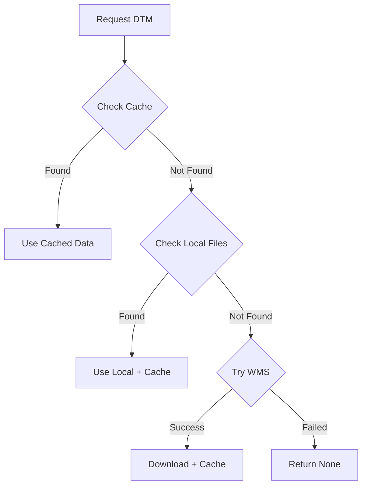

# RGE ALTI Integration Guide

Complete guide to integrating IGN's **RGE ALTI® Digital Terrain Model** into the LiDAR HD processing pipeline for enhanced ground coverage and accurate height computation.

## Overview

**RGE ALTI** (Référentiel à Grande Échelle pour l'Altimétrie) is France's national high-resolution digital terrain model, providing:

- **Synthetic ground point generation** under vegetation and buildings
- **Accurate height computation** using DTM as ground reference
- **Improved classification** through better height features
- **Automatic WMS fallback** for reliable data access

### Key Specifications

| Property             | Value                             |
| -------------------- | --------------------------------- |
| **Resolution**       | 1 meter (5m fallback available)   |
| **Coverage**         | Mainland France + DOM-TOM         |
| **Source**           | LiDAR and photogrammetric surveys |
| **Format**           | GeoTIFF raster                    |
| **Access**           | IGN Géoplateforme WMS             |
| **Accuracy**         | ±0.2m vertical (RMSE)             |
| **Update Frequency** | Varies by region                  |

---

## Table of Contents

- [Quick Start](#quick-start)
- [Integration Methods](#integration-methods)
- [WMS Service & Caching](#wms-service--caching)
- [Configuration](#configuration)
- [Implementation Details](#implementation-details)
- [Migration Guide](#migration-guide)
- [Best Practices](#best-practices)
- [Troubleshooting](#troubleshooting)

---

## Quick Start

### Basic Setup

```yaml
# config.yaml
data_sources:
  rge_alti:
    enabled: true
    use_wcs: true # Enables WMS (name kept for compatibility)
    resolution: 1.0 # 1m resolution
    cache_enabled: true # Strongly recommended
    cache_dir: null # Auto: {input_dir}/cache/rge_alti

ground_truth:
  rge_alti:
    augment_ground: true
    augmentation_strategy: "intelligent" # gaps|intelligent|full
```

### Python Usage

```python
from ign_lidar.io.rge_alti_fetcher import RGEALTIFetcher

# Enable WMS with caching (recommended)
fetcher = RGEALTIFetcher(
    cache_dir=".cache/ign_lidar/rge_alti",
    use_wcs=True,  # Actually enables WMS
    resolution=1.0
)

# First call: Downloads from WMS and caches
bbox = (635000.0, 6856000.0, 636000.0, 6857000.0)  # EPSG:2154
dtm_data = fetcher.fetch_dtm_for_bbox(bbox, crs="EPSG:2154")

# Second call: Uses cached file (instant)
dtm_data = fetcher.fetch_dtm_for_bbox(bbox, crs="EPSG:2154")
```

---

## Integration Methods

RGE ALTI enhances LiDAR processing in three key ways:

### 1. Ground Point Augmentation

Fills gaps in LiDAR ground coverage by generating synthetic ground points from DTM.

**Where gaps occur:**

- **Under buildings** - Roofs block ground returns
- **Dense vegetation** - Tree canopies absorb laser pulses
- **Coverage gaps** - Flight path overlaps or sensor dropouts

**How it works:**

```python
# Generate regular grid of ground points from DTM
synthetic_points = []
for x, y in grid_positions:
    z = dtm.sample_elevation_at_xy(x, y)
    synthetic_points.append([x, y, z])

# Merge with original LiDAR points
enriched_points = concatenate(lidar_points, synthetic_points)
```

**Configuration:**

```yaml
ground_truth:
  rge_alti:
    augment_ground: true
    augmentation_spacing: 2.0 # Grid spacing (meters)
    augmentation_strategy: "intelligent" # See strategies below
```

**Augmentation Strategies:**

| Strategy      | Description                       | Use Case               |
| ------------- | --------------------------------- | ---------------------- |
| `gaps`        | Fill only low-density areas       | Conservative approach  |
| `intelligent` | Fill under buildings & vegetation | Balanced (recommended) |
| `full`        | Add points everywhere             | Maximum coverage       |

### 2. Accurate Height Computation

Uses DTM as absolute ground reference instead of local minimum elevation.

**Traditional method problems:**

- ❌ Inaccurate under vegetation (uses vegetation base, not true ground)
- ❌ Unreliable near buildings (uses nearby ground)
- ❌ Errors in sloped terrain

**RGE ALTI solution:**

```python
height_above_ground = point_Z - DTM_elevation_at_XY
```

**Benefits:**

- ✅ Accurate heights even under dense vegetation
- ✅ Correct building heights
- ✅ Reliable on slopes and complex terrain
- ✅ 10-30% classification improvement in difficult areas

**Configuration:**

```yaml
features:
  height_method: "dtm" # Options: local|dtm|hybrid
  use_rge_alti_for_height: true
  compute_height_above_ground: true
```

### 3. Enhanced Classification

Improved height features enable better distinction between classes.

**Improvements:**

- **Vegetation** - Better low/medium/high separation
- **Buildings** - Accurate building vs low object separation
- **Roads** - Automatic exclusion of roadside trees
- **Terrain** - Better ground vs non-ground classification

**Example - Road Classification:**

```python
# Traditional (height from local minimum)
road_mask = (height <= 2.0) & (planarity >= 0.7)
# Problem: Includes roadside trees

# With RGE ALTI (height above DTM)
road_mask = (height_above_ground <= 0.5) & (planarity >= 0.7)
# Solution: Only surface points, trees automatically excluded
```

---

## WMS Service & Caching

### IGN Géoplateforme Migration

:::warning Service Change
IGN migrated from old Géoservices to **Géoplateforme** (`data.geopf.fr`) in October 2025.
**WCS (Web Coverage Service) is no longer available** - use WMS with caching instead.
:::

### Data Source Priority

The `RGEALTIFetcher` attempts to fetch DTM data in this order:

1. **Cache** (fastest) - Checks for previously downloaded tiles
2. **Local files** - Searches local DTM directory if specified
3. **WMS** - Downloads from IGN Géoplateforme and caches result



### WMS with Automatic Caching

**How it works:**

1. **First fetch** - Downloads GeoTIFF from WMS, saves to cache
2. **Subsequent fetches** - Uses cached file (no network request)
3. **Cache naming** - `rge_alti_{crs}_{minx}_{miny}_{maxx}_{maxy}.tif`

**WMS GetMap Request:**

```python
params = {
    'SERVICE': 'WMS',
    'VERSION': '1.3.0',
    'REQUEST': 'GetMap',
    'LAYERS': 'ELEVATION.ELEVATIONGRIDCOVERAGE.HIGHRES',
    'FORMAT': 'image/geotiff',
    'BBOX': f'{minx},{miny},{maxx},{maxy}',
    'WIDTH': 1000,
    'HEIGHT': 1000,
    'CRS': 'EPSG:2154'
}
```

**Performance:**

| Method          | First Access | Subsequent Access | Data Quality    |
| --------------- | ------------ | ----------------- | --------------- |
| **WMS + Cache** | ~2-5 seconds | &lt;0.1 seconds   | Good (rendered) |
| **Local files** | ~0.1 seconds | ~0.1 seconds      | Best (raw)      |

### Cache Management

**Cache location:**

```
Default: .cache/ign_lidar/rge_alti/
Files: rge_alti_2154_635000_6856000_636000_6857000.tif
```

**Cache size:**

- Each 1km² tile at 1m resolution ≈ 4-8 MB (compressed)
- 100 tiles ≈ 400-800 MB

**Clearing cache:**

```bash
# Clear all cached tiles
rm -rf .cache/ign_lidar/rge_alti/*.tif

# Clear specific bbox
rm .cache/ign_lidar/rge_alti/rge_alti_2154_635000_*.tif
```

**Programmatic cleanup:**

```python
from pathlib import Path
import time

cache_dir = Path(".cache/ign_lidar/rge_alti")
max_age_days = 30
now = time.time()

for cache_file in cache_dir.glob("*.tif"):
    age_days = (now - cache_file.stat().st_mtime) / 86400
    if age_days > max_age_days:
        cache_file.unlink()
```

---

## Configuration

### Complete Example

```yaml
# RGE ALTI Data Source
data_sources:
  rge_alti:
    enabled: true
    use_wcs: true # Enable WMS
    resolution: 1.0 # 1m resolution
    cache_enabled: true # Strongly recommended
    cache_dir: .cache/rge_alti # Cache location
    cache_ttl_days: 90 # Cache expiration
    local_dtm_dir: null # Optional: local files

# Ground Augmentation
ground_truth:
  rge_alti:
    augment_ground: true
    augmentation_strategy: "intelligent" # gaps|intelligent|full
    augmentation_spacing: 2.0 # Grid spacing (meters)
    min_distance_to_existing: 0.5 # Min distance to LiDAR ground
    max_elevation_difference: 5.0 # Max elevation difference

# Height Computation
features:
  height_method: "dtm" # Use DTM for height
  use_rge_alti_for_height: true
  compute_height_above_ground: true
  compute_height_local: true # Also compute local (comparison)

# Classification Thresholds (with height_above_ground)
classification:
  thresholds:
    roads:
      max_height_above_ground: 0.5 # Excludes trees
      min_planarity: 0.7
    sports:
      max_height_above_ground: 2.0 # Surface + low equipment
      min_planarity: 0.6
    cemeteries:
      max_height_above_ground: 2.5 # Tombs + monuments
    parking:
      max_height_above_ground: 0.5 # Same as roads
    water:
      min_height_above_ground: -0.5 # Below DTM
      max_height_above_ground: 0.3 # Surface + banks
```

### Minimal Configuration

```yaml
data_sources:
  rge_alti:
    enabled: true
    use_wcs: true
    cache_enabled: true

ground_truth:
  rge_alti:
    augment_ground: true
```

### Production Configuration

```yaml
data_sources:
  rge_alti:
    enabled: true
    use_wcs: false # Disable WMS
    local_dtm_dir: /data/rge_alti_tiles # Use pre-downloaded files
    cache_dir: /var/cache/rge_alti # Persistent cache
    resolution: 1.0

ground_truth:
  rge_alti:
    augment_ground: true
    augmentation_strategy: "intelligent"
    augmentation_spacing: 1.5 # Denser grid
```

---

## Implementation Details

### Processing Pipeline Integration

RGE ALTI augmentation occurs **early** in the pipeline:

```python
# Pipeline order in processor.py
def _process_tile_core():
    # 1. Load LiDAR points
    points, classification = load_laz_file(tile_path)

    # 1a. Augment ground with RGE ALTI (BEFORE features)
    if rge_alti_enabled and augment_ground:
        points, classification = self._augment_ground_with_dtm(
            points, classification, bbox
        )

    # 2. Compute features (on ALL points including synthetic)
    features = compute_geometric_features(points)

    # 3. Compute height_above_ground (using DTM)
    height_above_ground = points[:, 2] - dtm.sample_elevation(points[:, :2])

    # 4. Classification
    classification = classify_ground_truth(points, features, height_above_ground)

    # 5. Save
    save_enriched_laz(points, classification, features)
```

### BD TOPO Classification Adaptation

With `height_above_ground`, BD TOPO classification is more accurate:

**Before (local height):**

```python
# Roads: includes roadside trees (height from local minimum)
road_mask = (height <= 2.0) & (planarity >= 0.7)
```

**After (DTM height):**

```python
# Roads: only surface points (height above DTM)
road_mask = (height_above_ground <= 0.5) & (planarity >= 0.7)
```

**Classification thresholds:**

| Surface        | Old (height) | New (height_above_ground) | Improvement             |
| -------------- | ------------ | ------------------------- | ----------------------- |
| **Roads**      | ≤ 2.0m       | ≤ 0.5m                    | Excludes trees/hedges   |
| **Railways**   | ≤ 2.0m       | ≤ 0.8m                    | Rails + ballast only    |
| **Sports**     | Not filtered | ≤ 2.0m                    | Surface + low equipment |
| **Cemeteries** | Not filtered | ≤ 2.5m                    | Tombs + monuments       |
| **Parking**    | Not filtered | ≤ 0.5m                    | Same as roads           |
| **Water**      | Not filtered | -0.5 to 0.3m              | Surface + banks         |

### Vegetation Reclassification

Automatically detects and reclassifies vegetation above surfaces:

```python
# In reclassifier.py
def reclassify_vegetation_above_surfaces(points, labels, features, ground_truth):
    """
    Identifies points that are:
    1. Inside BD TOPO polygon (road, sport, cemetery, parking)
    2. Elevated: height_above_ground > 2.0m (configurable)
    3. Vegetation: NDVI > 0.3 (if available)

    Action: Reclassify to vegetation based on height:
    - Low vegetation (3): <= 3m
    - Medium vegetation (4): 3-10m
    - High vegetation (5): > 10m
    """
    for feature_type in ['roads', 'sports', 'cemeteries', 'parking']:
        # Points inside BD TOPO polygons
        in_polygon_mask = labels == feature_asprs_class[feature_type]

        # High above ground + vegetation signature
        vegetation_mask = (
            in_polygon_mask &
            (height_above_ground > 2.0) &
            (ndvi > 0.3 if 'ndvi' in features else True)
        )

        # Reclassify by height
        labels[vegetation_mask & (height_above_ground <= 3)] = 3   # Low veg
        labels[vegetation_mask & (height_above_ground <= 10)] = 4  # Medium veg
        labels[vegetation_mask & (height_above_ground > 10)] = 5   # High veg
```

---

## Migration Guide

### From Old WCS Service

:::danger WCS Deprecated
The old WCS endpoint (`wxs.ign.fr`) no longer works. Migrate to WMS with caching.
:::

**Old code (broken):**

```python
fetcher = RGEALTIFetcher(
    use_wcs=True,
    api_key="pratique"  # No longer needed
)
```

**New code (working):**

```python
fetcher = RGEALTIFetcher(
    use_wcs=True,  # Actually enables WMS now
    cache_dir=".cache/rge_alti"
)
```

### Manual Download Option

For production or offline processing, download RGE ALTI tiles:

1. Visit [IGN Download Portal](https://geoservices.ign.fr/telechargement)
2. Navigate to **Altimetry** → **RGE ALTI**
3. Download tiles covering your area
4. Configure local directory:

```python
fetcher = RGEALTIFetcher(
    local_dtm_dir="/path/to/rge_alti_tiles",
    cache_dir=".cache/rge_alti",
    use_wcs=False  # Disable WMS
)
```

### Alternative Data Sources

If RGE ALTI unavailable:

| Source           | Resolution | Coverage              | Access                                                          |
| ---------------- | ---------- | --------------------- | --------------------------------------------------------------- |
| **LiDAR HD MNT** | 1m         | Limited (newer areas) | [Download](https://geoservices.ign.fr/lidarhd)                  |
| **BD ALTI**      | 25m        | Complete France       | [Download](https://geoservices.ign.fr/bdalti)                   |
| **EU-DEM**       | 25-30m     | Europe                | [Copernicus](https://land.copernicus.eu/imagery-in-situ/eu-dem) |

---

## Best Practices

### 1. Always Enable Caching

```yaml
# ✅ GOOD
data_sources:
  rge_alti:
    cache_enabled: true
    cache_dir: /data/cache/rge_alti  # Persistent location

# ❌ BAD
data_sources:
  rge_alti:
    cache_enabled: false  # Every fetch downloads from WMS
```

**Benefits:**

- 5-10× speedup on repeated runs
- Works offline after first fetch
- Reduces server load
- Protects against service interruptions

### 2. Use Local Files for Production

```python
# Production: Reliable, fast, offline-capable
fetcher = RGEALTIFetcher(
    local_dtm_dir="/data/rge_alti",
    use_wcs=False
)

# Development: Convenient, automatic
fetcher = RGEALTIFetcher(
    cache_dir=".cache/rge_alti",
    use_wcs=True
)
```

### 3. Monitor Cache Size

```bash
# Check cache size
du -sh .cache/ign_lidar/rge_alti

# Implement cleanup for long-running applications
find .cache/ign_lidar/rge_alti -name "*.tif" -mtime +30 -delete
```

### 4. Validate Results

```python
# After augmentation
print(f"Original points: {n_original:,}")
print(f"Synthetic points: {n_synthetic:,}")
print(f"Total points: {n_total:,}")
print(f"Augmentation: +{100*n_synthetic/n_original:.1f}%")

# Sanity checks
assert n_synthetic > 0, "No synthetic points added"
assert n_synthetic < n_original, "Too many synthetic points"
```

### 5. Tune Augmentation Strategy

| Use Case         | Strategy      | Spacing | Result                               |
| ---------------- | ------------- | ------- | ------------------------------------ |
| **Conservative** | `gaps`        | 3.0m    | Only fill obvious gaps               |
| **Balanced**     | `intelligent` | 2.0m    | Buildings + vegetation (recommended) |
| **Maximum**      | `full`        | 1.0m    | Complete coverage everywhere         |

---

## Troubleshooting

### Problem: WMS Fetch Failures

**Symptoms:**

```log
[WARNING] WMS fetch failed: HTTPError 400
[ERROR] Failed to fetch DTM for bbox
```

**Solutions:**

1. **Check network:**

   ```bash
   curl https://data.geopf.fr/wms-r/wms?REQUEST=GetCapabilities
   ```

2. **Reduce bbox size:**

   ```python
   # ❌ Too large (may timeout)
   bbox = (0, 0, 10000, 10000)

   # ✅ Reasonable size
   bbox = (635000, 6856000, 636000, 6857000)  # 1km²
   ```

3. **Enable caching:**

   ```yaml
   cache_enabled: true
   ```

4. **Use local files:**
   ```yaml
   local_dtm_dir: /data/rge_alti_tiles
   ```

### Problem: No Synthetic Points Added

**Symptoms:**

```log
[INFO] ℹ️  No ground points added (sufficient existing coverage)
```

**Causes:**

- Already dense ground coverage
- Augmentation disabled
- Strategy too conservative

**Solutions:**

```yaml
# Try more aggressive strategy
ground_truth:
  rge_alti:
    augmentation_strategy: "full" # Was "gaps"
    augmentation_spacing: 1.0 # Was 2.0
```

### Problem: Cache Not Being Used

**Symptoms:**

```log
[INFO] Fetching DTM from IGN WMS: ...  # Every time
```

**Solutions:**

1. **Verify cache directory:**

   ```python
   assert Path(cache_dir).exists()
   assert os.access(cache_dir, os.W_OK)
   ```

2. **Check file permissions:**

   ```bash
   ls -la .cache/ign_lidar/rge_alti/
   chmod 755 .cache/ign_lidar/rge_alti/
   ```

3. **Use consistent bbox:**
   ```python
   # Round bbox to avoid slight differences
   bbox = tuple(round(v, 1) for v in bbox)
   ```

### Problem: Poor DTM Quality

**Cause:** WMS rendering/compression

**Solution:** Use high-quality local files:

1. Download from [IGN](https://geoservices.ign.fr/telechargement)
2. Use raw GeoTIFF files
3. Configure `local_dtm_dir`

---

## Related Documentation

- [DTM Processing Guide](./dtm-processing.md) - Complete DTM enrichment reference
- [Ground Truth Classification](../features/ground-truth-classification.md) - Using BD TOPO data
- [Configuration Guide](../guides/configuration.md) - Complete configuration reference
- [Height Features](../features/geometric-features.md#height-computation) - Height calculation methods

---

## References

- [IGN RGE ALTI](https://geoservices.ign.fr/rgealti) - Official product page
- [Géoplateforme](https://geoservices.ign.fr) - New IGN platform
- [WMS GetCapabilities](https://data.geopf.fr/wms-r/wms?REQUEST=GetCapabilities) - Service capabilities
- [Download Portal](https://geoservices.ign.fr/telechargement) - Manual download

---

_Last updated: October 21, 2025_
