# Classification Workflow Guide

Complete workflows for classifying LiDAR point clouds using different classification modes and data sources.

---

## 🎯 Overview

This guide provides step-by-step workflows for three main classification modes:

- **ASPRS Mode**: Standard LAS 1.4 classification
- **LOD2 Mode**: Building-focused classification (15 classes)
- **LOD3 Mode**: Detailed architectural classification (30 classes)

Each workflow integrates geometric analysis, ground truth data, and optional spectral features.

---

## 📊 Classification Mode Comparison

| Mode      | Classes | Point Density | Processing Time | Use Cases                    |
| --------- | ------- | ------------- | --------------- | ---------------------------- |
| **ASPRS** | 0-255   | 10+ pts/m²    | Fast            | Standard classification, GIS |
| **LOD2**  | 15      | 10-20 pts/m²  | Medium          | Solar analysis, roof types   |
| **LOD3**  | 30      | 20-50 pts/m²  | Slow            | Heritage, detailed modeling  |

---

## 🏗️ Workflow 1: ASPRS Classification

### Overview

Standard ASPRS LAS 1.4 classification with BD TOPO® ground truth integration.


### Step-by-Step Process

#### Step 1: Configuration

```yaml
# config_asprs.yaml
defaults:
  - ../config
  - _self_

classification:
  mode: asprs
  normalize_classes: true
  use_ground_truth: true

data_sources:
  bd_topo:
    enabled: true
    features:
      buildings: true # → Class 6
      roads: true # → Class 11
      water: true # → Class 9
      vegetation: true # → Class 3-5

  orthophoto_nir: true # Optional for NDVI

processor:
  use_gpu: true
  gpu_batch_size: 8_000_000
```

#### Step 2: Execute Processing

```bash
ign-lidar-hd process \
  --config-name asprs_classification \
  input_dir=data/tiles/ \
  output_dir=output/asprs/
```

#### Step 3: Python API

```python
from ign_lidar.core.processor import LiDARProcessor
from ign_lidar.config import load_config

# Load configuration
config = load_config("configs/presets/asprs_classification.yaml")

# Initialize processor
processor = LiDARProcessor(config)

# Process tile
result = processor.process_tile(
    tile_path="data/tiles/tile_0650_6860.laz",
    output_dir="output/asprs/"
)

print(f"Processed {result.points_classified} points")
print(f"Classes: {result.unique_classes}")
```

### Classification Logic

```python
# ASPRS classification priority (highest to lowest)
1. Ground Truth (BD TOPO)
   - Buildings → Class 6
   - Roads → Class 11
   - Water → Class 9
   - Vegetation → Classes 3-5 (by height)

2. Geometric Rules
   - High planarity + horizontal → Ground (2)
   - High planarity + vertical → Building (6)
   - Low planarity → Vegetation (3-5)

3. NDVI Refinement (if NIR available)
   - NDVI > 0.5 → High Vegetation (5)
   - NDVI > 0.3 → Medium Vegetation (4)
   - NDVI > 0.1 → Low Vegetation (3)

4. Post-Processing
   - Reclassify isolated points
   - Apply morphological filters
   - Fix class boundaries
```

### Expected Output

```
Input:  tile_0650_6860.laz (18.2M points)
Output: tile_0650_6860_enriched.laz

Class Distribution:
  1 (Unclassified):     668,890 pts ( 3.67%)
  2 (Ground):         7,982,345 pts (43.79%)
  3 (Low Veg):          237,049 pts ( 1.30%)
  4 (Medium Veg):       506,921 pts ( 2.78%)
  5 (High Veg):       6,784,123 pts (37.21%)
  6 (Building):       2,047,207 pts (11.23%)
  9 (Water):              8,032 pts ( 0.04%)
  11 (Road):            201,433 pts ( 1.10%)
```

---

## 🏠 Workflow 2: LOD2 Classification

### Overview

Building-focused classification for roof type analysis and solar potential.


### Step-by-Step Process

#### Step 1: Configuration

```yaml
# config_lod2.yaml
classification:
  mode: lod2
  asprs_to_lod2:
    enabled: true
    auto_refine_buildings: true

  lod2:
    roof_slope_threshold: 5.0 # degrees
    wall_verticality: 0.85
    chimney_height_min: 1.0
    dormer_protrusion: 0.5
    balcony_protrusion: 0.8
```

#### Step 2: Execute

```bash
ign-lidar-hd process \
  --config-name lod2_classification \
  input_dir=data/tiles_asprs/ \
  output_dir=output/lod2/
```

#### Step 3: Python API

```python
from ign_lidar.preprocessing.classification_refinement import refine_lod2_buildings
from ign_lidar.classes import ASPRS_TO_LOD2

# Convert ASPRS to LOD2
lod2_classes = np.array([ASPRS_TO_LOD2.get(c, 14) for c in asprs_classes])

# Refine building points
lod2_refined = refine_lod2_buildings(
    points=points,
    classes=lod2_classes,
    compute_normals=True,
    detect_roof_types=True,
    detect_chimneys=True,
    detect_dormers=True,
    detect_balconies=True
)
```

### Classification Logic

```python
# LOD2 refinement logic for buildings (Class 6 → 0-8)

For each building point:
    1. Compute surface normal

    2. Classify structure:
       if verticality > 0.85:
           class = 0 (wall)
       else:
           Analyze roof:
           if slope < 5°:
               class = 1 (flat roof)
           else:
               Detect roof type:
               - 2 slopes → class = 2 (gable)
               - 4+ slopes → class = 3 (hip)

    3. Detect details:
       if protrudes_above_roof and small_footprint:
           class = 4 (chimney)

       if protrudes_from_roof and window_like:
           class = 5 (dormer)

       if protrudes_from_wall and horizontal:
           class = 6 (balcony)
```

### Expected Output

```
LOD2 Class Distribution:
  0 (wall):           1,250,000 pts (61.0%)
  1 (roof_flat):        205,000 pts (10.0%)
  2 (roof_gable):       410,000 pts (20.0%)
  3 (roof_hip):         164,000 pts ( 8.0%)
  4 (chimney):            8,200 pts ( 0.4%)
  5 (dormer):            12,300 pts ( 0.6%)
```

---

## 🎨 Workflow 3: LOD3 Classification

### Overview

Detailed architectural classification with facade element detection.

```mermaid
flowchart TD
    A[LOD2 Classified Data] --> B[Check Point Density]
    B --> C{Density > 20 pts/m²?}
    C -->|No| D[Keep LOD2]
    C -->|Yes| E[Refine Walls]

    E --> F[Detect Openings]
    F --> G[Window Detection]
    F --> H[Door Detection]

    G --> I[Classify Wall Types]
    H --> I

    I --> J[wall_plain]
    I --> K[wall_with_windows]
    I --> L[wall_with_door]

    E --> M[Refine Roofs]
    M --> N[Mansard/Gambrel Detection]
    M --> O[Skylight Detection]
    M --> P[Roof Edge Detection]

    I --> Q[LOD3 Output]
    N --> Q
    O --> Q
    P --> Q

    style A fill:#e1f5fe
    style Q fill:#e8f5e8
```



### Step-by-Step Process

#### Step 1: Configuration

```yaml
# config_lod3.yaml
classification:
  mode: lod3

  lod3:
    # Roof classification
    roof_slope_threshold: 5.0
    mansard_slope_break: 30.0
    gambrel_slope_break: 45.0

    # Wall classification
    wall_verticality: 0.85
    window_depth: 0.15
    door_height_min: 1.8

    # Facade elements
    balcony_protrusion: 0.8
    pillar_radius: 0.3
    cornice_height: 0.2

    # Requirements
    min_feature_size: 0.1
    point_density_required: 20
```

#### Step 2: Execute

```bash
ign-lidar-hd process \
  --config-name lod3_classification \
  input_dir=data/tiles_lod2/ \
  output_dir=output/lod3/ \
  classification.lod3.min_point_density=20
```

#### Step 3: Python API

```python
from ign_lidar.preprocessing.classification_refinement import refine_lod3_buildings

# Check point density first
point_density = estimate_point_density(points)
if point_density < 20.0:
    print("Warning: Point density too low for LOD3")
    print("Recommended: 20+ pts/m², current: {point_density:.1f}")

# Refine to LOD3
lod3_refined = refine_lod3_buildings(
    points=points,
    classes=lod2_classes,
    detect_windows=True,
    detect_doors=True,
    detect_balconies=True,
    detect_cornices=True,
    detect_skylights=True,
    min_point_density=20.0
)
```

### Classification Logic

```python
# LOD3 refinement logic

For each building facade:
    1. Detect openings (windows/doors):
       - Find depth discontinuities (> 15cm)
       - Analyze shape (rectangular, vertical extent)
       - Classify by height:
         * Height > 1.8m and bottom near ground → door (14)
         * Height < 1.8m and above ground → window (13)

    2. Refine wall classification:
       if has_windows:
           class = 1 (wall_with_windows)
       elif has_door:
           class = 2 (wall_with_door)
       else:
           class = 0 (wall_plain)

    3. Detect facade elements:
       - Protrusions > 0.8m → balcony (16)
       - Vertical cylinders → pillar (19)
       - Horizontal top bands → cornice (20)

    4. Refine roof types:
       - Detect slope breaks:
         * Break at ~30° → mansard (6)
         * Break at ~45° → gambrel (7)
       - Detect roof elements:
         * Transparent panels → skylight (11)
         * Edge features → roof_edge (12)
```

### Expected Output

```
LOD3 Class Distribution:
  0 (wall_plain):        450,000 pts (22.0%)
  1 (wall_with_windows): 600,000 pts (29.3%)
  2 (wall_with_door):    200,000 pts ( 9.8%)
  3 (roof_flat):         205,000 pts (10.0%)
  4 (roof_gable):        350,000 pts (17.1%)
  5 (roof_hip):          140,000 pts ( 6.8%)
  6 (roof_mansard):       30,000 pts ( 1.5%)
  8 (chimney):             8,200 pts ( 0.4%)
  9 (dormer_gable):       10,000 pts ( 0.5%)
  11 (skylight):           5,000 pts ( 0.2%)
  13 (window):            35,000 pts ( 1.7%)
  14 (door):               8,000 pts ( 0.4%)
  16 (balcony):            6,000 pts ( 0.3%)
```

---

## 🔄 Mode Selection Decision Tree

```mermaid
flowchart TD
    START[Start] --> Q1{What is your goal?}

    Q1 -->|Standard classification| ASPRS
    Q1 -->|Building analysis| Q2
    Q1 -->|Detailed modeling| Q3

    Q2{Point density?}
    Q2 -->|10-20 pts/m²| LOD2
    Q2 -->|20+ pts/m²| Q3
    Q2 -->|< 10 pts/m²| ASPRS

    Q3{Need facade details?}
    Q3 -->|Yes| LOD3
    Q3 -->|No| LOD2

    ASPRS[ASPRS Mode]
    LOD2[LOD2 Mode]
    LOD3[LOD3 Mode]

    style ASPRS fill:#e1f5fe
    style LOD2 fill:#fff3e0
    style LOD3 fill:#e8f5e8
```



---

## 📊 Performance Comparison

| Workflow | Input Size | Processing Time | GPU Speedup | Memory Usage |
| -------- | ---------- | --------------- | ----------- | ------------ |
| ASPRS    | 10M points | 30-60s          | 15x         | 2-4 GB       |
| LOD2     | 10M points | 60-120s         | 12x         | 4-8 GB       |
| LOD3     | 10M points | 180-300s        | 8x          | 8-12 GB      |

**Hardware**: RTX 4080 Super, 16GB VRAM

---

## 💡 Best Practices

### General

1. **Start simple** - Begin with ASPRS, progress to LOD if needed
2. **Check data quality** - Verify point density before choosing mode
3. **Use ground truth** - BD TOPO significantly improves results
4. **Enable GPU** - 10-15x speedup for all modes
5. **Cache ground truth** - Reuse BD TOPO data across tiles
6. **Validate results** - Visual QC recommended

### ASPRS Mode

1. **Enable all data sources** - Buildings, roads, water, vegetation
2. **Use NDVI if available** - Improves vegetation classification
3. **Tune thresholds** - Adjust planarity for local conditions
4. **Post-process** - Apply morphological filters

### LOD2 Mode

1. **Ensure minimum density** - 10+ pts/m² required
2. **Compute accurate normals** - Essential for roof detection
3. **Validate roof slopes** - Check against architectural standards
4. **Focus on buildings** - Use building masks for efficiency

### LOD3 Mode

1. **Verify high density** - 20+ pts/m² strongly recommended
2. **Enable all refinements** - Window, door, balcony detection
3. **Tune thresholds carefully** - Adjust for regional styles
4. **Expect longer processing** - 5-10x slower than LOD2
5. **Visual validation** - Manual review recommended

---

## 🔍 Troubleshooting

### Low Classification Coverage

**Problem**: Many points remain unclassified

**Solutions**:

1. Check BD TOPO data availability
2. Reduce planarity thresholds
3. Enable NDVI refinement
4. Check point cloud quality

### Incorrect Building Classification

**Problem**: Non-buildings classified as buildings

**Solutions**:

1. Increase planarity threshold
2. Check BD TOPO footprint accuracy
3. Enable height-based filtering
4. Use stricter verticality threshold

### Missing Roof Details (LOD2/3)

**Problem**: Roofs classified as single type

**Solutions**:

1. Verify point density (20+ pts/m²)
2. Check normal computation accuracy
3. Reduce minimum feature size
4. Adjust slope thresholds

---

## 📚 See Also

- [ASPRS Classification Reference](./asprs-classification.md)
- [LOD Classification Reference](./lod-classification.md)
- [BD TOPO Integration](./bd-topo-integration.md)
- [Ground Truth Classification](../features/ground-truth-classification.md)
- [Configuration V5 Guide](../guides/configuration-v5.md)

---

**Updated**: October 17, 2025 - V5 Configuration
