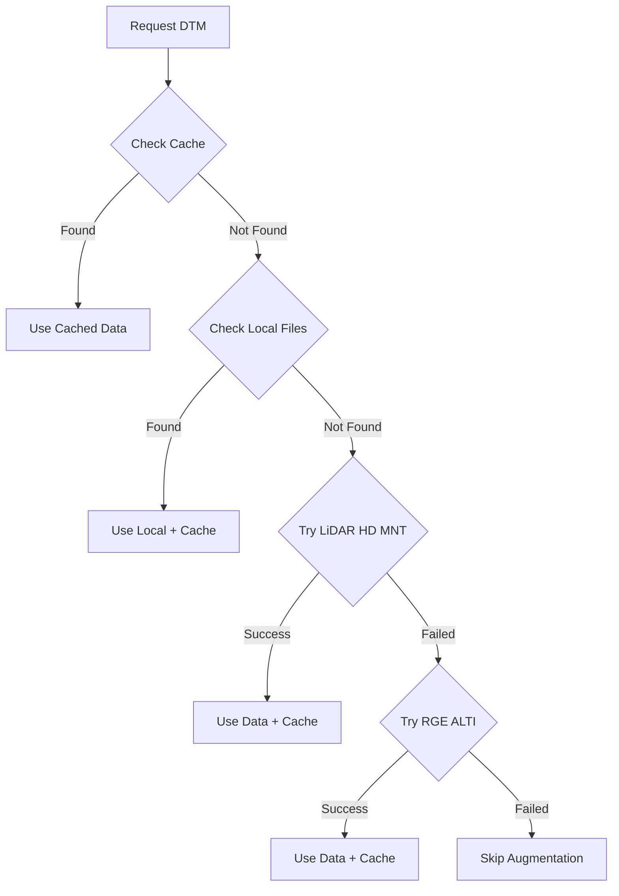

# DTM Processing & Ground Enrichment

Comprehensive guide to Digital Terrain Model (DTM) processing for LiDAR point cloud enrichment and terrain analysis.

## Overview

The IGN LiDAR HD library uses **RGE ALTI** (French national elevation reference) to enhance LiDAR point clouds by:

1. **Ground Point Enrichment** - Adding synthetic ground points in sparse areas
2. **Height Computation** - Calculating accurate height-above-ground values
3. **Variable Object Filtering** - Identifying temporary objects using terrain reference
4. **Automatic Fallback** - Seamless switching between LiDAR HD MNT and RGE ALTI sources

---

## Table of Contents

- [Ground Point Enrichment](#ground-point-enrichment)
- [DTM Fallback Strategy](#dtm-fallback-strategy)
- [Variable Object Filtering](#variable-object-filtering)
- [Configuration](#configuration)
- [API Reference](#api-reference)
- [Best Practices](#best-practices)
- [Troubleshooting](#troubleshooting)

---

## Ground Point Enrichment

### What is Ground Enrichment?

Ground enrichment adds **synthetic ground points** from DTM data to fill gaps in LiDAR coverage, particularly:

- **Under buildings** - Where roofs block ground returns
- **Under dense vegetation** - Where tree canopies absorb laser pulses
- **Coverage gaps** - From flight path overlaps or sensor dropouts

### Three Enrichment Modes

#### 1. Building Mode

Adds ground points under building footprints using BD TOPO vector data.

**Configuration:**

```yaml
dtm_enrichment:
  enable_building_enrichment: true
  spacing_buildings: 1.0 # 1m grid spacing
  buffer_margin: 0.5 # Shrink footprints 0.5m inward
```

**Output:**

- ~1M synthetic points per km² of buildings
- Complete ground coverage under structures
- Smooth terrain transitions at building edges

#### 2. Vegetation Mode

Adds ground points under tall vegetation (>2m height).

**Configuration:**

```yaml
dtm_enrichment:
  enable_vegetation_enrichment: true
  spacing_vegetation: 2.0 # 2m grid spacing
  vegetation_height_threshold: 2.0 # Only vegetation >2m tall
```

**Output:**

- ~250K synthetic points per km² of forest
- Ground surface under tree canopy
- Preserves understory structure

:::caution Prerequisites
Requires `height_above_ground` to be computed first!
:::

#### 3. Gap Filling Mode

Detects and fills areas with abnormally low point density.

**Configuration:**

```yaml
dtm_enrichment:
  enable_gap_enrichment: true
  spacing_gaps: 3.0 # 3m grid spacing
  gap_density_threshold: 0.1 # <0.1 pts/m² = gap
  gap_analysis_cell_size: 10.0 # Analyze in 10m cells
```

**Output:**

- Variable points depending on gap size
- Minimum viable coverage in sparse areas

### Quick Start Example

```python
from ign_lidar.io.dtm_ground_enrichment import enrich_laz_with_dtm_ground
import numpy as np

# Your data
points = np.load("tile_points.npy")  # Shape: (N, 3)
labels = np.load("tile_labels.npy")   # Shape: (N,)
bbox = (650000, 6860000, 651000, 6861000)  # EPSG:2154

# Enrich!
enriched_points, enriched_labels, stats = enrich_laz_with_dtm_ground(
    points=points,
    labels=labels,
    bbox=bbox,
    spacing_buildings=1.0,
    spacing_vegetation=2.0,
    spacing_gaps=3.0
)

# Results
print(f"Added {stats.total_synthetic:,} synthetic ground points")
print(f"  Under buildings: {stats.synthetic_under_buildings:,}")
print(f"  Under vegetation: {stats.synthetic_under_vegetation:,}")
print(f"  In gaps: {stats.synthetic_in_gaps:,}")
```

### Performance

| Operation       | Time (per km²) | Memory      | Points Added   |
| --------------- | -------------- | ----------- | -------------- |
| Building mode   | ~2-5 sec       | ~50 MB      | ~500K-1M       |
| Vegetation mode | ~1-3 sec       | ~30 MB      | ~200K-500K     |
| Gap mode        | ~3-7 sec       | ~40 MB      | ~50K-300K      |
| **Combined**    | **~6-15 sec**  | **~120 MB** | **~800K-1.8M** |

---

## DTM Fallback Strategy

### Why Fallback is Needed

When fetching DTM from IGN Géoplateforme, the system implements automatic fallback to maximize data availability:

1. **Primary:** LiDAR HD MNT (1m resolution, best quality)
2. **Fallback:** RGE ALTI (1-5m resolution, broader coverage)

**Common issues:**

- Service interruptions (502 Bad Gateway errors)
- Coverage gaps (LiDAR HD MNT not available everywhere)
- Maintenance windows
- High server load during peak usage

### How Fallback Works



### Log Messages

#### Successful Primary Fetch

```log
[INFO] Fetching DTM from IGN WMS (LiDAR HD MNT): (635000.0, 6856000.0, 636000.0, 6857000.0)
[INFO] ✅ Successfully fetched DTM using LiDAR HD MNT
[INFO] ✅ Added 1,234,567 synthetic ground points from DTM
```

#### Successful Fallback

```log
[INFO] Fetching DTM from IGN WMS (LiDAR HD MNT): ...
[WARNING] WMS fetch failed for LiDAR HD MNT: 502 Server Error: Bad Gateway
[INFO] Fetching DTM from IGN WMS (RGE ALTI (fallback)): ...
[INFO] ✅ Successfully fetched DTM using RGE ALTI (fallback)
[INFO] ✅ Added 1,234,567 synthetic ground points from DTM
```

#### Complete Failure

```log
[WARNING] WMS fetch failed for LiDAR HD MNT: 502 Server Error
[WARNING] WMS fetch failed for RGE ALTI (fallback): 502 Server Error
[ERROR] Failed to fetch DTM from all WMS layers
[WARNING] Skipping ground augmentation - using existing LiDAR ground points only
[INFO] 💡 Tip: Check your internet connection or consider pre-downloading DTM tiles
```

### Quality Comparison

| Aspect          | LiDAR HD MNT          | RGE ALTI              |
| --------------- | --------------------- | --------------------- |
| **Resolution**  | 1m (always)           | 1-5m (varies)         |
| **Source**      | LiDAR point clouds    | Mixed sources         |
| **Quality**     | Highest (±0.15m)      | Good (±0.30m)         |
| **Coverage**    | Limited (newer areas) | Complete (all France) |
| **Consistency** | Perfect with input    | Good                  |
| **Use Case**    | Best for LiDAR        | Fallback/broad        |

---

## Variable Object Filtering

### Principle

DTM provides a stable terrain reference to calculate precise height-above-ground:

```
height_above_ground = point_Z - DTM_elevation_at_XY
```

This enables identification and filtering of temporary/variable objects.

### Objects to Filter

#### 1. Vehicles (Cars, Trucks, Buses)

**Characteristics:**

- Height: 1.4-1.8m (cars), 2.5-4.0m (trucks/buses)
- Location: Roads, parking lots, service areas
- Signature: Horizontal flat surfaces + vertical walls

**Filtering Strategy:**

```python
# On roads (class 11)
vehicle_mask = (classification == 11) & (height_above_ground > 0.8)
classification[vehicle_mask] = 1  # Reclassify as "unassigned"

# In parking lots (class 40)
vehicle_mask = (
    (classification == 40) &
    (height_above_ground > 0.5) &
    (height_above_ground < 3.0)
)
classification[vehicle_mask] = 1
```

**Recommended thresholds:**

- Roads: `0.8m < height < 3.0m` → probably vehicle
- Parking: `0.5m < height < 4.0m` → probably vehicle
- Railways: `1.5m < height < 5.0m` → probably train/wagon

#### 2. Walls and Fences

**Characteristics:**

- Height: 0.5-2.5m
- Geometry: Linear vertical structures
- Verticality: > 0.8

**Filtering Strategy:**

```python
# Detect walls (combine height + verticality)
wall_mask = (
    (height_above_ground > 0.5) &
    (height_above_ground < 2.5) &
    (verticality > 0.8) &
    (planarity > 0.7)
)

# Option 1: Create "wall" class (61)
classification[wall_mask] = 61

# Option 2: Reclassify by context
# - Near building → part of building (6)
# - Between parcels → fence/boundary
```

#### 3. Street Furniture

**Characteristics:**

- Height: 0.5-4.0m
- Size: Small clusters < 2m²
- Location: Sidewalks, squares, parks

**Examples:** Benches, signs, poles, bollards, public lighting

**Filtering Strategy:**

```python
# Detect small elevated objects
furniture_mask = (
    (height_above_ground > 0.5) &
    (height_above_ground < 4.0) &
    (cluster_size < 2.0) &  # Small objects
    (classification == 1)    # Unclassified
)

# Create custom class or merge with existing
classification[furniture_mask] = 14  # Bridge/Elevated
```

---

## Configuration

### Complete Example

```yaml
# DTM Ground Enrichment Settings
dtm_enrichment:
  enabled: true

  # Enable/disable modes
  enable_building_enrichment: true
  enable_vegetation_enrichment: true
  enable_gap_enrichment: false # Disabled by default

  # Spacing parameters (meters)
  spacing_buildings: 1.0 # Dense grid under buildings
  spacing_vegetation: 2.0 # Medium grid under vegetation
  spacing_gaps: 3.0 # Sparse grid in gaps

  # Filtering parameters
  min_distance: 0.5 # Min distance to existing ground (m)
  buffer_margin: 0.5 # Shrink building footprints (m)

  # Vegetation mode settings
  vegetation_height_threshold: 2.0 # Only >2m vegetation

  # Gap detection settings
  gap_density_threshold: 0.1 # <0.1 pts/m² = gap
  gap_analysis_cell_size: 10.0 # Analyze in 10m cells

# DTM Data Source Configuration
data_sources:
  rge_alti:
    enabled: true
    use_wcs: true # Enable WMS downloads with fallback
    resolution: 1.0
    cache_enabled: true # Strongly recommended
    cache_dir: null # Auto: {input_dir}/cache/rge_alti
    cache_ttl_days: 90 # DTM rarely changes
    local_dtm_dir: null # Optional: path to pre-downloaded tiles

# Ground Truth Data (for building footprints)
ground_truth:
  bd_topo:
    enabled: true
    path: ./data/ground_truth/BDTOPO/
    features:
      buildings:
        enabled: true
        file: BATIMENT.shp
```

### Minimal Configuration

```yaml
dtm_enrichment:
  enable_building_enrichment: true
  enable_vegetation_enrichment: false
  enable_gap_enrichment: false
  spacing_buildings: 1.5
```

---

## API Reference

### DTMGroundEnricher

Main enrichment engine.

```python
class DTMGroundEnricher:
    def __init__(
        self,
        dtm_fetcher: Optional[RGEALTIFetcher] = None,
        spacing_buildings: float = 1.0,
        spacing_vegetation: float = 2.0,
        spacing_gaps: float = 3.0,
        min_distance: float = 0.5,
        buffer_margin: float = 0.5,
        vegetation_height_threshold: float = 2.0,
        gap_density_threshold: float = 0.1,
        gap_analysis_cell_size: float = 10.0,
        enable_building_enrichment: bool = True,
        enable_vegetation_enrichment: bool = True,
        enable_gap_enrichment: bool = True
    )
```

### enrich_point_cloud()

Main enrichment method.

```python
def enrich_point_cloud(
    self,
    points: np.ndarray,          # Point cloud coordinates (N × 3)
    labels: np.ndarray,          # ASPRS classification labels (N,)
    bbox: Tuple[float, ...],     # (xmin, ymin, xmax, ymax)
    ground_truth_features: Optional[Dict] = None,  # {'buildings': GeoDataFrame}
    height_above_ground: Optional[np.ndarray] = None  # Heights (N,)
) -> Tuple[np.ndarray, np.ndarray, EnrichmentStats]
```

**Returns:**

- `enriched_points`: Merged point coordinates (M × 3)
- `enriched_labels`: Merged classification labels (M,)
- `stats`: EnrichmentStats with detailed metrics

### enrich_laz_with_dtm_ground()

Convenience wrapper function.

```python
def enrich_laz_with_dtm_ground(
    points: np.ndarray,
    labels: np.ndarray,
    bbox: Tuple[float, float, float, float],
    spacing_buildings: float = 1.0,
    spacing_vegetation: float = 2.0,
    spacing_gaps: float = 3.0,
    **kwargs
) -> Tuple[np.ndarray, np.ndarray, EnrichmentStats]
```

### EnrichmentStats

Results dataclass.

```python
@dataclass
class EnrichmentStats:
    original_points: int              # Original point count
    synthetic_under_buildings: int    # Points added under buildings
    synthetic_under_vegetation: int   # Points added under vegetation
    synthetic_in_gaps: int            # Points added in gaps
    total_synthetic: int              # Total synthetic points
    duplicate_filtered: int           # Duplicates removed
    final_points: int                 # Final enriched point count
```

---

## Best Practices

### 1. Enable Caching

Always enable DTM caching to reduce network requests:

```yaml
data_sources:
  rge_alti:
    cache_enabled: true
    cache_dir: /data/cache/rge_alti # Persistent location
    cache_ttl_days: 90
```

**Benefits:**

- 5-10× speedup on repeated runs
- Protection against service interruptions
- Reduced server load
- Offline processing capability

### 2. Compute HAG Before Enrichment

```python
# ❌ BAD: Vegetation mode without HAG
enriched = enrich_laz_with_dtm_ground(
    points, labels, bbox,
    spacing_vegetation=2.0
    # Missing height_above_ground!
)

# ✅ GOOD: Compute HAG first
hag = compute_height_above_ground(points, labels)
enriched = enrich_laz_with_dtm_ground(
    points, labels, bbox,
    height_above_ground=hag,
    spacing_vegetation=2.0
)
```

### 3. Tune Spacing for Your Use Case

| Use Case                 | Buildings | Vegetation | Gaps |
| ------------------------ | --------- | ---------- | ---- |
| **High accuracy DTM**    | 0.5m      | 1.0m       | 2.0m |
| **Balanced (default)**   | 1.0m      | 2.0m       | 3.0m |
| **Performance priority** | 2.0m      | 3.0m       | 5.0m |

### 4. Monitor Fallback Usage

```bash
# Count fallback occurrences in logs
grep "fallback" pipeline.log | wc -l

# Show successful primary fetches
grep "Successfully fetched DTM using LiDAR HD MNT" pipeline.log | wc -l

# Show fallback fetches
grep "Successfully fetched DTM using RGE ALTI" pipeline.log | wc -l
```

### 5. Pre-download for Large Projects

For large-scale processing or poor connectivity, pre-download DTM tiles:

```yaml
data_sources:
  rge_alti:
    use_local: true
    local_dtm_dir: "/data/rge_alti_tiles/"
```

---

## Troubleshooting

### Problem: No Synthetic Points Added

**Symptoms:**

```python
stats.total_synthetic == 0
```

**Possible Causes:**

1. All enrichment modes disabled
2. No building footprints provided
3. Missing height_above_ground for vegetation mode
4. DTM data unavailable

**Solutions:**

```python
# Check modes are enabled
assert enricher.enable_building_enrichment or \
       enricher.enable_vegetation_enrichment or \
       enricher.enable_gap_enrichment

# Provide buildings for building mode
enriched = enrich_point_cloud(
    ground_truth_features={'buildings': buildings_gdf}
)

# Compute HAG for vegetation mode
hag = compute_height_above_ground(points, labels)
enriched = enrich_point_cloud(height_above_ground=hag)
```

### Problem: WMS Fetch Failures

**Symptoms:**

```log
[ERROR] Failed to fetch DTM from all WMS layers
```

**Solutions:**

1. Check internet: `curl https://data.geopf.fr/wms-r/wms`
2. Enable caching to use cached data
3. Wait and retry (services usually recover quickly)
4. Pre-download DTM tiles for offline use

### Problem: Performance Too Slow

**Symptoms:**

- Enrichment takes >30 seconds per km²

**Solutions:**

1. Reduce spacing (fewer points):

   ```python
   spacing_buildings=2.0  # Was 1.0
   spacing_vegetation=4.0  # Was 2.0
   ```

2. Disable gap mode (most expensive):

   ```python
   enable_gap_enrichment=False
   ```

3. Use local DTM (avoid downloads):
   ```python
   local_dtm_dir="/data/rge_alti/"
   ```

### Problem: Wrong Elevations

**Symptoms:**

- Synthetic points above/below expected terrain

**Debug:**

```python
# Check DTM elevation range
dtm = fetcher.get_dtm_for_bbox(bbox)
print(f"DTM range: {dtm.min():.1f} - {dtm.max():.1f}m")

# Compare with point cloud
print(f"Point Z range: {points[:,2].min():.1f} - {points[:,2].max():.1f}m")

# Sample comparison
test_xy = points[:10, :2]
test_z_dtm = fetcher.sample_elevation_at_points(test_xy, bbox)
test_z_actual = points[:10, 2]
print(f"Mean Z difference: {np.abs(test_z_dtm - test_z_actual).mean():.2f}m")
```

---

## Related Documentation

- [RGE ALTI Integration](../guides/rge-alti-integration.md) - Full RGE ALTI setup guide
- [Ground Truth Classification](../features/ground-truth-classification.md) - Using ground truth data
- [Configuration Guide](../guides/configuration-system.md) - Complete configuration reference
- [Height Computation](../features/geometric-features.md#height-above-ground) - HAG calculation

---

## References

- [IGN RGE ALTI 1m](https://geoservices.ign.fr/rgealti) - Official documentation
- [BD TOPO V3](https://geoservices.ign.fr/bdtopo) - Building footprint source
- [ASPRS LAS 1.4](https://www.asprs.org/divisions-committees/lidar-division/laser-las-file-format-exchange-activities) - Classification standard

---

_Last updated: October 21, 2025_
