# Level of Detail (LOD) Classification Reference

Comprehensive guide to LOD2 and LOD3 building classification systems for architectural analysis and 3D modeling.

---

## 🎯 Overview

Level of Detail (LOD) classification enables detailed building analysis from LiDAR point clouds. This library implements:

- **LOD2**: Building-focused taxonomy (15 classes) - Roof structures and major elements
- **LOD3**: Extended architectural taxonomy (30 classes) - Detailed facade elements
- **ASPRS Integration**: Automatic mapping from ASPRS classes
- **ML-Ready**: Optimized for deep learning applications

---

## 📐 LOD Levels Explained

### LOD Hierarchy


| Level    | Description     | Complexity | Use Cases                                |
| -------- | --------------- | ---------- | ---------------------------------------- |
| **LOD0** | 2D footprint    | Low        | Urban planning, GIS                      |
| **LOD1** | Extruded blocks | Low        | City-scale visualization                 |
| **LOD2** | Roof structures | Medium     | Solar analysis, **this library**         |
| **LOD3** | Facade details  | High       | Heritage documentation, **this library** |
| **LOD4** | Interior spaces | Very High  | Indoor navigation                        |

---

## 🏗️ LOD2 Classification (15 Classes)

### Overview

LOD2 focuses on **building structures** with simplified architectural elements:

- **Target**: Roof shapes, major building components
- **Classes**: 15 classes (0-14)
- **Applications**: Solar potential, urban modeling, roof type analysis
- **Point Density**: Optimized for standard LiDAR (10-20 pts/m²)

### Class Taxonomy

#### Structural Elements

| Class | Name   | Code | Description              |
| ----- | ------ | ---- | ------------------------ |
| 0     | `wall` | 0    | Wall surfaces (vertical) |

#### Roof Types

| Class | Name         | Code | Description             |
| ----- | ------------ | ---- | ----------------------- |
| 1     | `roof_flat`  | 1    | Flat roofs (< 5° slope) |
| 2     | `roof_gable` | 2    | Gable/pitched roofs     |
| 3     | `roof_hip`   | 3    | Hip roofs (4+ slopes)   |

#### Roof Details

| Class | Name      | Code | Description        |
| ----- | --------- | ---- | ------------------ |
| 4     | `chimney` | 4    | Chimney structures |
| 5     | `dormer`  | 5    | Dormer windows     |

#### Facade Elements

| Class | Name       | Code | Description           |
| ----- | ---------- | ---- | --------------------- |
| 6     | `balcony`  | 6    | Balconies, terraces   |
| 7     | `overhang` | 7    | Roof overhangs, eaves |

#### Foundation

| Class | Name         | Code | Description               |
| ----- | ------------ | ---- | ------------------------- |
| 8     | `foundation` | 8    | Building base, foundation |

#### Context (Non-Building)

| Class | Name              | Code | Description              |
| ----- | ----------------- | ---- | ------------------------ |
| 9     | `ground`          | 9    | Ground surface           |
| 10    | `vegetation_low`  | 10   | Low vegetation (< 2m)    |
| 11    | `vegetation_high` | 11   | High vegetation (trees)  |
| 12    | `water`           | 12   | Water surfaces           |
| 13    | `vehicle`         | 13   | Vehicles, mobile objects |
| 14    | `other`           | 14   | Unclassified/other       |

### Configuration

```yaml
# config.yaml (V5) - LOD2 Mode
classification:
  mode: lod2 # Enable LOD2 classification

  # LOD2-specific parameters
  lod2:
    roof_slope_threshold: 5.0 # degrees (flat vs pitched)
    wall_verticality: 0.85 # Vertical surface threshold
    chimney_height_min: 1.0 # meters
    dormer_protrusion: 0.5 # meters
    balcony_protrusion: 0.8 # meters

  # ASPRS → LOD2 mapping
  asprs_to_lod2:
    enabled: true
    auto_refine_buildings: true # Refine Class 6 → wall/roof
```

### Python API

```python
from ign_lidar.classes import LOD2_CLASSES, ASPRS_TO_LOD2
import numpy as np

# Convert ASPRS classes to LOD2
asprs_classes = las.classification
lod2_classes = np.array([ASPRS_TO_LOD2.get(c, 14) for c in asprs_classes])

# Get class statistics
for class_id, class_name in LOD2_CLASSES.items():
    count = np.sum(lod2_classes == class_id)
    if count > 0:
        print(f"{class_name:20s}: {count:8d} points")
```

---

## 🎨 LOD3 Classification (30 Classes)

### Overview

LOD3 provides **detailed architectural classification** including facade elements:

- **Target**: Windows, doors, architectural details
- **Classes**: 30 classes (0-29)
- **Applications**: Heritage documentation, detailed 3D modeling, facade analysis
- **Point Density**: Requires high-density LiDAR (20-50 pts/m²)

### Class Taxonomy

#### Structural Elements (Walls)

| Class | Name                | Code | Description               |
| ----- | ------------------- | ---- | ------------------------- |
| 0     | `wall_plain`        | 0    | Plain wall surface        |
| 1     | `wall_with_windows` | 1    | Wall with window openings |
| 2     | `wall_with_door`    | 2    | Wall with door openings   |

#### Roof Types (Detailed)

| Class | Name           | Code | Description                 |
| ----- | -------------- | ---- | --------------------------- |
| 3     | `roof_flat`    | 3    | Flat roof (< 5°)            |
| 4     | `roof_gable`   | 4    | Gable/pitched roof          |
| 5     | `roof_hip`     | 5    | Hip roof (4 slopes)         |
| 6     | `roof_mansard` | 6    | Mansard roof (French style) |
| 7     | `roof_gambrel` | 7    | Gambrel roof (barn style)   |

#### Roof Details

| Class | Name           | Code | Description          |
| ----- | -------------- | ---- | -------------------- |
| 8     | `chimney`      | 8    | Chimney structures   |
| 9     | `dormer_gable` | 9    | Gable dormer windows |
| 10    | `dormer_shed`  | 10   | Shed dormer windows  |
| 11    | `skylight`     | 11   | Roof skylights       |
| 12    | `roof_edge`    | 12   | Roof edges, gutters  |

#### Openings

| Class | Name          | Code | Description          |
| ----- | ------------- | ---- | -------------------- |
| 13    | `window`      | 13   | Window openings      |
| 14    | `door`        | 14   | Door openings        |
| 15    | `garage_door` | 15   | Garage door openings |

#### Facade Elements

| Class | Name         | Code | Description           |
| ----- | ------------ | ---- | --------------------- |
| 16    | `balcony`    | 16   | Balconies, terraces   |
| 17    | `balustrade` | 17   | Railings, balustrades |
| 18    | `overhang`   | 18   | Roof overhangs        |
| 19    | `pillar`     | 19   | Pillars, columns      |
| 20    | `cornice`    | 20   | Cornices, moldings    |

#### Foundation

| Class | Name              | Code | Description         |
| ----- | ----------------- | ---- | ------------------- |
| 21    | `foundation`      | 21   | Building foundation |
| 22    | `basement_window` | 22   | Basement windows    |

#### Context (Non-Building)

| Class | Name               | Code | Description            |
| ----- | ------------------ | ---- | ---------------------- |
| 23    | `ground`           | 23   | Ground surface         |
| 24    | `vegetation_low`   | 24   | Low vegetation         |
| 25    | `vegetation_high`  | 25   | Trees, tall vegetation |
| 26    | `water`            | 26   | Water surfaces         |
| 27    | `vehicle`          | 27   | Vehicles               |
| 28    | `street_furniture` | 28   | Street furniture       |
| 29    | `other`            | 29   | Unclassified           |

### Configuration

```yaml
# config.yaml (V5) - LOD3 Mode
classification:
  mode: lod3 # Enable LOD3 classification

  # LOD3-specific parameters
  lod3:
    # Roof classification
    roof_slope_threshold: 5.0
    mansard_slope_break: 30.0 # degrees
    gambrel_slope_break: 45.0

    # Wall classification
    wall_verticality: 0.85
    window_depth: 0.15 # meters (recess)
    door_height_min: 1.8 # meters

    # Facade elements
    balcony_protrusion: 0.8 # meters
    pillar_radius: 0.3 # meters
    cornice_height: 0.2 # meters

    # Detail detection
    min_feature_size: 0.1 # meters
    point_density_required: 20 # pts/m²
```

### Python API

```python
from ign_lidar.classes import LOD3_CLASSES, ASPRS_TO_LOD3

# Convert ASPRS to LOD3
lod3_classes = np.array([ASPRS_TO_LOD3.get(c, 29) for c in asprs_classes])

# Refine building points (Class 6) with geometric analysis
from ign_lidar.preprocessing.classification_refinement import refine_lod3_buildings

lod3_refined = refine_lod3_buildings(
    points=points,
    initial_classes=lod3_classes,
    point_density=25.0,  # pts/m²
    detect_windows=True,
    detect_doors=True,
    detect_balconies=True
)
```

---

## 🔄 Class Mapping Tables

### ASPRS → LOD2 Mapping

```python
ASPRS_TO_LOD2 = {
    0: 14,   # Never classified → other
    1: 14,   # Unclassified → other
    2: 9,    # Ground → ground
    3: 10,   # Low Vegetation → vegetation_low
    4: 10,   # Medium Vegetation → vegetation_low
    5: 11,   # High Vegetation → vegetation_high
    6: 0,    # Building → wall (requires refinement)
    7: 10,   # Low Point (noise) → vegetation_low
    9: 12,   # Water → water
    10: 14,  # Rail → other
    11: 14,  # Road Surface → other
    17: 13,  # Bridge Deck → vehicle
    18: 11,  # High Noise → vegetation_high
    67: 14,  # Unknown → other
}
```

### ASPRS → LOD3 Mapping

```python
ASPRS_TO_LOD3 = {
    0: 29,   # Never classified → other
    1: 29,   # Unclassified → other
    2: 23,   # Ground → ground
    3: 24,   # Low Vegetation → vegetation_low
    4: 24,   # Medium Vegetation → vegetation_low
    5: 25,   # High Vegetation → vegetation_high
    6: 0,    # Building → wall_plain (requires refinement)
    7: 24,   # Low Point (noise) → vegetation_low
    9: 26,   # Water → water
    10: 29,  # Rail → other
    11: 23,  # Road Surface → ground
    17: 27,  # Bridge Deck → vehicle
    18: 25,  # High Noise → vegetation_high
    67: 29,  # Unknown → other
}
```

### LOD2 → LOD3 Mapping

```python
LOD2_TO_LOD3 = {
    0: 0,    # wall → wall_plain
    1: 3,    # roof_flat → roof_flat
    2: 4,    # roof_gable → roof_gable
    3: 5,    # roof_hip → roof_hip
    4: 8,    # chimney → chimney
    5: 9,    # dormer → dormer_gable
    6: 16,   # balcony → balcony
    7: 18,   # overhang → overhang
    8: 21,   # foundation → foundation
    9: 23,   # ground → ground
    10: 24,  # vegetation_low → vegetation_low
    11: 25,  # vegetation_high → vegetation_high
    12: 26,  # water → water
    13: 27,  # vehicle → vehicle
    14: 29,  # other → other
}
```

---

## 🎯 Classification Workflow

### LOD2 Workflow

```mermaid
flowchart TD
    A[LiDAR Point Cloud<br/>ASPRS Classes] --> B[Detect Buildings<br/>Class 6]
    B --> C[Compute Normals]
    C --> D{Vertical?}
    D -->|Yes| E[Wall Class 0]
    D -->|No| F{Slope < 5°?}
    F -->|Yes| G[Flat Roof Class 1]
    F -->|No| H[Pitched Roof Class 2-3]

    H --> I{Slope Count}
    I -->|2| J[Gable Class 2]
    I -->|4+| K[Hip Class 3]

    E --> L[Detect Details]
    J --> L
    K --> L
    G --> L

    L --> M[Chimney Class 4]
    L --> N[Dormer Class 5]
    L --> O[Balcony Class 6]

    style A fill:#e1f5fe
    style E fill:#fff3e0
    style G fill:#fff3e0
    style J fill:#e8f5e8
```



### LOD3 Workflow

```mermaid
flowchart TD
    A[LOD2 Classification] --> B[High-Density Check]
    B --> C{Density > 20 pts/m²?}
    C -->|No| D[Keep LOD2]
    C -->|Yes| E[Refine Walls]

    E --> F[Detect Openings]
    F --> G[Window Detection Class 13]
    F --> H[Door Detection Class 14]

    G --> I[Refine Wall Types]
    H --> I

    I --> J[wall_plain Class 0]
    I --> K[wall_with_windows Class 1]
    I --> L[wall_with_door Class 2]

    E --> M[Refine Roofs]
    M --> N[Detect Roof Type]
    N --> O[Mansard Class 6]
    N --> P[Gambrel Class 7]

    M --> Q[Detect Roof Details]
    Q --> R[Skylight Class 11]
    Q --> S[Roof Edge Class 12]

    style A fill:#e1f5fe
    style E fill:#fff3e0
    style F fill:#e8f5e8
```



---

## 📊 Use Cases

### LOD2 Applications

1. **Solar Potential Analysis**

   - Roof type identification
   - Slope calculation
   - Area estimation

2. **Urban Morphology**

   - Building type classification
   - Roof shape distribution
   - Urban pattern analysis

3. **3D City Models**
   - CityGML LOD2 generation
   - Simplified visualization
   - Performance-optimized models

### LOD3 Applications

1. **Heritage Documentation**

   - Detailed facade capture
   - Architectural element inventory
   - Historical building analysis

2. **Facade Analysis**

   - Window-to-wall ratio
   - Architectural style detection
   - Ornament classification

3. **Detailed 3D Modeling**
   - CityGML LOD3 generation
   - Textured building models
   - Virtual reality applications

---

## ⚙️ Processing Modes

### LOD2 Processing

```bash
# Process tiles in LOD2 mode
ign-lidar-hd process \
  --config-name lod2_classification \
  input_dir=data/tiles/ \
  output_dir=output/lod2/ \
  classification.mode=lod2
```

### LOD3 Processing

```bash
# Process tiles in LOD3 mode (requires high-density data)
ign-lidar-hd process \
  --config-name lod3_classification \
  input_dir=data/tiles_hd/ \
  output_dir=output/lod3/ \
  classification.mode=lod3 \
  classification.lod3.min_point_density=20
```

### Adaptive Mode

```yaml
# Automatically choose LOD2 or LOD3 based on point density
classification:
  mode: adaptive

  adaptive:
    lod3_density_threshold: 20.0 # pts/m²
    lod2_density_threshold: 10.0
    fallback_to_asprs: true # Use ASPRS if density < 10
```

---

## 💻 Advanced Python API

### LOD Classification with Refinement

```python
from ign_lidar.preprocessing.classification_refinement import (
    refine_lod2_buildings,
    refine_lod3_buildings
)

# Load point cloud
las = laspy.read("tile.laz")
points = np.column_stack([las.x, las.y, las.z])
asprs_classes = las.classification

# Initial conversion
lod2_classes = np.array([ASPRS_TO_LOD2.get(c, 14) for c in asprs_classes])

# Refine with geometric analysis
lod2_refined = refine_lod2_buildings(
    points=points,
    classes=lod2_classes,
    compute_normals=True,
    detect_roof_types=True,
    detect_chimneys=True,
    detect_dormers=True
)

# Further refine to LOD3 if density sufficient
point_density = estimate_point_density(points)
if point_density > 20.0:
    lod3_refined = refine_lod3_buildings(
        points=points,
        classes=lod2_refined,
        detect_windows=True,
        detect_doors=True,
        detect_balconies=True,
        detect_cornices=True
    )
```

### Export Class Statistics

```python
from ign_lidar.classes import LOD3_CLASSES

def print_lod3_statistics(classes):
    """Print detailed LOD3 class statistics."""
    print("\n=== LOD3 Classification Report ===\n")

    # Group by category
    categories = {
        'Walls': [0, 1, 2],
        'Roofs': [3, 4, 5, 6, 7],
        'Roof Details': [8, 9, 10, 11, 12],
        'Openings': [13, 14, 15],
        'Facade': [16, 17, 18, 19, 20],
        'Foundation': [21, 22],
        'Context': [23, 24, 25, 26, 27, 28, 29]
    }

    for category, class_ids in categories.items():
        print(f"\n{category}:")
        for class_id in class_ids:
            if class_id in LOD3_CLASSES.values():
                class_name = [k for k, v in LOD3_CLASSES.items() if v == class_id][0]
                count = np.sum(classes == class_id)
                if count > 0:
                    pct = 100 * count / len(classes)
                    print(f"  {class_name:20s}: {count:8d} pts ({pct:5.2f}%)")

print_lod3_statistics(lod3_refined)
```

---

## 📚 See Also

- [ASPRS Classification Reference](./asprs-classification.md)
- [Ground Truth Classification](../features/ground-truth-classification.md)
- [Classification Workflow](./classification-workflow.md)
- [Architectural Styles](../features/architectural-styles.md)

---

## 💡 Best Practices

### LOD2

1. **Check point density** - Requires at least 10 pts/m²
2. **Compute normals accurately** - Essential for roof type detection
3. **Validate roof slopes** - Verify against architectural standards
4. **Use building masks** - Focus refinement on building points

### LOD3

1. **Verify high density** - Requires 20+ pts/m²
2. **Enable all refinements** - Window, door, balcony detection
3. **Tune thresholds** - Adjust for regional architectural styles
4. **Post-process results** - Manual verification recommended
5. **Consider computational cost** - LOD3 is 5-10x slower than LOD2

### General

1. **Start with LOD2** - Simpler, faster, more robust
2. **Use adaptive mode** - Automatically choose based on data quality
3. **Validate outputs** - Check with QGIS or CloudCompare
4. **Document parameters** - Keep track of thresholds used
5. **Test on samples** - Validate before batch processing

---

**Standards**: CityGML LOD2/LOD3, ASPRS LAS 1.4  
**Updated**: October 17, 2025 - V5 Configuration
