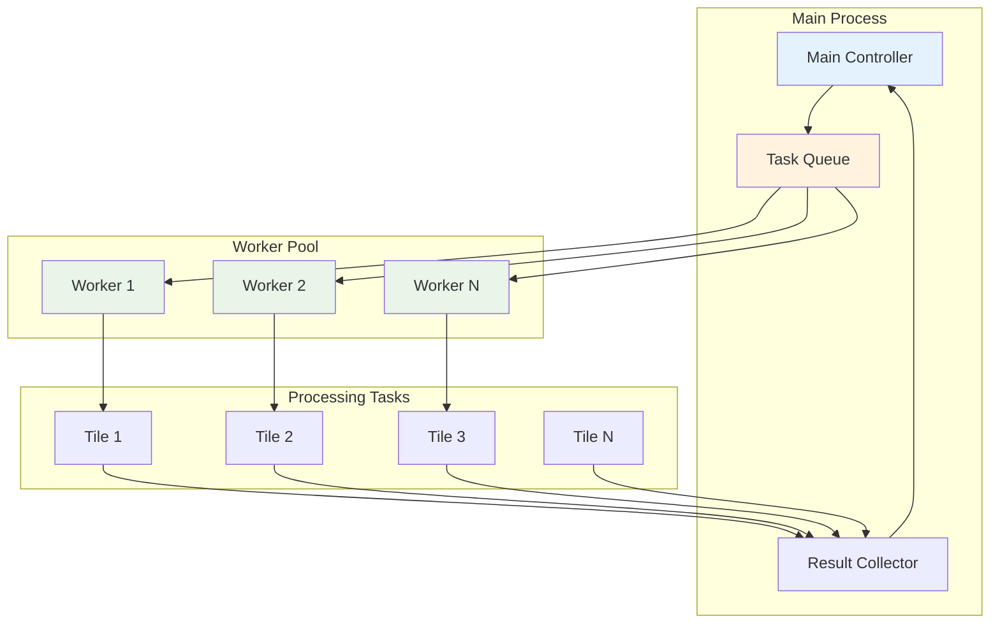
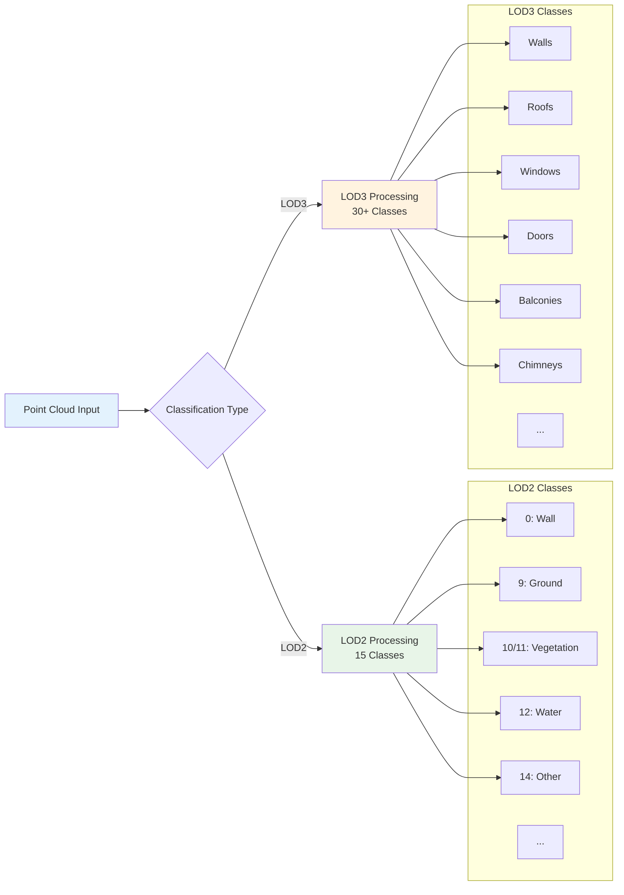
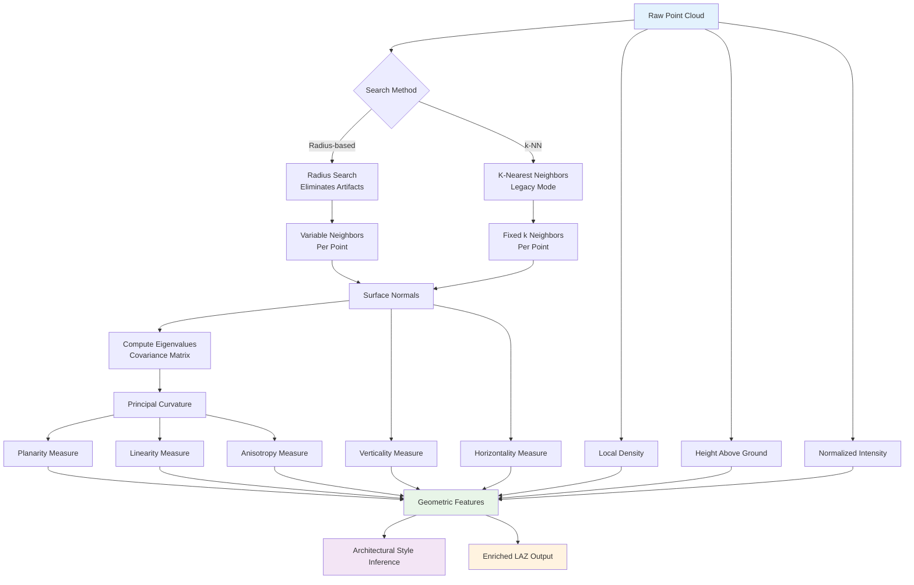
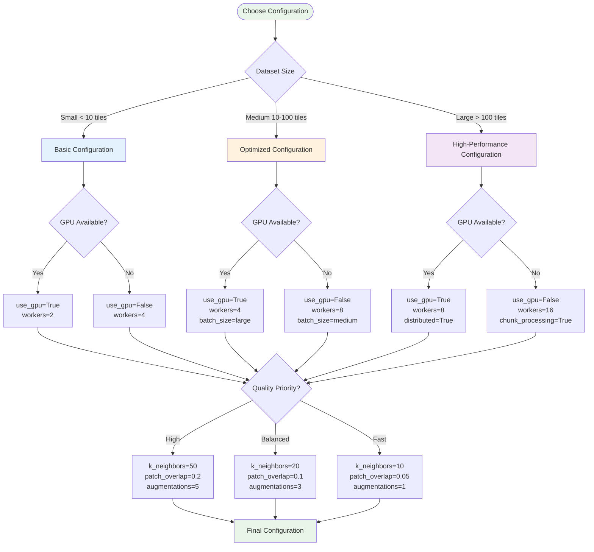

# Workflow Guide

This guide demonstrates common processing workflows with visual representations to help you understand the data flow and decision points.

:::tip Navigation

- [Basic Workflow](#-basic-workflow) - Standard processing pipeline
- [GPU-Accelerated Workflow](#-gpu-accelerated-workflow) - High-performance GPU processing
- [Smart Skip Workflow](#-smart-skip-workflow) - Resume interrupted jobs
- [Parallel Processing](#-parallel-processing-workflow) - Multi-worker processing
- [Best Practices](#-best-practice-workflows) - Optimized workflows for different scenarios
  :::

## 🚀 Basic Workflow

The most common workflow for processing LiDAR data into ML-ready datasets.

:::tip Diagram Reference
For the complete basic workflow diagram, see [Workflow Diagrams - Basic Processing Pipeline](reference/workflow-diagrams.md#basic-processing-pipeline).
:::

The workflow includes the following key stages:

1. **Data Availability Check**: Verify if LiDAR tiles are already downloaded
2. **Download**: Acquire tiles from IGN servers if needed
3. **Validation**: Ensure downloaded files are valid
4. **Enrichment**: Add geometric features and building component classification
5. **RGB Augmentation**: Optionally add color information from orthophotos
6. **Processing**: Create training patches for machine learning
   RGB -->|No| SkipRGB[LiDAR Only]

   FetchRGB --> Features[Enriched LAZ Ready]
   SkipRGB --> Features

   Features --> Process[Create Training Patches]
   Process --> Output[ML Dataset Ready]
   Output --> End([Process Complete])

   Error1 --> End

   style Start fill:#e8f5e8
   style End fill:#e8f5e8
   style Download fill:#e3f2fd
   style Analyze fill:#c8e6c9
   style CleanData fill:#fff9c4
   style Enrich fill:#fff3e0
   style Process fill:#f3e5f5
   style Output fill:#e8f5e8

````

## ⚡ GPU-Accelerated Workflow

Workflow for processing large datasets with GPU acceleration (v1.3.0+).

```mermaid
flowchart TD
    Start([Start GPU Processing]) --> CheckGPU{GPU Available?}

    CheckGPU -->|Yes| GPUSetup[Initialize GPU<br/>CuPy + CUDA]
    CheckGPU -->|No| Fallback[⚠️ Fallback to CPU]

    GPUSetup --> LoadData[Load Point Cloud]
    Fallback --> LoadData

    LoadData --> TransferGPU[Transfer to GPU Memory]
    TransferGPU --> FeatureGPU[🚀 GPU Feature Computation<br/>5-10x faster]

    FeatureGPU --> RGBCheck{Include RGB?}
    RGBCheck -->|Yes v1.5.0+| RGBFetch[Fetch Orthophoto]
    RGBCheck -->|No| FeaturesDone[Features Complete]

    RGBFetch --> RGBCache{In GPU Cache?}
    RGBCache -->|Yes| RGBInterpolate[⚡ GPU Color Interpolation<br/>24x faster]
    RGBCache -->|No| RGBLoad[Load to GPU Cache]
    RGBLoad --> RGBInterpolate

    RGBInterpolate --> Combine[Combine Features + RGB]
    FeaturesDone --> Combine

    Combine --> TransferCPU[Transfer to CPU]
    TransferCPU --> SaveOutput[Save Enriched LAZ]

    SaveOutput --> MoreData{More Data?}
    MoreData -->|Yes| LoadData
    MoreData -->|No| End([Processing Complete])

    style Start fill:#e8f5e8
    style End fill:#e8f5e8
    style GPUSetup fill:#e3f2fd
    style FeatureGPU fill:#c8e6c9
    style RGBInterpolate fill:#c8e6c9
    style Fallback fill:#fff3e0
````

### GPU Performance Benefits

| Operation          | CPU Time | GPU Time | Speedup  |
| ------------------ | -------- | -------- | -------- |
| Feature Extraction | 45s      | 6s       | 8x       |
| RGB Interpolation  | 12s      | 0.5s     | 24x      |
| Normal Computation | 30s      | 5s       | 6x       |
| **Total (1M pts)** | ~87s     | ~11.5s   | **7.5x** |

:::tip GPU Optimization Tips

- **Cache RGB tiles** - Reuse orthophotos across patches
- **Batch processing** - Process multiple tiles in sequence
- **Monitor GPU memory** - Use `nvidia-smi` to check utilization
- **Use workers=1 with GPU** - GPU parallelizes internally

See [GPU Overview](gpu/overview.md) for detailed setup instructions.
:::

## 🔄 Smart Skip Workflow

Understanding how the smart skip system optimizes repeated runs.

```mermaid
sequenceDiagram
    participant User
    participant CLI
    participant SkipChecker as Smart Skip
    participant FileSystem as File System
    participant Processor

    User->>CLI: ign-lidar-hd enrich
    CLI->>SkipChecker: Check existing files
    SkipChecker->>FileSystem: List output directory
    FileSystem-->>SkipChecker: File list

    loop For each input file
        SkipChecker->>SkipChecker: Check if output exists
        SkipChecker->>SkipChecker: Validate file integrity
        alt File exists and valid
            SkipChecker-->>CLI: Skip this file
        else File missing or invalid
            SkipChecker->>Processor: Process this file
            Processor-->>SkipChecker: File processed
        end
    end

    CLI-->>User: Processing complete

    Note over SkipChecker: Smart skip saves time<br/>on large datasets
```

## 🏗️ Parallel Processing Workflow

How the library handles multi-worker processing for optimal performance.



## 🎯 LOD Classification Workflow

Understanding how building components are classified into LOD levels.

:::tip Classification Schema
LOD2/LOD3 use a **building-focused classification** where buildings are Class 0 (`wall`), ground is Class 9, etc. This differs from ASPRS standards. See [Classification Taxonomy](./reference/classification-taxonomy.md) for details.
:::



## 🎯 Enhanced Enrich Pipeline

Detailed view of the complete enrich workflow with auto-params and preprocessing.

:::info Feature Availability
Auto-params and advanced preprocessing features have been available since v1.7.1 and continue to work in v2.0+.
:::



```mermaid
flowchart TD
    Start[Load LAZ Tile] --> AutoCheck{Auto-Params<br/>Enabled?}

    AutoCheck -->|Yes| Sample[Sample 50K Points]
    AutoCheck -->|No| ManualParams[Use Manual Parameters]

    Sample --> CalcDensity[Calculate:<br/>• Point Density<br/>• NN Distance<br/>• Noise Level]
    CalcDensity --> Optimize[Determine Optimal:<br/>• Radius: 0.5-3.0m<br/>• SOR k: 8-15<br/>• SOR std: 1.5-2.5<br/>• ROR radius: 1.0-2.0m<br/>• ROR neighbors: 2-6]

    Optimize --> Report[📊 Display Analysis Report]
    ManualParams --> Report
    Report --> PreCheck{Preprocessing<br/>Enabled?}

    PreCheck -->|Yes| SOR[Statistical Outlier Removal<br/>Filter noise points]
    PreCheck -->|No| SkipPre[Skip to Features]

    SOR --> ROR[Radius Outlier Removal<br/>Remove scan artifacts]
    ROR --> VoxelCheck{Voxel<br/>Downsampling?}

    VoxelCheck -->|Yes| Voxel[Homogenize Point Density]
    VoxelCheck -->|No| CleanData[Clean Point Cloud]
    Voxel --> CleanData
    SkipPre --> Features

    CleanData --> Features[🔧 Feature Computation]
    Features --> SearchMode{Search Mode}

    SearchMode -->|Radius-based<br/>v1.6.5| RadiusSearch[Radius Search<br/>Artifact-free]
    SearchMode -->|k-NN<br/>legacy| KNNSearch[k-Nearest Neighbors]

    RadiusSearch --> BuildKDTree[Build KD-Tree]
    KNNSearch --> BuildKDTree

    BuildKDTree --> CoreFeatures[Compute Core Features:<br/>• Normals<br/>• Curvature<br/>• Planarity<br/>• Verticality]

    CoreFeatures --> ModeCheck{Feature Mode}
    ModeCheck -->|Core| SaveCore[Core Features Only]
    ModeCheck -->|Building| BuildFeatures[Building Features:<br/>• Wall probability<br/>• Roof probability<br/>• Edge detection<br/>• Corner detection]

    BuildFeatures --> RGBCheck{Add RGB?}
    SaveCore --> RGBCheck

    RGBCheck -->|Yes| FetchOrtho[Fetch IGN Orthophoto]
    RGBCheck -->|No| SaveLAZ[Save Enriched LAZ]

    FetchOrtho --> InterpolateRGB[Interpolate RGB Colors]
    InterpolateRGB --> SaveLAZ

    SaveLAZ --> End[✅ Enriched Tile Complete]

    style Start fill:#e3f2fd
    style Sample fill:#c8e6c9
    style Optimize fill:#c8e6c9
    style Report fill:#fff9c4
    style SOR fill:#fff9c4
    style ROR fill:#fff9c4
    style Features fill:#fff3e0
    style RadiusSearch fill:#c8e6c9
    style SaveLAZ fill:#e8f5e8
    style End fill:#e8f5e8
```

## 📊 Feature Extraction Pipeline

Detailed view of the geometric feature computation process.



## 🔧 Configuration Decision Tree

How to choose optimal settings for your use case.



## 💡 Best Practice Workflows

### Urban Area Processing

```bash
# Optimized for dense urban environments
ign-lidar-hd download --bbox 2.0,48.8,2.1,48.9 --output urban_tiles/
ign-lidar-hd enrich --input-dir urban_tiles/ --output urban_enriched/ --use-gpu --k-neighbors 30
ign-lidar-hd process --input-dir urban_enriched/ --output urban_patches/ --lod-level LOD3
```

### Rural/Natural Area Processing

```bash
# Optimized for sparse rural environments
ign-lidar-hd download --bbox -1.0,46.0,0.0,47.0 --output rural_tiles/
ign-lidar-hd enrich --input-dir rural_tiles/ --output rural_enriched/ --k-neighbors 15
ign-lidar-hd process --input-dir rural_enriched/ --output rural_patches/ --lod-level LOD2
```

### High-Performance Batch Processing

```bash
# Maximum throughput for large datasets
ign-lidar-hd enrich --input-dir tiles/ --output enriched/ --use-gpu --num-workers 8 --batch-size large
ign-lidar-hd process --input-dir enriched/ --output patches/ --num-workers 16 --skip-existing
```

### GPU-Accelerated with RGB (v1.5.0+)

```bash
# Fastest processing with GPU RGB augmentation
ign-lidar-hd enrich \
  --input-dir tiles/ \
  --output enriched/ \
  --use-gpu \
  --add-rgb \
  --rgb-cache-dir /data/rgb_cache/ \
  --num-workers 4

# Create patches with cached RGB
ign-lidar-hd process \
  --input-dir enriched/ \
  --output patches/ \
  --lod-level LOD3 \
  --num-workers 8
```

---

## 📚 Related Documentation

- **[GPU Acceleration Guide](gpu/overview.md)** - Detailed GPU setup and optimization
- **[RGB GPU Guide](gpu/rgb-augmentation.md)** - GPU-accelerated RGB augmentation (v1.5.0+)
- **[Architecture](architecture.md)** - System architecture and components
- **[CLI Commands](guides/cli-commands.md)** - Complete CLI reference
- **[Smart Skip](features/smart-skip.md)** - Smart skip system details
- **[LOD Classification](features/lod3-classification.md)** - LOD2/LOD3 classification

---

## 💡 Tips for Workflow Selection

### Choose Basic Workflow when:

- ✅ Learning the library
- ✅ Processing < 10 tiles
- ✅ No GPU available
- ✅ Prototyping and testing

### Choose GPU Workflow when:

- ✅ Processing > 50 tiles
- ✅ NVIDIA GPU available
- ✅ Production pipelines
- ✅ Time-sensitive projects

### Choose Smart Skip when:

- ✅ Resuming interrupted jobs
- ✅ Iterative processing
- ✅ Large datasets with failures
- ✅ Incremental updates

### Parallel Processing for:

- ✅ Multi-core systems
- ✅ Batch processing
- ✅ Production environments
- ✅ Maximizing throughput
