# Performance Benchmarking Guide

**Version:** 3.8.1-dev  
**Date:** November 23, 2025  
**Purpose:** Automated performance monitoring and regression detection

---

## Overview

This guide explains the automated performance benchmarking system implemented to monitor code performance and detect regressions automatically in CI/CD pipelines.

### Key Features

- ✅ **Automated Benchmarking:** Runs on every PR and push to main
- ✅ **Regression Detection:** Compares against baseline, fails CI if regression >5%
- ✅ **Multiple Modes:** Quick (PR checks) and full (main branch)
- ✅ **Comprehensive Metrics:** CPU, GPU, memory, transfer overhead
- ✅ **PR Comments:** Automatic feedback on performance impact

---

## Quick Start

### Run Benchmarks Locally

```bash
# Quick benchmarks (3 iterations, 1M points)
python scripts/benchmark_performance.py --quick

# Full benchmarks (10 iterations, 1M/5M/10M points)
python scripts/benchmark_performance.py

# Save results as new baseline
python scripts/benchmark_performance.py --save baseline_v3.8.1.json

# Check for regressions
python scripts/benchmark_performance.py \
    --baseline baseline_v3.8.0.json \
    --threshold 0.05

# CI mode (exit 1 on regression)
python scripts/benchmark_performance.py \
    --ci \
    --baseline baseline_v3.8.0.json
```

### Interpret Results

```
📊 BENCHMARK SUMMARY
  cpu_features_1M: 12.450 seconds
  gpu_features_1M: 1.850 seconds
  gpu_transfer_overhead_5M: 0.280 seconds
  gpu_memory_peak_5M: 2.350 GB
```

- **Lower is better** for time and memory metrics
- **Speedup** = CPU time / GPU time (higher is better)
- **Throughput** = points/second (higher is better)

---

## Architecture

### Benchmark Suite Components

```
scripts/
├── benchmark_performance.py      # Main benchmark suite (CI/CD)
├── benchmark_phase3.py           # Phase 3 specific benchmarks
├── benchmark_gpu_fusion.py       # Kernel fusion benchmarks
└── benchmark_cuda_streams.py     # CUDA streams benchmarks

baseline_v3.8.0.json              # Reference baseline

.github/workflows/
└── performance_benchmarks.yml    # GitHub Actions config
```

### Benchmark Flow

```mermaid
graph TD
    A[PR Created] --> B[GitHub Actions Triggered]
    B --> C[Run Quick Benchmarks]
    C --> D[Compare vs Baseline]
    D --> E{Regression?}
    E -->|No| F[✅ Comment on PR]
    E -->|Yes| G[❌ Comment + Fail CI]

    H[Push to Main] --> I[Run Full Benchmarks]
    I --> J[Save Results]
    J --> K[Generate Report]
```



---

## Benchmarked Metrics

### 1. Feature Computation Speed

**Metrics:**

- `cpu_features_1M`: 1M points on CPU
- `cpu_features_5M`: 5M points on CPU
- `cpu_features_10M`: 10M points on CPU
- `gpu_features_1M`: 1M points on GPU
- `gpu_features_5M`: 5M points on GPU
- `gpu_features_10M`: 10M points on GPU

**What it measures:**

- End-to-end feature computation time
- Includes KNN, normals, eigenvalues, geometric features
- Uses LOD2 feature mode (12 features)

**Typical values (v3.8.0):**

- 1M points: ~12s CPU, ~1.8s GPU (6.7x speedup)
- 5M points: ~68s CPU, ~6.7s GPU (10x speedup)
- 10M points: ~142s CPU, ~14s GPU (10x speedup)

### 2. Ground Truth Processing

**Metrics:**

- `ground_truth_gpu_1M`: 1M points with GPU

**What it measures:**

- Point-in-polygon classification on GPU
- Includes transfer overhead
- Uses chunked processing

**Typical values:**

- ~0.45s for 1M points

### 3. GPU Transfer Overhead

**Metrics:**

- `gpu_transfer_overhead_5M`: Upload + download for 5M points

**What it measures:**

- CPU → GPU transfer time
- GPU → CPU transfer time
- Combined overhead

**Typical values:**

- Upload: ~140ms
- Download: ~140ms
- Total: ~280ms

### 4. GPU Memory Usage

**Metrics:**

- `gpu_memory_peak_5M`: Peak VRAM for 5M points

**What it measures:**

- Maximum GPU memory allocation
- Includes intermediate arrays
- Accounts for all features

**Typical values:**

- ~2.35GB for 5M points (LOD2)
- ~3.8GB for 5M points (LOD3)

---

## CI/CD Integration

### GitHub Actions Workflow

The benchmark suite runs automatically on:

1. **Pull Requests:**

   - Quick mode (3 iterations, 1M points)
   - Compares vs `baseline_v3.8.0.json`
   - Posts comment with results
   - **Fails CI if regression >5%**

2. **Pushes to Main:**

   - Full mode (10 iterations, 1M/5M/10M points)
   - Saves results as artifacts (90 days retention)
   - Generates performance report

3. **Manual Trigger:**
   - Choose quick or full mode
   - Run on-demand from Actions tab

### Regression Thresholds

| Severity                | Threshold    | Action                        |
| ----------------------- | ------------ | ----------------------------- |
| 🟢 **No regression**    | <5% slower   | CI passes, PR approved        |
| 🟡 **Minor regression** | 5-10% slower | CI fails, review required     |
| 🔴 **Major regression** | >10% slower  | CI fails, optimization needed |

### Example PR Comment

✅ **Performance Check Passed**

No performance regressions detected in this PR.

```
🔍 CHECKING FOR REGRESSIONS
Threshold: 5.0%
  ✅ OK cpu_features_1M: 12.450 → 12.380 (-0.6%)
  ✅ OK gpu_features_1M: 1.850 → 1.820 (-1.6%)
  ✅ OK gpu_memory_peak_5M: 2.350 → 2.340 (-0.4%)
```

---

## Updating Baselines

### When to Update

Update baselines when:

- ✅ Intentional performance optimization (speedup)
- ✅ Major version release with breaking changes
- ✅ Hardware upgrade (different GPU/CPU)
- ❌ NOT for regressions (fix code instead)

### How to Update

```bash
# 1. Run full benchmarks
python scripts/benchmark_performance.py --save baseline_v3.9.0.json

# 2. Review results
cat baseline_v3.9.0.json

# 3. Compare with previous baseline
python scripts/benchmark_performance.py \
    --baseline baseline_v3.8.0.json \
    --threshold 0.0  # Check all changes

# 4. If results are good, commit new baseline
git add baseline_v3.9.0.json
git commit -m "chore: Update performance baseline for v3.9.0"
git push

# 5. Update GitHub Actions to use new baseline
# Edit .github/workflows/performance_benchmarks.yml:
# Change: --baseline baseline_v3.8.0.json
#     to: --baseline baseline_v3.9.0.json
```

### Baseline Versioning

- **Format:** `baseline_v{major}.{minor}.{patch}.json`
- **Example:** `baseline_v3.8.0.json`
- **Location:** Repository root
- **Retention:** Keep last 3 versions

---

## Advanced Usage

### Custom Benchmark Suites

Create custom benchmarks for specific scenarios:

```python
# custom_benchmark.py
from scripts.benchmark_performance import PerformanceBenchmarkSuite

# Custom configuration
suite = PerformanceBenchmarkSuite(quick_mode=False)
suite.iterations = 20  # More iterations
suite.dataset_sizes = [500_000, 2_000_000]  # Custom sizes

# Run specific benchmarks
result = suite.benchmark_features_cpu(2_000_000)
print(f"CPU: {result.value:.3f}s")

result = suite.benchmark_features_gpu(2_000_000)
print(f"GPU: {result.value:.3f}s")
```

### Profiling Integration

Combine with profiling for detailed analysis:

```bash
# 1. Run benchmark with profiling
python -m cProfile -o profile.stats scripts/benchmark_performance.py --quick

# 2. Analyze profile
python -m pstats profile.stats
>>> sort cumtime
>>> stats 20

# 3. Visualize with snakeviz
pip install snakeviz
snakeviz profile.stats
```

### GPU Profiling

Use NVIDIA tools for GPU-specific profiling:

```bash
# NVIDIA Nsight Systems
nsys profile \
    --stats=true \
    --output=benchmark_profile \
    python scripts/benchmark_performance.py --quick

# NVIDIA Nsight Compute (kernel-level)
ncu \
    --set full \
    --export benchmark_kernels \
    python scripts/benchmark_performance.py --quick
```

---

## Troubleshooting

### Benchmark Failures

**Problem:** Benchmark times out

```
Solution:
- Use --quick mode for faster results
- Reduce dataset sizes
- Check for infinite loops or deadlocks
```

**Problem:** High variance in results

```
Solution:
- Close other applications (GPU/CPU load)
- Increase warmup iterations
- Run on dedicated hardware
- Check GPU thermal throttling: nvidia-smi -q -d TEMPERATURE
```

**Problem:** GPU OOM errors

```
Solution:
- Use smaller dataset sizes
- Enable chunked processing
- Check available GPU memory: nvidia-smi
```

### Regression Detection

**Problem:** False positive regressions

```
Solution:
- Increase threshold: --threshold 0.10 (10%)
- Ensure consistent hardware
- Check for background processes
- Verify baseline is from same hardware
```

**Problem:** Regression not detected

```
Solution:
- Decrease threshold: --threshold 0.01 (1%)
- Run more iterations for statistical significance
- Compare with previous runs manually
```

### CI/CD Issues

**Problem:** GitHub Actions fails to install dependencies

```
Solution:
- Check requirements.txt is up-to-date
- Verify Python version compatibility
- Use pip cache for faster installs
```

**Problem:** Artifacts not uploaded

```
Solution:
- Check retention-days setting
- Verify workflow permissions
- Ensure file path is correct
```

---

## Performance Targets

### Phase 3 (v3.8.0) Targets

| Metric                | Target          | Achieved | Status          |
| --------------------- | --------------- | -------- | --------------- |
| GPU speedup (1M pts)  | 6x              | 6.7x     | ✅ **EXCEEDED** |
| GPU speedup (10M pts) | 8x              | 10x      | ✅ **EXCEEDED** |
| Memory overhead       | <3GB (5M pts)   | 2.35GB   | ✅ **EXCEEDED** |
| Transfer overhead     | <500ms (5M pts) | 280ms    | ✅ **EXCEEDED** |
| GPU utilization       | >80%            | 85%      | ✅ **MET**      |

### Future Targets (v3.9.0+)

- 🎯 15x GPU speedup for 10M points
- 🎯 <200ms transfer overhead
- 🎯 <2GB memory for 5M points (LOD2)
- 🎯 >90% GPU utilization

---

## Benchmark History

### v3.8.0 (Phase 3) - Current

**Optimizations:**

- Kernel fusion (Phase 2): 35% speedup
- CUDA streams (Phase 3): 10-20% speedup
- Adaptive chunking: Memory safety
- GPU memory checks: 100% OOM prevention

**Results:**

- 1M points: 1.85s GPU (6.7x speedup)
- 5M points: 6.72s GPU (10x speedup)
- 10M points: 14.1s GPU (10x speedup)
- Memory: 2.35GB for 5M points

### v3.7.0 (Phase 2)

**Optimizations:**

- Kernel fusion: Combined normals + eigenvalues
- GPU-Core bridge: Unified GPU operations

**Results:**

- 1M points: 2.15s GPU (5.8x speedup)
- 5M points: 8.50s GPU (8x speedup)

### v3.6.0 (Phase 1)

**Optimizations:**

- GPU unification: GPUManager singleton
- Improved error messages

**Results:**

- 1M points: 2.80s GPU (4.4x speedup)
- 5M points: 12.5s GPU (5.5x speedup)

---

## Best Practices

### Development Workflow

1. **Before making changes:**

   ```bash
   # Run baseline benchmark
   python scripts/benchmark_performance.py --quick --save before.json
   ```

2. **Make your changes**

3. **After changes:**

   ```bash
   # Run new benchmark
   python scripts/benchmark_performance.py --quick --save after.json

   # Compare
   python scripts/benchmark_performance.py --baseline before.json
   ```

4. **If regression detected:**
   - Profile the code to find bottleneck
   - Optimize hot paths
   - Re-run benchmarks
   - Document performance trade-offs

### Code Review

When reviewing PRs:

✅ **Check:**

- Performance impact in CI comments
- Regression justification if any
- New features benchmarked
- Baseline update if needed

❌ **Reject if:**

- Major regression (>10%) without justification
- Missing benchmark for performance-critical code
- Baseline updated without approval

---

## Metrics Glossary

### Time Metrics

- **Mean time:** Average over all iterations
- **Median time:** Middle value (robust to outliers)
- **Std time:** Standard deviation (variance)
- **Min/Max time:** Best/worst iteration

### Throughput Metrics

- **Points/sec:** Processing rate
- **M pts/s:** Millions of points per second
- **Speedup:** Ratio of CPU time / GPU time

### Memory Metrics

- **VRAM used:** GPU memory allocated
- **Peak memory:** Maximum allocation
- **Memory pressure:** Used / Total ratio

---

## Related Documentation

- **GPU Architecture:** `docs/architecture/gpu-optimizations.md`
- **Profiling Guide:** `docs/guides/verbose-mode-profiling.md`
- **Phase 3 Summary:** `PHASE3_COMPLETE_SUMMARY.md`
- **Priority Actions:** `PRIORITY_ACTIONS.md`

---

## Support

For questions or issues:

1. Check this guide and related docs
2. Review benchmark logs: `benchmark_results_*.json`
3. Profile code: `python -m cProfile script.py`
4. Open issue: https://github.com/sducournau/IGN_LIDAR_HD_DATASET/issues

---

**Document Version:** 1.0.0  
**Last Updated:** November 23, 2025  
**Maintainer:** IGN LiDAR HD Development Team
