---
# 🇫🇷 Traduisez les champs title et description ci-dessous
sidebar_position: 5
---

# Mermaid Diagrams Reference

This page demonstrates the various Mermaid diagrams used throughout the IGN LiDAR HD documentation to visualize workflows, architectures, and processes.

## 🔄 Workflow Diagrams

### Basic Traitementing Flow

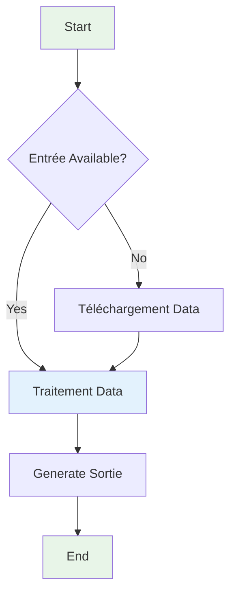

### Complex Pipeline

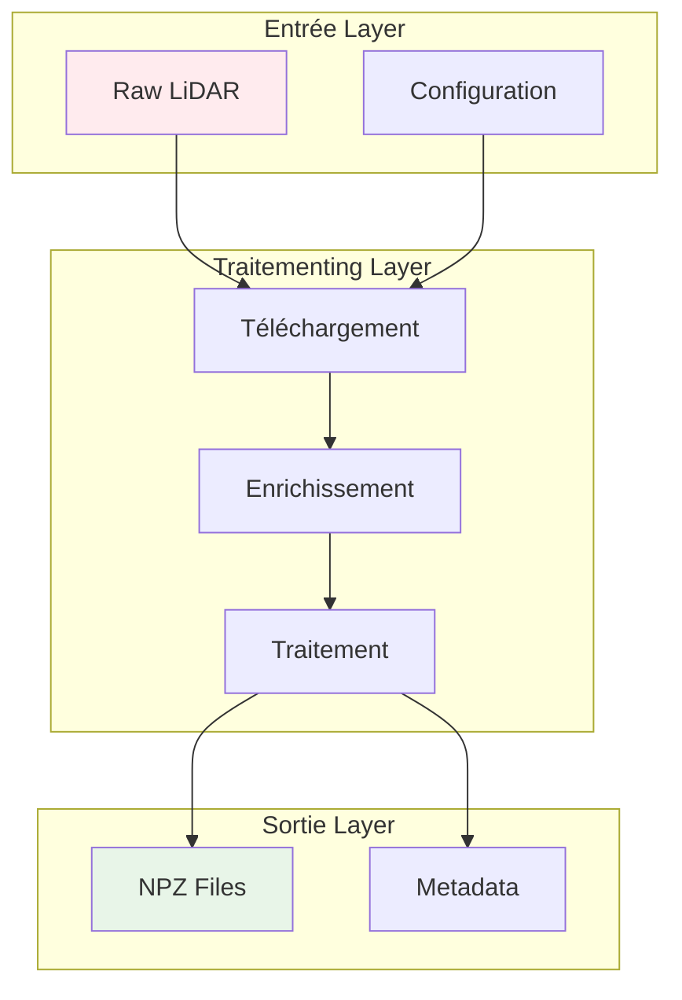

## 📊 Performance Charts

### Traitementing Speed Comparison

```mermaid
xychart-beta
    title "Traitementing Performance by Hardware"
    x-axis [CPU-4core, CPU-8core, CPU-16core, GPU-RTX3080, GPU-RTX4090]
    y-axis "Tiles per Hour" 0 --> 100
    bar "Small Tiles" [8, 15, 25, 60, 85]
    bar "Large Tiles" [3, 6, 10, 25, 40]
```

### Memory Usage Over Time

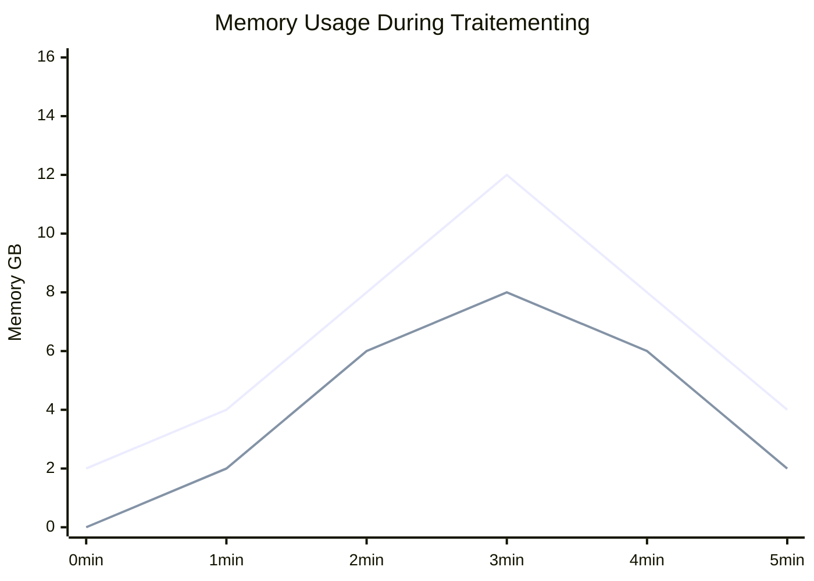

## 🔀 Sequence Diagrams

### CLI Command Flow

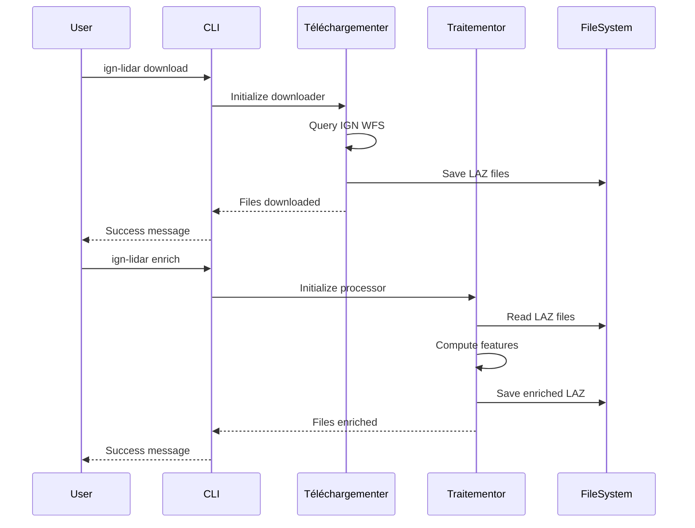

### Error Handling Flow

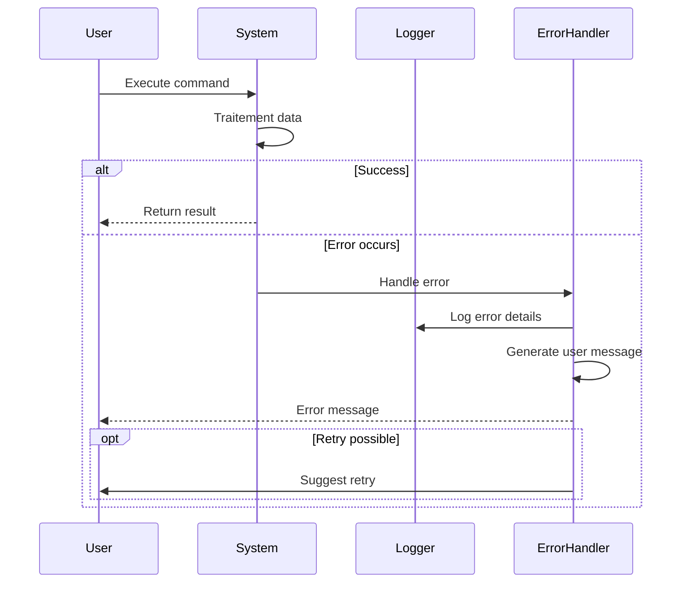

## 📈 Gantt Charts

### Project Timeline

```mermaid
gantt
    title IGN LiDAR Traitementing Timeline
    dateFormat X
    axisFormat %s

    section Téléchargement
    Tile Discovery   :0, 30
    File Téléchargement    :20, 120
    Validation      :100, 140

    section Enrichissementment
    Feature Setup   :120, 150
    GPU Traitementing  :140, 300
    LAZ Generation  :280, 320

    section ML Preparation
    Patch Extract   :300, 400
    Augmentation    :380, 420
    Dataset Ready   :420, 450
```

### Resource Utilization

```mermaid
gantt
    title System Resource Usage
    dateFormat X
    axisFormat %s

    section CPU Usage
    Preprocessing :0, 60
    Feature Calc  :40, 200
    Postprocess   :180, 240

    section GPU Usage
    Memory Alloc  :60, 80
    Computation   :80, 180
    Memory Free   :180, 200

    section Disk I/O
    Read Entrée    :0, 40
    Write Temp    :40, 160
    Write Sortie  :160, 240
```

## 🌐 State Diagrams

### Traitementing States

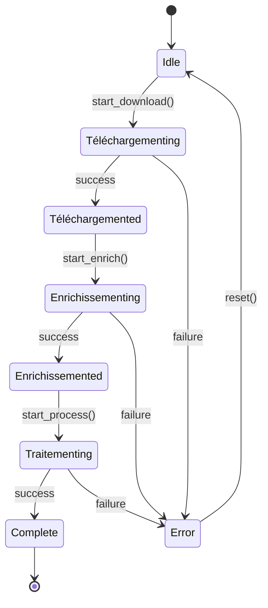

### Configuration States

```mermaid
stateDiagram-v2
    [*] --> Default
    Default --> CPU_Mode : set_cpu()
    Default --> GPU_Mode : set_gpu()
    CPU_Mode --> Multi_Worker : add_workers()
    GPU_Mode --> GPU_Optimized : optimize()
    Multi_Worker --> Traitementing
    GPU_Optimized --> Traitementing
    Traitementing --> [*] : complete
```

## 🔧 Entity Relationship Diagrams

### Data Model

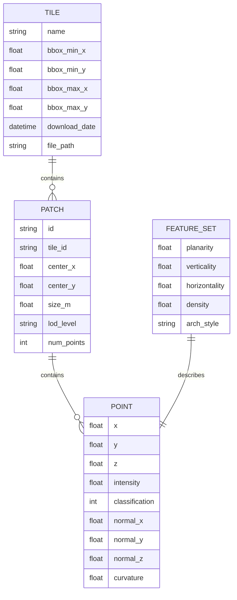

## 💡 Usage Tips

### Diagram Selection Guide

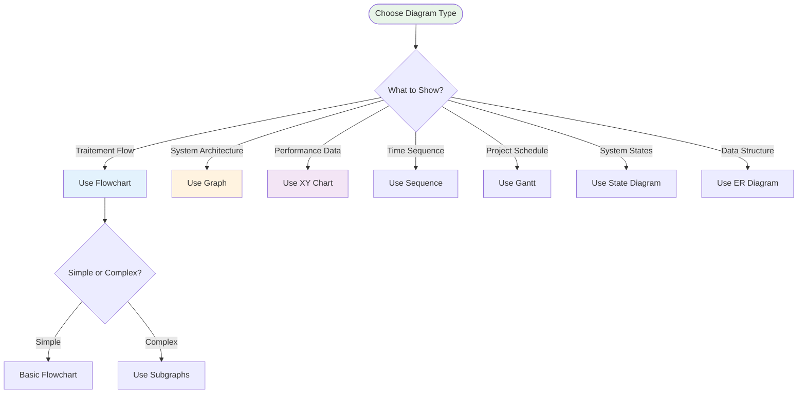

### Color Scheme Guidelines

- 🟢 **Success/Completion**: `fill:#e8f5e8`
- 🔵 **Traitementing/Active**: `fill:#e3f2fd`
- 🟡 **Warning/Attention**: `fill:#fff3e0`
- 🟣 **Configuration**: `fill:#f3e5f5`
- 🔴 **Error/Problem**: `fill:#ffebee`

### Best Practices

1. **Keep diagrams focused** - One concept per diagram
2. **Use consistent styling** - Same colors for similar elements
3. **Add meaningful labels** - Clear, descriptive text
4. **Optimize for readability** - Not too cluttered
5. **Update regularly** - Keep diagrams current with code changes

