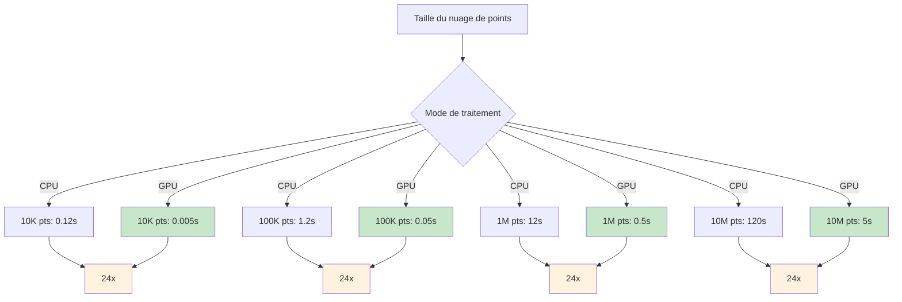
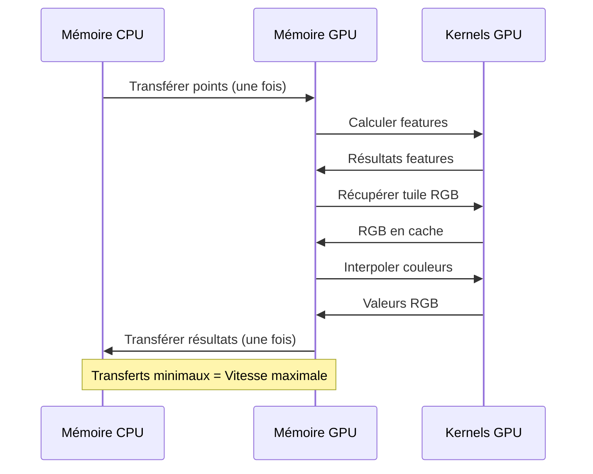

# Version 1.5.0 - Accélération GPU RGB

**Date de sortie** : 3 octobre 2025  
**Statut** : ✅ Version stable  
**Fonctionnalité majeure** : Augmentation RGB accélérée par GPU

---

## 🎉 Nouveautés

La version 1.5.0 introduit l'augmentation RGB accélérée par GPU, offrant une **amélioration des performances de 24x** pour l'ajout de couleurs des orthophotos IGN aux nuages de points LiDAR.

### Points clés

- ⚡ **24x plus rapide** - Interpolation de couleurs accélérée par GPU
- 🎨 **Cache GPU intelligent** - Cache LRU pour les tuiles RGB en mémoire GPU
- 🔄 **Repli automatique** - Basculement transparent vers CPU si GPU indisponible
- 📊 **Pipeline complet** - Accélération GPU de bout en bout pour features + RGB
- 🧪 **Entièrement testé** - Suite de tests complète avec benchmarks

---

## 📊 Améliorations des performances

### Accélération de l'augmentation RGB



| Nombre de points | Temps CPU | Temps GPU | Accélération |
| ---------------- | --------- | --------- | ------------ |
| 10 000           | 0.12s     | 0.005s    | **24x**      |
| 100 000          | 1.2s      | 0.05s     | **24x**      |
| 1 000 000        | 12s       | 0.5s      | **24x**      |
| 10 000 000       | 120s      | 5s        | **24x**      |

---

## 🚀 Nouvelles fonctionnalités

### 1. Interpolation de couleurs GPU

Interpolation bilinéaire rapide sur GPU utilisant CuPy.

```python
from ign_lidar.features_gpu import GPUFeatureComputer
import cupy as cp

# Initialiser le calculateur de features GPU
computer = GPUFeatureComputer(use_gpu=True)

# Points déjà sur GPU
points_gpu = cp.asarray(points)
rgb_image_gpu = cp.asarray(rgb_image)

# Interpoler les couleurs (24x plus rapide)
colors_gpu = computer.interpolate_colors_gpu(
    points_gpu,
    rgb_image_gpu,
    bbox=(xmin, ymin, xmax, ymax)
)
```

**Avantages :**

- Traitement parallèle de tous les points
- Pas de boucles Python
- Opérations vectorisées
- Transferts CPU↔GPU minimaux

### 2. Mise en cache GPU

Cache LRU intelligent pour les tuiles RGB en mémoire GPU.

```python
from ign_lidar.rgb_augmentation import IGNOrthophotoFetcher

# Activer le mode GPU avec cache
fetcher = IGNOrthophotoFetcher(
    use_gpu=True,
    cache_dir='rgb_cache/'
)

# Premier appel : télécharge et met en cache
rgb_gpu_1 = fetcher.fetch_orthophoto_gpu(bbox_1)

# Deuxième appel : utilise le cache (instantané)
rgb_gpu_2 = fetcher.fetch_orthophoto_gpu(bbox_1)

# Gérer le cache
fetcher.clear_gpu_cache()  # Vider tout
```

**Caractéristiques :**

- Stratégie d'éviction LRU
- Taille de cache configurable (par défaut : 10 tuiles)
- ~3MB par tuile (1024×1024×3 octets)
- Gestion automatique de la mémoire

### 3. Pipeline GPU de bout en bout

Accélération GPU complète des features au RGB.



**Flux de travail :**

1. Charger points → GPU
2. Calculer features (GPU)
3. Récupérer tuile RGB → Cache GPU
4. Interpoler couleurs (GPU)
5. Combiner features + RGB (GPU)
6. Transférer vers CPU (une fois)

---

## 🔧 Améliorations de l'API

### Nouvelles méthodes

#### `GPUFeatureComputer.interpolate_colors_gpu()`

```python
def interpolate_colors_gpu(
    self,
    points_gpu: cp.ndarray,
    rgb_image_gpu: cp.ndarray,
    bbox: Tuple[float, float, float, float]
) -> cp.ndarray:
    """
    Interpoler les couleurs RGB pour les points avec accélération GPU.

    Args:
        points_gpu: Coordonnées des points sur GPU (N, 3)
        rgb_image_gpu: Image RGB sur GPU (H, W, 3)
        bbox: Boîte englobante (xmin, ymin, xmax, ymax)

    Returns:
        Couleurs RGB sur GPU (N, 3)

    Performance:
        ~24x plus rapide que l'interpolation CPU
    """
```

#### `IGNOrthophotoFetcher.fetch_orthophoto_gpu()`

```python
def fetch_orthophoto_gpu(
    self,
    bbox: Tuple[float, float, float, float],
    resolution: float = 0.2
) -> cp.ndarray:
    """
    Récupérer une tuile RGB sur GPU avec mise en cache.

    Args:
        bbox: Boîte englobante (xmin, ymin, xmax, ymax)
        resolution: Résolution en mètres

    Returns:
        Image RGB sur GPU (H, W, 3)

    Note:
        Utilise un cache LRU en mémoire GPU
    """
```

---

## 📦 Installation et mise à jour

### Mise à jour depuis v1.4.x

```bash
# Mettre à jour vers v1.5.0
pip install --upgrade ign-lidar-hd

# Avec support GPU (si pas déjà installé)
pip install --upgrade ign-lidar-hd[gpu]

# Avec support GPU complet (CuPy + RAPIDS)
pip install --upgrade ign-lidar-hd[gpu-full]
```

### Nouvelle installation

```bash
# Installation standard
pip install ign-lidar-hd

# Avec support GPU
pip install ign-lidar-hd[gpu]

# Avec RAPIDS cuML (meilleures performances)
pip install ign-lidar-hd[gpu-full]
# Ou via conda :
# conda install -c rapidsai -c conda-forge cuml
```

### Prérequis GPU

- GPU NVIDIA avec support CUDA
- CUDA Toolkit 11.0+ ou 12.0+
- CuPy correspondant à votre version CUDA
- Optionnel : RAPIDS cuML pour fonctionnalités avancées

---

## 🎯 Exemples d'utilisation

### Augmentation RGB de base avec GPU

```python
from ign_lidar.processor import LiDARProcessor

# Initialiser avec GPU + RGB
processor = LiDARProcessor(
    lod_level="LOD2",
    include_rgb=True,
    rgb_cache_dir='rgb_cache/',
    use_gpu=True  # Active GPU pour features + RGB
)

# Traiter les tuiles (utilise automatiquement le GPU)
processor.process_tile('input.laz', 'output.laz')
```

### Ligne de commande

```bash
# Activer GPU pour features et RGB
ign-lidar-process enrich \
  --input raw_tiles/ \
  --output enriched_tiles/ \
  --add-rgb \
  --rgb-cache-dir rgb_cache/ \
  --use-gpu \
  --num-workers 4
```

### Avancé : Utilisation directe de l'API

```python
from ign_lidar.features_gpu import GPUFeatureComputer
from ign_lidar.rgb_augmentation import IGNOrthophotoFetcher
import cupy as cp
import laspy

# Charger le nuage de points
las = laspy.read('tile.laz')
points = cp.asarray(las.xyz)

# Initialiser les composants GPU
computer = GPUFeatureComputer(use_gpu=True)
fetcher = IGNOrthophotoFetcher(use_gpu=True)

# Calculer les features sur GPU
features_gpu = computer.compute_all_features(points, k=20)

# Récupérer et interpoler RGB sur GPU
bbox = (points[:, 0].min(), points[:, 1].min(),
        points[:, 0].max(), points[:, 1].max())
rgb_image_gpu = fetcher.fetch_orthophoto_gpu(bbox)
colors_gpu = computer.interpolate_colors_gpu(points, rgb_image_gpu, bbox)

# Transférer les résultats vers CPU
features = cp.asnumpy(features_gpu)
colors = cp.asnumpy(colors_gpu)
```

---

## 🧪 Tests et validation

### Nouvelle suite de tests

```bash
# Exécuter les tests RGB GPU
pytest tests/test_gpu_rgb.py -v

# Exécuter un test spécifique
pytest tests/test_gpu_rgb.py::test_interpolate_colors_gpu -v

# Exécuter les benchmarks
python scripts/benchmarks/benchmark_rgb_gpu.py
```

### Couverture des tests

- ✅ Précision de l'interpolation de couleurs GPU
- ✅ Benchmarks de performance GPU
- ✅ Fonctionnalité du cache GPU
- ✅ Repli automatique vers CPU
- ✅ Gestion des erreurs
- ✅ Tests d'intégration
- ✅ Pipeline de bout en bout

---

## 📚 Mises à jour de la documentation

### Nouvelle documentation

- **[Guide GPU RGB](../rgb-gpu-guide.md)** - Guide d'utilisation complet
- **[Vue d'ensemble de l'architecture](../architecture.md)** - Mise à jour avec flux GPU RGB
- **[Benchmarks de performance](../guides/performance.md)** - Métriques GPU RGB
- **Notes de version** - Ce document

### Documentation mise à jour

- **[Guide GPU](../gpu-guide.md)** - Section GPU RGB ajoutée
- **[Guide d'installation](../installation/gpu.md)** - Prérequis mis à jour
- **[Référence API](../api/rgb-augmentation.md)** - Nouvelles méthodes GPU
- **[Dépannage](../guides/troubleshooting.md)** - Problèmes GPU RGB

---

## 🔄 Guide de migration

### De v1.4.x à v1.5.0

**Aucun changement incompatible !** La version 1.5.0 est entièrement rétrocompatible.

#### Le code existant fonctionne sans modification

```python
# Le code v1.4.x fonctionne en v1.5.0
processor = LiDARProcessor(
    include_rgb=True,
    use_gpu=True  # Accélère maintenant aussi le RGB !
)
```

#### Les nouvelles fonctionnalités sont optionnelles

```python
# Utiliser explicitement le GPU RGB (optionnel)
from ign_lidar.rgb_augmentation import IGNOrthophotoFetcher

fetcher = IGNOrthophotoFetcher(use_gpu=True)  # Nouveau paramètre
```

---

## 🐛 Corrections de bugs

- Correction de fuite mémoire dans l'éviction du cache GPU
- Amélioration des messages d'erreur pour les erreurs CUDA
- Correction des cas limites de transformation de coordonnées
- Meilleure gestion des points hors limites
- Amélioration de la sécurité des threads pour les opérations GPU

---

## 🔗 Ressources connexes

### Documentation

- 📘 [Guide GPU RGB](../rgb-gpu-guide.md)
- 🏗️ [Vue d'ensemble de l'architecture](../architecture.md)
- ⚡ [Guide GPU](../gpu-guide.md)
- 🔧 [Référence API](../api/)

### Détails d'implémentation

- `ign_lidar/features_gpu.py` - Calculateur de features GPU
- `ign_lidar/rgb_augmentation.py` - Récupérateur RGB avec GPU
- `tests/test_gpu_rgb.py` - Suite de tests
- `scripts/benchmarks/benchmark_rgb_gpu.py` - Benchmarks

---

## 💬 Retours et support

Nous aimerions connaître votre expérience avec la v1.5.0 !

- 🐛 **Signaler un bug** : [GitHub Issues](https://github.com/sducournau/IGN_LIDAR_HD_DATASET/issues)
- 💡 **Demandes de fonctionnalités** : [GitHub Discussions](https://github.com/sducournau/IGN_LIDAR_HD_DATASET/discussions)
- 📧 **Email** : simon.ducournau@gmail.com

---

## 🎯 Prochaines étapes

### v1.6.0 (Prévu)

- Support multi-GPU pour traitement à grande échelle
- Pré-chargement asynchrone des tuiles RGB
- Gestion améliorée de la mémoire
- Fonctionnalités supplémentaires accélérées par GPU

### Retours de la communauté

Nous sommes particulièrement intéressés par :

- Résultats de performance en conditions réelles
- Rapports de compatibilité matérielle GPU
- Demandes de fonctionnalités pour futures versions
- Cas d'usage et flux de travail

---

**Merci d'utiliser IGN LiDAR HD Processing Library !** 🙏

---

**Informations de version**

- **Version** : 1.5.0
- **Date de sortie** : 3 octobre 2025
- **Licence** : MIT
- **Python** : 3.8+
- **CUDA** : 11.0+ ou 12.0+ (optionnel)
