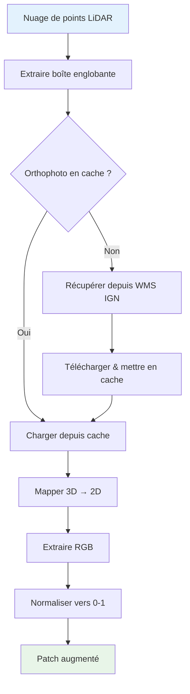

# Augmentation RGB : Apporter la couleur à vos nuages de points

Nous sommes ravis d'annoncer une nouvelle fonctionnalité majeure pour la Bibliothèque de Traitement LiDAR HD de l'IGN : **l'Augmentation RGB depuis les orthophotos IGN** ! 🎨

Cette fonctionnalité enrichit automatiquement vos nuages de points LiDAR avec des couleurs RGB récupérées directement depuis le service haute résolution d'orthophotos de l'IGN, permettant l'apprentissage automatique multi-modal et une visualisation améliorée.

<!-- truncate -->

## Quoi de neuf ?

### 🎨 Augmentation RGB

Vos patches LiDAR peuvent maintenant inclure des informations de couleur RGB automatiquement extraites depuis les orthophotos IGN BD ORTHO® à résolution 20cm :

```bash
# Commande simple pour ajouter les couleurs RGB
ign-lidar-hd patch \
  --input tuiles_enrichies/ \
  --output patches/ \
  --include-rgb \
  --rgb-cache-dir cache/
```

### 📦 Commande renommée : `process` → `patch`

Pour plus de clarté, nous avons renommé la commande `process` en `patch`. Ne vous inquiétez pas - l'ancienne commande fonctionne toujours pour la compatibilité ascendante !

```bash
# Nouvelle commande recommandée
ign-lidar-hd patch --input tuiles/ --output patches/

# Ancienne commande (fonctionne toujours, affiche avertissement de dépréciation)
ign-lidar-hd process --input tuiles/ --output patches/
```

## Pourquoi l'augmentation RGB ?

### Apprentissage automatique multi-modal

Combinez caractéristiques géométriques et informations photométriques pour une meilleure classification :

- **Précision améliorée** : Les modèles peuvent apprendre depuis la forme et la couleur
- **Meilleure généralisation** : La couleur aide à désambiguïser les géométries similaires
- **Caractéristiques enrichies** : 30+ caractéristiques géométriques + 3 canaux couleur

### Meilleure visualisation

Les nuages de points colorés facilitent grandement l'analyse et le débogage :

```python
import numpy as np
import matplotlib.pyplot as plt
from mpl_toolkits.mplot3d import Axes3D

# Charger patch avec RGB
data = np.load('patch.npz')
points = data['points']
rgb = data['rgb']  # Normalisé [0, 1]

# Visualiser avec vraies couleurs
fig = plt.figure(figsize=(12, 8))
ax = fig.add_subplot(111, projection='3d')
ax.scatter(points[:, 0], points[:, 1], points[:, 2], c=rgb, s=1)
plt.title('Nuage de points augmenté RGB')
plt.show()
```

### Zéro travail manuel

Pas besoin de :

- Télécharger les orthophotos manuellement
- Aligner les images avec les nuages de points
- Gérer les transformations de coordonnées
- Gérer plusieurs sources de données

Tout est automatique ! La bibliothèque :

1. Récupère les orthophotos depuis IGN Géoplateforme WMS
2. Mappe automatiquement les points 3D vers les pixels 2D
3. Extrait et normalise les valeurs RGB
4. Met en cache les téléchargements pour les performances

## Comment ça fonctionne



Le système est intelligent avec la mise en cache - les orthophotos sont téléchargées une fois par tuile et réutilisées pour tous les patches, rendant le processus rapide et efficace.

## Performance

### Benchmarks de vitesse

| Configuration                | Temps par patch | Notes                      |
| ---------------------------- | --------------- | -------------------------- |
| Géométrie seule              | 0,5-2s          | Base (pas de RGB)          |
| RGB (en cache)               | 0,6-2,5s        | +0,1-0,5s (impact minimal) |
| RGB (premier téléchargement) | 2-7s            | +2-5s (coût unique)        |

Avec la mise en cache activée (recommandé !), l'impact sur les performances est minimal :

- **10-20x plus rapide** que télécharger à chaque fois
- **~500Ko-2Mo** de taille de cache par tuile
- **Réutilisation automatique** entre patches de la même tuile

### Impact mémoire

L'augmentation RGB ajoute seulement **~196Ko par patch** (16 384 points × 3 couleurs × 4 octets), ce qui est négligeable comparé aux caractéristiques géométriques.

## API Python

### Utilisation basique

```python
from pathlib import Path
from ign_lidar import LiDARProcessor

# Initialiser avec support RGB
processor = LiDARProcessor(
    lod_level="LOD2",
    include_rgb=True,
    rgb_cache_dir=Path("cache/")
)

# Traiter les tuiles
patches = processor.process_tile("tuile_enrichie.laz", "sortie/")

# Chaque patch a maintenant du RGB !
import numpy as np
data = np.load("sortie/patch_0001.npz")
print(data.keys())  # ['points', 'features', 'labels', 'rgb', 'metadata']
print(data['rgb'].shape)  # (N, 3) - RGB normalisé [0, 1]
```

### Avancé : Augmentation RGB directe

```python
from ign_lidar.rgb_augmentation import IGNOrthophotoFetcher

# Contrôle direct de la récupération RGB
fetcher = IGNOrthophotoFetcher(cache_dir=Path("cache/"))

# Récupérer pour boîte englobante spécifique
bbox = (x_min, y_min, x_max, y_max)  # Lambert 93
image = fetcher.fetch_orthophoto(bbox, tile_id="0123_4567")

# Augmenter points
import numpy as np
points = np.array([[x1, y1, z1], [x2, y2, z2]])
rgb = fetcher.augment_points_with_rgb(points, bbox, tile_id="0123_4567")
```

## Spécifications des données

### Service IGN

- **Source** : IGN Géoplateforme WMS
- **Couche** : `HR.ORTHOIMAGERY.ORTHOPHOTOS`
- **Résolution** : 20cm par pixel
- **CRS** : EPSG:2154 (Lambert 93)
- **Couverture** : France métropolitaine
- **Format** : PNG (RGB 24-bit)

### Format de sortie

Chaque patch NPZ inclut maintenant :

```python
{
    'points': np.ndarray,      # (N, 3) - X, Y, Z
    'features': np.ndarray,    # (N, 30+) - Caractéristiques géométriques
    'labels': np.ndarray,      # (N,) - Étiquettes de classification
    'rgb': np.ndarray,         # (N, 3) - Couleurs RGB [0, 1]
    'metadata': dict           # Info patch
}
```

## Démarrage

### Installation

La fonctionnalité RGB nécessite deux packages supplémentaires :

```bash
pip install requests Pillow

# Ou installer avec extras
pip install ign-lidar-hd[rgb]
```

### Démarrage rapide

```bash
# 1. Télécharger tuiles (comme d'habitude)
ign-lidar-hd download --bbox -2.0,47.0,-1.0,48.0 --output tuiles/

# 2. Enrichir avec caractéristiques (comme d'habitude)
ign-lidar-hd enrich --input-dir tuiles/ --output enrichies/

# 3. Créer patches AVEC RGB (nouveau !)
ign-lidar-hd patch \
  --input-dir enrichies/ \
  --output patches/ \
  --include-rgb \
  --rgb-cache-dir cache/ \
  --lod-level LOD2
```

## Bonnes pratiques

### 1. Toujours utiliser la mise en cache

```bash
# ✅ Bon : Avec cache (rapide)
ign-lidar-hd patch --include-rgb --rgb-cache-dir cache/

# ❌ Lent : Sans cache (télécharge à répétition)
ign-lidar-hd patch --include-rgb
```

La mise en cache rend l'augmentation RGB 10-20x plus rapide pour les patches suivants.

### 2. Vérifier les statistiques RGB

```python
import numpy as np

data = np.load('patch.npz')
rgb = data['rgb']

print(f"Moyenne RGB : {rgb.mean(axis=0)}")
print(f"Écart-type RGB : {rgb.std(axis=0)}")
print(f"Plage RGB : [{rgb.min():.3f}, {rgb.max():.3f}]")

# Les valeurs doivent être dans [0, 1]
assert rgb.min() >= 0 and rgb.max() <= 1, "RGB non normalisé !"
```

### 3. Gérer les dépendances manquantes gracieusement

```python
try:
    from ign_lidar.rgb_augmentation import IGNOrthophotoFetcher
    SUPPORT_RGB = True
except ImportError:
    SUPPORT_RGB = False
    print("Installer 'requests' et 'Pillow' pour le support RGB")

processor = LiDARProcessor(
    include_rgb=SUPPORT_RGB,
    rgb_cache_dir=Path("cache/") if SUPPORT_RGB else None
)
```

## Compatibilité ascendante

**Tout fonctionne toujours comme avant !**

- L'augmentation RGB est **opt-in** via le drapeau `--include-rgb`
- Comportement par défaut inchangé (pas de RGB)
- L'ancienne commande `process` fonctionne toujours (avec avertissement de dépréciation)
- Les scripts existants continuent de fonctionner sans modifications

## Guide de migration

### Ligne de commande

```bash
# Ancien workflow (fonctionne toujours)
ign-lidar-hd process --input tuiles/ --output patches/

# Nouveau workflow (recommandé)
ign-lidar-hd patch --input tuiles/ --output patches/

# Nouveau workflow avec RGB
ign-lidar-hd patch --input tuiles/ --output patches/ --include-rgb
```

### API Python

```python
# Ancien code (fonctionne toujours)
processor = LiDARProcessor(lod_level="LOD2")
patches = processor.process_tile("tuile.laz", "sortie/")

# Nouveau avec RGB (opt-in)
processor = LiDARProcessor(
    lod_level="LOD2",
    include_rgb=True,  # NOUVEAU !
    rgb_cache_dir=Path("cache/")  # NOUVEAU !
)
patches = processor.process_tile("tuile.laz", "sortie/")
```

## Cas d'usage

### 1. Classification des matériaux de bâtiment

Utiliser la couleur pour distinguer les matériaux de construction :

- **Murs en brique** : Tons rouge/brun
- **Béton** : Tons gris
- **Fenêtres en verre** : Couleurs réfléchissantes/variables
- **Végétation** : Tons verts

### 2. Contrôle qualité

Identifier les désalignements ou erreurs de traitement en vérifiant si les couleurs correspondent aux sémantiques attendues :

```python
data = np.load('patch.npz')
rgb = data['rgb']
etiquettes = data['labels']

# Les toits devraient être sombres (tuiles) ou clairs (métal)
couleurs_toits = rgb[etiquettes == CLASSE_TOIT]
print(f"Couleurs toits : R={couleurs_toits[:, 0].mean():.2f}")
```

### 3. Apprentissage profond multi-modal

Entraîner des modèles sur géométrie et photométrie :

```python
import torch
import torch.nn as nn

class ReseauMultiModal(nn.Module):
    def __init__(self):
        super().__init__()
        self.branche_geom = nn.Linear(30, 64)
        self.branche_rgb = nn.Linear(3, 16)
        self.classificateur = nn.Linear(80, 15)

    def forward(self, geometrie, rgb):
        g = self.branche_geom(geometrie)
        r = self.branche_rgb(rgb)
        combine = torch.cat([g, r], dim=-1)
        return self.classificateur(combine)
```

## Documentation

Documentation complète disponible :

- **[Guide d'augmentation RGB](https://igndataset.dev/docs/features/rgb-augmentation)** - Guide complet avec exemples
- **[Référence commandes CLI](https://igndataset.dev/docs/guides/cli-commands)** - Documentation des commandes mise à jour
- **[Référence API](https://igndataset.dev/docs/api)** - Détails de l'API Python

## Et ensuite ?

Nous améliorons continuellement la bibliothèque. Fonctionnalités à venir :

- 🔧 Support pour sources d'orthophotos personnalisées
- 📊 Ingénierie de caractéristiques basée sur RGB
- 🎯 Modèles multi-modaux pré-entraînés
- 🌍 Support pour d'autres services WMS

## Participez

- 🌟 [Donnez-nous une étoile sur GitHub](https://github.com/sducournau/IGN_LIDAR_HD_DATASET)
- 🐛 [Signaler des problèmes](https://github.com/sducournau/IGN_LIDAR_HD_DATASET/issues)
- 💬 [Rejoindre les discussions](https://github.com/sducournau/IGN_LIDAR_HD_DATASET/discussions)
- 📖 [Lire la documentation](https://igndataset.dev/)

## Essayez maintenant

```bash
# Installer/mettre à jour
pip install --upgrade ign-lidar-hd

# Installer dépendances RGB
pip install requests Pillow

# Commencer à utiliser l'augmentation RGB
ign-lidar-hd patch \
  --input vos_tuiles/ \
  --output patches/ \
  --include-rgb \
  --rgb-cache-dir cache/
```

Bon traitement ! 🚀✨
