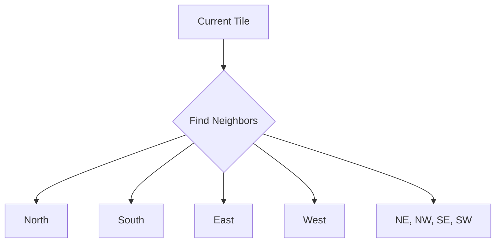

<!-- 🇫🇷 TRADUCTION FRANÇAISE REQUISE -->
<!-- Ce fichier est un modèle qui nécessite une traduction manuelle. -->
<!-- Veuillez traduire le contenu ci-dessous en conservant : -->
<!-- - Le frontmatter (métadonnées en haut) -->
<!-- - Les blocs de code (traduire uniquement les commentaires) -->
<!-- - Les liens et chemins de fichiers -->
<!-- - La structure Markdown -->


# Boundary-Aware Feature Computation

Cross-tile processing that eliminates edge artifacts and ensures consistent feature quality across tile boundaries.

---

## 🎯 What is Boundary-Aware Processing?

**Boundary-aware processing** uses neighboring tile context when computing features near tile edges, eliminating the artificial discontinuities that occur when tiles are processed in isolation.

### The Problem

Traditional tile-by-tile processing creates artifacts at boundaries:

```
Tile A          |  Tile B
                |
Points near edge have:
- Incomplete neighborhoods
- Incorrect geometric features
- Edge artifacts in ML predictions
```

### The Solution

Boundary-aware processing loads neighbor tiles and includes their points when computing features:

```
Tile A + Buffer from B  |  Tile B + Buffer from A
                        |
Points near edge now have:
✅ Complete neighborhoods
✅ Accurate geometric features
✅ Seamless predictions across tiles
```

---

## 🚀 Usage

### Enable Boundary-Aware Processing

```bash
# Basic usage
ign-lidar-hd process \
  input_dir=data/raw/ \
  output_dir=output/ \
  features.boundary_aware=true
```

### With Tile Stitching

Boundary-aware processing works seamlessly with tile stitching:

```bash
# Multi-tile dataset with boundary-aware features
ign-lidar-hd process \
  input_dir=data/raw/ \
  output_dir=output/ \
  stitching.enabled=true \
  features.boundary_aware=true \
  features.buffer_size=5.0
```

---

## ⚙️ Configuration

### Key Parameters

| Parameter                 | Type  | Default | Description                           |
| ------------------------- | ----- | ------- | ------------------------------------- |
| `features.boundary_aware` | bool  | `false` | Enable boundary-aware processing      |
| `features.buffer_size`    | float | `5.0`   | Buffer distance in meters             |
| `features.neighbor_tiles` | int   | `8`     | Number of neighbors to consider (1-8) |
| `features.edge_threshold` | float | `2.0`   | Distance from edge to apply buffer    |

### Buffer Size Selection

Choose buffer size based on your feature scale:

```python
# For local features (curvature, normal vectors)
features.buffer_size=2.0

# For neighborhood features (linearity, planarity)
features.buffer_size=5.0

# For contextual features (density, height variations)
features.buffer_size=10.0
```

---

## 📊 How It Works

### 1. Neighbor Detection



### 2. Buffer Extraction

```python
# For each neighbor tile
1. Load neighbor point cloud
2. Extract points within buffer_size of shared boundary
3. Merge with current tile points
4. Compute features with complete neighborhood
```

### 3. Feature Computation

```python
# Compute features with neighbor context
for point in tile_points:
    if distance_to_edge(point) < edge_threshold:
        neighborhood = get_neighbors(point, include_buffer=True)
    else:
        neighborhood = get_neighbors(point, include_buffer=False)

    features = compute_features(neighborhood)
```

---

## 🎨 Visual Comparison

### Without Boundary-Aware Processing

```
Tile Boundary Issue:
┌─────────────┬─────────────┐
│   Tile A    │   Tile B    │
│             │             │
│        XXXXX│XXXXX        │  ← Artifacts at edge
│        XXXXX│XXXXX        │
│             │             │
└─────────────┴─────────────┘
```

### With Boundary-Aware Processing

```
Seamless Transition:
┌─────────────┬─────────────┐
│   Tile A    │   Tile B    │
│             │             │
│   XXXXXXXXXXXXXXXXXX      │  ← Smooth features
│   XXXXXXXXXXXXXXXXXX      │
│             │             │
└─────────────┴─────────────┘
```

---

## 📈 Performance Impact

### Processing Time

| Mode                 | Time per Tile | Overhead |
| -------------------- | ------------- | -------- |
| Standard             | 1.0x          | 0%       |
| Boundary-Aware (1-4) | 1.1x          | +10%     |
| Boundary-Aware (5-8) | 1.2x          | +20%     |

### Memory Usage

```
Memory per tile = tile_size + (buffer_size × num_neighbors)

Example (50m tile, 5m buffer, 4 neighbors):
  Standard: 100 MB
  Boundary-aware: 120 MB (+20%)
```

---

## 🔧 Advanced Usage

### Custom Neighbor Selection

```bash
# Only load orthogonal neighbors (faster)
ign-lidar-hd process \
  input_dir=data/ \
  output_dir=output/ \
  features.boundary_aware=true \
  features.neighbor_tiles=4

# Load all 8 neighbors (highest quality)
ign-lidar-hd process \
  input_dir=data/ \
  output_dir=output/ \
  features.boundary_aware=true \
  features.neighbor_tiles=8
```

### Python API

```python
from ign_lidar.features import BoundaryAwareComputer
from ign_lidar.io import TileManager

# Initialize
tile_manager = TileManager(input_dir="data/raw/")
computer = BoundaryAwareComputer(
    buffer_size=5.0,
    neighbor_tiles=8,
    edge_threshold=2.0
)

# Process with boundary awareness
tile = tile_manager.load_tile("tile_1234_5678")
neighbors = tile_manager.get_neighbors(tile)
features = computer.compute_features(tile, neighbors)

print(f"Features computed with {len(neighbors)} neighbors")
```

---

## ✅ Best Practices

### When to Use

✅ **Use boundary-aware processing when:**

- Processing multi-tile datasets
- Features depend on local neighborhoods
- Quality at boundaries is critical
- Training ML models on tile data

❌ **Skip boundary-aware processing when:**

- Processing single tiles
- Using global features only
- Performance is critical
- Tiles have no neighbors

### Optimization Tips

1. **Start small**: Use `neighbor_tiles=4` for faster processing
2. **Tune buffer**: Match buffer size to feature scale
3. **Batch processing**: Process tiles in groups for efficiency
4. **Cache neighbors**: Reuse neighbor data when processing adjacent tiles

---

## 🐛 Troubleshooting

### Missing Neighbors

```bash
# Error: Cannot find neighbor tiles
Solution: Ensure all neighbor tiles are available in input_dir

# Check tile availability
ls -la data/raw/*.laz | wc -l
```

### High Memory Usage

```bash
# Reduce buffer size
features.buffer_size=2.0

# Or reduce neighbors
features.neighbor_tiles=4
```

### Slow Processing

```bash
# Process fewer neighbors
features.neighbor_tiles=4

# Or reduce buffer
features.buffer_size=3.0

# Or disable for non-edge points
features.edge_threshold=5.0  # Only process within 5m of edge
```

---

## 📚 Related Topics

- [Tile Stitching](/features/tile-stitching) - Multi-tile dataset creation
- [Feature Computation](/api/features) - Available features
- [Configuration System](/guides/configuration-system) - Advanced configuration

---

## 🎓 Example Workflows

### Regional Dataset with Boundary-Aware Features

```bash
# 1. Download regional tiles
ign-lidar-hd download \
  bbox="2.3,48.8,2.4,48.9" \
  output_dir=data/raw/

# 2. Process with boundary-aware features
ign-lidar-hd process \
  input_dir=data/raw/ \
  output_dir=output/ \
  stitching.enabled=true \
  features.boundary_aware=true \
  features.buffer_size=5.0 \
  features=full

# 3. Results: Seamless features across all tiles
```

---

**Next Steps:**

- Learn about [Tile Stitching](/features/tile-stitching)
- Explore [Configuration Options](/guides/configuration-system)
- See [Complete Workflows](/guides/complete-workflow)
