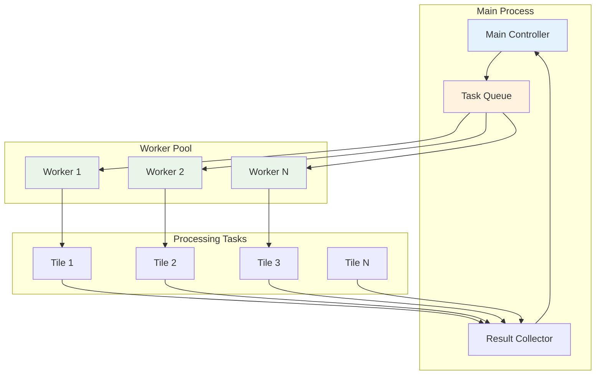
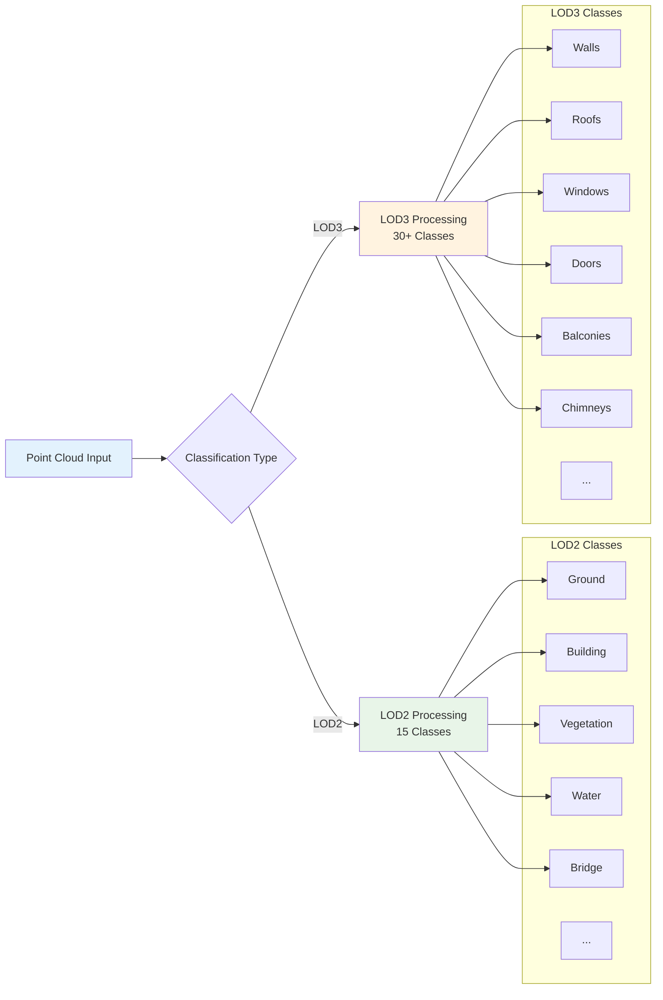
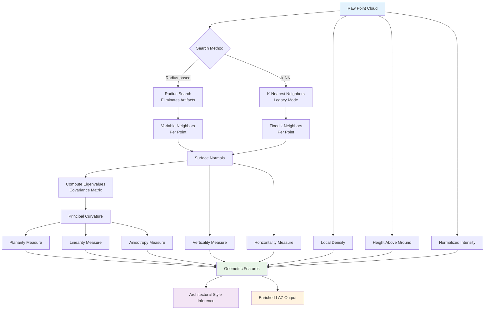
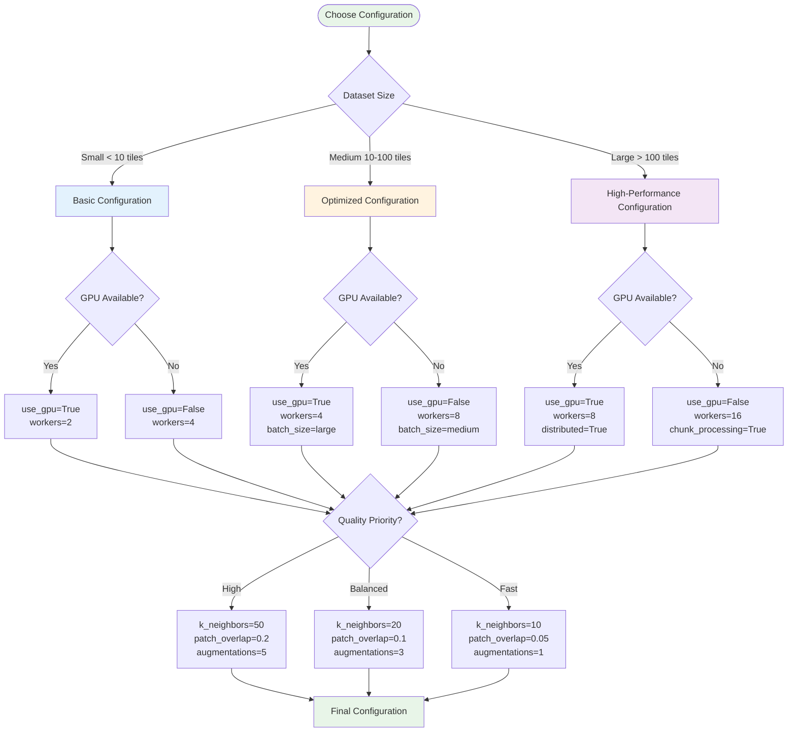

# Guide des Flux de Travail

Ce guide présente les flux de travail courants de traitement avec des représentations visuelles pour vous aider à comprendre le flux de données et les points de décision.

:::tip Navigation

- [Flux de Travail de Base](#-basic-workflow) - Pipeline de traitement standard
- [Flux de Travail Accéléré GPU](#-gpu-accelerated-workflow) - Traitement GPU haute performance
- [Flux de Travail Smart Skip](#-smart-skip-workflow) - Reprendre les tâches interrompues
- [Traitement Parallèle](#-parallel-processing-workflow) - Traitement multi-worker
- [Meilleures Pratiques](#-best-practice-workflows) - Flux de travail optimisés pour différents scénarios
  :::

## 🚀 Flux de Travail de Base

Le flux de travail le plus courant pour traiter les données LiDAR en jeux de données prêts pour le ML.

:::tip Référence au Diagramme
Pour le diagramme complet du flux de travail de base, voir [Diagrammes de Flux de Travail - Pipeline de Traitement de Base](reference/workflow-diagrams.md#basic-processing-pipeline).
:::

Le flux de travail comprend les étapes clés suivantes :

1. **Vérification de Disponibilité des Données** : Vérifier si les tuiles LiDAR sont déjà téléchargées
2. **Téléchargement** : Acquérir les tuiles depuis les serveurs IGN si nécessaire
3. **Validation** : S'assurer que les fichiers téléchargés sont valides
4. **Enrichissement** : Ajouter des caractéristiques géométriques et la classification des composants de bâtiment
5. **Augmentation RGB** : Ajouter optionnellement des informations de couleur depuis les orthophotos
6. **Traitement** : Créer des patches d'entraînement pour l'apprentissage automatique
   RGB -->|No| SkipRGB[LiDAR Only]

   FetchRGB --> Features[Enriched LAZ Ready]
   SkipRGB --> Features

   Features --> Process[Create Training Patches]
   Process --> Output[ML Dataset Ready]
   Output --> End([Process Complete])

   Error1 --> End

   style Start fill:#e8f5e8
   style End fill:#e8f5e8
   style Download fill:#e3f2fd
   style Analyze fill:#c8e6c9
   style CleanData fill:#fff9c4
   style Enrich fill:#fff3e0
   style Process fill:#f3e5f5
   style Output fill:#e8f5e8

````

## ⚡ Flux de Travail Accéléré GPU

Flux de travail pour le traitement de grands jeux de données avec accélération GPU (v1.3.0+).

```mermaid
flowchart TD
    Start([Start GPU Processing]) --> CheckGPU{GPU Available?}

    CheckGPU -->|Yes| GPUSetup[Initialize GPU<br/>CuPy + CUDA]
    CheckGPU -->|No| Fallback[⚠️ Fallback to CPU]

    GPUSetup --> LoadData[Load Point Cloud]
    Fallback --> LoadData

    LoadData --> TransferGPU[Transfer to GPU Memory]
    TransferGPU --> FeatureGPU[🚀 GPU Feature Computation<br/>5-10x faster]

    FeatureGPU --> RGBCheck{Include RGB?}
    RGBCheck -->|Yes v1.5.0+| RGBFetch[Fetch Orthophoto]
    RGBCheck -->|No| FeaturesDone[Features Complete]

    RGBFetch --> RGBCache{In GPU Cache?}
    RGBCache -->|Yes| RGBInterpolate[⚡ GPU Color Interpolation<br/>24x faster]
    RGBCache -->|No| RGBLoad[Load to GPU Cache]
    RGBLoad --> RGBInterpolate

    RGBInterpolate --> Combine[Combine Features + RGB]
    FeaturesDone --> Combine

    Combine --> TransferCPU[Transfer to CPU]
    TransferCPU --> SaveOutput[Save Enriched LAZ]

    SaveOutput --> MoreData{More Data?}
    MoreData -->|Yes| LoadData
    MoreData -->|No| End([Processing Complete])

    style Start fill:#e8f5e8
    style End fill:#e8f5e8
    style GPUSetup fill:#e3f2fd
    style FeatureGPU fill:#c8e6c9
    style RGBInterpolate fill:#c8e6c9
    style Fallback fill:#fff3e0
````

### Bénéfices de Performance GPU

| Opération              | Temps CPU | Temps GPU | Accélération |
| ---------------------- | --------- | --------- | ------------ |
| Extraction de Features | 45s       | 6s        | 8x           |
| Interpolation RGB      | 12s       | 0.5s      | 24x          |
| Calcul de Normales     | 30s       | 5s        | 6x           |
| **Total (1M pts)**     | ~87s      | ~11.5s    | **7.5x**     |

:::tip Conseils d'Optimisation GPU

- **Cache des tuiles RGB** - Réutiliser les orthophotos entre les patches
- **Traitement par lot** - Traiter plusieurs tuiles en séquence
- **Surveiller la mémoire GPU** - Utiliser `nvidia-smi` pour vérifier l'utilisation
- **Utiliser workers=1 avec GPU** - Le GPU parallélise en interne

Voir [Vue d'ensemble GPU](gpu/overview.md) pour les instructions de configuration détaillées.
:::

## 🔄 Flux de Travail Smart Skip

Comprendre comment le système de saut intelligent optimise les exécutions répétées.

```mermaid
sequenceDiagram
    participant User
    participant CLI
    participant SkipChecker as Smart Skip
    participant FileSystem as File System
    participant Processor

    User->>CLI: ign-lidar-hd enrich
    CLI->>SkipChecker: Check existing files
    SkipChecker->>FileSystem: List output directory
    FileSystem-->>SkipChecker: File list

    loop For each input file
        SkipChecker->>SkipChecker: Check if output exists
        SkipChecker->>SkipChecker: Validate file integrity
        alt File exists and valid
            SkipChecker-->>CLI: Skip this file
        else File missing or invalid
            SkipChecker->>Processor: Process this file
            Processor-->>SkipChecker: File processed
        end
    end

    CLI-->>User: Processing complete

    Note over SkipChecker: Smart skip saves time<br/>on large datasets
```

## 🏗️ Flux de Travail de Traitement Parallèle

Comment la bibliothèque gère le traitement multi-worker pour une performance optimale.



## 🎯 Flux de Travail de Classification LOD

Comprendre comment les composants de bâtiment sont classifiés en niveaux LOD.



## 🎯 Pipeline d'Enrichissement Amélioré (v1.7.1)

Vue détaillée du flux de travail d'enrichissement complet avec auto-params et prétraitement.

```mermaid
flowchart TD
    Start[Load LAZ Tile] --> AutoCheck{Auto-Params<br/>Enabled?}

    AutoCheck -->|Yes| Sample[Sample 50K Points]
    AutoCheck -->|No| ManualParams[Use Manual Parameters]

    Sample --> CalcDensity[Calculate:<br/>• Point Density<br/>• NN Distance<br/>• Noise Level]
    CalcDensity --> Optimize[Determine Optimal:<br/>• Radius: 0.5-3.0m<br/>• SOR k: 8-15<br/>• SOR std: 1.5-2.5<br/>• ROR radius: 1.0-2.0m<br/>• ROR neighbors: 2-6]

    Optimize --> Report[📊 Display Analysis Report]
    ManualParams --> Report
    Report --> PreCheck{Preprocessing<br/>Enabled?}

    PreCheck -->|Yes| SOR[Statistical Outlier Removal<br/>Filter noise points]
    PreCheck -->|No| SkipPre[Skip to Features]

    SOR --> ROR[Radius Outlier Removal<br/>Remove scan artifacts]
    ROR --> VoxelCheck{Voxel<br/>Downsampling?}

    VoxelCheck -->|Yes| Voxel[Homogenize Point Density]
    VoxelCheck -->|No| CleanData[Clean Point Cloud]
    Voxel --> CleanData
    SkipPre --> Features

    CleanData --> Features[🔧 Feature Computation]
    Features --> SearchMode{Search Mode}

    SearchMode -->|Radius-based<br/>v1.6.5| RadiusSearch[Radius Search<br/>Artifact-free]
    SearchMode -->|k-NN<br/>legacy| KNNSearch[k-Nearest Neighbors]

    RadiusSearch --> BuildKDTree[Build KD-Tree]
    KNNSearch --> BuildKDTree

    BuildKDTree --> CoreFeatures[Compute Core Features:<br/>• Normals<br/>• Curvature<br/>• Planarity<br/>• Verticality]

    CoreFeatures --> ModeCheck{Feature Mode}
    ModeCheck -->|Core| SaveCore[Core Features Only]
    ModeCheck -->|Building| BuildFeatures[Building Features:<br/>• Wall probability<br/>• Roof probability<br/>• Edge detection<br/>• Corner detection]

    BuildFeatures --> RGBCheck{Add RGB?}
    SaveCore --> RGBCheck

    RGBCheck -->|Yes| FetchOrtho[Fetch IGN Orthophoto]
    RGBCheck -->|No| SaveLAZ[Save Enriched LAZ]

    FetchOrtho --> InterpolateRGB[Interpolate RGB Colors]
    InterpolateRGB --> SaveLAZ

    SaveLAZ --> End[✅ Enriched Tile Complete]

    style Start fill:#e3f2fd
    style Sample fill:#c8e6c9
    style Optimize fill:#c8e6c9
    style Report fill:#fff9c4
    style SOR fill:#fff9c4
    style ROR fill:#fff9c4
    style Features fill:#fff3e0
    style RadiusSearch fill:#c8e6c9
    style SaveLAZ fill:#e8f5e8
    style End fill:#e8f5e8
```



## 📊 Pipeline d'Extraction de Features

Vue détaillée du processus de calcul des caractéristiques géométriques.



## 🔧 Arbre de Décision de Configuration

Comment choisir les paramètres optimaux pour votre cas d'usage.



## 💡 Flux de Travail de Meilleures Pratiques

### Traitement de Zone Urbaine

```bash
# Optimisé pour les environnements urbains denses
ign-lidar-hd download --bbox 2.0,48.8,2.1,48.9 --output urban_tiles/
ign-lidar-hd enrich --input-dir urban_tiles/ --output urban_enriched/ --use-gpu --k-neighbors 30
ign-lidar-hd process --input-dir urban_enriched/ --output urban_patches/ --lod-level LOD3
```

### Traitement de Zone Rurale/Naturelle

```bash
# Optimisé pour les environnements ruraux clairsemés
ign-lidar-hd download --bbox -1.0,46.0,0.0,47.0 --output rural_tiles/
ign-lidar-hd enrich --input-dir rural_tiles/ --output rural_enriched/ --k-neighbors 15
ign-lidar-hd process --input-dir rural_enriched/ --output rural_patches/ --lod-level LOD2
```

### Traitement par Lot Haute Performance

```bash
# Débit maximal pour les grands jeux de données
ign-lidar-hd enrich --input-dir tiles/ --output enriched/ --use-gpu --num-workers 8 --batch-size large
ign-lidar-hd process --input-dir enriched/ --output patches/ --num-workers 16 --skip-existing
```

### Accélération GPU avec RGB (v1.5.0+)

```bash
# Traitement le plus rapide avec augmentation RGB GPU
ign-lidar-hd enrich \
  --input-dir tiles/ \
  --output enriched/ \
  --use-gpu \
  --add-rgb \
  --rgb-cache-dir /data/rgb_cache/ \
  --num-workers 4

# Créer des patches avec RGB en cache
ign-lidar-hd process \
  --input-dir enriched/ \
  --output patches/ \
  --lod-level LOD3 \
  --num-workers 8
```

---

## 📚 Documentation Associée

- **[Guide d'Accélération GPU](gpu/overview.md)** - Configuration et optimisation GPU détaillées
- **[Guide RGB GPU](gpu/rgb-augmentation.md)** - Augmentation RGB accélérée par GPU (v1.5.0+)
- **[Architecture](architecture.md)** - Architecture système et composants
- **[Commandes CLI](guides/cli-commands.md)** - Référence CLI complète
- **[Smart Skip](features/smart-skip.md)** - Détails du système de saut intelligent
- **[Classification LOD](features/lod3-classification.md)** - Classification LOD2/LOD3

---

## 💡 Conseils pour la Sélection du Flux de Travail

### Choisir le Flux de Travail de Base quand :

- ✅ Apprentissage de la bibliothèque
- ✅ Traitement de < 10 tuiles
- ✅ Pas de GPU disponible
- ✅ Prototypage et tests

### Choisir le Flux de Travail GPU quand :

- ✅ Traitement de > 50 tuiles
- ✅ GPU NVIDIA disponible
- ✅ Pipelines de production
- ✅ Projets urgents

### Choisir Smart Skip quand :

- ✅ Reprise de tâches interrompues
- ✅ Traitement itératif
- ✅ Grands jeux de données avec échecs
- ✅ Mises à jour incrémentales

### Traitement Parallèle pour :

- ✅ Systèmes multi-cœurs
- ✅ Traitement par lot
- ✅ Environnements de production
- ✅ Maximisation du débit
