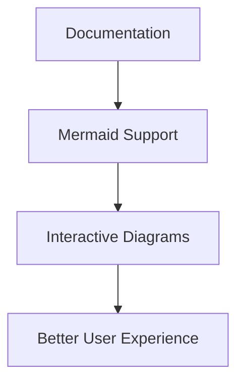

# IGN LiDAR HD - Documentation Website

This website is built using [Docusaurus](https://docusaurus.io/), a modern static website generator with full Mermaid diagram support.

## 🚀 Quick Start

### Installation

```bash
npm install
```

### Local Development

```bash
npm start
```

This command starts a local development server and opens up a browser window. Most changes are reflected live without having to restart the server.

### Build

```bash
npm run build
```

This command generates static content into the `build` directory and can be served using any static content hosting service.

## 🌐 Deployment

The website is automatically deployed to GitHub Pages using GitHub Actions whenever changes are pushed to the `main` branch in the `website/` directory.

**Live Site**: https://sducournau.github.io/IGN_LIDAR_HD_DATASET/

### Automatic Deployment

The deployment is handled by the GitHub Actions workflow in `.github/workflows/deploy-docs.yml`:

1. **Trigger**: Automatically on push to `main` branch when `website/**` files change
2. **Build**: Uses Node.js 20 to build the Docusaurus site
3. **Deploy**: Deploys to GitHub Pages

### Manual Deployment

You can also deploy manually from your local machine:

```bash
GIT_USER=<your-username> npm run deploy
```

## 📊 Features

### Mermaid Diagrams Support

The site includes full support for Mermaid diagrams for interactive documentation:



### Multi-language Ready

Configured for English and French documentation.

### Responsive Design

Fully responsive design that works on desktop, tablet, and mobile devices.

## 🔧 Development

### Testing Changes

Always test your changes locally before pushing:

```bash
npm run build
npm run serve
```

### Adding New Documentation

1. Create new `.md` files in the `docs/` directory
2. Update `sidebars.ts` to include new pages in navigation
3. Use Mermaid diagrams for visual explanations
4. Follow the established style guide with emoji icons

## 🔗 Links

- **Docusaurus Documentation**: https://docusaurus.io/
- **Mermaid Documentation**: https://mermaid.js.org/
