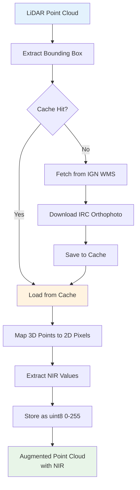

# Infrared Augmentation

Automatically enrich your LiDAR point clouds with Near-Infrared (NIR) values from IGN IRC (Infrared Color) orthophotos for advanced vegetation analysis, land cover classification, and enhanced machine learning datasets.

## Overview

Infrared augmentation fetches high-resolution infrared orthophotos from the IGN Géoplateforme WMS service and maps NIR intensity values to each point in your LiDAR tiles. Combined with RGB augmentation, this creates powerful multi-modal datasets for vegetation index calculation (NDVI, EVI) and improved land cover classification.

:::tip Why use Infrared augmentation?

- **Vegetation Analysis**: Calculate NDVI, EVI, and other vegetation indices
- **Land Cover Classification**: Better differentiate vegetation from built structures
- **Multi-Modal Learning**: Combine geometry + RGB + NIR for superior ML models
- **Automatic Integration**: Seamlessly works alongside RGB augmentation
- **High Resolution**: 20cm pixel resolution from IGN IRC orthophotos
- **Smart Caching**: Shared caching system with RGB augmentation
  :::

## Quick Start

### CLI Usage

```bash
# Basic enrichment with infrared
ign-lidar-hd enrich \
  --input raw_tiles/ \
  --output enriched/ \
  --add-infrared

# With custom cache directory
ign-lidar-hd enrich \
  --input raw_tiles/ \
  --output enriched/ \
  --add-infrared \
  --infrared-cache-dir /data/cache/infrared/

# Combined RGB + Infrared (recommended for ML)
ign-lidar-hd enrich \
  --input raw_tiles/ \
  --output enriched/ \
  --mode full \
  --add-rgb \
  --add-infrared \
  --rgb-cache-dir cache/rgb/ \
  --infrared-cache-dir cache/infrared/

# Full-featured processing
ign-lidar-hd enrich \
  --input raw_tiles/ \
  --output enriched/ \
  --mode full \
  --auto-params \
  --preprocess \
  --add-rgb \
  --add-infrared \
  --rgb-cache-dir cache/rgb/ \
  --infrared-cache-dir cache/infrared/ \
  --use-gpu
```

### Python API

```python
from pathlib import Path
import laspy
import numpy as np

# Process with infrared augmentation
from ign_lidar.cli import cmd_enrich
from argparse import Namespace

args = Namespace(
    input=Path("tile.laz"),
    output=Path("enriched/"),
    mode="full",
    add_infrared=True,
    infrared_cache_dir=Path("cache/infrared/"),
    add_rgb=True,
    rgb_cache_dir=Path("cache/rgb/"),
    # ... other settings
)

# Direct module usage
from ign_lidar.infrared_augmentation import IGNInfraredFetcher

# Initialize fetcher
fetcher = IGNInfraredFetcher(cache_dir="cache/infrared/")

# Load tile
las = laspy.read("tile.laz")
points = np.vstack([las.x, las.y, las.z]).T

# Fetch and add infrared values
nir_values = fetcher.augment_points_with_infrared(
    points,
    resolution=0.2  # 20cm pixels
)

# nir_values is uint8 array (0-255) with NIR intensity
```

## How It Works



### Technical Details

1. **WMS Service**: Fetches from `ORTHOIMAGERY.ORTHOPHOTOS.IRC` layer
2. **Resolution**: Default 20cm (0.2m) per pixel, configurable
3. **Coordinate System**: Lambert-93 (EPSG:2154)
4. **Data Format**: NIR stored as extra dimension 'nir' (uint8, 0-255)
5. **LAZ Compatibility**: Saves as standard LAZ 1.4 with extra dimensions

## Data Format

### Output LAZ Structure

After infrared augmentation, your LAZ files contain an additional extra dimension:

```python
import laspy

las = laspy.read("enriched_tile.laz")

# Check extra dimensions
print(las.point_format.extra_dimension_names)
# Output: ['nir'] or ['nir', 'red', 'green', 'blue'] with RGB

# Access NIR values
nir = las.nir  # uint8 array (0-255)

print(f"NIR range: {nir.min()}-{nir.max()}")
print(f"NIR mean: {nir.mean():.1f}")
```

### Value Interpretation

- **0-255**: NIR intensity values (uint8)
- **High values (&gt;200)**: Strong NIR reflection (healthy vegetation)
- **Low values (&lt;50)**: Weak NIR reflection (water, artificial surfaces)
- **Medium values (50-200)**: Mixed surfaces, stressed vegetation

## Vegetation Indices

### NDVI Calculation

The most common use of NIR data is calculating the Normalized Difference Vegetation Index:

```python
import laspy
import numpy as np

# Load enriched tile with RGB + NIR
las = laspy.read("enriched_tile.laz")

# Extract RGB and NIR
red = las.red.astype(float)
nir = las.nir.astype(float)

# Calculate NDVI: (NIR - Red) / (NIR + Red)
ndvi = (nir - red) / (nir + red + 1e-8)  # epsilon prevents division by zero

# NDVI ranges from -1 to 1
# > 0.5: Dense vegetation
# 0.2-0.5: Moderate vegetation
# 0.1-0.2: Sparse vegetation
# < 0.1: Non-vegetation (buildings, water, bare soil)

# Classify points
dense_veg = ndvi > 0.5
buildings = ndvi < 0.1

print(f"Dense vegetation: {dense_veg.sum()/len(ndvi)*100:.1f}%")
print(f"Buildings/artificial: {buildings.sum()/len(ndvi)*100:.1f}%")
```

### Other Vegetation Indices

```python
# Enhanced Vegetation Index (EVI)
# More sensitive to high biomass regions
blue = las.blue.astype(float)
evi = 2.5 * (nir - red) / (nir + 6*red - 7.5*blue + 1)

# Green NDVI (uses green channel)
green = las.green.astype(float)
gndvi = (nir - green) / (nir + green + 1e-8)

# Soil Adjusted Vegetation Index (SAVI)
L = 0.5  # soil brightness correction factor
savi = ((nir - red) / (nir + red + L)) * (1 + L)
```

## Pipeline Configuration

### YAML Configuration

```yaml
enrich:
  input_dir: "data/raw"
  output: "data/enriched"
  mode: "full"

  # RGB augmentation
  add_rgb: true
  rgb_cache_dir: "cache/rgb"

  # Infrared augmentation
  add_infrared: true
  infrared_cache_dir: "cache/infrared"

  # Preprocessing (recommended)
  preprocess: true
  auto_params: true

  # GPU acceleration
  use_gpu: true
```

## Caching System

The infrared augmentation uses a smart caching system to avoid redundant downloads:

### Disk Cache (Default)

```bash
# Cache structure
cache/infrared/
├── tile_479000_6904000_500x500_0.2m.png
├── tile_479500_6904000_500x500_0.2m.png
└── ...

# Cache key format: tile_{minx}_{miny}_{width}x{height}_{resolution}m.png
```

### Cache Benefits

- **Fast Re-processing**: Cached tiles load in milliseconds vs seconds
- **Bandwidth Saving**: Reduces IGN WMS server load
- **Offline Work**: Process tiles without internet after initial download
- **Shared Across Files**: Same orthophoto used for overlapping tiles

### Cache Management

```bash
# Check cache size
du -sh cache/infrared/

# Clean old cache (optional)
rm -rf cache/infrared/*

# Separate RGB and infrared caches (recommended)
--rgb-cache-dir cache/rgb/
--infrared-cache-dir cache/infrared/
```

## GPU Acceleration

For large datasets, GPU caching provides additional performance:

```python
from ign_lidar.infrared_augmentation import IGNInfraredFetcher

# Initialize with GPU cache (requires CuPy)
fetcher = IGNInfraredFetcher(
    cache_dir="cache/infrared/",
    use_gpu=True  # Enables GPU memory cache
)

# GPU cache uses LRU eviction
# Orthophotos stored in GPU memory for ultra-fast access
```

## CloudCompare Visualization

### Viewing NIR Field

1. Open enriched LAZ file in CloudCompare
2. Select point cloud in DB Tree
3. Open Properties panel (right side)
4. Look for "Scalar Fields" section
5. Click on `[0]` or `nir` field
6. NIR values will be displayed with color gradient

:::tip Field Names
CloudCompare may show `[0]` instead of `nir` for extra dimensions. This is normal - `[0]` represents the first extra dimension, which is your NIR field.
:::

### NDVI Visualization

Create custom scalar field in CloudCompare:

1. **Edit > Scalar Fields > Arithmetic**
2. Formula: `(SF0 - SF1) / (SF0 + SF1)` where:
   - SF0 = NIR field
   - SF1 = Red field (if RGB augmented)
3. Save as "NDVI" scalar field
4. Apply color scale (red = vegetation, blue = buildings)

## Performance

### Benchmarks

Test configuration: 18M point tile, Intel i7, 32GB RAM

| Operation            | Time     | Cache |
| -------------------- | -------- | ----- |
| First run (download) | ~4-6s    | Cold  |
| Subsequent runs      | &lt;1s   | Warm  |
| With GPU cache       | &lt;0.5s | GPU   |

### Optimization Tips

1. **Use caching**: Always specify `--infrared-cache-dir`
2. **Parallel processing**: Use `--num-workers` for multiple tiles
3. **GPU acceleration**: Enable `--use-gpu` with CuPy installed
4. **Batch processing**: Process multiple tiles in one command

## Use Cases

### 1. Vegetation Mapping

```python
# Identify and classify vegetation
dense_forest = ndvi > 0.7
grassland = (ndvi > 0.3) & (ndvi <= 0.7)
sparse_veg = (ndvi > 0.1) & (ndvi <= 0.3)
```

### 2. Building Detection

```python
# Non-vegetation surfaces (buildings, roads)
artificial = ndvi < 0.1

# Combine with geometric features
from ign_lidar.features import compute_features

features = compute_features(points, k=30)
flat_surfaces = features['planarity'] > 0.8

# High confidence buildings: flat + low NDVI
buildings = flat_surfaces & artificial
```

### 3. Multi-Modal ML Datasets

```python
# Create training dataset with geometry + RGB + NIR
features = {
    'xyz': points[:, :3],
    'normals': geometric_features['normals'],
    'curvature': geometric_features['curvature'],
    'rgb': np.vstack([red, green, blue]).T / 255.0,
    'nir': nir / 255.0,
    'ndvi': ndvi,
    'labels': building_labels
}

np.savez('training_patch.npz', **features)
```

### 4. Land Cover Classification

```python
# Multi-class land cover from NDVI
def classify_land_cover(ndvi):
    classes = np.zeros(len(ndvi), dtype=np.uint8)
    classes[ndvi < 0.1] = 1  # Buildings/Roads
    classes[(ndvi >= 0.1) & (ndvi < 0.3)] = 2  # Bare soil
    classes[(ndvi >= 0.3) & (ndvi < 0.5)] = 3  # Grass/sparse veg
    classes[(ndvi >= 0.5) & (ndvi < 0.7)] = 4  # Moderate forest
    classes[ndvi >= 0.7] = 5  # Dense forest
    return classes
```

## Troubleshooting

### Common Issues

#### NIR Field Not Visible in CloudCompare

**Solution**: Extra dimensions appear as `[0]`, `[1]`, etc. Click on the number to activate display.

#### All NIR Values Are Same/Zero

**Possible causes**:

- Network issue during WMS fetch
- Orthophoto not available for region
- Cache corruption

**Solution**:

```bash
# Clear cache and retry
rm -rf cache/infrared/*
ign-lidar-hd enrich --input tile.laz --output output/ --add-infrared --force
```

#### Out of Memory with Large Tiles

**Solution**: Chunked processing is automatic for tiles &gt;15M points, but you can also:

```bash
# Enable preprocessing to reduce point count
ign-lidar-hd enrich --input tile.laz --output output/ \
  --add-infrared --preprocess --voxel-size 0.3
```

#### COPC Format Issues

COPC (Cloud Optimized Point Cloud) format is automatically detected and converted:

```
INFO - ℹ️ COPC detected - will convert to standard LAZ
```

This is normal and ensures compatibility with extra dimensions.

## Best Practices

1. **Always use caching** in production pipelines
2. **Combine with RGB** for maximum information
3. **Apply preprocessing** before augmentation for clean results
4. **Use auto-params** for optimal feature quality
5. **Verify NDVI ranges** to validate data quality
6. **Store RGB and NIR caches separately** for better organization

## API Reference

### IGNInfraredFetcher Class

```python
class IGNInfraredFetcher:
    """Fetch Near-Infrared values from IGN IRC orthophotos."""

    def __init__(
        self,
        cache_dir: Optional[Path] = None,
        use_gpu: bool = False,
        wms_url: str = "https://data.geopf.fr/wms-r",
        layer: str = "ORTHOIMAGERY.ORTHOPHOTOS.IRC"
    ):
        """Initialize fetcher with caching options."""

    def augment_points_with_infrared(
        self,
        points: np.ndarray,
        resolution: float = 0.2
    ) -> np.ndarray:
        """
        Add NIR values to points.

        Args:
            points: (N, 3) array of XYZ coordinates
            resolution: Orthophoto resolution in meters

        Returns:
            (N,) uint8 array of NIR values (0-255)
        """
```

### CLI Arguments

```bash
--add-infrared              # Enable infrared augmentation
--infrared-cache-dir PATH   # Cache directory for IRC orthophotos
```

## Related Documentation

- [RGB Augmentation](rgb-augmentation.md) - Color augmentation guide
- [Pipeline Configuration](pipeline-configuration.md) - YAML config reference
- [GPU Acceleration](../gpu/overview.md) - GPU setup and usage
- [Preprocessing](../guides/preprocessing.md) - Artifact mitigation

## Examples

- [Demo: Infrared Augmentation](https://github.com/sducournau/IGN_LIDAR_HD_DATASET/blob/main/examples/demo_infrared_augmentation.py)
- [NDVI Calculation Example](https://github.com/sducournau/IGN_LIDAR_HD_DATASET/blob/main/examples/demo_infrared_augmentation.py#L89)
- [Multi-Modal Workflow](https://github.com/sducournau/IGN_LIDAR_HD_DATASET/blob/main/examples/pipeline_example.py)

## Changelog

### v1.7.2 (2024-10-04)

- ✨ Initial release of infrared augmentation
- 🎯 IGN IRC orthophoto integration
- 💾 Disk and GPU caching system
- 📊 NDVI calculation examples
- 🔧 CLI and YAML configuration support
- 📚 Comprehensive documentation
