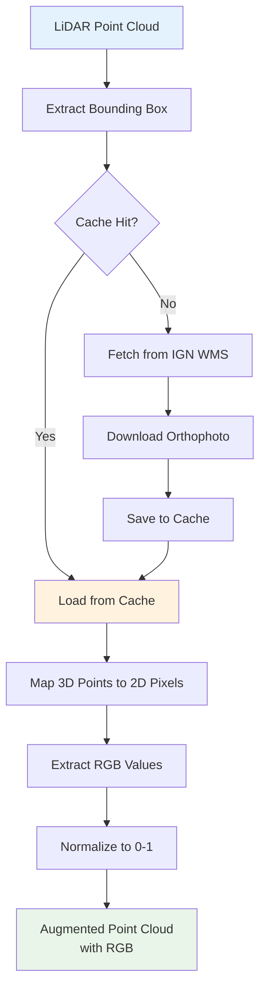
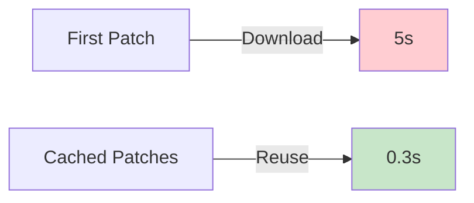

# RGB Augmentation

Automatically enrich your LiDAR point clouds with RGB colors from IGN BD ORTHO® orthophotos for enhanced machine learning and visualization.

## Overview

RGB augmentation fetches high-resolution orthophotos from the IGN Géoplateforme WMS service and maps RGB colors to each point in your LiDAR patches. This creates multi-modal datasets combining geometric features with photometric information.

:::tip Why use RGB augmentation?

- **Improved ML accuracy**: Multi-modal learning leverages both geometry and color
- **Better visualization**: Color-coded point clouds for analysis
- **Automatic**: No manual orthophoto downloads or alignment needed
- **High resolution**: 20cm pixel resolution from IGN BD ORTHO®
- **Smart caching**: Reuses downloaded orthophotos across patches
  :::

## Quick Start

### CLI Usage

```bash
# Basic patch creation with RGB
ign-lidar-hd patch \
  --input enriched_tiles/ \
  --output patches/ \
  --lod-level LOD2 \
  --include-rgb

# With custom cache directory
ign-lidar-hd patch \
  --input enriched_tiles/ \
  --output patches/ \
  --lod-level LOD2 \
  --include-rgb \
  --rgb-cache-dir /data/cache/orthophotos/

# Parallel processing with RGB
ign-lidar-hd patch \
  --input enriched_tiles/ \
  --output patches/ \
  --lod-level LOD3 \
  --include-rgb \
  --rgb-cache-dir cache/ \
  --num-workers 6
```

### Python API

```python
from pathlib import Path
from ign_lidar import LiDARProcessor

# Initialize processor with RGB support
processor = LiDARProcessor(
    lod_level="LOD2",
    include_rgb=True,
    rgb_cache_dir=Path("cache/")
)

# Process tiles with RGB augmentation
patches = processor.process_tile(
    "enriched_tile.laz",
    "output_patches/"
)

# Each patch now contains 'rgb' key
import numpy as np
data = np.load("output_patches/patch_0001.npz")
print(data['rgb'].shape)  # (N, 3) - normalized RGB values [0, 1]
```

## How It Works



### Processing Pipeline

1. **Bounding Box Extraction**: Calculate the spatial extent of each patch
2. **Cache Check**: Look for existing orthophoto in cache directory
3. **WMS Request**: If not cached, fetch from IGN Géoplateforme service
4. **Point Mapping**: Map each 3D point (X, Y, Z) to 2D orthophoto pixel (x, y)
5. **Color Extraction**: Sample RGB values from the orthophoto
6. **Normalization**: Convert RGB from [0, 255] to [0, 1] for ML compatibility
7. **Storage**: Save augmented patches with `rgb` field

## Data Specifications

### IGN Service Details

- **Service**: IGN Géoplateforme WMS
- **Endpoint**: `https://data.geopf.fr/wms-r`
- **Layer**: `HR.ORTHOIMAGERY.ORTHOPHOTOS`
- **Resolution**: 20cm (0.2m per pixel)
- **CRS**: EPSG:2154 (Lambert 93)
- **Coverage**: Metropolitan France
- **Format**: PNG (24-bit RGB)

### Output Format

Each patch NPZ file contains an additional `rgb` array:

```python
{
    'points': np.ndarray,      # Shape: (N, 3) - X, Y, Z coordinates
    'features': np.ndarray,    # Shape: (N, 30+) - Geometric features
    'labels': np.ndarray,      # Shape: (N,) - Classification labels
    'rgb': np.ndarray,         # Shape: (N, 3) - RGB colors [0, 1]
    'metadata': dict           # Patch metadata
}
```

**RGB Array Details:**

- **Type**: `np.float32`
- **Shape**: `(N, 3)` where N = number of points
- **Range**: `[0.0, 1.0]` (normalized from 0-255)
- **Order**: Red, Green, Blue
- **Memory**: ~196KB per patch (16384 points × 3 × 4 bytes)

## Performance

### Speed

| Configuration  | Time per Patch | Notes                            |
| -------------- | -------------- | -------------------------------- |
| Geometry only  | 0.5-2s         | No RGB fetching                  |
| RGB (cached)   | 0.6-2.5s       | +0.1-0.5s cache lookup & mapping |
| RGB (uncached) | 2-7s           | +2-5s for orthophoto download    |

### Caching Benefits



- **First patch per tile**: ~2-5s (includes download)
- **Subsequent patches**: ~0.1-0.5s (cache hit)
- **Cache size**: ~500KB-2MB per tile orthophoto
- **Speedup**: 10-20x faster with caching

### Memory Impact

- **Per patch overhead**: ~196KB (minimal)
- **Cache memory**: Managed by filesystem
- **Processing memory**: Similar to non-RGB processing
- **Recommended RAM**: 4GB+ per worker (same as without RGB)

## Configuration

### Cache Directory

The cache directory stores downloaded orthophotos to avoid redundant downloads:

```bash
# Default: No caching (slower, downloads each time)
ign-lidar-hd patch --input tiles/ --output patches/ --include-rgb

# With cache (recommended)
ign-lidar-hd patch \
  --input tiles/ \
  --output patches/ \
  --include-rgb \
  --rgb-cache-dir /data/cache/

# Cache structure
cache/
├── orthophoto_0123_4567.png  # Cached orthophoto for tile
├── orthophoto_0124_4567.png
└── ...
```

:::tip Best Practice
Always specify a cache directory for production workflows. This dramatically improves performance when processing multiple patches from the same tile.
:::

### Python Configuration

```python
from pathlib import Path
from ign_lidar import LiDARProcessor

# Full configuration example
processor = LiDARProcessor(
    lod_level="LOD2",
    patch_size=10.0,
    include_rgb=True,              # Enable RGB augmentation
    rgb_cache_dir=Path("cache/"),  # Cache directory
    num_workers=4                   # Parallel processing
)

# Process with custom settings
patches = processor.process_directory(
    input_dir="enriched/",
    output_dir="patches/",
    num_workers=6
)
```

## Use Cases

### Machine Learning

**Multi-Modal Classification:**

```python
# Train with both geometry and color
import torch
import torch.nn as nn

class MultiModalNet(nn.Module):
    def __init__(self):
        super().__init__()
        self.geom_encoder = nn.Linear(30, 64)  # Geometric features
        self.rgb_encoder = nn.Linear(3, 16)    # RGB features
        self.classifier = nn.Linear(80, 15)    # Combined → classes

    def forward(self, geometry, rgb):
        geom_feat = self.geom_encoder(geometry)
        rgb_feat = self.rgb_encoder(rgb)
        combined = torch.cat([geom_feat, rgb_feat], dim=-1)
        return self.classifier(combined)

# Load patch with RGB
data = np.load('patch.npz')
geometry = torch.from_numpy(data['features'])
rgb = torch.from_numpy(data['rgb'])
labels = torch.from_numpy(data['labels'])
```

### Visualization

**Color-Coded Point Clouds:**

```python
import numpy as np
import matplotlib.pyplot as plt
from mpl_toolkits.mplot3d import Axes3D

# Load patch
data = np.load('patch.npz')
points = data['points']
rgb = data['rgb']

# Visualize
fig = plt.figure(figsize=(10, 8))
ax = fig.add_subplot(111, projection='3d')
ax.scatter(
    points[:, 0],
    points[:, 1],
    points[:, 2],
    c=rgb,  # RGB colors directly
    s=1
)
plt.title('RGB-Augmented Point Cloud')
plt.show()
```

### Quality Control

**Identify Misalignments:**

```python
# Check if colors match expected building materials
data = np.load('patch.npz')
rgb = data['rgb']
labels = data['labels']

# Walls should be gray/white/brick colors
wall_points = rgb[labels == WALL_CLASS]
mean_color = wall_points.mean(axis=0)
print(f"Average wall color: R={mean_color[0]:.2f}, G={mean_color[1]:.2f}, B={mean_color[2]:.2f}")
```

## Troubleshooting

### Missing Dependencies

```bash
# Error: ImportError: requests is required
pip install requests Pillow

# Or install all optional dependencies
pip install ign-lidar-hd[rgb]
```

### Network Issues

```python
# Service unavailable or timeout
# The library gracefully degrades - patches created without RGB
[WARNING] Failed to fetch orthophoto for tile_0123_4567: Network timeout
[INFO] Continuing without RGB augmentation
```

### Cache Management

```bash
# Clear cache to free disk space
rm -rf /data/cache/orthophotos/

# Check cache size
du -sh /data/cache/orthophotos/
```

### Missing Colors (Black/White Pixels)

**Cause**: Point falls outside orthophoto coverage or on no-data area

**Solution**: Library uses fallback strategy:

1. Try to fetch from IGN service
2. If outside coverage → use [0.5, 0.5, 0.5] (gray)
3. If no-data pixel → use [0.5, 0.5, 0.5] (gray)

## API Reference

### IGNOrthophotoFetcher

Main class for fetching and caching orthophotos.

```python
from ign_lidar.rgb_augmentation import IGNOrthophotoFetcher
from pathlib import Path

# Initialize
fetcher = IGNOrthophotoFetcher(cache_dir=Path("cache/"))

# Fetch orthophoto for bounding box
bbox = (x_min, y_min, x_max, y_max)  # Lambert 93 coordinates
image = fetcher.fetch_orthophoto(bbox, tile_id="0123_4567")

# Augment points with RGB
import numpy as np
points = np.array([[x1, y1, z1], [x2, y2, z2], ...])
rgb_colors = fetcher.augment_points_with_rgb(points, bbox, tile_id="0123_4567")
```

### Standalone Functions

```python
from ign_lidar.rgb_augmentation import augment_tile_with_rgb

# Augment entire tile
augmented_patches = augment_tile_with_rgb(
    patches=patch_list,
    tile_path="tile.laz",
    cache_dir=Path("cache/")
)
```

## Best Practices

### 1. Always Use Caching

```bash
# ✅ Good: With cache
ign-lidar-hd patch --include-rgb --rgb-cache-dir cache/

# ❌ Slow: No cache (downloads every time)
ign-lidar-hd patch --include-rgb
```

### 2. Monitor Network Usage

RGB augmentation downloads ~1-2MB per tile. For large datasets:

- Use caching to minimize downloads
- Consider processing in batches
- Ensure stable internet connection

### 3. Validate RGB Quality

```python
# Check RGB statistics
data = np.load('patch.npz')
rgb = data['rgb']

print(f"RGB mean: {rgb.mean(axis=0)}")
print(f"RGB std: {rgb.std(axis=0)}")
print(f"RGB range: [{rgb.min()}, {rgb.max()}]")

# Should be normalized [0, 1]
assert rgb.min() >= 0 and rgb.max() <= 1
```

### 4. Handle Missing Dependencies Gracefully

```python
try:
    from ign_lidar.rgb_augmentation import IGNOrthophotoFetcher
    has_rgb_support = True
except ImportError:
    has_rgb_support = False
    print("RGB support not available. Install: pip install requests Pillow")

if has_rgb_support:
    processor = LiDARProcessor(include_rgb=True)
else:
    processor = LiDARProcessor(include_rgb=False)
```

## Migration from Geometry-Only

Existing workflows continue to work without changes:

```bash
# Old workflow (still works)
ign-lidar-hd process --input tiles/ --output patches/

# New workflow with RGB (opt-in)
ign-lidar-hd patch --input tiles/ --output patches/ --include-rgb
```

**Backwards Compatibility:**

- Default behavior unchanged (no RGB)
- Existing scripts work without modification
- `--include-rgb` is optional flag
- Old `process` command still works (with deprecation warning)

## Related Resources

- [CLI Commands Reference](../guides/cli-commands.md) - Full command documentation
- [Basic Usage Guide](../guides/basic-usage.md) - Getting started
- [Smart Skip Detection](./smart-skip.md) - Resume interrupted workflows
- [IGN Géoplateforme WMS](https://geoservices.ign.fr/services-web-experts-wms) - Official documentation

## FAQ

**Q: Do I need RGB augmentation?**

A: No, it's optional. Use it if you want multi-modal learning or better visualization.

**Q: Does it slow down processing?**

A: First run: +2-5s per patch. With caching: +0.1-0.5s (minimal impact).

**Q: What if orthophotos aren't available?**

A: Library gracefully degrades - creates patches without RGB and logs a warning.

**Q: Can I use my own orthophotos?**

A: Not directly, but you can modify `rgb_augmentation.py` to use custom sources.

**Q: Is the RGB data accurate?**

A: Yes, IGN BD ORTHO® is 20cm resolution aligned with LiDAR HD. Some minor misalignment (<0.5m) may occur in complex urban areas.

**Q: How much disk space for cache?**

A: ~0.5-2MB per tile. For 100 tiles: ~50-200MB total.
