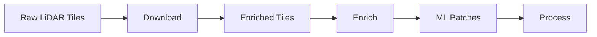

# Basic Usage

This guide covers the essential workflows for processing IGN LiDAR HD data into machine learning-ready datasets.

## Overview

The IGN LiDAR HD processing workflow consists of three main steps:

1. **Download** - Get LiDAR tiles from IGN servers
2. **Enrich** - Add building component features to points
3. **Process** - Extract patches for machine learning



## Step 1: Download LiDAR Tiles

Download LiDAR tiles for your area of interest:

```bash
# Download tiles for Paris center
python -m ign_lidar.cli download \
  --bbox 2.25,48.82,2.42,48.90 \
  --output /path/to/raw_tiles/ \
  --max-tiles 10
```

### Parameters

- `--bbox`: Bounding box as `min_lon,min_lat,max_lon,max_lat`
- `--output`: Directory to save downloaded tiles
- `--max-tiles`: Maximum number of tiles to download (optional)

### Output

Downloaded tiles are saved as LAZ files:

```
raw_tiles/
├── LIDARHD_FXX_0123_4567_LA93_IGN69_2020.laz
├── LIDARHD_FXX_0124_4567_LA93_IGN69_2020.laz
└── ...
```

## Step 2: Enrich with Building Features

Add building component classification features to the point clouds:

```bash
# Enrich tiles with building features
python -m ign_lidar.cli enrich \
  --input-dir /path/to/raw_tiles/ \
  --output /path/to/enriched_tiles/ \
  --mode building \
  --num-workers 4
```

### Parameters

- `--input-dir`: Directory containing raw LAZ tiles
- `--output`: Directory to save enriched tiles
- `--mode`: Feature extraction mode (currently only `building`)
- `--num-workers`: Number of parallel workers (optional)

### Output

Enriched tiles contain additional point attributes for building classification:

```
enriched_tiles/
├── LIDARHD_FXX_0123_4567_LA93_IGN69_2020.laz  # With building features
├── LIDARHD_FXX_0124_4567_LA93_IGN69_2020.laz
└── ...
```

Each point now has 30+ geometric features for building component classification.

## Step 3: Extract Patches

Extract small patches suitable for machine learning:

```bash
# Extract patches for LOD2 building classification
python -m ign_lidar.cli process \
  --input /path/to/enriched_tiles/ \
  --output /path/to/patches/ \
  --lod-level LOD2 \
  --patch-size 10.0 \
  --num-workers 4
```

### Parameters

- `--input`: Directory containing enriched LAZ tiles
- `--output`: Directory to save extracted patches
- `--lod-level`: Classification level (`LOD2` or `LOD3`)
- `--patch-size`: Patch size in meters (default: 10.0)
- `--num-workers`: Number of parallel workers (optional)

### Output

Patches are saved as NPZ files with point clouds and labels:

```
patches/
├── tile_0123_4567/
│   ├── patch_0001.npz
│   ├── patch_0002.npz
│   └── ...
├── tile_0124_4567/
│   └── ...
```

Each patch contains:

- Point coordinates (X, Y, Z)
- Geometric features (30+ attributes)
- Building component labels
- Patch metadata

## Classification Levels

### LOD2 (15 Classes)

Basic building components suitable for urban analysis:

- Wall, Roof, Ground, Vegetation
- Window, Door, Balcony, Chimney
- And 7 more classes...

### LOD3 (30 Classes)

Detailed building components for architectural analysis:

- All LOD2 classes plus:
- Roof details (tiles, gutters, dormers)
- Facade elements (shutters, decorative features)
- And 15 additional detailed classes...

## Complete Workflow Example

Here's a complete example processing the 13th arrondissement of Paris:

```bash
# 1. Download tiles
python -m ign_lidar.cli download \
  --bbox 2.32,48.82,2.38,48.86 \
  --output data/raw_tiles/ \
  --max-tiles 20

# 2. Enrich with features
python -m ign_lidar.cli enrich \
  --input-dir data/raw_tiles/ \
  --output data/enriched_tiles/ \
  --mode building \
  --num-workers 6

# 3. Extract patches
python -m ign_lidar.cli process \
  --input data/enriched_tiles/ \
  --output data/patches/ \
  --lod-level LOD2 \
  --patch-size 10.0 \
  --num-workers 6
```

Expected processing time for 20 tiles:

- Download: ~15 minutes (depends on network)
- Enrich: ~45 minutes (with 6 workers)
- Process: ~30 minutes (with 6 workers)

## Data Loading

Once you have patches, load them for machine learning:

```python
import numpy as np

# Load a single patch
data = np.load('patches/tile_0123_4567/patch_0001.npz')
points = data['points']        # Shape: (N, 3) - X, Y, Z
features = data['features']    # Shape: (N, 30+) - Geometric features
labels = data['labels']        # Shape: (N,) - Building component labels

print(f"Patch has {len(points)} points")
print(f"Feature dimensions: {features.shape[1]}")
print(f"Unique labels: {np.unique(labels)}")
```

## Memory Considerations

For large datasets, monitor memory usage:

```bash
# Check memory usage during processing
htop

# Reduce workers if memory is limited
python -m ign_lidar.cli process --num-workers 2

# Process tiles one by one for very large tiles
python -m ign_lidar.cli process --num-workers 1
```

See the [Memory Optimization Guide](../reference/memory-optimization.md) for detailed memory management strategies.

## Smart Skip Detection

All commands automatically skip existing outputs:

```bash
# Run the same command twice - second run skips existing files
python -m ign_lidar.cli download --bbox 2.32,48.82,2.38,48.86 --output data/raw_tiles/
# First run: Downloads new tiles
# Second run: Skips existing tiles automatically

# Force reprocessing with --force flag
python -m ign_lidar.cli process --input data/enriched/ --output data/patches/ --force
```

See the [Smart Skip Features](../features/smart-skip.md) guide for details.

## Troubleshooting

### Download Issues

```bash
# Check network connectivity
ping geoservices.ign.fr

# Verify bbox coordinates (should be in France)
# Valid range: longitude 1-8, latitude 42-51
```

### Processing Errors

```bash
# Check file permissions
ls -la /path/to/tiles/

# Verify LAZ file integrity
lasinfo tile.laz

# Reduce workers if getting memory errors
python -m ign_lidar.cli process --num-workers 1
```

### Missing Features

```bash
# Verify enrichment completed successfully
lasinfo enriched_tile.laz | grep "extra bytes"

# Re-enrich if features are missing
python -m ign_lidar.cli enrich --input-dir raw/ --output enriched/ --force
```

## Next Steps

- **Advanced Processing**: Learn about [GPU acceleration](gpu-acceleration.md)
- **QGIS Integration**: See [QGIS integration guide](qgis-integration.md)
- **Batch Processing**: Check out [parallel processing examples](../examples/parallel_processing_example.py)
- **Custom Features**: Develop [custom feature extractors](../tutorials/custom-features.md)
