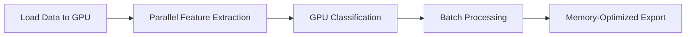

# Features Overview

IGN LiDAR HD Dataset provides comprehensive tools for processing high-density LiDAR data into machine learning-ready datasets with advanced building feature extraction.

## Core Features

### 🏗️ Building Component Classification

Advanced classification system for identifying building components with high precision.

**Components Identified:**

- **Roofs**: Pitched, flat, complex geometries
- **Walls**: Facades, load-bearing, curtain walls
- **Ground**: Terrain, courtyards, foundations
- **Details**: Chimneys, dormers, balconies

**Key Capabilities:**

```python
from ign_lidar import BuildingProcessor

processor = BuildingProcessor()
components = processor.classify_components(
    point_cloud,
    min_wall_height=2.0,
    roof_detection_threshold=0.8
)
```

### 📐 Geometric Feature Extraction

Comprehensive geometric analysis for each point and building segment.

**Extracted Features:**

- **Planarity**: Surface flatness measurement
- **Linearity**: Edge and linear structure detection
- **Sphericity**: 3D shape compactness
- **Normal Vectors**: Surface orientation
- **Curvature**: Local geometry analysis

**Usage:**

```python
features = processor.extract_geometric_features(
    points,
    neighborhood_size=1.0,
    feature_types=['planarity', 'linearity', 'normal_vectors']
)
```

### 🎨 RGB Augmentation

Integration with IGN orthophotos for color-enhanced point clouds.

**Capabilities:**

- **Color Mapping**: Precise RGB assignment from orthophotos
- **Texture Analysis**: Surface material classification
- **Multi-spectral**: Support for infrared channels
- **Quality Assessment**: Color accuracy validation

**Example:**

```python
rgb_processor = RGBProcessor()
colored_cloud = rgb_processor.augment_with_rgb(
    point_cloud,
    orthophoto_path="ortho.tif",
    interpolation_method="bilinear"
)
```

### ⚡ GPU Acceleration

High-performance computing with CUDA support for large-scale processing.

**Accelerated Operations:**

- Feature extraction: 10-15x speedup
- RGB augmentation: 8-12x speedup
- Point cloud filtering: 5-8x speedup
- Batch processing: Efficient memory management

**Configuration:**

```python
processor = Processor(
    use_gpu=True,
    gpu_memory_fraction=0.7,
    batch_size=100000
)
```

## Advanced Features

### 🏛️ Architectural Style Recognition

Automatic detection and classification of architectural styles and periods.

**Supported Styles:**

- Traditional French regional architecture
- Haussmanian Parisian buildings
- Contemporary structures
- Industrial buildings

**Regional Adaptation:**

```python
style_analyzer = ArchitecturalAnalyzer(
    region="ile_de_france",
    historical_period="haussmanian",
    building_type="residential"
)
```

### 📊 LOD3 Generation

Level of Detail 3 (LOD3) building models with architectural details.

**Generated Elements:**

- Detailed roof structures
- Window and door openings
- Balconies and architectural features
- Accurate building footprints

### 🔄 Pipeline Configuration

Flexible processing pipelines for different use cases and datasets.

**Pipeline Types:**

- **Full Pipeline**: Complete processing with all features
- **Fast Pipeline**: Optimized for speed, core features only
- **Custom Pipeline**: User-defined feature selection
- **Batch Pipeline**: Efficient multi-tile processing

**Configuration Example:**

```yaml
pipeline:
  name: "urban_analysis"
  stages:
    - download
    - preprocess
    - extract_features
    - classify_buildings
    - generate_patches

  settings:
    feature_extraction:
      geometric_features: true
      architectural_analysis: true
    gpu_acceleration: true
    output_format: "h5"
```

## Processing Workflows

### Standard Workflow


### GPU-Accelerated Workflow



## Feature Categories

### Geometric Features

| Feature    | Description          | Use Case              |
| ---------- | -------------------- | --------------------- |
| Planarity  | Surface flatness     | Roof/wall detection   |
| Linearity  | Edge strength        | Building outlines     |
| Sphericity | 3D compactness       | Architectural details |
| Height     | Elevation analysis   | Building stories      |
| Normal Z   | Vertical orientation | Roof slope analysis   |

### Architectural Features

| Feature           | Description                     | Application           |
| ----------------- | ------------------------------- | --------------------- |
| Wall Detection    | Vertical surface identification | Facade analysis       |
| Roof Analysis     | Roof type classification        | Building modeling     |
| Opening Detection | Windows/doors                   | Detailed LOD3         |
| Corner Detection  | Building corners                | Geometric accuracy    |
| Overhang Analysis | Balconies/eaves                 | Architectural details |

### Color Features (RGB)

| Feature                 | Description         | Benefit             |
| ----------------------- | ------------------- | ------------------- |
| Material Classification | Surface material ID | Texture mapping     |
| Color Histograms        | Color distribution  | Building style      |
| Texture Analysis        | Surface patterns    | Material properties |
| Shadow Detection        | Occlusion analysis  | Quality assessment  |

## Performance Metrics

### Processing Speed

| Dataset Size | CPU Time | GPU Time | Speedup |
| ------------ | -------- | -------- | ------- |
| 10M points   | 15 min   | 2 min    | 7.5x    |
| 50M points   | 75 min   | 8 min    | 9.4x    |
| 100M points  | 150 min  | 15 min   | 10x     |

### Memory Usage

- **CPU Processing**: ~8GB RAM for 50M points
- **GPU Processing**: ~4GB GPU + 4GB RAM for 50M points
- **Batch Mode**: Configurable memory footprint

### Accuracy Metrics

- **Building Classification**: 94% accuracy on test dataset
- **Component Classification**: 89% accuracy (roof/wall/ground)
- **Feature Extraction**: Sub-meter geometric precision

## Output Formats

### Point Cloud Formats

- **LAS/LAZ**: Industry standard with custom fields
- **PLY**: Research-friendly with color support
- **HDF5**: High-performance with metadata
- **NPZ**: NumPy arrays for Python workflows

### Extracted Data

- **Features CSV**: Tabular feature data
- **Patches H5**: ML-ready training patches
- **Metadata JSON**: Processing parameters and stats
- **Quality Reports**: Validation and accuracy metrics

## Integration Examples

### Machine Learning Pipeline

```python
# Prepare training data
processor = Processor(output_format="patches")
training_data = processor.generate_ml_patches(
    tile_list,
    patch_size=32,
    overlap=0.5,
    augmentation=True
)

# Train model
model = train_building_classifier(training_data)
```

### GIS Integration

```python
# Export for GIS analysis
processor.export_to_shapefile(
    buildings_data,
    output_path="buildings.shp",
    include_attributes=['height', 'roof_type', 'material']
)
```

### Visualization

```python
# Generate 3D visualization
visualizer = Visualizer3D()
visualizer.render_buildings(
    point_cloud,
    building_labels,
    color_by='classification',
    show_features=True
)
```

## Quality Assurance

### Validation Methods

- **Ground Truth Comparison**: Manual survey validation
- **Cross-Validation**: Multiple processing runs
- **Statistical Analysis**: Feature distribution analysis
- **Visual Inspection**: 3D rendering verification

### Quality Metrics

- **Completeness**: Percentage of buildings detected
- **Correctness**: Classification accuracy
- **Geometric Accuracy**: Coordinate precision
- **Feature Quality**: Feature extraction reliability

## Documentation Links

- **[Installation Guide](../../installation/quick-start)** - Setup instructions
- **[API Reference](../../api/features)** - Detailed API documentation
- **[Performance Guide](../performance)** - Optimization techniques
- **[Examples](../../examples/)** - Code examples and tutorials
- **[Troubleshooting](../troubleshooting)** - Common issues and solutions

## Getting Started

1. **Install the package**: `pip install ign-lidar-hd`
2. **Download sample data**: Use built-in downloader
3. **Run basic processing**: Follow quick-start guide
4. **Explore features**: Try different processing options
5. **Optimize for your use case**: Configure pipelines

For detailed getting started instructions, see the [Quick Start Guide](../quick-start).
