# GPU Acceleration

Learn how to accelerate LiDAR processing using GPU computing with CUDA support.

## Overview

The IGN LiDAR HD library supports GPU acceleration for computationally intensive operations like feature extraction and point cloud processing.

## Requirements

- NVIDIA GPU with CUDA capability
- CUDA Toolkit 11.0 or higher
- GPU-specific Python packages

## Installation

Install the GPU version of the library:

```bash
pip install -r requirements_gpu.txt
```

## Configuration

Enable GPU processing in your configuration:

```python
from ign_lidar import Config

config = Config(
    use_gpu=True,
    gpu_memory_limit=0.8,  # Use 80% of GPU memory
    cuda_device=0  # Use first GPU
)
```

## Performance Benefits

GPU acceleration provides significant performance improvements:

### 📊 Performance Comparison


### 🚀 Speed Improvements by Operation


### 💾 Memory Usage Patterns


## Monitoring GPU Usage

Monitor GPU utilization during processing:

```bash
nvidia-smi
```

## Troubleshooting

Common GPU-related issues and solutions:

### 🔧 GPU Troubleshooting Decision Tree

```mermaid
flowchart TD
    Start([GPU Issues?]) --> Check1{CUDA Available?}

    Check1 -->|No| Install[Install CUDA Toolkit<br/>+ GPU Drivers]
    Check1 -->|Yes| Check2{Out of Memory?}

    Install --> Restart[Restart System]
    Restart --> Check1

    Check2 -->|Yes| MemFix[Reduce Memory Usage]
    Check2 -->|No| Check3{Slow Performance?}

    MemFix --> MemOptions[• Lower gpu_memory_limit<br/>• Reduce batch_size<br/>• Use smaller tiles]
    MemOptions --> Test1[Test Again]

    Check3 -->|Yes| PerfFix[Optimize Settings]
    Check3 -->|No| Check4{Driver Issues?}

    PerfFix --> PerfOptions[• Update GPU drivers<br/>• Check GPU utilization<br/>• Verify CUDA version]
    PerfOptions --> Test2[Test Again]

    Check4 -->|Yes| DriverFix[Update Drivers]
    Check4 -->|No| Success[GPU Working]

    DriverFix --> Test3[Test Again]
    Test1 --> Success
    Test2 --> Success
    Test3 --> Success

    style Start fill:#e3f2fd
    style Success fill:#e8f5e8
    style Install fill:#fff3e0
    style MemFix fill:#fff3e0
    style PerfFix fill:#fff3e0
    style DriverFix fill:#fff3e0
```



### Common Solutions

#### CUDA Out of Memory

Reduce batch size or memory limit:

```python
config.gpu_memory_limit = 0.5  # Use only 50% of GPU memory
```

#### GPU Not Detected

Verify CUDA installation:

```bash
python -c "import torch; print(torch.cuda.is_available())"
```

#### Performance Issues

Monitor GPU utilization:

```bash
nvidia-smi -l 1  # Monitor GPU usage in real-time
```
