## 🎉 First Release Announcement

**We're excited to announce the first official release of the IGN LiDAR HD Processing Library!**

📺 **[Watch our release video](https://youtu.be/ksBWEhkVqQI)** to see the library in action!

📖 **[Read the full release announcement](/blog/first-release)** in our blog!

---

## Welcome to IGN LiDAR HD

A comprehensive Python library designed for processing French Geographic Institute (IGN) LiDAR HD data into machine learning-ready datasets. This library provides tools for downloading, processing, and enriching LiDAR point cloud data with building classifications and architectural features.

```mermaid
graph TB
    A[🌍 IGN LiDAR HD Data] --> B[📊 Processing Pipeline]
    B --> C[🤖 ML-Ready Datasets]

    B --> D[🏢 Building Detection]
    B --> E[🎯 Feature Extraction]
    B --> F[📦 Data Packaging]

    D --> G[LOD2/LOD3 Classification]
    E --> H[Geometric Features]
    F --> I[NPZ Format]

    subgraph "🔧 Core Features"
    G
    H
    I
    end

    style A fill:#e1f5fe
    style C fill:#f3e5f5
    style B fill:#fff3e0
```



## 🚀 Quick Start

Get started with IGN LiDAR HD in just a few commands:

```bash
# Install the library
pip install ign-lidar-hd

# Process your first tile
from ign_lidar import IGNLidarProcessor
processor = IGNLidarProcessor()
processor.process_tile("0757_6291")
```

## 📚 Key Features

- **🔄 Automated Processing**: End-to-end pipeline from raw LiDAR to ML datasets
- **🏗️ Building Classification**: Advanced LOD2/LOD3 building detection
- **⚡ GPU Acceleration**: CUDA-powered feature extraction
- **🎛️ QGIS Integration**: Seamless workflow with QGIS tools
- **📊 Rich Features**: 20+ geometric and architectural features
- **🔧 Flexible Configuration**: Customizable processing parameters

## 🎯 Use Cases

- **Machine Learning**: Training datasets for building detection models
- **Urban Planning**: Automated building inventory and classification
- **Research**: Academic studies on LiDAR processing techniques
- **GIS Applications**: Integration with existing geospatial workflows

## 📖 Documentation Sections

- **[Quick Start Guide](quick-start)** - Get up and running in minutes
- **[Architecture Overview](architecture)** - Understand the system design
- **[Processing Workflows](workflows)** - Learn the data processing pipeline
- **[QGIS Integration](qgis-integration)** - Use with QGIS tools
- **[API Reference](api-reference)** - Complete function documentation

---

**Ready to start processing LiDAR data?** 📊 [Begin with our Quick Start Guide](quick-start)

**Want to contribute?** 🤝 [Visit our GitHub repository](https://github.com/sducournau/IGN_LIDAR_HD_DATASET)
