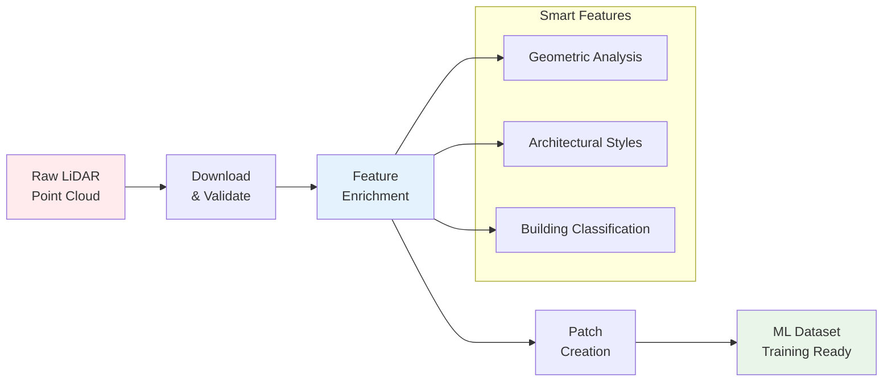

# Getting Started

Welcome to the IGN LiDAR HD Processing Library documentation!

## What is IGN LiDAR HD?

The IGN LiDAR HD Processing Library is a Python toolkit for processing high-density LiDAR data from the French National Institute of Geographic and Forest Information (IGN) into machine learning-ready datasets.

## 🔄 Processing Pipeline Overview



## Key Features

- 🎯 **LiDAR-Only Processing** - No RGB dependency
- ⚡ **Smart Skip Detection** - Resume interrupted workflows
- 🏗️ **Multi-Level Classification** - LOD2 and LOD3 support
- 🚀 **GPU Acceleration** - Optional CUDA support
- 🔄 **Parallel Processing** - Multi-worker batch processing
- 📊 **Rich Features** - Comprehensive geometric feature extraction

## Quick Installation

```bash
pip install ign-lidar-hd
```

## Quick Example

```python
from ign_lidar import LiDARProcessor

# Initialize processor
processor = LiDARProcessor(lod_level="LOD2")

# Process a single tile
patches = processor.process_tile("data.laz", "output/")
```

## Next Steps

- 📖 Read the [Installation Guide](installation/quick-start.md)
- 🎓 Follow the [Basic Usage Guide](guides/basic-usage.md)
- 🔍 Explore [Smart Skip Features](features/smart-skip.md)
- 📚 Check the [Memory Optimization Guide](reference/memory-optimization.md)

## Project Status

This library is actively maintained and used for processing IGN LiDAR HD data for building component classification research. It supports:

- **LOD2 Classification**: 15 building component classes
- **LOD3 Classification**: 30 detailed building component classes
- **Feature Engineering**: 30+ geometric features per point
- **Data Formats**: LAZ 1.4, NPZ patches, QGIS-compatible outputs

## Getting Help

- 📋 Check the [Quick Reference](https://github.com/sducournau/IGN_LIDAR_HD_DATASET/blob/main/QUICK_REFERENCE.md)
- 🐛 Report issues on [GitHub Issues](https://github.com/sducournau/IGN_LIDAR_HD_DATASET/issues)
- 💬 Ask questions in [GitHub Discussions](https://github.com/sducournau/IGN_LIDAR_HD_DATASET/discussions)
