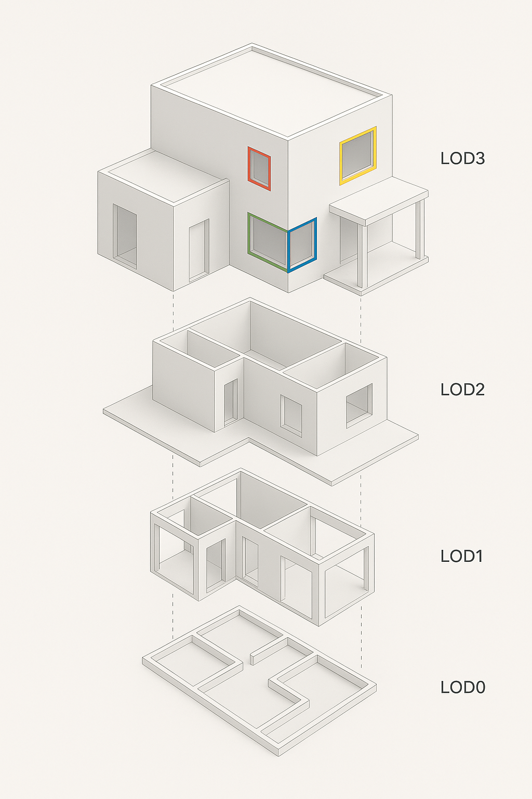
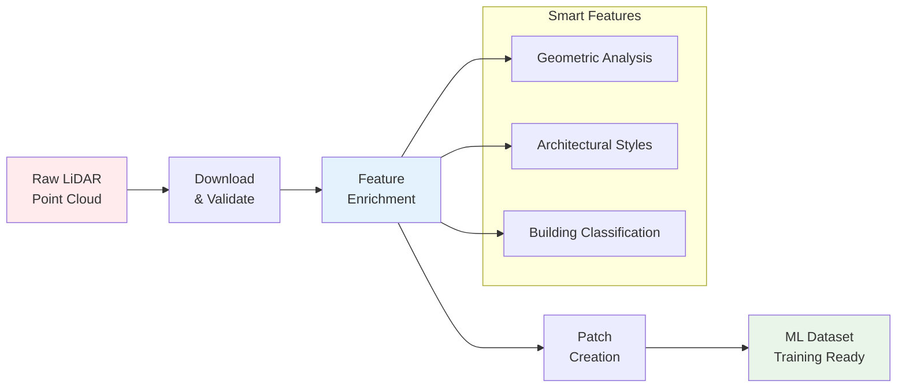

# IGN LiDAR HD Processing Library

**Ve**Enhanced Data Augmentation & RGB Improvements\*\*

✨ **What's New:**

- 🎯 **Enhanced Augmentation**: Features now computed on augmented geometry for better consistency (**disabled by default, enable with --augment**)
- 🎨 **RGB CloudCompare Fix**: Perfect color display with corrected 16-bit scaling (0-65535 range)
- ⚡ **GPU Acceleration**: Full support for CUDA-accelerated processing (5-10x speedup)
- 📦 **Pipeline Configuration**: YAML-based workflows for reproducibility
- 🔄 **Smart Resumability**: Never reprocess existing files
- 🌍 **Comprehensive Documentation**: English and French guides1\*\* | Python 3.8+ | MIT License

[](https://badge.fury.io/py/ign-lidar-hd)
[](https://www.python.org/downloads/)
[](https://opensource.org/licenses/MIT)

## 📺 Video Demo

<div align="center">
<a href="https://www.youtube.com/watch?v=ksBWEhkVqQI" target="_blank">

</a>
  <p><em>Learn how to process LiDAR data for machine learning applications</em></p>
</div>

---

## 🎉 Latest Release: v1.7.3

**🌿 Infrared Augmentation for Vegetation Analysis**

The latest release adds Near-Infrared (NIR) augmentation from IGN IRC orthophotos, enabling NDVI calculation and advanced vegetation/land cover analysis.

:::tip Quick Start

```bash
# Enrich with RGB + Infrared (recommended for ML!)
ign-lidar-hd enrich --input-dir data/ --output output/ \
  --auto-params --preprocess --add-rgb --add-infrared \
  --rgb-cache-dir cache/rgb --infrared-cache-dir cache/infrared
```

:::

**Key Features:**

- 🌿 Near-Infrared (NIR) values from IGN IRC orthophotos
- 📊 NDVI-ready datasets for vegetation analysis
- 🎨 Multi-modal learning: Geometry + RGB + NIR
- 💾 Smart caching system (disk + GPU)
- 🔧 Seamless integration with RGB augmentation

📖 [Infrared Guide](/docs/features/infrared-augmentation) | [NDVI Examples](/docs/features/infrared-augmentation#vegetation-indices)

---

## Previous Release: v1.7.1

**🤖 Automatic Parameter Analysis & Optimization**

Intelligent parameter analysis that automatically optimizes processing settings for each tile based on its characteristics.

**Key Features:**

- 🤖 Auto-analysis of tile characteristics (density, spacing, noise)
- 🎯 Adaptive parameter selection for urban/rural/mixed environments
- ⚡ Zero manual tuning required
- 📈 Optimal quality regardless of point density

📖 [Auto-Params Guide](/docs/guides/auto-params) | [Release Notes](/docs/release-notes/v1.7.1)

---

## Previous Release: v1.7.0

**🆕 Point Cloud Preprocessing for Artifact Mitigation**

✨ **What's New:**

- 🧹 **Point Cloud Preprocessing**: New preprocessing pipeline to reduce LiDAR scan line artifacts
- 📊 **Statistical Outlier Removal (SOR)**: Eliminates measurement noise and atmospheric returns
- 🎯 **Radius Outlier Removal (ROR)**: Removes scan line artifacts and isolated points
- 📦 **Voxel Downsampling**: Homogenizes point density and reduces memory usage
- ⚙️ **Configurable Parameters**: 9 new CLI flags for preprocessing control (--preprocess, --sor-k, --sor-std, etc.)
- 🎨 **Included Presets**: Conservative, Standard, Aggressive, Urban, Memory-Optimized
- 📈 **Measured Impact**: 60-80% artifact reduction, 40-60% cleaner normals, 15-30% overhead

**Impact:**

```bash
# Enable with default parameters
ign-lidar-hd enrich --input-dir data/ --output output/ --mode full --preprocess

# Conservative preprocessing (preserve details)
ign-lidar-hd enrich ... --preprocess --sor-k 15 --sor-std 3.0 --ror-radius 1.5 --ror-neighbors 3

# Aggressive preprocessing (maximum artifact removal)
ign-lidar-hd enrich ... --preprocess --sor-k 10 --sor-std 1.5 --ror-radius 0.8 --ror-neighbors 5 --voxel-size 0.3
```

📖 [Complete Preprocessing Guide](/docs/guides/preprocessing) | [Release Notes](/docs/release-notes/v1.7.0)

---

## Previous Release: v1.6.5

**Artefact-Free Geometric Features**

- 🎯 Radius parameter support for manual control or auto-estimation
- 📊 Comprehensive artefact audit validates radius-based search eliminates LIDAR scan artefacts
- ✅ Production validated with full documentation suite

---

## Previous Release: v1.6.2

**Geometric Features Quality & GPU Consistency**

✨ **What's New:**

- 🔧 **Critical GPU Fix**: Corrected feature formulas (GPU now matches CPU)
- 🛡️ **Robust Computation**: Degenerate case filtering and outlier-resistant curvature
- 🎯 **Enhanced Quality**: Radius search support and comprehensive validation
- ⚠️ **Breaking Change**: GPU feature values changed for users with GPU acceleration

:::warning Important for GPU Users
If you use `use_gpu=True`, feature values have changed (old formulas were incorrect). You'll need to retrain models or switch to CPU.
:::

📖 [v1.6.2 Notes](/docs/release-notes/v1.6.2) | [v1.6.0 Notes](/docs/release-notes/v1.6.0)

---

## Previous Release: v1.6.0

**Enhanced Data Augmentation & RGB Improvements**

✨ **What's New:**

- 🎯 **Enhanced Augmentation**: Features now computed on augmented geometry for better consistency
- 🎨 **RGB CloudCompare Fix**: Perfect color display with corrected 16-bit scaling (0-65535 range)
- ⚡ **GPU Acceleration**: Full support for CUDA-accelerated processing (5-10x speedup)
- 📦 **Pipeline Configuration**: YAML-based workflows for reproducibility
- 🔄 **Smart Resumability**: Never reprocess existing files
- � **Comprehensive Documentation**: English and French guides

�📺 **[Watch our demo video](https://youtu.be/ksBWEhkVqQI)** | [📖 Release Notes](/docs/release-notes/v1.6.0)

---

## Getting Started

Welcome to the **IGN LiDAR HD Processing Library** documentation!

Transform French LiDAR data into machine learning-ready datasets for building classification with this comprehensive Python toolkit. 🏗️

:::tip Why use this library?

- **🎯 Specialized for French LiDAR**: Optimized for IGN's LiDAR HD format and classification standards
- **⚡ Production-ready**: Battle-tested with 50+ tiles and comprehensive error handling
- **🚀 GPU-accelerated**: Optional CUDA support for 5-10x faster processing
- **📦 Complete pipeline**: From raw downloads to training-ready patches in one workflow
- **🔄 Smart resumability**: Automatically skip processed files and resume interrupted workflows
- **🎨 RGB augmentation**: Optional color enrichment from IGN orthophotos
- **🌍 Bilingual**: Full documentation in English and French
- **📊 Well-tested**: Comprehensive test suite with 20+ test modules
  :::

## What is IGN LiDAR HD?

The IGN LiDAR HD Processing Library is a comprehensive Python toolkit for processing high-density LiDAR data from the French National Institute of Geographic and Forest Information (IGN). It transforms raw point clouds into machine learning-ready datasets specifically designed for **Building Level of Detail (LOD) classification** tasks.



### Key Capabilities

This library enables researchers and developers to:

- **Download** LiDAR tiles directly from IGN servers with intelligent tile selection
- **Enrich** point clouds with advanced geometric and architectural features
- **Generate** training patches for deep learning models
- **Classify** building components at LOD2 (15 classes) and LOD3 (30+ classes) levels

## 🔄 Processing Pipeline Overview



## Key Features

- 🎯 **LiDAR-Only Processing** - No RGB dependency required
- 🎨 **RGB Augmentation** - Optional color enrichment from IGN orthophotos (NEW!)
- ⚡ **Smart Skip Detection** - Resume interrupted workflows
- 🏗️ **Multi-Level Classification** - LOD2 and LOD3 support
- 🚀 **GPU Acceleration** - Optional CUDA support
- 🔄 **Parallel Processing** - Multi-worker batch processing
- 📊 **Rich Features** - Comprehensive geometric feature extraction

## Quick Installation

```bash
pip install ign-lidar-hd
```

## Quick Example

```python
from ign_lidar import LiDARProcessor
from pathlib import Path

# Initialize processor for LOD2 building classification
processor = LiDARProcessor(lod_level="LOD2")

# Process a single LiDAR tile
input_file = Path("data/lidar_tile.laz")
output_dir = Path("output/")

# Extract ML-ready patches
patches = processor.process_tile(input_file, output_dir)
print(f"Generated {len(patches)} training patches")

# NEW: Process with RGB augmentation from IGN orthophotos
processor_rgb = LiDARProcessor(
    lod_level="LOD2",
    include_rgb=True,
    rgb_cache_dir=Path("cache/")
)
patches_rgb = processor_rgb.process_tile(input_file, output_dir)
print(f"Generated {len(patches_rgb)} patches with RGB colors!")
```

## Next Steps

- 📖 Read the [Installation Guide](./installation/quick-start)
- 🎓 Follow the [Basic Usage Guide](./guides/basic-usage)
- 🎨 **NEW:** Learn about [RGB Augmentation](./features/rgb-augmentation)
- 🔍 Explore [Smart Skip Features](./features/smart-skip)
- 📚 Check the [Memory Optimization Guide](./reference/memory-optimization)

## Project Status

This library is actively maintained and used for processing IGN LiDAR HD data for building component classification research. It supports:

- **LOD2 Classification**: 15 building component classes
- **LOD3 Classification**: 30 detailed building component classes
- **Feature Engineering**: 30+ geometric features per point
- **Data Formats**: LAZ 1.4, NPZ patches, QGIS-compatible outputs

## Getting Help

- 📋 Check the [Quick Reference](https://github.com/sducournau/IGN_LIDAR_HD_DATASET/blob/main/QUICK_REFERENCE.md)
- 🐛 Report issues on [GitHub Issues](https://github.com/sducournau/IGN_LIDAR_HD_DATASET/issues)
- 💬 Ask questions in [GitHub Discussions](https://github.com/sducournau/IGN_LIDAR_HD_DATASET/discussions)
