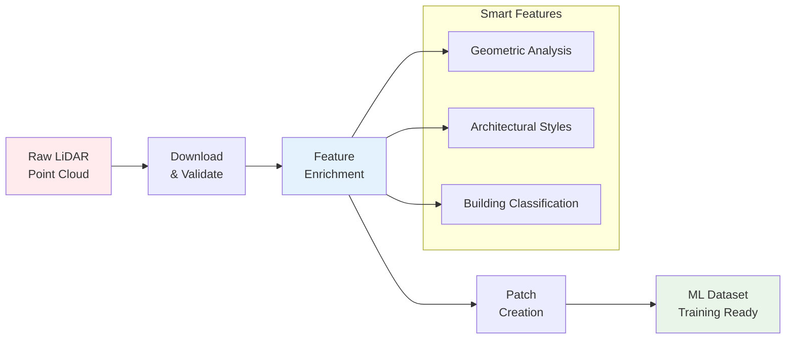

## 🎉 First Release Announcement

**We're excited to announce the first official release of the IGN LiDAR HD Processing Library!**

📺 **[Watch our release video](https://youtu.be/ksBWEhkVqQI)** to see the library in action!

📖 **[Read the full release announcement](/blog/first-release)** in our blog!

---

## Getting Started

Welcome to the **IGN LiDAR HD Processing Library** documentation!

Transform French LiDAR data into machine learning-ready datasets for building classification with this comprehensive Python toolkit. 🏗️

:::tip Why use this library?

- **🎯 Specialized for French LiDAR**: Optimized for IGN's LiDAR HD format and classification standards
- **⚡ Production-ready**: Battle-tested with 50+ tile processing and comprehensive error handling
- **🚀 GPU-accelerated**: Optional CUDA support for faster feature computation
- **📦 Complete pipeline**: From raw downloads to training-ready patches in one workflow
  :::

## What is IGN LiDAR HD?

The IGN LiDAR HD Processing Library is a comprehensive Python toolkit for processing high-density LiDAR data from the French National Institute of Geographic and Forest Information (IGN). It transforms raw point clouds into machine learning-ready datasets specifically designed for **Building Level of Detail (LOD) classification** tasks.

This library enables researchers and developers to:

- **Download** LiDAR tiles directly from IGN servers
- **Enrich** point clouds with advanced geometric and architectural features
- **Generate** training patches for deep learning models
- **Classify** building components at LOD2 (15 classes) and LOD3 (30+ classes) levels

## 🔄 Processing Pipeline Overview



## Key Features

- 🎯 **LiDAR-Only Processing** - No RGB dependency
- ⚡ **Smart Skip Detection** - Resume interrupted workflows
- 🏗️ **Multi-Level Classification** - LOD2 and LOD3 support
- 🚀 **GPU Acceleration** - Optional CUDA support
- 🔄 **Parallel Processing** - Multi-worker batch processing
- 📊 **Rich Features** - Comprehensive geometric feature extraction

## Quick Installation

```bash
pip install ign-lidar-hd
```

## Quick Example

```python
from ign_lidar import LiDARProcessor
from pathlib import Path

# Initialize processor for LOD2 building classification
processor = LiDARProcessor(lod_level="LOD2")

# Process a single LiDAR tile
input_file = Path("data/lidar_tile.laz")
output_dir = Path("output/")

# Extract ML-ready patches
patches = processor.process_tile(input_file, output_dir)
print(f"Generated {len(patches)} training patches")
```

## Next Steps

- 📖 Read the [Installation Guide](./installation/quick-start)
- 🎓 Follow the [Basic Usage Guide](./guides/basic-usage)
- 🔍 Explore [Smart Skip Features](./features/smart-skip)
- 📚 Check the [Memory Optimization Guide](./reference/memory-optimization)

## Project Status

This library is actively maintained and used for processing IGN LiDAR HD data for building component classification research. It supports:

- **LOD2 Classification**: 15 building component classes
- **LOD3 Classification**: 30 detailed building component classes
- **Feature Engineering**: 30+ geometric features per point
- **Data Formats**: LAZ 1.4, NPZ patches, QGIS-compatible outputs

## Getting Help

- 📋 Check the [Quick Reference](https://github.com/sducournau/IGN_LIDAR_HD_DATASET/blob/main/QUICK_REFERENCE.md)
- 🐛 Report issues on [GitHub Issues](https://github.com/sducournau/IGN_LIDAR_HD_DATASET/issues)
- 💬 Ask questions in [GitHub Discussions](https://github.com/sducournau/IGN_LIDAR_HD_DATASET/discussions)
