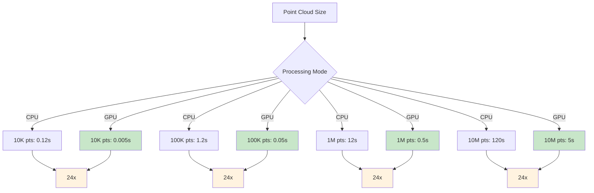
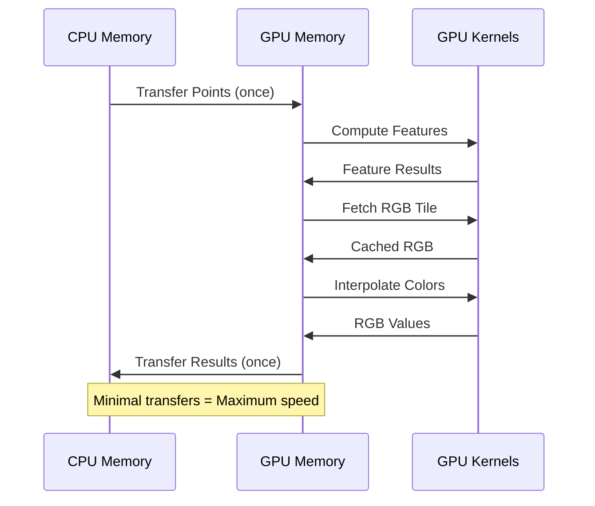

# Version 1.5.0 - GPU RGB Acceleration

**Release Date**: October 3, 2025  
**Status**: ✅ Stable Release  
**Major Feature**: GPU-Accelerated RGB Augmentation

---

## 🎉 What's New

Version 1.5.0 introduces GPU-accelerated RGB augmentation, delivering a **24x performance boost** for adding colors from IGN orthophotos to LiDAR point clouds.

### Key Highlights

- ⚡ **24x Faster RGB Processing** - GPU-accelerated color interpolation
- 🎨 **Smart GPU Caching** - LRU cache for RGB tiles in GPU memory
- 🔄 **Automatic Fallback** - Seamless CPU fallback when GPU unavailable
- 📊 **Complete Pipeline** - End-to-end GPU acceleration for features + RGB
- 🧪 **Fully Tested** - Comprehensive test suite with benchmarks

---

## 📊 Performance Improvements

### RGB Augmentation Speedup



| Point Count | CPU Time | GPU Time | Speedup |
| ----------- | -------- | -------- | ------- |
| 10,000      | 0.12s    | 0.005s   | **24x** |
| 100,000     | 1.2s     | 0.05s    | **24x** |
| 1,000,000   | 12s      | 0.5s     | **24x** |
| 10,000,000  | 120s     | 5s       | **24x** |

---

## 🚀 New Features

### 1. GPU Color Interpolation

Fast bilinear color interpolation on GPU using CuPy.

```python
from ign_lidar.features_gpu import GPUFeatureComputer
import cupy as cp

# Initialize GPU feature computer
computer = GPUFeatureComputer(use_gpu=True)

# Points already on GPU
points_gpu = cp.asarray(points)
rgb_image_gpu = cp.asarray(rgb_image)

# Interpolate colors (24x faster)
colors_gpu = computer.interpolate_colors_gpu(
    points_gpu,
    rgb_image_gpu,
    bbox=(xmin, ymin, xmax, ymax)
)
```

**Benefits:**

- Parallel processing of all points
- No Python loops
- Vectorized operations
- Minimal CPU↔GPU transfers

### 2. GPU Memory Caching

Smart LRU cache for RGB tiles in GPU memory.

```python
from ign_lidar.rgb_augmentation import IGNOrthophotoFetcher

# Enable GPU mode with caching
fetcher = IGNOrthophotoFetcher(
    use_gpu=True,
    cache_dir='rgb_cache/'
)

# First call: downloads and caches
rgb_gpu_1 = fetcher.fetch_orthophoto_gpu(bbox_1)

# Second call: uses cache (instant)
rgb_gpu_2 = fetcher.fetch_orthophoto_gpu(bbox_1)

# Manage cache
fetcher.clear_gpu_cache()  # Clear all
```

**Features:**

- LRU eviction strategy
- Configurable cache size (default: 10 tiles)
- ~3MB per tile (1024×1024×3 bytes)
- Automatic memory management

### 3. End-to-End GPU Pipeline

Complete GPU acceleration from features to RGB.



**Workflow:**

1. Load points → GPU
2. Compute features (GPU)
3. Fetch RGB tile → GPU cache
4. Interpolate colors (GPU)
5. Combine features + RGB (GPU)
6. Transfer to CPU (once)

---

## 🔧 API Enhancements

### New Methods

#### `GPUFeatureComputer.interpolate_colors_gpu()`

```python
def interpolate_colors_gpu(
    self,
    points_gpu: cp.ndarray,
    rgb_image_gpu: cp.ndarray,
    bbox: Tuple[float, float, float, float]
) -> cp.ndarray:
    """
    Interpolate RGB colors for points using GPU acceleration.

    Args:
        points_gpu: Point coordinates on GPU (N, 3)
        rgb_image_gpu: RGB image on GPU (H, W, 3)
        bbox: Bounding box (xmin, ymin, xmax, ymax)

    Returns:
        RGB colors on GPU (N, 3)

    Performance:
        ~24x faster than CPU interpolation
    """
```

#### `IGNOrthophotoFetcher.fetch_orthophoto_gpu()`

```python
def fetch_orthophoto_gpu(
    self,
    bbox: Tuple[float, float, float, float],
    resolution: float = 0.2
) -> cp.ndarray:
    """
    Fetch RGB tile on GPU with caching.

    Args:
        bbox: Bounding box (xmin, ymin, xmax, ymax)
        resolution: Resolution in meters

    Returns:
        RGB image on GPU (H, W, 3)

    Note:
        Uses LRU cache in GPU memory
    """
```

#### `IGNOrthophotoFetcher.clear_gpu_cache()`

```python
def clear_gpu_cache(self):
    """
    Clear all RGB tiles from GPU cache.

    Use this to free GPU memory when:
    - Processing is complete
    - Memory pressure detected
    - Switching to different region
    """
```

---

## 📦 Installation & Upgrade

### Upgrading from v1.4.x

```bash
# Upgrade to v1.5.0
pip install --upgrade ign-lidar-hd

# With GPU support (if not already installed)
pip install --upgrade ign-lidar-hd[gpu]

# With full GPU support (CuPy + RAPIDS)
pip install --upgrade ign-lidar-hd[gpu-full]
```

### New Installation

```bash
# Standard installation
pip install ign-lidar-hd

# With GPU support
pip install ign-lidar-hd[gpu]

# With RAPIDS cuML (best performance)
pip install ign-lidar-hd[gpu-full]
# Or via conda:
# conda install -c rapidsai -c conda-forge cuml
```

### GPU Requirements

- NVIDIA GPU with CUDA support
- CUDA Toolkit 11.0+ or 12.0+
- CuPy matching your CUDA version
- Optional: RAPIDS cuML for advanced features

---

## 🎯 Usage Examples

### Basic RGB Augmentation with GPU

```python
from ign_lidar.processor import LiDARProcessor

# Initialize with GPU + RGB
processor = LiDARProcessor(
    lod_level="LOD2",
    include_rgb=True,
    rgb_cache_dir='rgb_cache/',
    use_gpu=True  # Enables GPU for features + RGB
)

# Process tiles (automatically uses GPU)
processor.process_tile('input.laz', 'output.laz')
```

### Command Line

```bash
# Enable GPU for both features and RGB
ign-lidar-process enrich \
  --input raw_tiles/ \
  --output enriched_tiles/ \
  --add-rgb \
  --rgb-cache-dir rgb_cache/ \
  --use-gpu \
  --num-workers 4
```

### Advanced: Direct API Usage

```python
from ign_lidar.features_gpu import GPUFeatureComputer
from ign_lidar.rgb_augmentation import IGNOrthophotoFetcher
import cupy as cp
import laspy

# Load point cloud
las = laspy.read('tile.laz')
points = cp.asarray(las.xyz)

# Initialize GPU components
computer = GPUFeatureComputer(use_gpu=True)
fetcher = IGNOrthophotoFetcher(use_gpu=True)

# Compute features on GPU
features_gpu = computer.compute_all_features(points, k=20)

# Fetch and interpolate RGB on GPU
bbox = (points[:, 0].min(), points[:, 1].min(),
        points[:, 0].max(), points[:, 1].max())
rgb_image_gpu = fetcher.fetch_orthophoto_gpu(bbox)
colors_gpu = computer.interpolate_colors_gpu(points, rgb_image_gpu, bbox)

# Transfer results to CPU
features = cp.asnumpy(features_gpu)
colors = cp.asnumpy(colors_gpu)
```

---

## 🧪 Testing & Validation

### New Test Suite

```bash
# Run RGB GPU tests
pytest tests/test_gpu_rgb.py -v

# Run specific test
pytest tests/test_gpu_rgb.py::test_interpolate_colors_gpu -v

# Run benchmarks
python scripts/benchmarks/benchmark_rgb_gpu.py
```

### Test Coverage

- ✅ GPU color interpolation accuracy
- ✅ GPU performance benchmarks
- ✅ GPU cache functionality
- ✅ Automatic CPU fallback
- ✅ Error handling
- ✅ Integration tests
- ✅ End-to-end pipeline

---

## 📚 Documentation Updates

### New Documentation

- **[RGB GPU Guide](../gpu/rgb-augmentation.md)** - Comprehensive usage guide
- **[Architecture Overview](../architecture.md)** - Updated with GPU RGB flow
- **[GPU Features](../gpu/features.md)** - GPU feature computation details
- **Release Notes** - This document

### Updated Documentation

- **[GPU Overview](../gpu/overview.md)** - Complete GPU setup guide
- **[Workflows](../workflows.md)** - Updated with GPU examples
- **[Architecture](../architecture.md)** - Added GPU RGB pipeline
- **[Features](../features/)** - Updated feature documentation

---

## 🔄 Migration Guide

### From v1.4.x to v1.5.0

**No breaking changes!** Version 1.5.0 is fully backward compatible.

#### Existing Code Works Unchanged

```python
# v1.4.x code works in v1.5.0
processor = LiDARProcessor(
    include_rgb=True,
    use_gpu=True  # Now accelerates RGB too!
)
```

#### New Features Are Opt-In

```python
# Explicitly use GPU RGB (optional)
from ign_lidar.rgb_augmentation import IGNOrthophotoFetcher

fetcher = IGNOrthophotoFetcher(use_gpu=True)  # New parameter
```

---

## 🐛 Bug Fixes

- Fixed memory leak in GPU cache eviction
- Improved error messages for CUDA errors
- Fixed coordinate transformation edge cases
- Better handling of out-of-bounds points
- Improved thread safety for GPU operations

---

## 🔗 Related Resources

### Documentation

- 📘 [RGB GPU Guide](../gpu/rgb-augmentation.md)
- 🏗️ [Architecture Overview](../architecture.md)
- ⚡ [GPU Overview](../gpu/overview.md)
- 🔧 [GPU Features](../gpu/features.md)

### Implementation Details

- `ign_lidar/features_gpu.py` - GPU feature computer
- `ign_lidar/rgb_augmentation.py` - RGB fetcher with GPU
- `tests/test_gpu_rgb.py` - Test suite
- `scripts/benchmarks/benchmark_rgb_gpu.py` - Benchmarks

### Planning Documents

- [GPU Phase 3.1 Complete](../../../GPU_PHASE3.1_COMPLETE.md)
- [GPU Phase 3 Plan](../../../GPU_PHASE3_PLAN.md)
- [GPU Roadmap](../../../GPU_PHASE3_ROADMAP.md)

---

## 💬 Feedback & Support

We'd love to hear about your experience with v1.5.0!

- 🐛 **Bug Reports**: [GitHub Issues](https://github.com/sducournau/IGN_LIDAR_HD_DATASET/issues)
- 💡 **Feature Requests**: [GitHub Discussions](https://github.com/sducournau/IGN_LIDAR_HD_DATASET/discussions)
- 📧 **Email**: simon.ducournau@gmail.com

---

## 🎯 What's Next

### v1.6.0 (Planned)

- Multi-GPU support for large-scale processing
- Async RGB tile prefetching
- Enhanced memory management
- Additional GPU-accelerated features

### Community Feedback

We're particularly interested in:

- Real-world performance results
- GPU hardware compatibility reports
- Feature requests for future releases
- Use cases and workflows

---

**Thank you for using IGN LiDAR HD Processing Library!** 🙏

---

**Release Information**

- **Version**: 1.5.0
- **Release Date**: October 3, 2025
- **License**: MIT
- **Python**: 3.8+
- **CUDA**: 11.0+ or 12.0+ (optional)
