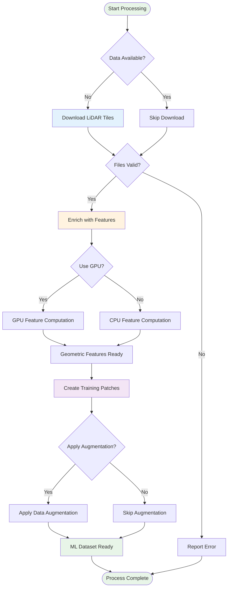
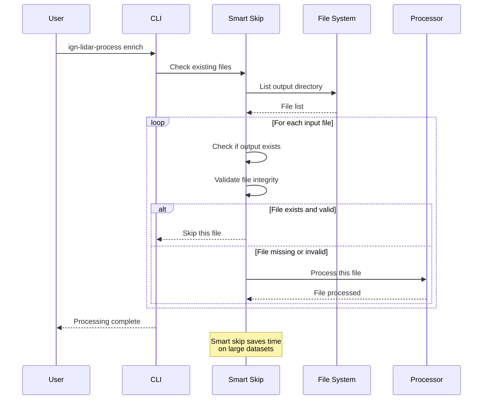
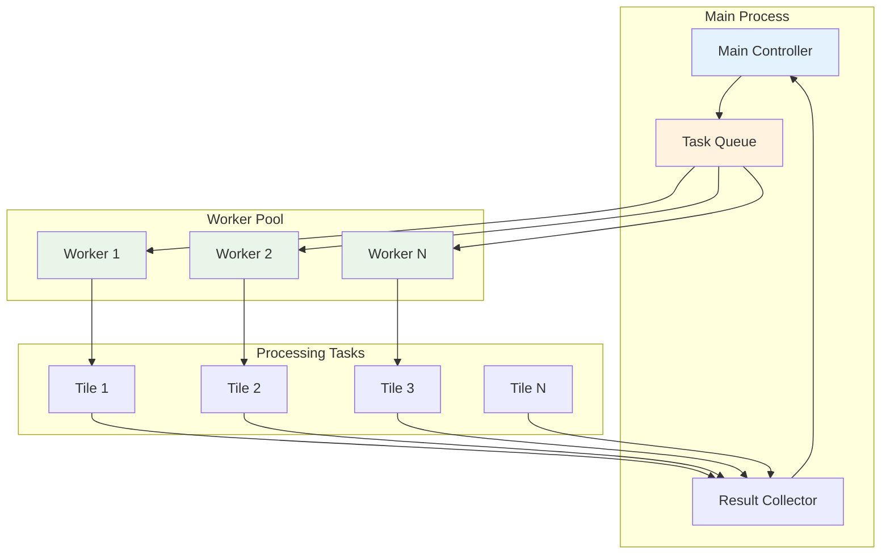
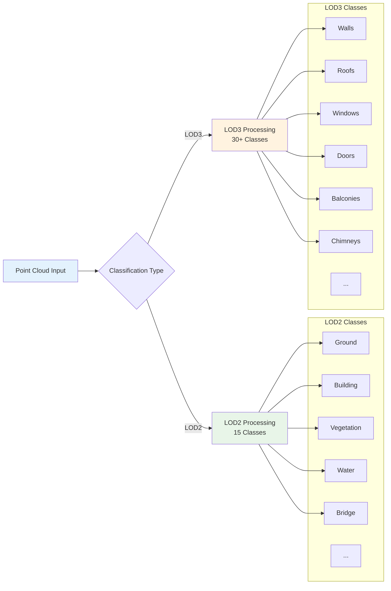
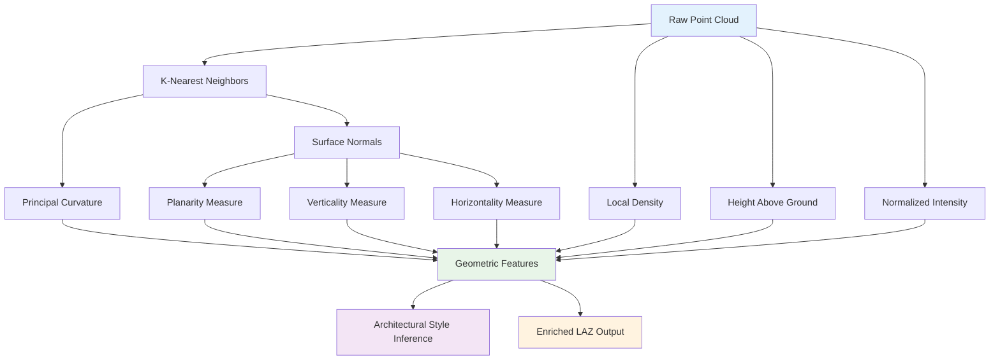
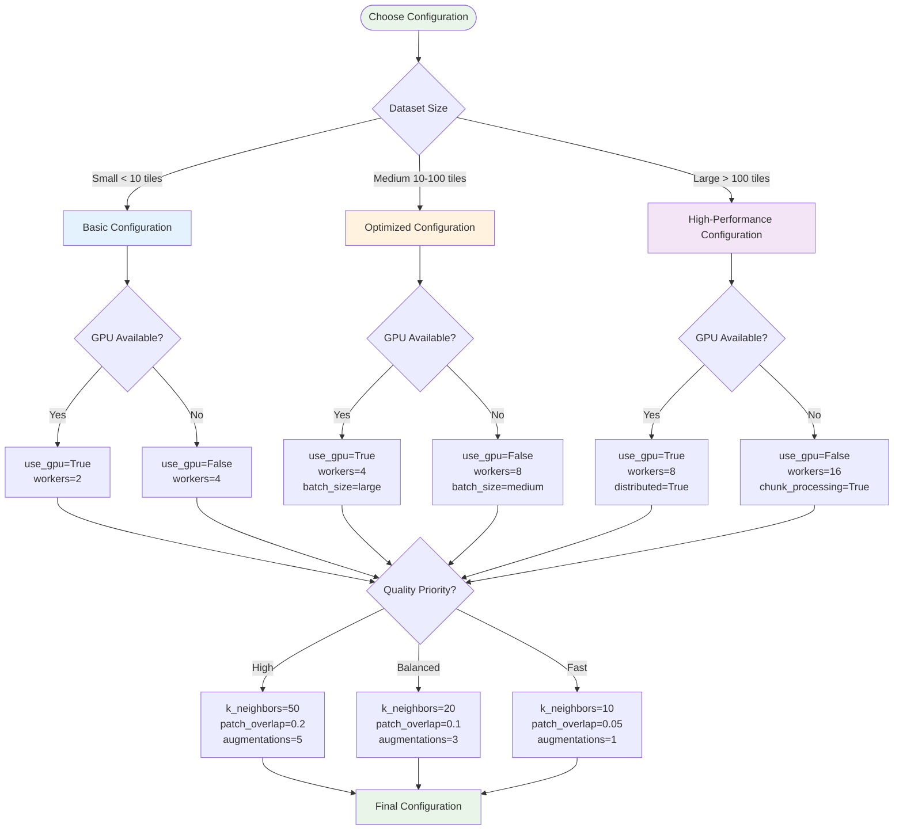

# Workflow Guide

This guide demonstrates common processing workflows with visual representations to help you understand the data flow and decision points.

## 🚀 Basic Workflow

The most common workflow for processing LiDAR data into ML-ready datasets.



## 🔄 Smart Skip Workflow

Understanding how the smart skip system optimizes repeated runs.



## 🏗️ Parallel Processing Workflow

How the library handles multi-worker processing for optimal performance.



## 🎯 LOD Classification Workflow

Understanding how building components are classified into LOD levels.



## 📊 Feature Extraction Pipeline

Detailed view of the geometric feature computation process.



## 🔧 Configuration Decision Tree

How to choose optimal settings for your use case.



## 💡 Best Practice Workflows

### Urban Area Processing

```bash
# Optimized for dense urban environments
ign-lidar-process download --bbox 2.0,48.8,2.1,48.9 --output urban_tiles/
ign-lidar-process enrich --input-dir urban_tiles/ --output urban_enriched/ --use-gpu --k-neighbors 30
ign-lidar-process process --input-dir urban_enriched/ --output urban_patches/ --lod-level LOD3 --num-augmentations 5
```

### Rural/Natural Area Processing

```bash
# Optimized for sparse rural environments
ign-lidar-process download --bbox -1.0,46.0,0.0,47.0 --output rural_tiles/
ign-lidar-process enrich --input-dir rural_tiles/ --output rural_enriched/ --k-neighbors 15
ign-lidar-process process --input-dir rural_enriched/ --output rural_patches/ --lod-level LOD2 --num-augmentations 2
```

### High-Performance Batch Processing

```bash
# Maximum throughput for large datasets
ign-lidar-process enrich --input-dir tiles/ --output enriched/ --use-gpu --num-workers 8 --batch-size large
ign-lidar-process process --input-dir enriched/ --output patches/ --num-workers 16 --skip-existing
```

