# Utilisation de base

This guide covers the essential workflows pour traiter IGN LiDAR HD data into jeux de données prêts pour l'apprentissage automatique.

## Vue d'ensemble

The IGN LiDAR HD processing workflow consists of three main steps:

1. **Téléchargement** - Obtenir les tuiles LiDAR depuis les serveurs IGN
2. **Enrichissement** - Ajouter des caractéristiques de composants de bâtiment aux points
3. **Traitement** - Extraire des patches pour l'apprentissage automatique

### 🔄 Workflow complet Pipeline

```mermaid
flowchart TD
    subgraph "Entrée"
        IGN[IGN LiDAR HD<br/>Service Web]
    end

    subgraph "Étape 1: Téléchargement"
        D1[Requête service WFS]
        D2[Téléchargement LAZ Tiles]
        D3[Validation fichiers]
    end

    subgraph "Étape 2: Enrichissement"
        E1[Load Nuage de points]
        E2[Compute Caractéristiques géométriques]
        E3[Classify Composants de bâtiment]
        E4[Save Enrichissemented LAZ]
    end

    subgraph "Étape 3: Traitement"
        P1[Extraction patches]
        P2[Application augmentations]
        P3[Attribution labels LOD]
        P4[Sauvegarde fichiers NPZ]
    end

    subgraph "Sortie"
        ML[Jeu de données ML<br/>Patches NPZ]
    end

    IGN --> D1
    D1 --> D2
    D2 --> D3
    D3 --> E1
    E1 --> E2
    E2 --> E3
    E3 --> E4
    E4 --> P1
    P1 --> P2
    P2 --> P3
    P3 --> P4
    P4 --> ML

    style IGN fill:#e3f2fd
    style ML fill:#e8f5e8
    style D2 fill:#fff3e0
    style E2 fill:#f3e5f5
    style P1 fill:#fce4ec
```



### 📊 Data Transformation Flow

```mermaid
graph LR
    subgraph "Données brutes"
        Raw[Nuage de points<br/>XYZ + Intensity<br/>~1M points/tile]
    end

    subgraph "Enrichissemented Data"
        Enrichissemented[Enhanced Cloud<br/>XYZ + 30 Features<br/>Building Classification]
    end

    subgraph "Jeu de données ML"
        Patches[Patches d'entraînement<br/>16K points/patch<br/>LOD Labels]
    end

    Raw -->|Enrichissement Traitement| Enrichissemented
    Enrichissemented -->|Extraction patches| Patches

    style Raw fill:#ffebee
    style Enrichissemented fill:#e8f5e8
    style Patches fill:#e3f2fd
```



## Étape 1: Téléchargement LiDAR Tiles

Téléchargement LiDAR tiles for your area of interest:

```bash
# Téléchargement tiles for Paris center
ign-lidar-hd download \
  --bbox 2.25,48.82,2.42,48.90 \
  --output /chemin/vers/tuiles_brutes/ \
  --max-tiles 10
```

### Paramètres

- `--bbox`: Boîte englobante au format `min_lon,min_lat,max_lon,max_lat`
- `--output`: Répertoire pour sauvegarder downloaded tiles
- `--max-tiles`: Nombre maximum de tuiles to download (optionnel)

### Sortie

Téléchargemented tiles are saved as LAZ files:

```
tuiles_brutes/
├── LIDARHD_FXX_0123_4567_LA93_IGN69_2020.laz
├── LIDARHD_FXX_0124_4567_LA93_IGN69_2020.laz
└── ...
```

## Étape 2: Enrichissement with Building Features

Add building component classification features to the point clouds:

```bash
# Enrichissement tiles with building features
ign-lidar-hd enrich \
  --input-dir /chemin/vers/tuiles_brutes/ \
  --output /chemin/vers/tuiles_enrichies/ \
  --mode full \
  --num-workers 4
```

### Paramètres

- `--input-dir`: Directory containing raw LAZ tiles
- `--output`: Répertoire pour sauvegarder enriched tiles
- `--mode`: Feature extraction mode (currently only `building`)
- `--num-workers`: Nombre de workers parallèles (optionnel)

### Sortie

Enrichissemented tiles contain additional point attributes for building classification:

```
tuiles_enrichies/
├── LIDARHD_FXX_0123_4567_LA93_IGN69_2020.laz  # With building features
├── LIDARHD_FXX_0124_4567_LA93_IGN69_2020.laz
└── ...
```

Chaque point dispose maintenant de 30+ caractéristiques géométriques pour la classification des composants de bâtiment.

## Étape 3: Extraction patches

Extract small patches suitable for machine learning:

```bash
# Extract patches for LOD2 building classification
ign-lidar-hd process \
  --input /chemin/vers/tuiles_enrichies/ \
  --output /chemin/vers/patches/ \
  --lod-level LOD2 \
  --patch-size 10.0 \
  --num-workers 4
```

### Paramètres

- `--input`: Directory containing enriched LAZ tiles
- `--output`: Répertoire pour sauvegarder extracted patches
- `--lod-level`: Classification level (`LOD2` or `LOD3`)
- `--patch-size`: Patch size in meters (default: 10.0)
- `--num-workers`: Nombre de workers parallèles (optionnel)

### Sortie

Patches are saved as NPZ files with point clouds and labels:

```
patches/
├── tile_0123_4567/
│   ├── patch_0001.npz
│   ├── patch_0002.npz
│   └── ...
├── tile_0124_4567/
│   └── ...
```

Each patch contains:

- Point coordinates (X, Y, Z)
- Geometric features (30+ attributes)
- Building component labels
- Patch metadata

## Niveaux de classification

### LOD2 (15 Classes)

Basic building components suitable for urban analysis:

- Wall, Roof, Ground, Vegetation
- Window, Door, Balcony, Chimney
- And 7 more classes...

### LOD3 (30 Classes)

Detailed building components for architectural analysis:

- All LOD2 classes plus:
- Roof details (tiles, gutters, dormers)
- Facade elements (shutters, decorative features)
- And 15 additional detailed classes...

## Workflow complet Exemple

Here's a complete example processing the 13th arrondissement of Paris:

```bash
# 1. Téléchargement tiles
ign-lidar-hd download \
  --bbox 2.32,48.82,2.38,48.86 \
  --output data/tuiles_brutes/ \
  --max-tiles 20

# 2. Enrichissement with features
ign-lidar-hd enrich \
  --input-dir data/tuiles_brutes/ \
  --output data/tuiles_enrichies/ \
  --mode full \
  --num-workers 6

# 3. Extract patches
ign-lidar-hd process \
  --input data/tuiles_enrichies/ \
  --output data/patches/ \
  --lod-level LOD2 \
  --patch-size 10.0 \
  --num-workers 6
```

Expected processing time for 20 tiles:

- Téléchargement: ~15 minutes (depends on network)
- Enrichissement: ~45 minutes (with 6 workers)
- Traitement: ~30 minutes (with 6 workers)

## Chargement des données

Once you have patches, load them for machine learning:

```python
import numpy as np

# Load a single patch
data = np.load('patches/tile_0123_4567/patch_0001.npz')
points = data['points']        # Shape: (N, 3) - X, Y, Z
features = data['features']    # Shape: (N, 30+) - Geometric features
labels = data['labels']        # Shape: (N,) - Building component labels

print(f"Patch has {len(points)} points")
print(f"Feature dimensions: {features.shape[1]}")
print(f"Unique labels: {np.unique(labels)}")
```

## Considérations sur la mémoire

For large datasets, monitor memory usage:

```bash
# Check memory usage during processing
htop

# Reduce workers if memory is limited
ign-lidar-hd process --num-workers 2

# Traitement tiles one by one for very large tiles
ign-lidar-hd process --num-workers 1
```

See the [Memory Optimization Guide](../reference/memory-optimization) for detailed memory management strategies.

## Détection intelligente de saut

All commands automatically skip existing outputs:

```bash
# Run the same command twice - second run skips existing files
ign-lidar-hd download --bbox 2.32,48.82,2.38,48.86 --output data/tuiles_brutes/
# First run: Téléchargements new tiles
# Second run: Skips existing tiles automatically

# Force reprocessing with --force flag
ign-lidar-hd process --input data/enriched/ --output data/patches/ --force
```

See the [Smart Skip Features](../features/smart-skip) guide for details.

## Dépannage

### Téléchargement Issues

```bash
# Check network connectivity
ping geoservices.ign.fr

# Verify bbox coordinates (should be in France)
# Valid range: longitude 1-8, latitude 42-51
```

### Traitementing Errors

```bash
# Check file permissions
ls -la /chemin/vers/tiles/

# Verify LAZ file integrity
lasinfo tile.laz

# Reduce workers if getting memory errors
ign-lidar-hd process --num-workers 1
```

### Missing Features

```bash
# Verify enrichment completed successfully
lasinfo enriched_tile.laz | grep "extra bytes"

# Re-enrich if features are missing
ign-lidar-hd enrich --input-dir raw/ --output enriched/ --force
```

## Prochaines étapes

- **Advanced Traitementing**: Learn about [GPU acceleration](gpu-acceleration.md)
- **QGIS Integration**: See [QGIS integration guide](qgis-integration.md)
- **Batch Traitementing**: Check out [parallel processing examples](../examples/parallel_processing_example.py)
- **Custom Features**: Develop [custom feature extractors](../tutorials/custom-features)
