# Workflow complet Guide

This guide walks you through the entire process of transforming raw IGN LiDAR HD data into jeux de données prêts pour l'apprentissage automatique.

## 📋 Vue d'ensemble

The complete workflow consists of three main stages:

1. **Téléchargement** - Acquire LiDAR tiles from IGN servers
2. **Enrichissement** - Add caractéristiques géométriques and optionnel RGB data
3. **Patch** - Create training-ready patches for ML models

```mermaid
flowchart TD
    subgraph "Stage 1: Téléchargement"
        A[Define Area of Interest] --> B{Selection Method}
        B -->|Bounding Box| C[IGN WFS Query]
        B -->|Tile IDs| D[Direct Téléchargement]
        B -->|Strategic| E[Urban/Building Selection]
        C --> F[Téléchargement LAZ Tiles]
        D --> F
        E --> F
    end

    subgraph "Stage 2: Enrichissement"
        F --> G[Load Nuage de points]
        G --> H{Traitementing Mode}
        H -->|Building| I[Extract Buildings]
        H -->|Full| J[Full Classification]
        I --> K{Add RGB?}
        J --> K
        K -->|Yes| L[RGB Augmentation<br/>from Orthophotos]
        K -->|No| M[Caractéristiques géométriques]
        L --> M
        M --> N{GPU Available?}
        N -->|Yes| O[GPU Acceleration<br/>5-10x Faster]
        N -->|No| P[CPU Traitementing]
        O --> Q[Export Enrichissemented LAZ]
        P --> Q
    end

    subgraph "Stage 3: Patch Generation"
        Q --> R[Split into Patches<br/>150m × 150m]
        R --> U[Quality Filter]
        U --> V[LOD Classification<br/>LOD2 or LOD3]
        V --> W[Jeu de données ML<br/>Train/Val/Test Split]
    end

    style A fill:#e3f2fd
    style F fill:#fff9c4
    style Q fill:#fff9c4
    style W fill:#c8e6c9
    style O fill:#b2dfdb
    style P fill:#ffccbc
```



## 🎯 Prerequisites

### Required

- Python 3.8 or higher
- `ign-lidar-hd` package installed
- Internet connection (for downloading tiles)
- ~10GB free disk space per 10 tiles

### Optional

- NVIDIA GPU with CUDA support (for 5-10x speedup)
- IGN BD ORTHO® orthophotos (for RGB augmentation)

## 🚀 Method 1: Pipeline Configuration (Recommended)

The easiest way to run a complete workflow is using YAML configuration files.

### Étape 1: Create Configuration File

```bash
ign-lidar-hd pipeline config.yaml --create-example full
```

This creates a `config.yaml` file with all options:

```yaml
# config.yaml - Complete Pipeline Configuration
global:
  num_workers: 4 # Parallel processing threads
  verbose: true # Detailed logging

download:
  # Bounding box: longitude_min, latitude_min, longitude_max, latitude_max
  bbox: "2.3, 48.8, 2.4, 48.9" # Paris area
  output: "data/raw"
  max_tiles: 10
  tile_selection_strategy: "urban" # or "building_rich", "random"

enrich:
  input_dir: "data/raw"
  output: "data/enriched"
  mode: "full" # Focus on building features

  # RGB Augmentation (optionnel)
  add_rgb: true
  rgb_source: "ign_orthophoto"
  rgb_cache_dir: "cache/orthophotos"

  # GPU Acceleration (optionnel)
  use_gpu: true # Auto-fallback to CPU if GPU unavailable

  # Feature Extraction
  compute_normals: true
  compute_curvature: true
  neighborhood_size: 20

patch:
  input_dir: "data/enriched"
  output: "data/patches"
  lod_level: "LOD2" # or "LOD3"
  num_points: 16384
  patch_size: 150 # meters
  overlap: 0.1 # 10% overlap

  # Data Augmentation
  augment: true
  augmentation_factor: 3 # Generate 3 augmented versions per patch

  # Quality Control
  min_building_points: 1000
  filter_empty_patches: true
```

### Étape 2: Run Complete Pipeline

```bash
ign-lidar-hd pipeline config.yaml
```

The pipeline will:

1. ✅ Téléchargement tiles from IGN
2. ✅ Enrichissement with features and optionnel RGB
3. ✅ Create training patches
4. ✅ Save metadata and statistics

**Sortie Structure:**

```
project/
├── config.yaml
├── data/
│   ├── raw/           # Téléchargemented tiles
│   ├── enriched/      # Feature-enriched tiles
│   └── patches/       # ML-ready patches
│       ├── LOD2/
│       │   ├── train/
│       │   ├── val/
│       │   └── test/
│       └── metadata.json
└── cache/
    └── orthophotos/   # Cached RGB data
```

### Étape 3: Verify Results

```python
from pathlib import Path
import json

# Load metadata
metadata = json.loads(Path("data/patches/metadata.json").read_text())

print(f"Total patches: {metadata['total_patches']}")
print(f"Classes: {metadata['classes']}")
print(f"Features: {metadata['features']}")
```

## 🛠️ Method 2: Command-Line Étape by Étape

For more control, run each stage separately.

### Stage 1: Téléchargement Tiles

```bash
# Téléchargement by bounding box (Paris area)
ign-lidar-hd download \
  --bbox 2.3,48.8,2.4,48.9 \
  --output data/raw \
  --max-tiles 10 \
  --strategy urban

# Or download specific tiles
ign-lidar-hd download \
  --tiles 0750_6620 0750_6621 0750_6622 \
  --output data/raw
```

**Options:**

- `--bbox`: Geographic bounding box (lon_min, lat_min, lon_max, lat_max)
- `--max-tiles`: Limit number of tiles to download
- `--strategy`: Tile selection strategy (urban/building_rich/random)
- `--tiles`: Specific tile IDs to download

### Stage 2: Enrichissement with Features

```bash
# Basic enrichment (CPU only)
ign-lidar-hd enrich \
  --input-dir data/raw \
  --output data/enriched \
  --num-workers 4

# With GPU acceleration
ign-lidar-hd enrich \
  --input-dir data/raw \
  --output data/enriched \
  --use-gpu \
  --num-workers 2

# With RGB augmentation
ign-lidar-hd enrich \
  --input-dir data/raw \
  --output data/enriched \
  --add-rgb \
  --rgb-cache-dir cache/orthophotos \
  --num-workers 4
```

**Options:**

- `--use-gpu`: Enable GPU acceleration (requires CUDA)
- `--add-rgb`: Add RGB colors from IGN orthophotos
- `--rgb-cache-dir`: Cache directory for orthophoto tiles
- `--num-workers`: Nombre de workers parallèles

### Stage 3: Create Patches

```bash
# Create LOD2 patches (15 classes)
ign-lidar-hd patch \
  --input-dir data/enriched \
  --output data/patches \
  --lod-level LOD2 \
  --num-points 16384

# Create LOD3 patches (30+ classes)
ign-lidar-hd patch \
  --input-dir data/enriched \
  --output data/patches \
  --lod-level LOD3 \
  --num-points 32768
```

**Options:**

- `--lod-level`: LOD2 (15 classes) or LOD3 (30+ classes)
- `--num-points`: Points per patch (typically 8192-32768)

## 🐍 Method 3: Python API

For maximum flexibility, use the Python API directly.

### Workflow complet Script

```python
from ign_lidar import LiDARTraitementor, TileTéléchargementer, PatchGenerator
from pathlib import Path

# Configuration
bbox = (2.3, 48.8, 2.4, 48.9)  # Paris area
raw_dir = Path("data/raw")
enriched_dir = Path("data/enriched")
patches_dir = Path("data/patches")

# Stage 1: Téléchargement Tiles
print("📥 Téléchargementing tiles...")
downloader = TileTéléchargementer(output_dir=raw_dir)
tiles = downloader.download_bbox(
    bbox=bbox,
    max_tiles=10,
    strategy="urban"
)
print(f"✅ Téléchargemented {len(tiles)} tiles")

# Stage 2: Enrichissement with Features
print("⚡ Enrichissementing with features...")
processor = LiDARTraitementor(
    use_gpu=True,           # Enable GPU if available
    include_rgb=True,       # Add RGB colors
    rgb_cache_dir=Path("cache/orthophotos"),
    num_workers=4
)

enriched_files = []
for tile_path in raw_dir.glob("*.laz"):
    output_path = enriched_dir / tile_path.name
    processor.enrich(tile_path, output_path)
    enriched_files.append(output_path)
    print(f"  ✓ {tile_path.name}")

print(f"✅ Enrichissemented {len(enriched_files)} files")

# Stage 3: Create Patches
print("📦 Creating patches...")
generator = PatchGenerator(
    lod_level="LOD2",
    num_points=16384,
    augment=True,
    augmentation_factor=3
)

patches = generator.generate_from_directory(
    enriched_dir,
    patches_dir
)
print(f"✅ Generated {len(patches)} patches")

# Summary
print("\n📊 Summary:")
print(f"  Raw tiles: {len(tiles)}")
print(f"  Enrichissemented files: {len(enriched_files)}")
print(f"  Training patches: {len(patches)}")
```

### Advanced: Custom Feature Extraction

```python
from ign_lidar import LiDARTraitementor
import numpy as np

# Custom processor with specific features
processor = LiDARTraitementor(
    lod_level="LOD2",
    use_gpu=True,
    features={
        "normals": True,
        "curvature": True,
        "planarity": True,
        "verticality": True,
        "density": True,
        "architectural_style": True
    },
    neighborhood_size=20,  # k-nearest neighbors
    min_building_height=3.0  # meters
)

# Traitement with custom filtering
def custom_filter(points):
    """Keep only high-quality points"""
    # Remove isolated points
    from scipy.spatial import cKDTree
    tree = cKDTree(points[:, :3])
    distances, _ = tree.query(points[:, :3], k=10)
    mask = distances.mean(axis=1) < 2.0  # 2m threshold
    return points[mask]

# Apply processing
enriched = processor.enrich(
    input_path="data/raw/tile.laz",
    output_path="data/enriched/tile.laz",
    preprocess_fn=custom_filter
)
```

## 📊 Monitoring Progress

### Real-time Monitoring

```python
from ign_lidar import LiDARTraitementor
from tqdm import tqdm

processor = LiDARTraitementor()

# Progress bar for batch processing
files = list(Path("data/raw").glob("*.laz"))
for file_path in tqdm(files, desc="Traitementing tiles"):
    processor.enrich(file_path, Path("data/enriched") / file_path.name)
```

### Resource Monitoring

```python
import psutil
import time

def monitor_resources():
    """Monitor CPU and memory usage"""
    process = psutil.Traitement()

    while True:
        cpu_percent = process.cpu_percent(interval=1)
        memory_mb = process.memory_info().rss / 1024 / 1024
        print(f"CPU: {cpu_percent:.1f}% | Memory: {memory_mb:.0f} MB")
        time.sleep(5)

# Run in separate thread
import threading
monitor_thread = threading.Thread(target=monitor_resources, daemon=True)
monitor_thread.start()

# Your processing code here
processor.process_directory("data/raw", "data/enriched")
```

## 🔧 Dépannage

### Common Issues

#### 1. Out of Memory

**Solution:** Use chunked processing or reduce batch size:

```python
processor = LiDARTraitementor(
    chunk_size=1_000_000,  # Traitement 1M points at a time
    num_workers=2          # Reduce parallel workers
)
```

#### 2. GPU Not Detected

**Solution:** Verify CUDA installation:

```bash
# Check CUDA version
nvidia-smi

# Test CuPy
python -c "import cupy; print(cupy.cuda.runtime.getDeviceCount())"
```

If GPU is not available, the library automatically falls back to CPU processing.

#### 3. RGB Augmentation Fails

**Solution:** Ensure orthophotos are accessible:

```python
from ign_lidar.rgb_augmentation import verify_rgb_source

# Test RGB source
result = verify_rgb_source(
    test_tile="0750_6620",
    cache_dir=Path("cache/orthophotos")
)
print(f"RGB source valid: {result}")
```

#### 4. Slow Traitementing

**Solution:** Enable optimizations:

```python
processor = LiDARTraitementor(
    use_gpu=True,           # Enable GPU
    num_workers=8,          # Max parallel workers
    cache_features=True,    # Cache intermediate results
    skip_existing=True      # Skip already processed files
)
```

## 📈 Performance Tips

### 1. Optimal Worker Count

```python
import os

# Use 75% of CPU cores for I/O-bound tasks
optimal_workers = max(1, int(os.cpu_count() * 0.75))

processor = LiDARTraitementor(num_workers=optimal_workers)
```

### 2. GPU Batch Traitementing

```python
# Traitement multiple tiles on GPU for better utilization
processor = LiDARTraitementor(
    use_gpu=True,
    gpu_batch_size=4  # Traitement 4 tiles simultaneously
)
```

### 3. Disk I/O Optimization

```bash
# Use SSD for intermediate storage
export TMPDIR=/mnt/ssd/tmp

# Or in Python
import tempfile
tempfile.tempdir = "/mnt/ssd/tmp"
```

## 🎓 Prochaines étapes

- 📊 [Analyze generated patches](../reference/dataset-analysis)
- 🧪 [Train ML models](../examples/training-models)
- 🎨 [Visualize results](../guides/visualization)
- ⚡ [GPU optimization guide](../gpu/optimization)

## 📚 Further Reading

- [Pipeline Configuration Reference](../reference/pipeline-config)
- [Feature Extraction Details](../features/geometric-features)
- [RGB Augmentation Guide](../features/rgb-augmentation)
- [Performance Benchmarks](../reference/benchmarks)
