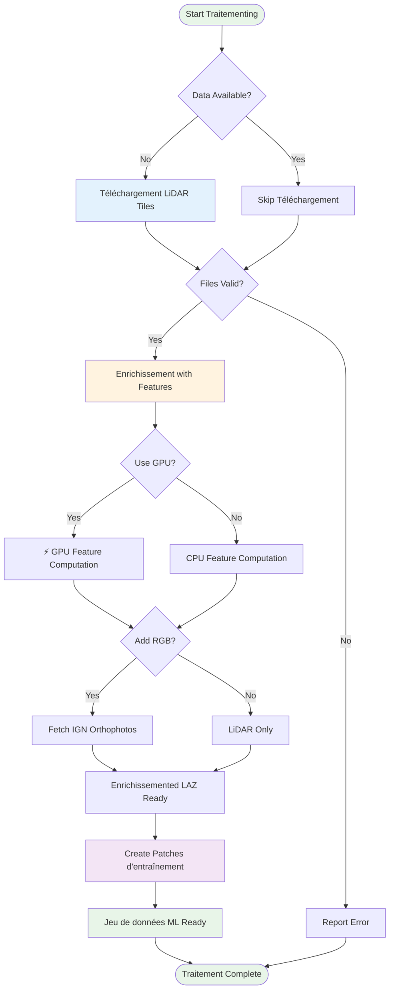
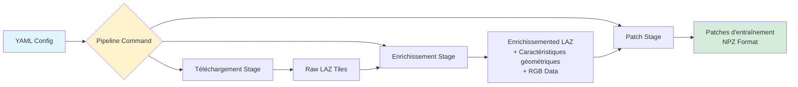
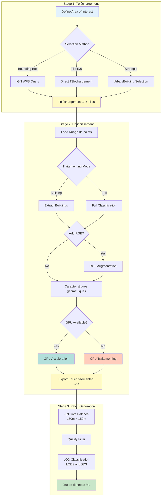

# Workflow Diagrams

This page contains reusable workflow diagrams that are referenced across multiple documentation pages.

## Basic Traitementing Pipeline

## Pipeline Architecture

## Three-Stage Workflow

