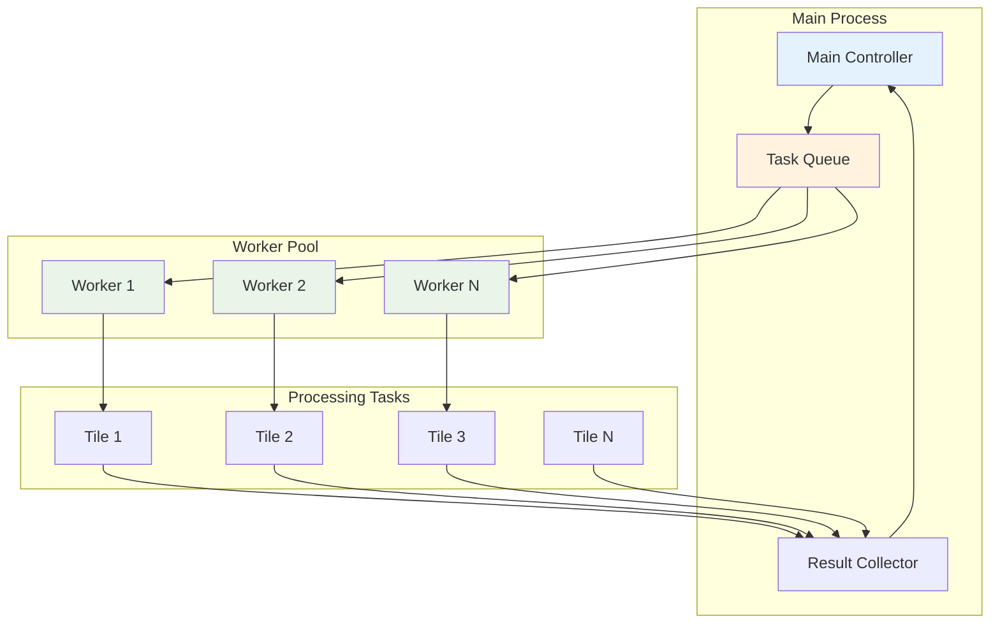
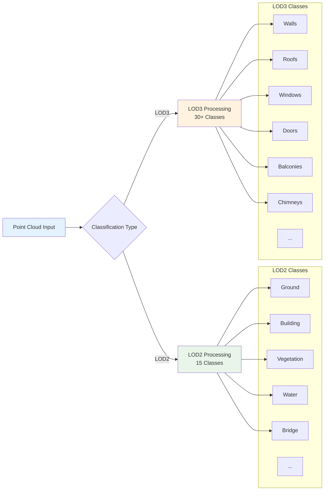
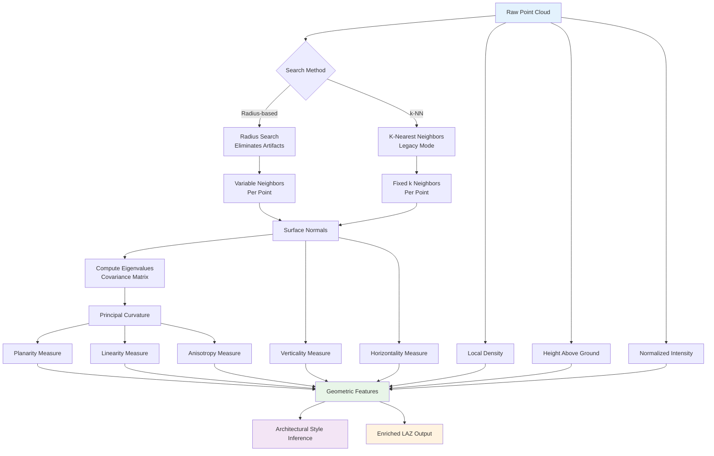
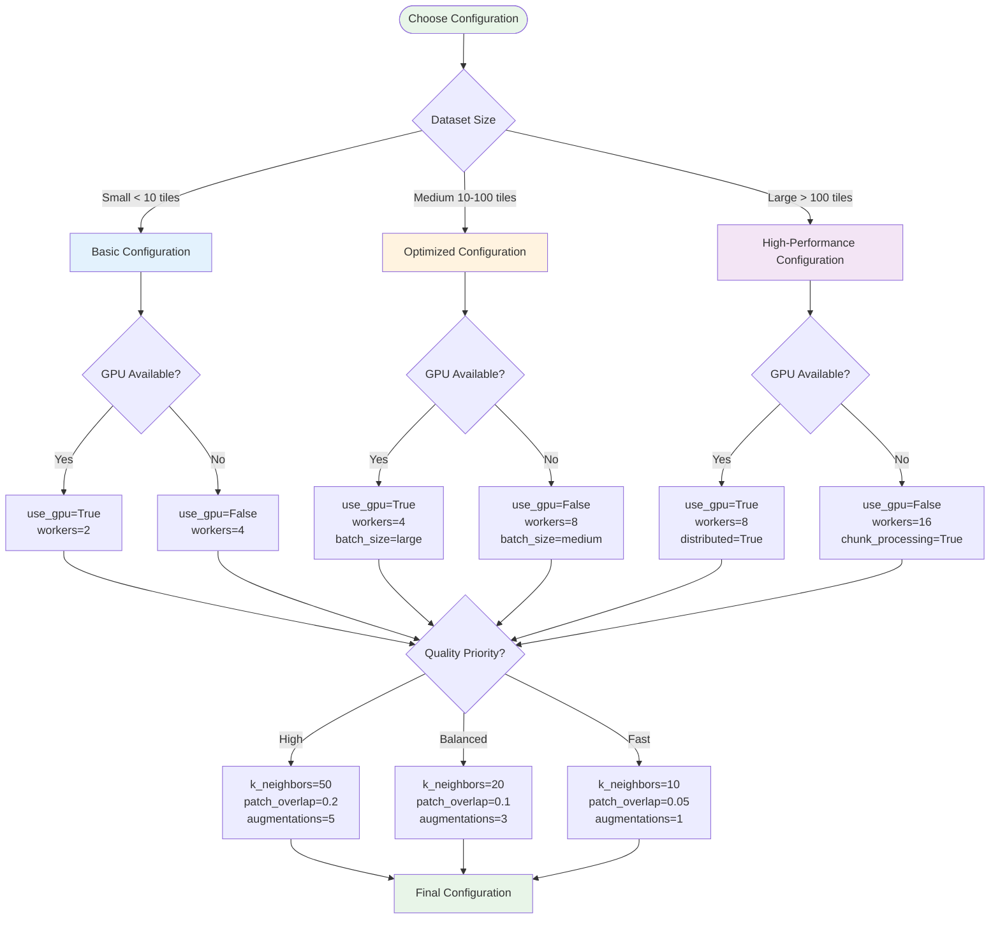

# Guide des Flux de Travail

Ce guide présente les flux de travail courants de traitement avec des représentations visuelles pour vous aider à comprendre le flux de données et les points de décision.

:::tip Navigation

- [Flux de Travail de Base](#-basic-workflow) - Pipeline de traitement standard
- [Flux de Travail Accéléré GPU](#-gpu-accelerated-workflow) - Traitement GPU haute performance
- [Flux de Travail Smart Skip](#-smart-skip-workflow) - Reprendre les t√¢ches interrompues
- [Traitement Parallèle](#-parallel-processing-workflow) - Traitement multi-worker
- [Meilleures Pratiques](#-best-practice-workflows) - Flux de travail optimisés pour différents scénarios
  :::

## üöÄ Flux de Travail de Base

Le flux de travail le plus courant pour traiter les données LiDAR en jeux de données prêts pour le ML.

:::tip Référence au Diagramme
Pour le diagramme complet du flux de travail de base, voir [Diagrammes de Flux de Travail - Pipeline de Traitement de Base](reference/workflow-diagrams.md#basic-processing-pipeline).
:::

Le flux de travail comprend les étapes clés suivantes :

1. **Vérification de Disponibilité des Données** : Vérifier si les tuiles LiDAR sont déjà téléchargées
2. **Téléchargement** : Acquérir les tuiles depuis les serveurs IGN si nécessaire
3. **Validation** : S'assurer que les fichiers téléchargés sont valides
4. **Enrichissement** : Ajouter des caractéristiques géométriques et la classification des composants de bâtiment
5. **Augmentation RGB** : Ajouter optionnellement des informations de couleur depuis les orthophotos
6. **Traitement** : Créer des patches d'entraînement pour l'apprentissage automatique
   RGB -->|No| SkipRGB[LiDAR Only]

   FetchRGB --> Features[Enriched LAZ Ready]
   SkipRGB --> Features

   Features --> Process[Create Training Patches]
   Process --> Output[ML Dataset Ready]
   Output --> End([Process Complete])

   Error1 --> End

   style Start fill:#e8f5e8
   style End fill:#e8f5e8
   style Download fill:#e3f2fd
   style Analyze fill:#c8e6c9
   style CleanData fill:#fff9c4
   style Enrich fill:#fff3e0
   style Process fill:#f3e5f5
   style Output fill:#e8f5e8

````

## ⚡ Flux de Travail Accéléré GPU

Flux de travail pour le traitement de grands jeux de données avec accélération GPU (v1.3.0+).

```mermaid
flowchart TD
    Start([Start GPU Processing]) --> CheckGPU{GPU Available?}

    CheckGPU -->|Yes| GPUSetup[Initialize GPU<br/>CuPy + CUDA]
    CheckGPU -->|No| Fallback[⚠️ Fallback to CPU]

    GPUSetup --> LoadData[Load Point Cloud]
    Fallback --> LoadData

    LoadData --> TransferGPU[Transfer to GPU Memory]
    TransferGPU --> FeatureGPU[üöÄ GPU Feature Computation<br/>5-10x faster]

    FeatureGPU --> RGBCheck{Include RGB?}
    RGBCheck -->|Yes v1.5.0+| RGBFetch[Fetch Orthophoto]
    RGBCheck -->|No| FeaturesDone[Features Complete]

    RGBFetch --> RGBCache{In GPU Cache?}
    RGBCache -->|Yes| RGBInterpolate[‚ö° GPU Color Interpolation<br/>24x faster]
    RGBCache -->|No| RGBLoad[Load to GPU Cache]
    RGBLoad --> RGBInterpolate

    RGBInterpolate --> Combine[Combine Features + RGB]
    FeaturesDone --> Combine

    Combine --> TransferCPU[Transfer to CPU]
    TransferCPU --> SaveOutput[Save Enriched LAZ]

    SaveOutput --> MoreData{More Data?}
    MoreData -->|Yes| LoadData
    MoreData -->|No| End([Processing Complete])

    style Start fill:#e8f5e8
    style End fill:#e8f5e8
    style GPUSetup fill:#e3f2fd
    style FeatureGPU fill:#c8e6c9
    style RGBInterpolate fill:#c8e6c9
    style Fallback fill:#fff3e0
````

### Bénéfices de Performance GPU

| Opération              | Temps CPU | Temps GPU | Accélération |
| ---------------------- | --------- | --------- | ------------ |
| Extraction de Features | 45s       | 6s        | 8x           |
| Interpolation RGB      | 12s       | 0.5s      | 24x          |
| Calcul de Normales     | 30s       | 5s        | 6x           |
| **Total (1M pts)**     | ~87s      | ~11.5s    | **7.5x**     |

:::tip Conseils d'Optimisation GPU

- **Cache des tuiles RGB** - Réutiliser les orthophotos entre les patches
- **Traitement par lot** - Traiter plusieurs tuiles en séquence
- **Surveiller la mémoire GPU** - Utiliser `nvidia-smi` pour vérifier l'utilisation
- **Utiliser workers=1 avec GPU** - Le GPU parallélise en interne

Voir [Vue d'ensemble GPU](gpu/overview.md) pour les instructions de configuration détaillées.
:::

## 🔄 Flux de Travail Smart Skip

Comprendre comment le système de saut intelligent optimise les exécutions répétées.

```mermaid
sequenceDiagram
    participant User
    participant CLI
    participant SkipChecker as Smart Skip
    participant FileSystem as File System
    participant Processor

    User->>CLI: ign-lidar-hd enrich
    CLI->>SkipChecker: Check existing files
    SkipChecker->>FileSystem: List output directory
    FileSystem-->>SkipChecker: File list

    loop For each input file
        SkipChecker->>SkipChecker: Check if output exists
        SkipChecker->>SkipChecker: Validate file integrity
        alt File exists and valid
            SkipChecker-->>CLI: Skip this file
        else File missing or invalid
            SkipChecker->>Processor: Process this file
            Processor-->>SkipChecker: File processed
        end
    end

    CLI-->>User: Processing complete

    Note over SkipChecker: Smart skip saves time<br/>on large datasets
```

## 🏗️ Flux de Travail de Traitement Parallèle

Comment la bibliothèque gère le traitement multi-worker pour une performance optimale.


```mermaid
graph TB
    subgraph "Main Process"
        M[Main Controller]
        Q[Task Queue]
        R[Result Collector]
    end

    subgraph "Worker Pool"
        W1[Worker 1]
        W2[Worker 2]
        W3[Worker N]
    end

    subgraph "Processing Tasks"
        T1[Tile 1]
        T2[Tile 2]
        T3[Tile 3]
        TN[Tile N]
    end

    M --> Q
    Q --> W1
    Q --> W2
    Q --> W3

    W1 --> T1
    W2 --> T2
    W3 --> T3

    T1 --> R
    T2 --> R
    T3 --> R
    TN --> R

    R --> M

    style M fill:#e3f2fd
    style Q fill:#fff3e0
    style W1 fill:#e8f5e8
    style W2 fill:#e8f5e8
    style W3 fill:#e8f5e8
```

## 🎯 Flux de Travail de Classification LOD

Comprendre comment les composants de bâtiment sont classifiés en niveaux LOD.


```mermaid
flowchart LR
    Input[Point Cloud Input] --> Classify{Classification Type}

    Classify -->|LOD2| LOD2_Process[LOD2 Processing<br/>15 Classes]
    Classify -->|LOD3| LOD3_Process[LOD3 Processing<br/>30+ Classes]

    subgraph "LOD2 Classes"
        LOD2_1[Ground]
        LOD2_2[Building]
        LOD2_3[Vegetation]
        LOD2_4[Water]
        LOD2_5[Bridge]
        LOD2_More[...]
    end

    subgraph "LOD3 Classes"
        LOD3_1[Walls]
        LOD3_2[Roofs]
        LOD3_3[Windows]
        LOD3_4[Doors]
        LOD3_5[Balconies]
        LOD3_6[Chimneys]
        LOD3_More[...]
    end

    LOD2_Process --> LOD2_1
    LOD2_Process --> LOD2_2
    LOD2_Process --> LOD2_3
    LOD2_Process --> LOD2_4
    LOD2_Process --> LOD2_5

    LOD3_Process --> LOD3_1
    LOD3_Process --> LOD3_2
    LOD3_Process --> LOD3_3
    LOD3_Process --> LOD3_4
    LOD3_Process --> LOD3_5
    LOD3_Process --> LOD3_6

    style Input fill:#e3f2fd
    style LOD2_Process fill:#e8f5e8
    style LOD3_Process fill:#fff3e0
```

## 🎯 Pipeline d'Enrichissement Amélioré (v1.7.1)

Vue détaillée du flux de travail d'enrichissement complet avec auto-params et prétraitement.


```mermaid
flowchart TD
    Start[Load LAZ Tile] --> AutoCheck{Auto-Params<br/>Enabled?}

    AutoCheck -->|Yes| Sample[Sample 50K Points]
    AutoCheck -->|No| ManualParams[Use Manual Parameters]

    Sample --> CalcDensity[Calculate:<br/>• Point Density<br/>• NN Distance<br/>• Noise Level]
    CalcDensity --> Optimize[Determine Optimal:<br/>• Radius: 0.5-3.0m<br/>• SOR k: 8-15<br/>• SOR std: 1.5-2.5<br/>• ROR radius: 1.0-2.0m<br/>• ROR neighbors: 2-6]

    Optimize --> Report[üìä Display Analysis Report]
    ManualParams --> Report
    Report --> PreCheck{Preprocessing<br/>Enabled?}

    PreCheck -->|Yes| SOR[Statistical Outlier Removal<br/>Filter noise points]
    PreCheck -->|No| SkipPre[Skip to Features]

    SOR --> ROR[Radius Outlier Removal<br/>Remove scan artifacts]
    ROR --> VoxelCheck{Voxel<br/>Downsampling?}

    VoxelCheck -->|Yes| Voxel[Homogenize Point Density]
    VoxelCheck -->|No| CleanData[Clean Point Cloud]
    Voxel --> CleanData
    SkipPre --> Features

    CleanData --> Features[üîß Feature Computation]
    Features --> SearchMode{Search Mode}

    SearchMode -->|Radius-based<br/>v1.6.5| RadiusSearch[Radius Search<br/>Artifact-free]
    SearchMode -->|k-NN<br/>legacy| KNNSearch[k-Nearest Neighbors]

    RadiusSearch --> BuildKDTree[Build KD-Tree]
    KNNSearch --> BuildKDTree

    BuildKDTree --> CoreFeatures[Compute Core Features:<br/>• Normals<br/>• Curvature<br/>• Planarity<br/>• Verticality]

    CoreFeatures --> ModeCheck{Feature Mode}
    ModeCheck -->|Core| SaveCore[Core Features Only]
    ModeCheck -->|Building| BuildFeatures[Building Features:<br/>• Wall probability<br/>• Roof probability<br/>• Edge detection<br/>• Corner detection]

    BuildFeatures --> RGBCheck{Add RGB?}
    SaveCore --> RGBCheck

    RGBCheck -->|Yes| FetchOrtho[Fetch IGN Orthophoto]
    RGBCheck -->|No| SaveLAZ[Save Enriched LAZ]

    FetchOrtho --> InterpolateRGB[Interpolate RGB Colors]
    InterpolateRGB --> SaveLAZ

    SaveLAZ --> End[‚úÖ Enriched Tile Complete]

    style Start fill:#e3f2fd
    style Sample fill:#c8e6c9
    style Optimize fill:#c8e6c9
    style Report fill:#fff9c4
    style SOR fill:#fff9c4
    style ROR fill:#fff9c4
    style Features fill:#fff3e0
    style RadiusSearch fill:#c8e6c9
    style SaveLAZ fill:#e8f5e8
    style End fill:#e8f5e8
```

## üìä Pipeline d'Extraction de Features

Vue détaillée du processus de calcul des caractéristiques géométriques.


```mermaid
graph TD
    Points[Raw Point Cloud] --> SearchMethod{Search Method}
    SearchMethod -->|Radius-based| Radius[Radius Search<br/>Eliminates Artifacts]
    SearchMethod -->|k-NN| KNN[K-Nearest Neighbors<br/>Legacy Mode]

    Radius --> Neighbors[Variable Neighbors<br/>Per Point]
    KNN --> FixedNeighbors[Fixed k Neighbors<br/>Per Point]

    Neighbors --> Normals[Surface Normals]
    FixedNeighbors --> Normals

    Normals --> Eigenvalues[Compute Eigenvalues<br/>Covariance Matrix]
    Eigenvalues --> Curvature[Principal Curvature]

    Curvature --> Planarity[Planarity Measure]
    Curvature --> Linearity[Linearity Measure]
    Curvature --> Anisotropy[Anisotropy Measure]

    Normals --> Verticality[Verticality Measure]
    Normals --> Horizontality[Horizontality Measure]

    Points --> Density[Local Density]
    Points --> Height[Height Above Ground]
    Points --> Intensity[Normalized Intensity]

    Planarity --> GeometricFeatures[Geometric Features]
    Linearity --> GeometricFeatures
    Anisotropy --> GeometricFeatures
    Verticality --> GeometricFeatures
    Horizontality --> GeometricFeatures
    Density --> GeometricFeatures
    Height --> GeometricFeatures
    Intensity --> GeometricFeatures

    GeometricFeatures --> ArchStyle[Architectural Style Inference]
    GeometricFeatures --> EnrichedLAZ[Enriched LAZ Output]

    style Points fill:#e3f2fd
    style GeometricFeatures fill:#e8f5e8
    style EnrichedLAZ fill:#fff3e0
    style ArchStyle fill:#f3e5f5
```

## 🔧 Arbre de Décision de Configuration

Comment choisir les paramètres optimaux pour votre cas d'usage.


```mermaid
flowchart TD
    Start([Choose Configuration]) --> DataSize{Dataset Size}

    DataSize -->|Small < 10 tiles| SmallConfig[Basic Configuration]
    DataSize -->|Medium 10-100 tiles| MediumConfig[Optimized Configuration]
    DataSize -->|Large > 100 tiles| LargeConfig[High-Performance Configuration]

    SmallConfig --> GPU1{GPU Available?}
    MediumConfig --> GPU2{GPU Available?}
    LargeConfig --> GPU3{GPU Available?}

    GPU1 -->|Yes| SmallGPU[use_gpu=True<br/>workers=2]
    GPU1 -->|No| SmallCPU[use_gpu=False<br/>workers=4]

    GPU2 -->|Yes| MediumGPU[use_gpu=True<br/>workers=4<br/>batch_size=large]
    GPU2 -->|No| MediumCPU[use_gpu=False<br/>workers=8<br/>batch_size=medium]

    GPU3 -->|Yes| LargeGPU[use_gpu=True<br/>workers=8<br/>distributed=True]
    GPU3 -->|No| LargeCPU[use_gpu=False<br/>workers=16<br/>chunk_processing=True]

    SmallGPU --> Quality{Quality Priority?}
    SmallCPU --> Quality
    MediumGPU --> Quality
    MediumCPU --> Quality
    LargeGPU --> Quality
    LargeCPU --> Quality

    Quality -->|High| HighQuality[k_neighbors=50<br/>patch_overlap=0.2<br/>augmentations=5]
    Quality -->|Balanced| Balanced[k_neighbors=20<br/>patch_overlap=0.1<br/>augmentations=3]
    Quality -->|Fast| Fast[k_neighbors=10<br/>patch_overlap=0.05<br/>augmentations=1]

    HighQuality --> Final[Final Configuration]
    Balanced --> Final
    Fast --> Final

    style Start fill:#e8f5e8
    style Final fill:#e8f5e8
    style SmallConfig fill:#e3f2fd
    style MediumConfig fill:#fff3e0
    style LargeConfig fill:#f3e5f5
```

## üí° Flux de Travail de Meilleures Pratiques

### Traitement de Zone Urbaine

```bash
# Optimisé pour les environnements urbains denses
ign-lidar-hd download --bbox 2.0,48.8,2.1,48.9 --output urban_tiles/
ign-lidar-hd enrich --input-dir urban_tiles/ --output urban_enriched/ --use-gpu --k-neighbors 30
ign-lidar-hd process --input-dir urban_enriched/ --output urban_patches/ --lod-level LOD3
```

### Traitement de Zone Rurale/Naturelle

```bash
# Optimisé pour les environnements ruraux clairsemés
ign-lidar-hd download --bbox -1.0,46.0,0.0,47.0 --output rural_tiles/
ign-lidar-hd enrich --input-dir rural_tiles/ --output rural_enriched/ --k-neighbors 15
ign-lidar-hd process --input-dir rural_enriched/ --output rural_patches/ --lod-level LOD2
```

### Traitement par Lot Haute Performance

```bash
# Débit maximal pour les grands jeux de données
ign-lidar-hd enrich --input-dir tiles/ --output enriched/ --use-gpu --num-workers 8 --batch-size large
ign-lidar-hd process --input-dir enriched/ --output patches/ --num-workers 16 --skip-existing
```

### Accélération GPU avec RGB (v1.5.0+)

```bash
# Traitement le plus rapide avec augmentation RGB GPU
ign-lidar-hd enrich \
  --input-dir tiles/ \
  --output enriched/ \
  --use-gpu \
  --add-rgb \
  --rgb-cache-dir /data/rgb_cache/ \
  --num-workers 4

# Créer des patches avec RGB en cache
ign-lidar-hd process \
  --input-dir enriched/ \
  --output patches/ \
  --lod-level LOD3 \
  --num-workers 8
```

---

## 📚 Documentation Associée

- **[Guide d'Accélération GPU](gpu/overview.md)** - Configuration et optimisation GPU détaillées
- **[Guide RGB GPU](gpu/rgb-augmentation.md)** - Augmentation RGB accélérée par GPU (v1.5.0+)
- **[Architecture](architecture.md)** - Architecture système et composants
- **[Commandes CLI](guides/cli-commands.md)** - Référence CLI complète
- **[Smart Skip](features/smart-skip.md)** - Détails du système de saut intelligent
- **[Classification LOD](features/lod3-classification.md)** - Classification LOD2/LOD3

---

## 💡 Conseils pour la Sélection du Flux de Travail

### Choisir le Flux de Travail de Base quand :

- ✅ Apprentissage de la bibliothèque
- ‚úÖ Traitement de < 10 tuiles
- ‚úÖ Pas de GPU disponible
- ‚úÖ Prototypage et tests

### Choisir le Flux de Travail GPU quand :

- ‚úÖ Traitement de > 50 tuiles
- ‚úÖ GPU NVIDIA disponible
- ‚úÖ Pipelines de production
- ‚úÖ Projets urgents

### Choisir Smart Skip quand :

- ‚úÖ Reprise de t√¢ches interrompues
- ✅ Traitement itératif
- ✅ Grands jeux de données avec échecs
- ✅ Mises à jour incrémentales

### Traitement Parallèle pour :

- ✅ Systèmes multi-cœurs
- ‚úÖ Traitement par lot
- ‚úÖ Environnements de production
- ✅ Maximisation du débit
