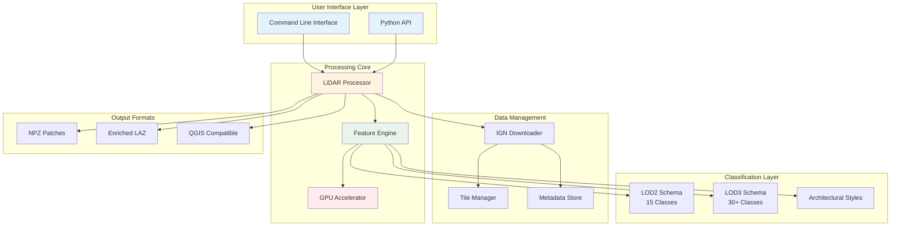
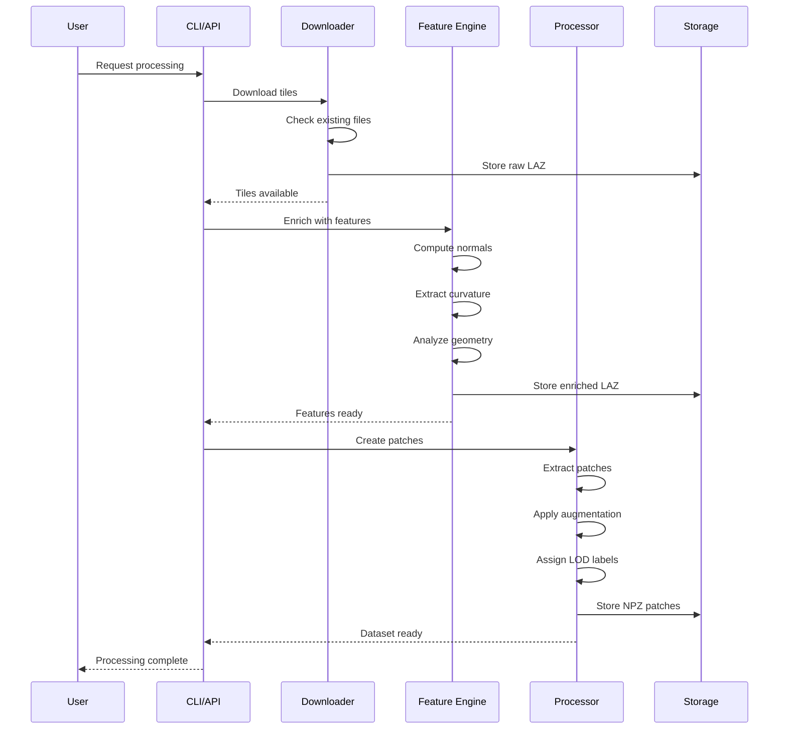
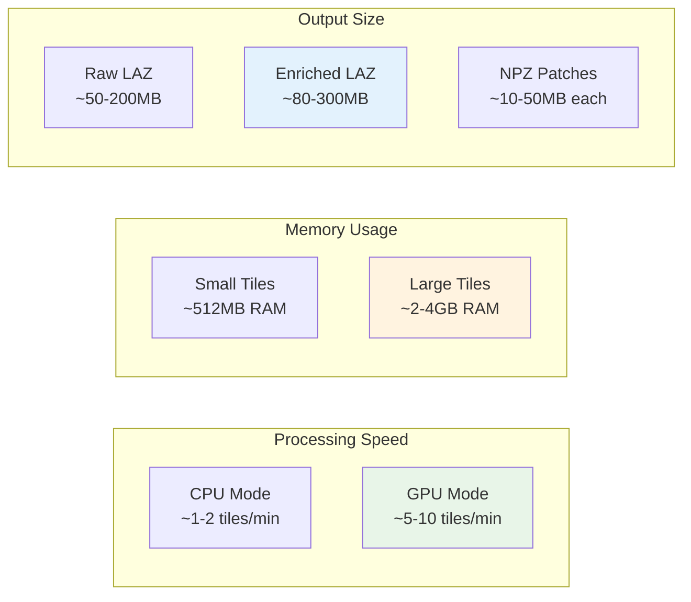

# System Architecture

Understanding the library's architecture helps you make the most of its capabilities and customize it for your specific needs.

## 🏗️ Core Architecture

## 🔄 Data Flow Architecture

## 🧩 Component Details

### Core Processor

The `LiDARProcessor` class orchestrates the entire pipeline:

- Manages workflow execution
- Handles parallel processing
- Coordinates smart skip detection
- Applies data augmentation

### Feature Engine

Advanced geometric analysis:

- Surface normal computation
- Principal curvature calculation
- Planarity and verticality measures
- Local density estimation
- Architectural style inference

### Smart Skip System

Intelligent workflow resumption:

- File existence checking
- Metadata validation
- Timestamp comparison
- Progress tracking

### GPU Acceleration (New in v1.5.0)

Optional CUDA acceleration for:

- K-nearest neighbor searches
- Matrix operations
- Feature computations
- **RGB color interpolation (24x faster)** 🆕
- **GPU memory caching for RGB tiles** 🆕
- Large dataset processing

:::tip Learn More
See [GPU Acceleration Guide](gpu/overview.md) for complete setup instructions and [GPU RGB Guide](gpu/rgb-augmentation.md) for RGB-specific details.
:::

#### GPU RGB Pipeline

**Performance:** 24x speedup for RGB augmentation (v1.5.0)

## 📊 Performance Characteristics

## 🔧 Configuration System

The library uses a hierarchical configuration approach:

1. **Default Settings** - Built-in optimal defaults
2. **Configuration Files** - Project-specific settings
3. **Environment Variables** - Runtime overrides
4. **Command Arguments** - Immediate parameters

### Key Configuration Options

| Category    | Options                          | Impact                  |
| ----------- | -------------------------------- | ----------------------- |
| Performance | `num_workers`, `use_gpu`         | Processing speed        |
| Quality     | `k_neighbors`, `patch_size`      | Feature accuracy        |
| Output      | `lod_level`, `format_preference` | Dataset characteristics |
| Workflow    | `skip_existing`, `force`         | Resumability behavior   |

## 🚀 Extension Points

The architecture supports customization through:

- **Custom Feature Extractors** - Add domain-specific features
- **Classification Schemas** - Define new LOD levels
- **Output Formats** - Support additional file formats
- **Processing Hooks** - Insert custom processing steps
- **Validation Rules** - Add quality checks

This modular design ensures the library can adapt to various research and production requirements while maintaining performance and reliability.
