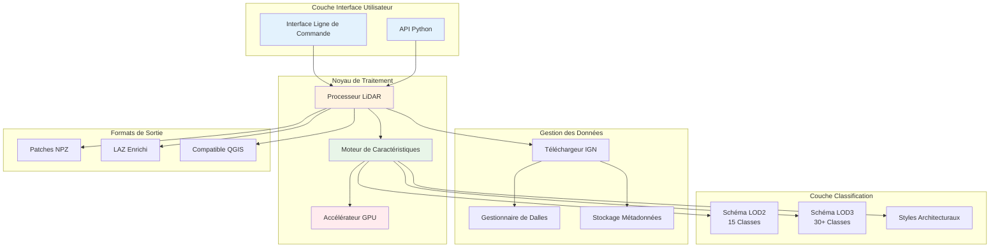
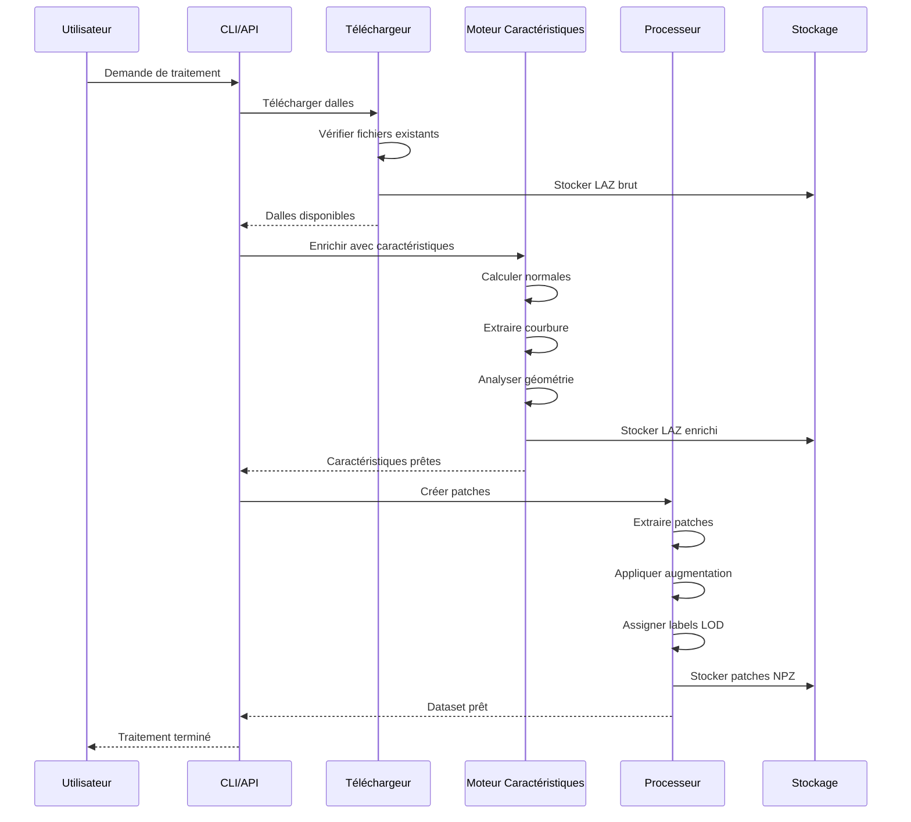
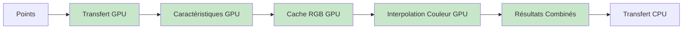
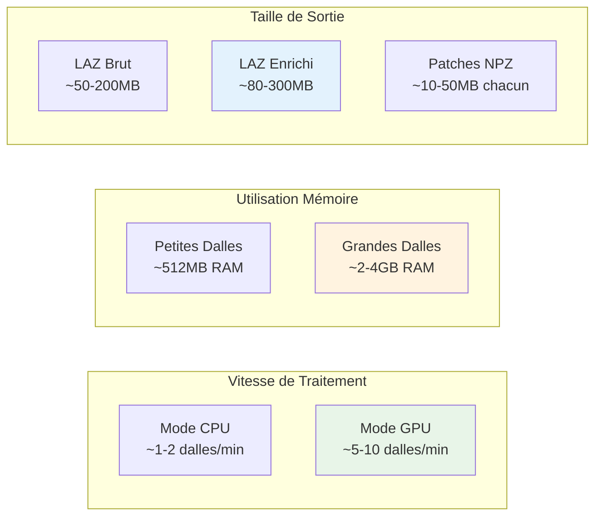

# Architecture du Système

Comprendre l'architecture de la bibliothèque vous aide à tirer le meilleur parti de ses capacités et à la personnaliser selon vos besoins spécifiques.

## 🏗️ Architecture de Base

## 🔄 Architecture de Flux de Données

## 🧩 Détails des Composants

### Processeur Principal

La classe `LiDARProcessor` orchestre l'ensemble du pipeline :

- Gère l'exécution du workflow
- Gère le traitement parallèle
- Coordonne la détection de saut intelligent
- Applique l'augmentation de données

### Moteur de Caractéristiques

Analyse géométrique avancée :

- Calcul des normales de surface
- Calcul de la courbure principale
- Mesures de planarité et verticalité
- Estimation de la densité locale
- Inférence du style architectural

### Système de Saut Intelligent

Reprise intelligente du workflow :

- Vérification de l'existence des fichiers
- Validation des métadonnées
- Comparaison des horodatages
- Suivi de la progression

### Accélération GPU (Nouveau en v1.5.0, Corrigé en v1.6.2)

Accélération CUDA optionnelle pour :

- Recherches k plus proches voisins
- Opérations matricielles
- Calculs de caractéristiques (formules corrigées en v1.6.2)
- **Interpolation de couleurs RGB (24x plus rapide)** 🆕
- **Mise en cache mémoire GPU pour dalles RGB** 🆕
- Traitement de grands jeux de données

:::tip En Savoir Plus
Voir le [Guide d'Accélération GPU](gpu/overview.md) pour les instructions complètes et le [Guide RGB GPU](gpu/rgb-augmentation.md) pour les détails spécifiques RGB.
:::

#### Pipeline RGB GPU

**Performance :** Accélération 24x pour l'augmentation RGB (v1.5.0)

## 📊 Caractéristiques de Performance

## 🔧 Système de Configuration

La bibliothèque utilise une approche de configuration hiérarchique :

1. **Paramètres par Défaut** - Valeurs optimales intégrées
2. **Fichiers de Configuration** - Paramètres spécifiques au projet
3. **Variables d'Environnement** - Remplacements à l'exécution
4. **Arguments de Commande** - Paramètres immédiats

### Options de Configuration Clés

| Catégorie   | Options                          | Impact                         |
| ----------- | -------------------------------- | ------------------------------ |
| Performance | `num_workers`, `use_gpu`         | Vitesse de traitement          |
| Qualité     | `k_neighbors`, `patch_size`      | Précision des caractéristiques |
| Sortie      | `lod_level`, `format_preference` | Caractéristiques du dataset    |
| Workflow    | `skip_existing`, `force`         | Comportement de reprise        |

## 🚀 Points d'Extension

L'architecture supporte la personnalisation via :

- **Extracteurs de Caractéristiques Personnalisés** - Ajouter des caractéristiques spécifiques au domaine
- **Schémas de Classification** - Définir de nouveaux niveaux LOD
- **Formats de Sortie** - Supporter des formats de fichiers supplémentaires
- **Hooks de Traitement** - Insérer des étapes de traitement personnalisées
- **Règles de Validation** - Ajouter des vérifications de qualité

Cette conception modulaire garantit que la bibliothèque peut s'adapter à diverses exigences de recherche et de production tout en maintenant performance et fiabilité.
