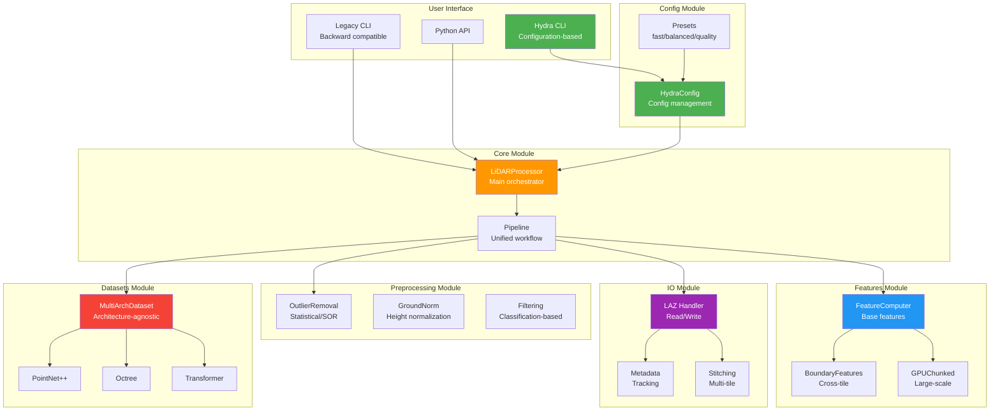
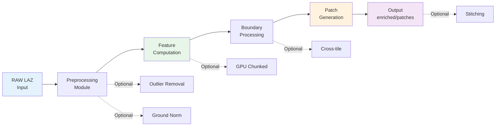
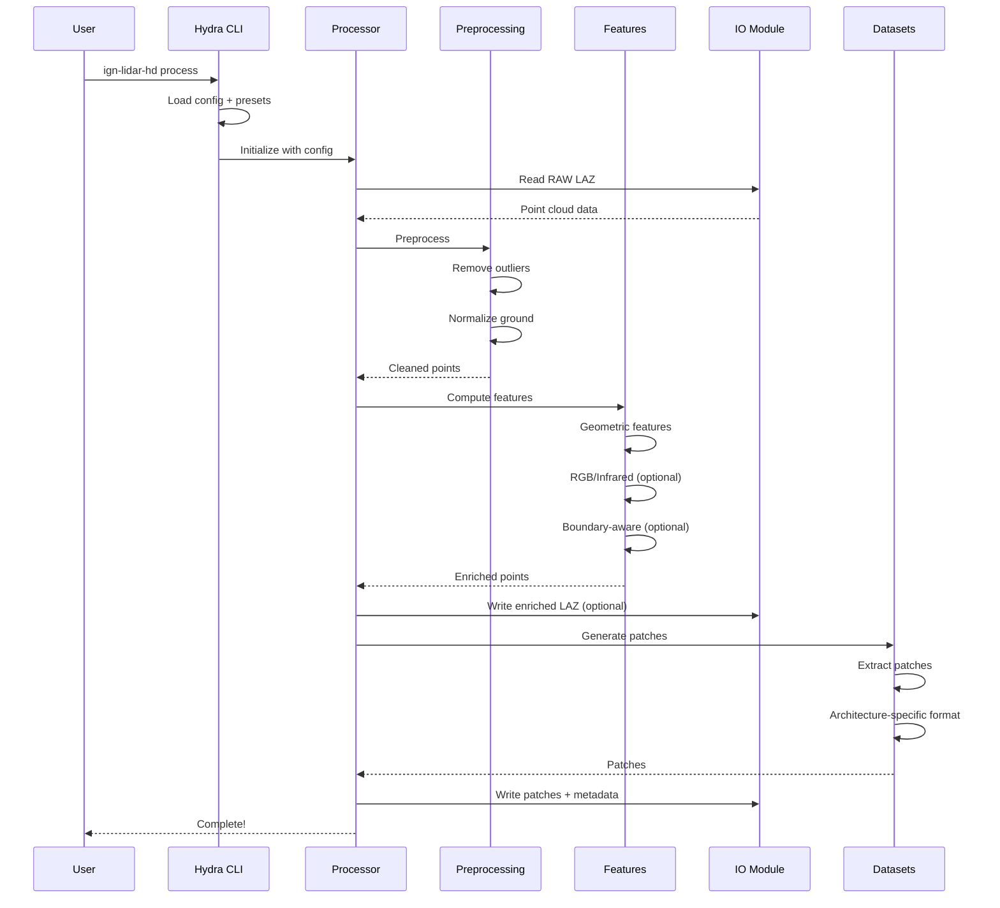
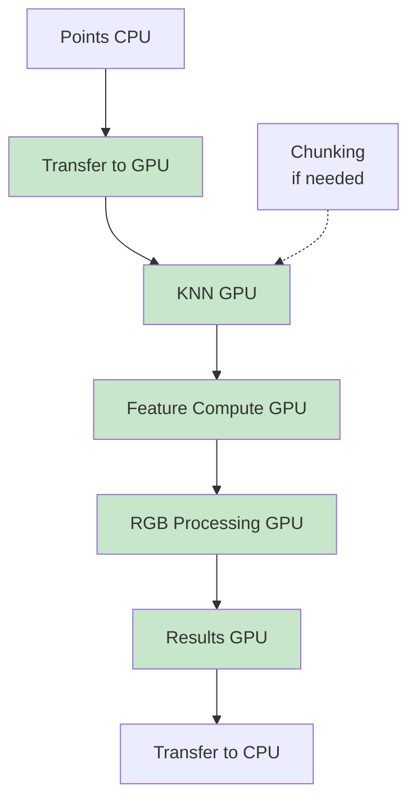
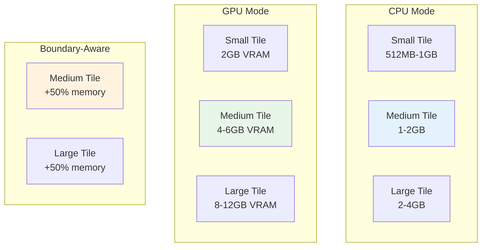
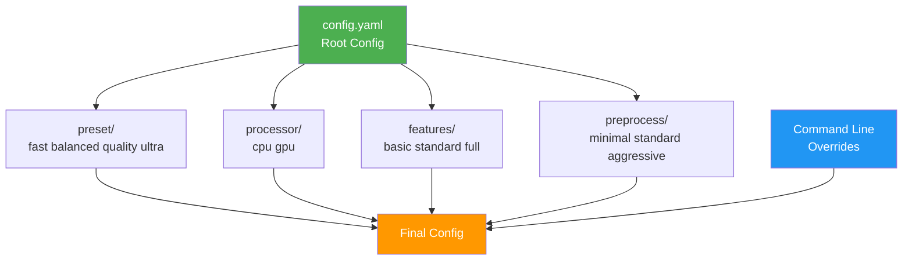

<!-- 🇫🇷 TRADUCTION FRANÇAISE REQUISE -->
<!-- Ce fichier est un modèle qui nécessite une traduction manuelle. -->
<!-- Veuillez traduire le contenu ci-dessous en conservant : -->
<!-- - Le frontmatter (métadonnées en haut) -->
<!-- - Les blocs de code (traduire uniquement les commentaires) -->
<!-- - Les liens et chemins de fichiers -->
<!-- - La structure Markdown -->


# System Architecture

**Version 2.0** - Modular Architecture

Understanding the v2.0 modular architecture helps you make the most of its capabilities and customize it for your specific needs.

:::tip What's New in v2.0?
Complete architectural redesign with **6 dedicated modules**, **Hydra CLI**, and **unified pipeline**. See [Migration Guide](/guides/migration-v1-to-v2) if upgrading from v1.x.
:::

## 🏗️ Modular Architecture (v2.0)



## � Module Structure

The v2.0 architecture organizes code into **6 specialized modules**:

```
ign_lidar/
├── core/              # 🎯 Core processing orchestration
│   ├── processor.py        # Main LiDARProcessor class
│   └── pipeline.py         # Unified RAW→Patches pipeline
│
├── features/          # 🔬 Feature computation
│   ├── computer.py         # Base feature computation
│   ├── gpu_chunked.py      # GPU chunked processing
│   ├── boundary.py         # Boundary-aware features
│   └── ultra.py            # Ultra-high quality features
│
├── preprocessing/     # 🔧 Data preprocessing
│   ├── outliers.py         # Outlier removal (SOR, statistical)
│   ├── normalization.py    # Ground height normalization
│   ├── tiling.py           # Tile operations
│   └── filters.py          # Classification filtering
│
├── io/                # 💾 Input/Output operations
│   ├── laz.py              # LAZ file reading/writing
│   ├── metadata.py         # Metadata management
│   ├── stitching.py        # Tile stitching
│   └── downloader.py       # IGN data download
│
├── config/            # ⚙️ Configuration management
│   └── hydra_config.py     # Hydra integration
│
├── configs/           # 📋 Hydra config files (YAML)
│   ├── config.yaml         # Root configuration
│   ├── preset/             # Presets (fast/balanced/quality/ultra)
│   ├── processor/          # Processor configs (cpu/gpu)
│   ├── features/           # Feature configs
│   └── preprocess/         # Preprocessing configs
│
└── datasets/          # 🗂️ ML dataset classes
    ├── multi_arch.py       # Architecture-agnostic dataset
    ├── pointnet_pp.py      # PointNet++ format
    ├── octree.py           # Octree format
    └── transformer.py      # Transformer format
```

### Module Responsibilities

| Module            | Purpose                                     | Key Classes                           |
| ----------------- | ------------------------------------------- | ------------------------------------- |
| **core**          | Pipeline orchestration, workflow management | `LiDARProcessor`, `Pipeline`          |
| **features**      | Feature computation, GPU acceleration       | `FeatureComputer`, `GPUChunked`       |
| **preprocessing** | Data cleaning, normalization                | `remove_outliers`, `normalize_ground` |
| **io**            | File operations, metadata                   | `read_laz_file`, `MetadataManager`    |
| **config**        | Configuration management                    | `HydraConfig`, `load_config`          |
| **datasets**      | PyTorch datasets for ML training            | `MultiArchDataset`, `PointNetDataset` |

---

## 🔄 Unified Pipeline (v2.0)

**Major Change:** Single-step RAW→Patches workflow!



### Pipeline Flow



---

## 🎯 Core Module

The **brain** of the system - orchestrates the entire pipeline.

### LiDARProcessor

Main class that coordinates all processing:

```python
from ign_lidar.core import LiDARProcessor

processor = LiDARProcessor(
    input_dir="data/raw/",
    output_dir="output/",
    preset="balanced",      # fast/balanced/quality/ultra
    use_gpu=True
)

processor.run()  # Single call for entire pipeline!
```

**Responsibilities:**

- ✅ Pipeline orchestration
- ✅ Multi-worker parallelization
- ✅ Progress tracking
- ✅ Error handling and recovery
- ✅ Metadata generation

### Pipeline

Unified workflow manager:

- **RAW→Patches** in one step
- Automatic preprocessing
- Feature computation
- Patch generation
- Optional stitching

---

## 🔬 Features Module

Advanced **geometric and RGB feature computation**.

### FeatureComputer

Base class for feature computation:

```python
from ign_lidar.features import FeatureComputer

computer = FeatureComputer(
    use_rgb=True,
    compute_ndvi=True,
    boundary_aware=False
)

features = computer.compute(points, colors)
```

**Computed Features:**

- **Geometric**: Linearity, planarity, sphericity, anisotropy
- **Curvature**: Mean, Gaussian, principal curvatures
- **Local**: Density, verticality, roughness
- **RGB**: Color features, NDVI (vegetation index)
- **Infrared**: Near-infrared intensity (optional)

### GPUChunked

Large-scale GPU processing:

- Automatic memory management
- Chunked processing for huge tiles
- 90%+ GPU utilization
- Memory-aware chunk sizing

### BoundaryFeatures

Cross-tile feature computation:

- **Eliminates edge artifacts**
- Automatic neighbor loading
- Seamless feature computation
- Configurable buffer zones

---

## 🔧 Preprocessing Module

**Data cleaning and normalization** before feature computation.

### Outlier Removal

```python
from ign_lidar.preprocessing import remove_outliers

# Statistical outlier removal
points = remove_outliers(
    points,
    method="statistical",
    nb_neighbors=20,
    std_ratio=2.0
)
```

**Methods:**

- `statistical`: Statistical Outlier Removal (SOR)
- `radius`: Radius-based outlier removal

### Ground Normalization

```python
from ign_lidar.preprocessing import normalize_ground

# Normalize heights to ground level
points = normalize_ground(
    points,
    max_distance=5.0,  # Max search distance
    resolution=1.0      # Grid resolution
)
```

### Filtering

```python
from ign_lidar.preprocessing import filter_by_classification

# Keep only building-related classes
points = filter_by_classification(
    points,
    keep_classes=[2, 3, 4, 5, 6]  # Ground, low/med/high veg, building
)
```

---

## 💾 IO Module

**File operations, metadata, and multi-tile workflows**.

### LAZ Handler

```python
from ign_lidar.io import read_laz_file, write_laz_file

# Read LAZ file
points, colors, features = read_laz_file("tile.laz")

# Write enriched LAZ with features
write_laz_file(
    "enriched_tile.laz",
    points,
    colors,
    features=features  # NEW in v2.0
)
```

### Metadata Manager

Tracks processing provenance:

```json
{
  "version": "2.0.1",
  "timestamp": "2025-10-08T12:00:00Z",
  "input_files": ["tile_1234_5678.laz"],
  "processing": {
    "preset": "balanced",
    "features": ["geometric", "rgb", "ndvi"],
    "preprocessing": ["outliers", "ground_norm"]
  },
  "statistics": {
    "total_points": 17234567,
    "patches_generated": 423
  }
}
```

### Stitching

Multi-tile workflows:

```python
from ign_lidar.io.stitching import TileStitcher

stitcher = TileStitcher(
    tile_dir="tiles/",
    output_dir="stitched/",
    buffer=10.0
)

stitcher.process_all()
```

---

## ⚙️ Config Module

**Hydra-based configuration management**.

### Configuration Hierarchy

```yaml
# config.yaml (root)
defaults:
  - preset: balanced
  - processor: gpu
  - features: standard
  - preprocess: standard

input_dir: "data/"
output_dir: "output/"
num_workers: 4
```

### Presets

Pre-configured workflows:

| Preset       | Speed  | Quality    | Features       | Use Case                  |
| ------------ | ------ | ---------- | -------------- | ------------------------- |
| **fast**     | ⚡⚡⚡ | ⭐         | Basic          | Quick testing             |
| **balanced** | ⚡⚡   | ⭐⭐⭐     | Standard       | Production (recommended)  |
| **quality**  | ⚡     | ⭐⭐⭐⭐   | Full           | High-quality datasets     |
| **ultra**    | 🐢     | ⭐⭐⭐⭐⭐ | All + boundary | Research, seamless output |

### Dynamic Configuration

Override any parameter:

```bash
ign-lidar-hd process \
  preset=balanced \
  processor=gpu \
  features.use_rgb=true \
  features.compute_ndvi=true \
  num_workers=8
```

---

## 🗂️ Datasets Module

**PyTorch datasets for multiple ML architectures**.

### MultiArchDataset

Architecture-agnostic dataset loader:

```python
from ign_lidar.datasets import MultiArchDataset

dataset = MultiArchDataset(
    data_dir="output/patches/",
    architecture="pointnet++",  # or octree, transformer, sparse_conv
    transform=None,
    augment=True
)

# Use with PyTorch DataLoader
from torch.utils.data import DataLoader

loader = DataLoader(dataset, batch_size=32, shuffle=True)
```

**Supported Architectures:**

1. **PointNet++** - Hierarchical point cloud learning
2. **Octree** - Spatial partitioning
3. **Transformer** - Attention-based
4. **Sparse Conv** - 3D sparse convolutions

---

## 🚀 GPU Acceleration

Optimized GPU processing across modules.

### GPU Pipeline



**Performance Benefits:**

- ⚡ **10-50x faster** feature computation
- ⚡ **24x faster** RGB augmentation
- ⚡ **90%+ GPU utilization**
- ⚡ **Chunked processing** for large tiles

### GPU Configuration

```bash
# Enable GPU
ign-lidar-hd process processor=gpu

# GPU with chunking (for large tiles)
ign-lidar-hd process \
  processor=gpu \
  features.gpu_chunk_size=1000000
```

---

## 📊 Performance Characteristics

### Processing Speed (v2.0)

| Preset       | CPU (tiles/min) | GPU (tiles/min) | Speedup | Time per Tile |
| ------------ | --------------- | --------------- | ------- | ------------- |
| **fast**     | ~3-4            | ~10-15          | 3-4x    | 5-10 min      |
| **balanced** | ~2-3            | ~6-9            | 3x      | 15-20 min     |
| **quality**  | ~1-2            | ~3-5            | 3x      | 30-45 min     |
| **ultra**    | ~0.5-1          | ~1.5-2          | 2-3x    | 60+ min       |

### Memory Usage



**Memory Optimization:**

- ✅ Automatic chunking for large tiles
- ✅ Streaming processing option
- ✅ Memory-aware worker scaling

### Output Size

| Output Type   | Size (per tile)   | Compression | Use Case                |
| ------------- | ----------------- | ----------- | ----------------------- |
| RAW LAZ       | 50-200 MB         | High        | Original data           |
| Enriched LAZ  | 80-300 MB (+60%)  | High        | Visualization, analysis |
| Patches (NPZ) | 10-50 MB per file | Medium      | ML training             |
| Full Output   | 100-400 MB        | Mixed       | Complete workflow       |

---

## 🎛️ Configuration System (Hydra)

### Hierarchical Composition



### Configuration Precedence

1. **Base defaults** - Built-in optimal defaults
2. **Preset selection** - Choose workflow preset
3. **Config files** - Project-specific YAML files
4. **Command-line overrides** - Immediate parameter changes

**Example:**

```bash
# Uses balanced preset + custom overrides
ign-lidar-hd process \
  preset=balanced \           # Preset
  processor=gpu \             # Override
  features.use_rgb=true \     # Override
  num_workers=8               # Override
```

### Key Parameters

| Category         | Parameters                            | Default (balanced)  | Impact        |
| ---------------- | ------------------------------------- | ------------------- | ------------- |
| **Input/Output** | `input_dir`, `output_dir`, `output`   | `output=patches`    | Data flow     |
| **Performance**  | `processor`, `num_workers`            | `cpu`, `4`          | Speed         |
| **Features**     | `features`, `use_rgb`, `compute_ndvi` | `standard`          | Quality       |
| **Preprocess**   | `preprocess`, `remove_outliers`       | `standard`          | Data cleaning |
| **Dataset**      | `patch_size`, `architecture`          | `50m`, `pointnet++` | ML format     |
| **Boundary**     | `boundary_aware`, `boundary_buffer`   | `false`, `10.0`     | Edge handling |
| **Stitching**    | `stitching`, `tile_overlap`           | `none`, `0.0`       | Multi-tile    |

---

## � Extension Points

The modular v2.0 architecture supports extensive customization:

### 1. Custom Feature Extractors

```python
from ign_lidar.features import FeatureComputer

class CustomFeatureComputer(FeatureComputer):
    def compute_custom_feature(self, points):
        # Your custom feature logic
        return custom_features

    def compute(self, points, colors):
        # Call parent for standard features
        features = super().compute(points, colors)

        # Add custom features
        features['custom'] = self.compute_custom_feature(points)
        return features
```

### 2. Custom Preprocessing

```python
from ign_lidar.preprocessing import BasePreprocessor

class CustomPreprocessor(BasePreprocessor):
    def preprocess(self, points):
        # Your custom preprocessing
        return processed_points
```

### 3. Custom Dataset Formats

```python
from ign_lidar.datasets import BaseDataset

class CustomArchDataset(BaseDataset):
    def __init__(self, data_dir, **kwargs):
        super().__init__(data_dir, **kwargs)

    def __getitem__(self, idx):
        # Load and format data for your architecture
        return data, labels
```

### 4. Processing Hooks

```python
from ign_lidar.core import LiDARProcessor

class CustomProcessor(LiDARProcessor):
    def post_feature_hook(self, points, features):
        # Custom logic after feature computation
        return points, features

    def pre_patch_hook(self, points):
        # Custom logic before patch generation
        return points
```

### 5. Custom Configuration

```yaml
# configs/custom/my_workflow.yaml
defaults:
  - /preset: quality
  - /processor: gpu
  - _self_

# Custom parameters
custom_param: true
my_threshold: 0.85

# Override preset values
features:
  use_rgb: true
  compute_ndvi: true
  custom_feature: true # Your extension
```

---

## 🏗️ Design Principles

The v2.0 architecture follows these principles:

### 1. **Modularity**

- Clear separation of concerns
- Independent, testable modules
- Minimal inter-module dependencies

### 2. **Composability**

- Mix and match presets and configs
- Hierarchical configuration
- Override any parameter

### 3. **Extensibility**

- Plugin architecture for features
- Custom preprocessing pipelines
- Multiple dataset formats

### 4. **Performance**

- GPU acceleration throughout
- Parallel processing
- Memory-efficient chunking

### 5. **Reliability**

- Comprehensive error handling
- Automatic recovery
- Detailed logging

### 6. **Usability**

- Sensible defaults
- Progressive disclosure
- Backward compatibility

---

## 🔄 Evolution from v1.x

| Aspect            | v1.x             | v2.0                  | Improvement              |
| ----------------- | ---------------- | --------------------- | ------------------------ |
| **Structure**     | Flat, monolithic | Modular, 6 modules    | Better organization      |
| **CLI**           | Legacy only      | Hydra + Legacy        | Modern + backward compat |
| **Pipeline**      | Multi-step       | Unified single-step   | Simpler workflow         |
| **Config**        | Command args     | Hydra hierarchical    | More flexible            |
| **Features**      | Per-tile         | Boundary-aware option | No edge artifacts        |
| **GPU**           | Basic            | Chunked + optimized   | 90%+ utilization         |
| **Extensibility** | Limited          | Plugin architecture   | Easy customization       |
| **Testing**       | Limited          | Comprehensive suite   | Higher quality           |

---

## 📚 Next Steps

- **[Quick Start](/guides/quick-start)** - Get started with v2.0
- **[Hydra CLI Guide](/guides/hydra-cli)** - Master the new CLI
- **[Migration Guide](/guides/migration-v1-to-v2)** - Upgrade from v1.x
- **[API Reference](/api/core-module)** - Complete API documentation
- **[Configuration Guide](/guides/configuration-system)** - Deep dive into configs

---

**The modular v2.0 architecture provides the flexibility and performance needed for production LiDAR processing workflows.** 🚀
