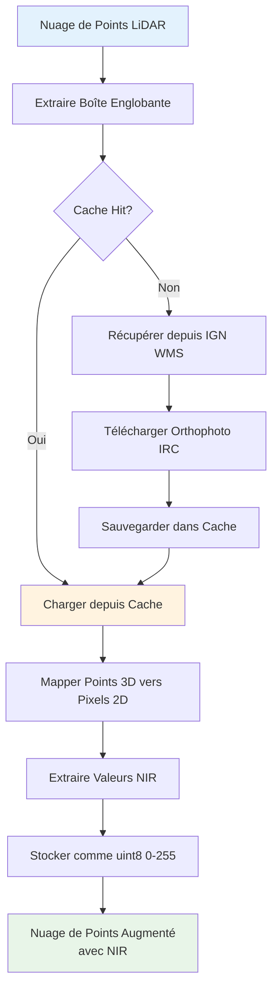

# Augmentation Infrarouge

Enrichissez automatiquement vos nuages de points LiDAR avec des valeurs Proche Infrarouge (NIR) depuis les orthophotos IRC (Infrarouge Couleur) de l'IGN pour une analyse avancée de la végétation, la classification de l'occupation du sol et des jeux de données d'apprentissage automatique améliorés.

## Vue d'ensemble

L'augmentation infrarouge récupère des orthophotos infrarouge haute résolution depuis le service WMS Géoplateforme de l'IGN et associe les valeurs d'intensité NIR à chaque point de vos dalles LiDAR. Combiné avec l'augmentation RGB, cela crée de puissants jeux de données multi-modaux pour le calcul d'indices de végétation (NDVI, EVI) et améliore la classification de l'occupation du sol.

:::tip Pourquoi utiliser l'augmentation Infrarouge ?

- **Analyse de la Végétation** : Calcul du NDVI, EVI et autres indices de végétation
- **Classification de l'Occupation du Sol** : Meilleure différenciation végétation/structures bâties
- **Apprentissage Multi-Modal** : Combiner géométrie + RGB + NIR pour des modèles ML supérieurs
- **Intégration Automatique** : Fonctionne parfaitement avec l'augmentation RGB
- **Haute Résolution** : Résolution de 20cm des orthophotos IRC de l'IGN
- **Cache Intelligent** : Système de cache partagé avec l'augmentation RGB
  :::

## Démarrage Rapide

### Utilisation CLI

```bash
# Enrichissement basique avec infrarouge
ign-lidar-hd enrich \
  --input dalles_brutes/ \
  --output enrichies/ \
  --add-infrared

# Avec répertoire de cache personnalisé
ign-lidar-hd enrich \
  --input dalles_brutes/ \
  --output enrichies/ \
  --add-infrared \
  --infrared-cache-dir /data/cache/infrared/

# RGB + Infrarouge combinés (recommandé pour le ML)
ign-lidar-hd enrich \
  --input dalles_brutes/ \
  --output enrichies/ \
  --mode full \
  --add-rgb \
  --add-infrared \
  --rgb-cache-dir cache/rgb/ \
  --infrared-cache-dir cache/infrared/

# Traitement complet
ign-lidar-hd enrich \
  --input dalles_brutes/ \
  --output enrichies/ \
  --mode full \
  --auto-params \
  --preprocess \
  --add-rgb \
  --add-infrared \
  --rgb-cache-dir cache/rgb/ \
  --infrared-cache-dir cache/infrared/ \
  --use-gpu
```

### API Python

```python
from pathlib import Path
import laspy
import numpy as np

# Traitement avec augmentation infrarouge
from ign_lidar.cli import cmd_enrich
from argparse import Namespace

args = Namespace(
    input=Path("dalle.laz"),
    output=Path("enrichies/"),
    mode="full",
    add_infrared=True,
    infrared_cache_dir=Path("cache/infrared/"),
    add_rgb=True,
    rgb_cache_dir=Path("cache/rgb/"),
    # ... autres paramètres
)

# Utilisation directe du module
from ign_lidar.infrared_augmentation import IGNInfraredFetcher

# Initialiser le récupérateur
fetcher = IGNInfraredFetcher(cache_dir="cache/infrared/")

# Charger la dalle
las = laspy.read("dalle.laz")
points = np.vstack([las.x, las.y, las.z]).T

# Récupérer et ajouter les valeurs infrarouge
valeurs_nir = fetcher.augment_points_with_infrared(
    points,
    resolution=0.2  # Pixels de 20cm
)

# valeurs_nir est un tableau uint8 (0-255) avec l'intensité NIR
```

## Fonctionnement



### Détails Techniques

1. **Service WMS** : Récupère depuis la couche `ORTHOIMAGERY.ORTHOPHOTOS.IRC`
2. **Résolution** : 20cm (0.2m) par pixel par défaut, configurable
3. **Système de Coordonnées** : Lambert-93 (EPSG:2154)
4. **Format de Données** : NIR stocké comme dimension extra 'nir' (uint8, 0-255)
5. **Compatibilité LAZ** : Sauvegarde comme LAZ 1.4 standard avec dimensions extras

## Format des Données

### Structure LAZ de Sortie

Après l'augmentation infrarouge, vos fichiers LAZ contiennent une dimension extra supplémentaire :

```python
import laspy

las = laspy.read("dalle_enrichie.laz")

# Vérifier les dimensions extras
print(las.point_format.extra_dimension_names)
# Sortie : ['nir'] ou ['nir', 'red', 'green', 'blue'] avec RGB

# Accéder aux valeurs NIR
nir = las.nir  # tableau uint8 (0-255)

print(f"Plage NIR : {nir.min()}-{nir.max()}")
print(f"Moyenne NIR : {nir.mean():.1f}")
```

### Interprétation des Valeurs

- **0-255** : Valeurs d'intensité NIR (uint8)
- **Valeurs élevées (>200)** : Forte réflexion NIR (végétation saine)
- **Valeurs faibles (<50)** : Faible réflexion NIR (eau, surfaces artificielles)
- **Valeurs moyennes (50-200)** : Surfaces mixtes, végétation stressée

## Indices de Végétation

### Calcul du NDVI

L'utilisation la plus courante des données NIR est le calcul de l'Indice de Végétation par Différence Normalisée :

```python
import laspy
import numpy as np

# Charger dalle enrichie avec RGB + NIR
las = laspy.read("dalle_enrichie.laz")

# Extraire RGB et NIR
rouge = las.red.astype(float)
nir = las.nir.astype(float)

# Calculer NDVI : (NIR - Rouge) / (NIR + Rouge)
ndvi = (nir - rouge) / (nir + rouge + 1e-8)  # epsilon évite division par zéro

# Le NDVI varie de -1 à 1
# > 0.5 : Végétation dense
# 0.2-0.5 : Végétation modérée
# 0.1-0.2 : Végétation éparse
# < 0.1 : Non-végétation (bâtiments, eau, sol nu)

# Classifier les points
veg_dense = ndvi > 0.5
batiments = ndvi < 0.1

print(f"Végétation dense : {veg_dense.sum()/len(ndvi)*100:.1f}%")
print(f"Bâtiments/artificiel : {batiments.sum()/len(ndvi)*100:.1f}%")
```

### Autres Indices de Végétation

```python
# Indice de Végétation Amélioré (EVI)
# Plus sensible aux régions à haute biomasse
bleu = las.blue.astype(float)
evi = 2.5 * (nir - rouge) / (nir + 6*rouge - 7.5*bleu + 1)

# NDVI Vert (utilise le canal vert)
vert = las.green.astype(float)
gndvi = (nir - vert) / (nir + vert + 1e-8)

# Indice de Végétation Ajusté au Sol (SAVI)
L = 0.5  # facteur de correction de luminosité du sol
savi = ((nir - rouge) / (nir + rouge + L)) * (1 + L)
```

## Configuration Pipeline

### Configuration YAML

```yaml
enrich:
  input_dir: "data/brutes"
  output: "data/enrichies"
  mode: "full"

  # Augmentation RGB
  add_rgb: true
  rgb_cache_dir: "cache/rgb"

  # Augmentation infrarouge
  add_infrared: true
  infrared_cache_dir: "cache/infrared"

  # Prétraitement (recommandé)
  preprocess: true
  auto_params: true

  # Accélération GPU
  use_gpu: true
```

## Système de Cache

L'augmentation infrarouge utilise un système de cache intelligent pour éviter les téléchargements redondants :

### Cache Disque (Par défaut)

```bash
# Structure du cache
cache/infrared/
├── tile_479000_6904000_500x500_0.2m.png
├── tile_479500_6904000_500x500_0.2m.png
└── ...

# Format de la clé de cache : tile_{minx}_{miny}_{largeur}x{hauteur}_{resolution}m.png
```

### Avantages du Cache

- **Retraitement Rapide** : Dalles en cache chargées en millisecondes vs secondes
- **Économie de Bande Passante** : Réduit la charge sur le serveur WMS de l'IGN
- **Travail Hors-Ligne** : Traiter les dalles sans internet après téléchargement initial
- **Partagé Entre Fichiers** : Même orthophoto utilisée pour les dalles qui se chevauchent

### Gestion du Cache

```bash
# Vérifier la taille du cache
du -sh cache/infrared/

# Nettoyer l'ancien cache (optionnel)
rm -rf cache/infrared/*

# Séparer les caches RGB et infrarouge (recommandé)
--rgb-cache-dir cache/rgb/
--infrared-cache-dir cache/infrared/
```

## Accélération GPU

Pour de grands jeux de données, le cache GPU offre des performances supplémentaires :

```python
from ign_lidar.infrared_augmentation import IGNInfraredFetcher

# Initialiser avec cache GPU (nécessite CuPy)
fetcher = IGNInfraredFetcher(
    cache_dir="cache/infrared/",
    use_gpu=True  # Active le cache mémoire GPU
)

# Le cache GPU utilise l'éviction LRU
# Orthophotos stockées en mémoire GPU pour accès ultra-rapide
```

## Visualisation CloudCompare

### Afficher le Champ NIR

1. Ouvrir le fichier LAZ enrichi dans CloudCompare
2. Sélectionner le nuage de points dans l'arbre DB
3. Ouvrir le panneau Propriétés (côté droit)
4. Chercher la section "Champs Scalaires"
5. Cliquer sur `[0]` ou `nir`
6. Les valeurs NIR seront affichées avec un gradient de couleur

:::tip Noms de Champs
CloudCompare peut afficher `[0]` au lieu de `nir` pour les dimensions extras. C'est normal - `[0]` représente la première dimension extra, qui est votre champ NIR.
:::

### Visualisation NDVI

Créer un champ scalaire personnalisé dans CloudCompare :

1. **Édition > Champs Scalaires > Arithmétique**
2. Formule : `(SF0 - SF1) / (SF0 + SF1)` où :
   - SF0 = Champ NIR
   - SF1 = Champ Rouge (si RGB augmenté)
3. Sauvegarder comme champ scalaire "NDVI"
4. Appliquer échelle de couleur (rouge = végétation, bleu = bâtiments)

## Performances

### Benchmarks

Configuration de test : Dalle 18M points, Intel i7, 32GB RAM

| Opération                           | Temps | Cache |
| ----------------------------------- | ----- | ----- |
| Première exécution (téléchargement) | ~4-6s | Froid |
| Exécutions suivantes                | <1s   | Chaud |
| Avec cache GPU                      | <0.5s | GPU   |

### Conseils d'Optimisation

1. **Utiliser le cache** : Toujours spécifier `--infrared-cache-dir`
2. **Traitement parallèle** : Utiliser `--num-workers` pour plusieurs dalles
3. **Accélération GPU** : Activer `--use-gpu` avec CuPy installé
4. **Traitement par lots** : Traiter plusieurs dalles en une commande

## Cas d'Usage

### 1. Cartographie de la Végétation

```python
# Identifier et classifier la végétation
foret_dense = ndvi > 0.7
prairie = (ndvi > 0.3) & (ndvi <= 0.7)
veg_parse = (ndvi > 0.1) & (ndvi <= 0.3)
```

### 2. Détection de Bâtiments

```python
# Surfaces non-végétation (bâtiments, routes)
artificiel = ndvi < 0.1

# Combiner avec caractéristiques géométriques
from ign_lidar.features import compute_features

features = compute_features(points, k=30)
surfaces_plates = features['planarity'] > 0.8

# Bâtiments haute confiance : plats + faible NDVI
batiments = surfaces_plates & artificiel
```

### 3. Jeux de Données ML Multi-Modaux

```python
# Créer jeu de données d'entraînement avec géométrie + RGB + NIR
features = {
    'xyz': points[:, :3],
    'normales': features_geometriques['normals'],
    'courbure': features_geometriques['curvature'],
    'rgb': np.vstack([rouge, vert, bleu]).T / 255.0,
    'nir': nir / 255.0,
    'ndvi': ndvi,
    'labels': labels_batiments
}

np.savez('patch_entrainement.npz', **features)
```

### 4. Classification Occupation du Sol

```python
# Classification multi-classes depuis NDVI
def classifier_occupation_sol(ndvi):
    classes = np.zeros(len(ndvi), dtype=np.uint8)
    classes[ndvi < 0.1] = 1  # Bâtiments/Routes
    classes[(ndvi >= 0.1) & (ndvi < 0.3)] = 2  # Sol nu
    classes[(ndvi >= 0.3) & (ndvi < 0.5)] = 3  # Herbe/végétation éparse
    classes[(ndvi >= 0.5) & (ndvi < 0.7)] = 4  # Forêt modérée
    classes[ndvi >= 0.7] = 5  # Forêt dense
    return classes
```

## Dépannage

### Problèmes Courants

#### Champ NIR Pas Visible dans CloudCompare

**Solution** : Les dimensions extras apparaissent comme `[0]`, `[1]`, etc. Cliquer sur le numéro pour activer l'affichage.

#### Toutes les Valeurs NIR Sont Identiques/Zéro

**Causes possibles** :

- Problème réseau lors de la récupération WMS
- Orthophoto non disponible pour la région
- Corruption du cache

**Solution** :

```bash
# Nettoyer le cache et réessayer
rm -rf cache/infrared/*
ign-lidar-hd enrich --input dalle.laz --output sortie/ --add-infrared --force
```

#### Mémoire Insuffisante avec Grandes Dalles

**Solution** : Le traitement par morceaux est automatique pour les dalles >15M points, mais vous pouvez aussi :

```bash
# Activer le prétraitement pour réduire le nombre de points
ign-lidar-hd enrich --input dalle.laz --output sortie/ \
  --add-infrared --preprocess --voxel-size 0.3
```

#### Problèmes Format COPC

Le format COPC (Cloud Optimized Point Cloud) est automatiquement détecté et converti :

```
INFO - ℹ️ COPC détecté - sera converti en LAZ standard
```

C'est normal et assure la compatibilité avec les dimensions extras.

## Bonnes Pratiques

1. **Toujours utiliser le cache** dans les pipelines de production
2. **Combiner avec RGB** pour un maximum d'informations
3. **Appliquer le prétraitement** avant l'augmentation pour des résultats propres
4. **Utiliser auto-params** pour une qualité de caractéristiques optimale
5. **Vérifier les plages NDVI** pour valider la qualité des données
6. **Stocker les caches RGB et NIR séparément** pour une meilleure organisation

## Référence API

### Classe IGNInfraredFetcher

```python
class IGNInfraredFetcher:
    """Récupère les valeurs Proche Infrarouge depuis les orthophotos IRC de l'IGN."""

    def __init__(
        self,
        cache_dir: Optional[Path] = None,
        use_gpu: bool = False,
        wms_url: str = "https://data.geopf.fr/wms-r",
        layer: str = "ORTHOIMAGERY.ORTHOPHOTOS.IRC"
    ):
        """Initialiser le récupérateur avec options de cache."""

    def augment_points_with_infrared(
        self,
        points: np.ndarray,
        resolution: float = 0.2
    ) -> np.ndarray:
        """
        Ajouter les valeurs NIR aux points.

        Args:
            points: Tableau (N, 3) de coordonnées XYZ
            resolution: Résolution de l'orthophoto en mètres

        Returns:
            Tableau uint8 (N,) de valeurs NIR (0-255)
        """
```

### Arguments CLI

```bash
--add-infrared              # Activer l'augmentation infrarouge
--infrared-cache-dir PATH   # Répertoire de cache pour les orthophotos IRC
```

## Documentation Associée

- [Augmentation RGB](rgb-augmentation.md) - Guide augmentation couleur
- [Configuration Pipeline](pipeline-configuration.md) - Référence config YAML
- [Accélération GPU](../gpu/overview.md) - Configuration et usage GPU
- [Prétraitement](../guides/preprocessing.md) - Atténuation des artefacts

## Exemples

- [Démo : Augmentation Infrarouge](https://github.com/sducournau/IGN_LIDAR_HD_DATASET/blob/main/examples/demo_infrared_augmentation.py)
- [Exemple Calcul NDVI](https://github.com/sducournau/IGN_LIDAR_HD_DATASET/blob/main/examples/demo_infrared_augmentation.py#L89)
- [Workflow Multi-Modal](https://github.com/sducournau/IGN_LIDAR_HD_DATASET/blob/main/examples/pipeline_example.py)

## Changelog

### v1.7.2 (2025-10-04)

- ✨ Version initiale de l'augmentation infrarouge
- 🎯 Intégration orthophotos IRC de l'IGN
- 💾 Système de cache disque et GPU
- 📊 Exemples de calcul NDVI
- 🔧 Support configuration CLI et YAML
- 📚 Documentation complète
