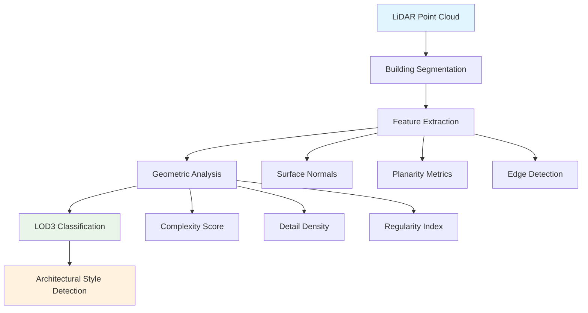

features/lod3-classification.md

# Level of Detail (LOD) Classification


## Vue d'ensemble

Level of Detail (LOD) is a fundamental concept in 3D building modeling and architectural analysis. This library focuses on classifying buildings based on their geometric complexity and detail level, particularly targeting **LOD3** classification from LiDAR point clouds.

## LOD Levels Explained

### LOD0 - Regional/Footprint Level

- **Description**: 2D building footprints without height information
- **Use Cases**: Urban planning, land use analysis
- **Data Source**: Cadastral maps, satellite imagery

### LOD1 - Block Model

- **Description**: Simple extruded building blocks with uniform height
- **Geometry**: Basic rectangular prisms
- **Use Cases**: City-scale visualization, urban morphology studies

### LOD2 - Roof Structure

- **Description**: Buildings with detailed roof structures and major architectural elements
- **Features**: Roof shapes, dormers, chimneys
- **Use Cases**: Solar potential analysis, detailed urban modeling

### LOD3 - Architectural Detail (Target)

- **Description**: Detailed building models including facade elements
- **Features**:
  - Windows and doors
  - Balconies and terraces
  - Architectural ornaments
  - Building textures
- **Use Cases**: Heritage documentation, detailed visualization, architectural analysis

### LOD4 - Interior Structure

- **Description**: Complete building models including interior spaces
- **Features**: Room layouts, furniture, interior architectural elements
- **Use Cases**: Indoor navigation, facility management

## LOD3 Classification with LiDAR

### Why LOD3?

LOD3 represents the optimal balance between geometric detail and computational feasibility for LiDAR-based analysis:

- **Sufficient Detail**: Captures essential architectural features visible in high-resolution LiDAR
- **Processing Efficiency**: Manageable computational requirements
- **Practical Applications**: Supports real-world use cases in architecture and urban planning

### Key Features for LOD3 Detection

1. **Facade Complexity**

   - Window and door openings
   - Balcony protrusions
   - Architectural ornaments

2. **Geometric Regularity**

   - Consistent architectural patterns
   - Repetitive structural elements
   - Symmetrical facades

3. **Point Density Analysis**
   - High-resolution detail capture
   - Surface texture information
   - Edge definition quality

## Classification Workflow



## Implementation Example

```python
from ign_lidar import Processor
from ign_lidar.architectural_styles import ArchitecturalAnalyzer

# Initialize processor with LOD3 focus
processor = Processor(
    target_lod='LOD3',
    detail_threshold=0.8,
    complexity_analysis=True
)

# Analyze architectural details
analyzer = ArchitecturalAnalyzer()

# Process building for LOD3 classification
results = processor.classify_building_lod(
    point_cloud_path="building.las",
    architectural_analysis=True
)

print(f"Detected LOD: {results['lod_level']}")
print(f"Confidence: {results['confidence']:.2f}")
print(f"Key features: {results['detected_features']}")
```

## Quality Metrics

### LOD3 Classification Confidence

- **High Confidence (>0.8)**: Clear architectural details, regular patterns
- **Medium Confidence (0.5-0.8)**: Some architectural elements, moderate detail
- **Low Confidence (&lt;0.5)**: Minimal architectural detail, simple geometry

### Validation Criteria

1. **Facade Detail Score**: Measures window/door detection accuracy
2. **Geometric Complexity**: Quantifies architectural ornament presence
3. **Pattern Regularity**: Evaluates structural consistency
4. **Point Density Quality**: Assesses LiDAR capture resolution

## Best Practices

### For Optimal LOD3 Classification

1. **Input Data Quality**

   - Use high-density LiDAR (>10 points/m²)
   - Ensure good building coverage
   - Minimize occlusion effects

2. **Processing Parameters**

   - Adjust detail thresholds based on building type
   - Consider regional architectural styles
   - Validate results with ground truth data

3. **Post-Processing**
   - Review classification confidence scores
   - Manual verification for critical applications
   - Cross-reference with architectural databases

## Documentation Associée

- [Architectural Styles](./architectural-styles.md) - Understanding regional building patterns
- [Axonometry Analysis](./axonometry.md) - 3D geometric representation methods
- [Feature Extraction](../api/features.md) - Technical implementation details

## Further Reading

- **CityGML LOD Specification**: Official standards for 3D city modeling
- **IGN Technical Documentation**: French national mapping agency guidelines
- **Architectural Pattern Recognition**: Academic research on building classification
