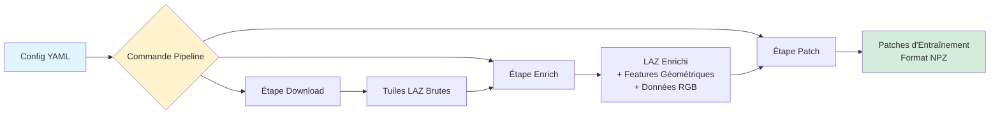
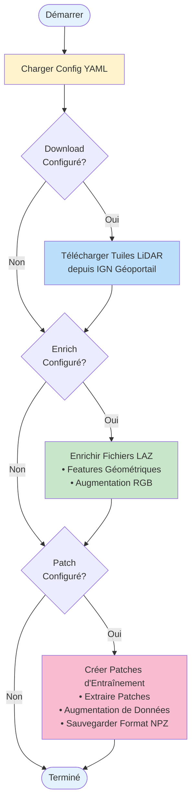

# Configuration Pipeline

Exécutez des workflows complets de traitement LiDAR en utilisant des fichiers de configuration YAML déclaratifs. La commande pipeline vous permet d'automatiser l'ensemble du processus, du téléchargement à la création de patches.

## Vue d'ensemble

La commande `pipeline` offre un moyen puissant de gérer des workflows complexes :

- **Déclarative** : Définissez votre workflow dans un fichier YAML
- **Reproductible** : Versionnez vos paramètres de traitement
- **Flexible** : Configurez uniquement les étapes dont vous avez besoin
- **Partageable** : Collaboration facile avec des fichiers de configuration

### Architecture du Pipeline



### Étapes du Workflow



## Démarrage rapide

### 1. Créer une configuration exemple

```bash
# Créer une configuration pipeline complète
ign-lidar-hd pipeline ma_config.yaml --create-example full

# Ou créer des configs spécifiques à une étape
ign-lidar-hd pipeline enrich_config.yaml --create-example enrich
ign-lidar-hd pipeline patch_config.yaml --create-example patch
```

### 2. Éditer la configuration

Pour des exemples détaillés de configurations, consultez [Exemples de Configuration](../reference/config-examples.md).

Exemple simple :

### 3. Exécuter le pipeline

```bash
ign-lidar-hd pipeline ma_config.yaml
```

## Structure de configuration

### Paramètres globaux

Paramètres qui s'appliquent à toutes les étapes :

```yaml
global:
  num_workers: 4 # Nombre de workers parallèles
  output_dir: "data/" # Répertoire de sortie de base (optionnel)
```

### Étape Download

Télécharger les tuiles LiDAR depuis l'IGN :

```yaml
download:
  bbox: "2.3, 48.8, 2.4, 48.9" # WGS84: lon_min,lat_min,lon_max,lat_max
  output: "data/brut" # Répertoire de sortie
  max_tiles: 10 # Optionnel: limiter les tuiles
  num_workers: 3 # Optionnel: téléchargements parallèles
```

### Étape Enrich

Enrichir les fichiers LAZ avec des caractéristiques géométriques et RGB :

```yaml
enrich:
  input_dir: "data/brut" # Fichiers LAZ d'entrée
  output: "data/enrichi" # Répertoire de sortie
  mode: "full" # 'core' ou 'full'
  k_neighbors: 10 # Voisins pour les features
  use_gpu: true # Accélération GPU
  add_rgb: true # Ajouter RGB depuis orthophotos
  rgb_cache_dir: "cache/ortho" # Répertoire cache RGB
  num_workers: 4 # Traitement parallèle
  auto_convert_qgis: false # Conversion format QGIS
  force: false # Forcer le retraitement
```

### Étape Patch

Créer des patches d'entraînement :

```yaml
patch:
  input_dir: "data/enrichi" # Fichiers LAZ d'entrée
  output: "data/patches" # Répertoire de sortie
  lod_level: "LOD2" # 'LOD2' ou 'LOD3'
  patch_size: 150.0 # Taille patch en mètres
  patch_overlap: 0.1 # Ratio de chevauchement (0.0-1.0)
  num_points: 16384 # Points par patch
  num_workers: 4 # Traitement parallèle
  include_architectural_style: false # Features de style
  style_encoding: "constant" # 'constant' ou 'multihot'
  force: false # Forcer le retraitement
```

## Exemples de workflows

### Pipeline complet

Télécharger, enrichir et créer des patches en un seul workflow :

```yaml
# pipeline_full.yaml
global:
  num_workers: 4

download:
  bbox: "2.3, 48.8, 2.4, 48.9"
  output: "data/brut"
  max_tiles: 10

enrich:
  input_dir: "data/brut"
  output: "data/enrichi"
  mode: "full"
  use_gpu: true
  add_rgb: true
  rgb_cache_dir: "cache/orthophotos"

patch:
  input_dir: "data/enrichi"
  output: "data/patches"
  lod_level: "LOD2"
  patch_size: 150.0
  num_points: 16384
  augment: true
```

Exécuter avec :

```bash
ign-lidar-hd pipeline pipeline_full.yaml
```

### Enrichissement uniquement

Traiter des tuiles existantes avec des caractéristiques géométriques et RGB :

```yaml
# pipeline_enrich.yaml
global:
  num_workers: 4

enrich:
  input_dir: "data/brut"
  output: "data/enrichi"
  mode: "full"
  k_neighbors: 10
  use_gpu: true
  add_rgb: true
  rgb_cache_dir: "cache/orthophotos"
```

### Patches uniquement

Créer des patches à partir de tuiles déjà enrichies :

```yaml
# pipeline_patch.yaml
global:
  num_workers: 4

patch:
  input_dir: "data/enrichi"
  output: "data/patches"
  lod_level: "LOD2"
  patch_size: 150.0
  num_points: 16384
  augment: true
  num_augmentations: 3
```

## Cas d'usage

### Workflow de production

Traitement haute qualité avec toutes les fonctionnalités :

```yaml
global:
  num_workers: 8

enrich:
  mode: "full" # Toutes les features
  use_gpu: true
  add_rgb: true

patch:
  num_points: 16384 # Patches complets
  augment: true
  num_augmentations: 5
```

### Développement/Tests

Itération rapide avec traitement minimal :

```yaml
global:
  num_workers: 2

enrich:
  mode: "core" # Features de base
  use_gpu: false
  add_rgb: false

patch:
  num_points: 4096 # Patches plus petits
  augment: false
```

### Traitement régional

Traiter différentes régions avec des paramètres spécifiques :

```yaml
# paris_urbain.yaml
enrich:
  input_dir: "tuiles_paris/"
  mode: "full"
  add_rgb: true

patch:
  input_dir: "paris_enrichi/"
  lod_level: "LOD3"
```

## API Python

Utiliser les configurations programmatiquement :

```python
from pathlib import Path
from ign_lidar.pipeline_config import PipelineConfig
from ign_lidar.cli import cmd_pipeline

# Charger la configuration
config = PipelineConfig(Path("ma_config.yaml"))

# Vérifier les étapes configurées
print(f"A download: {config.has_download}")
print(f"A enrich: {config.has_enrich}")
print(f"A patch: {config.has_patch}")

# Obtenir la configuration d'une étape
if config.has_enrich:
    enrich_cfg = config.get_enrich_config()
    print(f"Mode: {enrich_cfg['mode']}")
    print(f"RGB: {enrich_cfg.get('add_rgb', False)}")
```

### Créer une configuration programmatiquement

```python
import yaml
from pathlib import Path

config = {
    'global': {'num_workers': 4},
    'enrich': {
        'input_dir': 'data/brut',
        'output': 'data/enrichi',
        'mode': 'full',
        'add_rgb': True,
    },
    'patch': {
        'input_dir': 'data/enrichi',
        'output': 'data/patches',
        'lod_level': 'LOD2',
    },
}

with open('config.yaml', 'w') as f:
    yaml.dump(config, f, default_flow_style=False)
```

## Avantages

### Reproductibilité

- Versionnez vos configurations
- Mêmes paramètres à chaque fois
- Facile de suivre les changements

### Simplicité

Avant (plusieurs commandes) :

```bash
ign-lidar-hd download --bbox "..." --output data/brut
ign-lidar-hd enrich --input-dir data/brut --output data/enrichi ...
ign-lidar-hd patch --input-dir data/enrichi --output data/patches ...
```

Après (une seule commande) :

```bash
ign-lidar-hd pipeline mon_workflow.yaml
```

### Collaboration

- Partagez les fichiers de configuration avec l'équipe
- Documentez les workflows de traitement
- Créez des templates réutilisables

## Bonnes pratiques

### 1. Utilisez des noms descriptifs

```
✅ Bon :
├── paris_urbain_LOD2.yaml
├── batiments_ruraux_LOD3.yaml
└── test_petit_dataset.yaml

❌ À éviter :
├── config1.yaml
├── test.yaml
└── nouveau.yaml
```

### 2. Ajoutez des commentaires

```yaml
enrich:
  # Utilisez le mode full pour zones urbaines avec géométrie complexe
  mode: "full"

  # RGB améliore la précision de classification de 5-10%
  add_rgb: true

  # GPU réduit le temps de traitement de 60%
  use_gpu: true
```

### 3. Utilisez des chemins relatifs

```yaml
# ✅ Bon - portable
enrich:
  input_dir: "data/brut"
  output: "data/enrichi"

# ❌ À éviter - difficile à partager
enrich:
  input_dir: "/home/user/projet/data/brut"
```

### 4. Versionnez vos configs

```yaml
# Version: 1.2
# Date: 2025-10-03
# Auteur: Équipe Data
# Objectif: Pipeline de production pour classification urbaine

global:
  num_workers: 8
```

## Dépannage

### Configuration non trouvée

```
Error: Configuration file not found: ma_config.yaml
```

Solution : Utilisez un chemin absolu

```bash
ign-lidar-hd pipeline $(pwd)/ma_config.yaml
```

### Syntaxe YAML invalide

```
Error: YAML parse error
```

Solution : Validez le YAML

```bash
python -c "import yaml; yaml.safe_load(open('config.yaml'))"
```

### Échec d'une étape

```
Error: Enrich stage failed
```

Solution : Exécutez l'étape séparément pour déboguer

```bash
ign-lidar-hd enrich --input-dir data/brut --output data/test
```

## Voir aussi

- [Commande Enrich](../reference/cli-enrich.md)
- [Commande Patch](../reference/cli-patch.md)
- [Commande Download](../reference/cli-download.md)
- [Exemples de configurations](https://github.com/sducournau/IGN_LIDAR_HD_DATASET/tree/main/config_examples)
