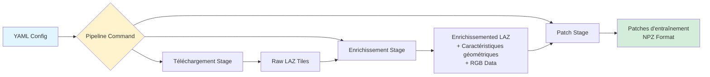
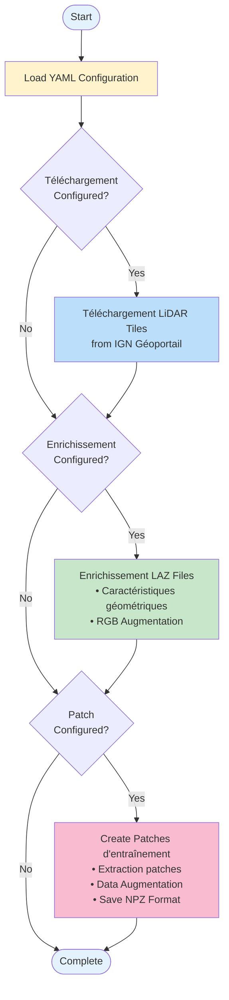

# Pipeline Configuration

Execute complete LiDAR processing workflows using declarative YAML configuration files. The pipeline command allows you to automate the entire process from download to patch creation.

## Vue d'ensemble

The `pipeline` command provides a powerful way to manage complex workflows:

- **Declarative**: Define your workflow in a YAML file
- **Reproducible**: Version control your processing parameters
- **Flexible**: Configure only the stages you need
- **Shareable**: Easy collaboration with configuration files

### Pipeline Architecture



### Workflow Stages



## Quick Start

### 1. Create Exemple Configuration

```bash
# Create a full pipeline configuration
ign-lidar-hd pipeline my_config.yaml --create-example full

# Or create stage-specific configs
ign-lidar-hd pipeline enrich_config.yaml --create-example enrich
ign-lidar-hd pipeline patch_config.yaml --create-example patch
```

### 2. Edit Configuration

```yaml
# my_config.yaml
global:
  num_workers: 4

enrich:
  input_dir: "data/raw"
  output: "data/enriched"
  mode: "full"
  add_rgb: true
  rgb_cache_dir: "cache/orthophotos"

patch:
  input_dir: "data/enriched"
  output: "data/patches"
  lod_level: "LOD2"
  num_points: 16384
```

### 3. Run Pipeline

```bash
ign-lidar-hd pipeline my_config.yaml
```

## Configuration Structure

### Global Settings

Settings that apply to all stages:

```yaml
global:
  num_workers: 4 # Nombre de workers parallèles
  output_dir: "data/" # Base output directory (optionnel)
```

### Téléchargement Stage

Téléchargement LiDAR tiles from IGN:

```yaml
download:
  bbox: "2.3, 48.8, 2.4, 48.9" # WGS84: lon_min,lat_min,lon_max,lat_max
  output: "data/raw" # Sortie directory
  max_tiles: 10 # Optional: limit tiles
  num_workers: 3 # Optional: parallel downloads
```

### Enrichissement Stage

Enrichissement LAZ files with caractéristiques géométriques and RGB:

```yaml
enrich:
  input_dir: "data/raw" # Entrée LAZ files
  output: "data/enriched" # Sortie directory
  mode: "full" # 'core' or 'full'
  k_neighbors: 10 # Neighbors for features
  use_gpu: true # GPU acceleration
  add_rgb: true # Add RGB from orthophotos
  rgb_cache_dir: "cache/ortho" # RGB cache directory
  num_workers: 4 # Parallel processing
  auto_convert_qgis: false # QGIS format conversion
  force: false # Force reprocessing
```

### Patch Stage

Create training patches:

```yaml
patch:
  input_dir: "data/enriched" # Entrée LAZ files
  output: "data/patches" # Sortie directory
  lod_level: "LOD2" # 'LOD2' or 'LOD3'
  patch_size: 150.0 # Patch size in meters
  patch_overlap: 0.1 # Overlap ratio (0.0-1.0)
  num_points: 16384 # Points per patch
  augment: true # Data augmentation
  num_augmentations: 3 # Augmented versions
  num_workers: 4 # Parallel processing
  include_architectural_style: false # Style features
  style_encoding: "constant" # 'constant' or 'multihot'
  force: false # Force reprocessing
```

## Exemple Workflows

### Full Pipeline

Téléchargement, enrich, and create patches in one workflow:

```yaml
# pipeline_full.yaml
global:
  num_workers: 4

download:
  bbox: "2.3, 48.8, 2.4, 48.9"
  output: "data/raw"
  max_tiles: 10

enrich:
  input_dir: "data/raw"
  output: "data/enriched"
  mode: "full"
  use_gpu: true
  add_rgb: true
  rgb_cache_dir: "cache/orthophotos"

patch:
  input_dir: "data/enriched"
  output: "data/patches"
  lod_level: "LOD2"
  patch_size: 150.0
  num_points: 16384
  augment: true
```

Run with:

```bash
ign-lidar-hd pipeline pipeline_full.yaml
```

### Enrichissement Only

Traitement existing tiles with caractéristiques géométriques and RGB:

```yaml
# pipeline_enrich.yaml
global:
  num_workers: 4

enrich:
  input_dir: "data/raw"
  output: "data/enriched"
  mode: "full"
  k_neighbors: 10
  use_gpu: true
  add_rgb: true
  rgb_cache_dir: "cache/orthophotos"
```

### Patch Only

Create patches from already enriched tiles:

```yaml
# pipeline_patch.yaml
global:
  num_workers: 4

patch:
  input_dir: "data/enriched"
  output: "data/patches"
  lod_level: "LOD2"
  patch_size: 150.0
  num_points: 16384
```

## Use Cases

### Production Workflow

High-quality processing with all features:

```yaml
global:
  num_workers: 8

enrich:
  mode: "full" # All features
  use_gpu: true
  add_rgb: true

patch:
  num_points: 16384 # Full patches
  augment: true
  num_augmentations: 5
```

### Development/Testing

Fast iteration with minimal processing:

```yaml
global:
  num_workers: 2

enrich:
  mode: "core" # Basic features
  use_gpu: false
  add_rgb: false

patch:
  num_points: 4096 # Smaller patches
  augment: false
```

### Regional Traitementing

Traitement different regions with specific settings:

```yaml
# paris_urban.yaml
enrich:
  input_dir: "paris_tiles/"
  mode: "full"
  add_rgb: true

patch:
  input_dir: "paris_enriched/"
  lod_level: "LOD3"
```

## Python API

Use configurations programmatically:

```python
from pathlib import Path
from ign_lidar.pipeline_config import PipelineConfig
from ign_lidar.cli import cmd_pipeline

# Load configuration
config = PipelineConfig(Path("my_config.yaml"))

# Check configured stages
print(f"Has download: {config.has_download}")
print(f"Has enrich: {config.has_enrich}")
print(f"Has patch: {config.has_patch}")

# Get stage configuration
if config.has_enrich:
    enrich_cfg = config.get_enrich_config()
    print(f"Mode: {enrich_cfg['mode']}")
    print(f"RGB: {enrich_cfg.get('add_rgb', False)}")
```

### Create Configuration Programmatically

```python
import yaml
from pathlib import Path

config = {
    'global': {'num_workers': 4},
    'enrich': {
        'input_dir': 'data/raw',
        'output': 'data/enriched',
        'mode': 'full',
        'add_rgb': True,
    },
    'patch': {
        'input_dir': 'data/enriched',
        'output': 'data/patches',
        'lod_level': 'LOD2',
    },
}

with open('config.yaml', 'w') as f:
    yaml.dump(config, f, default_flow_style=False)
```

## Benefits

### Reproducibility

- Version control your configurations
- Exact same parameters every time
- Easy to track changes

### Simplicity

Before (multiple commands):

```bash
ign-lidar-hd download --bbox "..." --output data/raw
ign-lidar-hd enrich --input-dir data/raw --output data/enriched ...
ign-lidar-hd patch --input-dir data/enriched --output data/patches ...
```

After (single command):

```bash
ign-lidar-hd pipeline my_workflow.yaml
```

### Collaboration

- Share configuration files with team
- Document processing workflows
- Create reusable templates

## Best Practices

### 1. Use Descriptive Names

```
✅ Good:
├── paris_urban_LOD2.yaml
├── rural_buildings_LOD3.yaml
└── test_small_dataset.yaml

❌ Avoid:
├── config1.yaml
├── test.yaml
└── new.yaml
```

### 2. Add Comments

```yaml
enrich:
  # Use building mode for urban areas with complex geometry
  mode: "full"

  # RGB improves classification accuracy by 5-10%
  add_rgb: true

  # GPU cuts processing time by 60%
  use_gpu: true
```

### 3. Use Relative Paths

```yaml
# ✅ Good - portable
enrich:
  input_dir: "data/raw"
  output: "data/enriched"

# ❌ Avoid - hard to share
enrich:
  input_dir: "/home/user/project/data/raw"
```

### 4. Version Your Configs

```yaml
# Version: 1.2
# Date: 2025-10-03
# Author: Data Team
# Purpose: Production pipeline for urban classification

global:
  num_workers: 8
```

## Dépannage

### Configuration Not Found

```
Error: Configuration file not found: my_config.yaml
```

Solution: Use absolute path

```bash
ign-lidar-hd pipeline $(pwd)/my_config.yaml
```

### Invalid YAML Syntax

```
Error: YAML parse error
```

Solution: Validate YAML

```bash
python -c "import yaml; yaml.safe_load(open('config.yaml'))"
```

### Stage Failed

```
Error: Enrichissement stage failed
```

Solution: Run stage separately to debug

```bash
ign-lidar-hd enrich --input-dir data/raw --output data/test
```

## See Also

- [Enrichissement Command](../reference/cli-enrich)
- [Patch Command](../reference/cli-patch)
- [Téléchargement Command](../reference/cli-download)
- [Exemple Configurations](https://github.com/sducournau/IGN_LIDAR_HD_DATASET/tree/main/config_examples)
