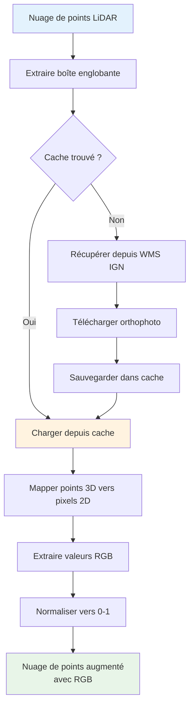
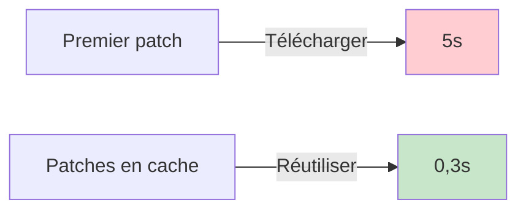

# Augmentation RGB

Enrichissez automatiquement vos nuages de points LiDAR avec les couleurs RGB depuis les orthophotos IGN BD ORTHO® pour améliorer l'apprentissage automatique et la visualisation.

## Vue d'ensemble

L'augmentation RGB récupère des orthophotos haute résolution depuis le service WMS IGN Géoplateforme et mappe les couleurs RGB à chaque point de vos patches LiDAR. Cela crée des jeux de données multi-modaux combinant caractéristiques géométriques et informations photométriques.

:::tip Pourquoi utiliser l'augmentation RGB ?

- **Meilleure précision ML** : L'apprentissage multi-modal exploite à la fois géométrie et couleur
- **Meilleure visualisation** : Nuages de points colorés pour l'analyse
- **Automatique** : Pas de téléchargement manuel ou d'alignement d'orthophotos
- **Haute résolution** : Résolution de 20cm depuis IGN BD ORTHO®
- **Cache intelligent** : Réutilise les orthophotos téléchargées entre patches
  :::

## Démarrage rapide

### Utilisation CLI

Ajoutez les couleurs RGB directement aux fichiers LAZ enrichis avec la commande `enrich` :

```bash
# Enrichissement basique avec RGB
ign-lidar-hd enrich \
  --input-dir tuiles_brutes/ \
  --output tuiles_enrichies_rgb/ \
  --add-rgb \
  --rgb-cache-dir cache/orthophotos/

# Avec mode complet (full) et GPU
ign-lidar-hd enrich \
  --input-dir tuiles_brutes/ \
  --output tuiles_enrichies_rgb/ \
  --mode full \
  --add-rgb \
  --rgb-cache-dir cache/orthophotos/ \
  --use-gpu \
  --num-workers 4

# Traitement parallèle avec RGB
ign-lidar-hd enrich \
  --input-dir tuiles_brutes/ \
  --output tuiles_enrichies_rgb/ \
  --add-rgb \
  --rgb-cache-dir cache/orthophotos/ \
  --num-workers 6
```

:::tip Workflow recommandé
L'augmentation RGB est disponible uniquement avec la commande `enrich`. Enrichissez d'abord vos tuiles avec les couleurs RGB, puis créez des patches à partir des tuiles enrichies avec la commande `patch`.
:::

### API Python

```python
from pathlib import Path
from ign_lidar.rgb_augmentation import IGNOrthophotoFetcher
import laspy
import numpy as np

# Enrichir une tuile LAZ avec RGB
laz_file = Path("tuile_brute.laz")
las = laspy.read(str(laz_file))
points = np.vstack([las.x, las.y, las.z]).T

# Calculer la boîte englobante
bbox = (
    points[:, 0].min(),
    points[:, 1].min(),
    points[:, 0].max(),
    points[:, 1].max()
)

# Récupérer les couleurs RGB
fetcher = IGNOrthophotoFetcher(cache_dir=Path("cache/"))
rgb = fetcher.augment_points_with_rgb(points, bbox=bbox)

# Ajouter RGB au fichier LAZ
if las.header.point_format.id in [2, 3, 5, 7, 8, 10]:
    las.red = rgb[:, 0].astype(np.uint16) * 256
    las.green = rgb[:, 1].astype(np.uint16) * 256
    las.blue = rgb[:, 2].astype(np.uint16) * 256

# Sauvegarder
las.write("tuile_enrichie_rgb.laz")
```

## Comment ça fonctionne



### Pipeline de traitement

1. **Extraction boîte englobante** : Calculer l'étendue spatiale de chaque patch
2. **Vérification cache** : Chercher l'orthophoto existante dans le répertoire de cache
3. **Requête WMS** : Si non en cache, récupérer depuis le service IGN Géoplateforme
4. **Mappage points** : Mapper chaque point 3D (X, Y, Z) vers pixel 2D orthophoto (x, y)
5. **Extraction couleur** : Échantillonner les valeurs RGB depuis l'orthophoto
6. **Normalisation** : Convertir RGB de [0, 255] vers [0, 1] pour compatibilité ML
7. **Stockage** : Sauvegarder patches augmentés avec champ `rgb`

## Spécifications des données

### Détails du service IGN

- **Service** : IGN Géoplateforme WMS
- **Point d'accès** : `https://data.geopf.fr/wms-r`
- **Couche** : `HR.ORTHOIMAGERY.ORTHOPHOTOS`
- **Résolution** : 20cm (0,2m par pixel)
- **CRS** : EPSG:2154 (Lambert 93)
- **Couverture** : France métropolitaine
- **Format** : PNG (RGB 24-bit)

### Format de sortie

Chaque fichier NPZ de patch contient un tableau `rgb` supplémentaire :

```python
{
    'points': np.ndarray,      # Forme : (N, 3) - coordonnées X, Y, Z
    'features': np.ndarray,    # Forme : (N, 30+) - caractéristiques géométriques
    'labels': np.ndarray,      # Forme : (N,) - étiquettes de classification
    'rgb': np.ndarray,         # Forme : (N, 3) - couleurs RGB [0, 1]
    'metadata': dict           # Métadonnées du patch
}
```

**Détails du tableau RGB :**

- **Type** : `np.float32`
- **Forme** : `(N, 3)` où N = nombre de points
- **Plage** : `[0.0, 1.0]` (normalisé depuis 0-255)
- **Ordre** : Rouge, Vert, Bleu
- **Mémoire** : ~196Ko par patch (16384 points × 3 × 4 octets)

## Performance

### Vitesse

| Configuration      | Temps par patch | Notes                                |
| ------------------ | --------------- | ------------------------------------ |
| Géométrie seule    | 0,5-2s          | Pas de récupération RGB              |
| RGB (en cache)     | 0,6-2,5s        | +0,1-0,5s recherche cache & mappage  |
| RGB (non en cache) | 2-7s            | +2-5s pour téléchargement orthophoto |

### Avantages du cache



- **Premier patch par tuile** : ~2-5s (inclut téléchargement)
- **Patches suivants** : ~0,1-0,5s (succès cache)
- **Taille cache** : ~500Ko-2Mo par orthophoto de tuile
- **Accélération** : 10-20x plus rapide avec mise en cache

### Impact mémoire

- **Surcharge par patch** : ~196Ko (minimal)
- **Mémoire cache** : Gérée par le système de fichiers
- **Mémoire de traitement** : Similaire au traitement sans RGB
- **RAM recommandée** : 4Go+ par worker (identique sans RGB)

## Configuration

### Répertoire de cache

Le répertoire de cache stocke les orthophotos téléchargées pour éviter les téléchargements redondants :

```bash
# Par défaut : Pas de mise en cache (plus lent, télécharge à chaque fois)
ign-lidar-hd patch --input tuiles/ --output patches/ --include-rgb

# Avec cache (recommandé)
ign-lidar-hd patch \
  --input tuiles/ \
  --output patches/ \
  --include-rgb \
  --rgb-cache-dir /data/cache/

# Structure du cache
cache/
├── orthophoto_0123_4567.png  # Orthophoto en cache pour la tuile
├── orthophoto_0124_4567.png
└── ...
```

:::tip Bonne pratique
Spécifiez toujours un répertoire de cache pour les workflows de production. Cela améliore considérablement les performances lors du traitement de plusieurs patches depuis la même tuile.
:::

### Configuration Python

```python
from pathlib import Path
from ign_lidar import LiDARProcessor

# Exemple de configuration complète
processor = LiDARProcessor(
    lod_level="LOD2",
    patch_size=10.0,
    include_rgb=True,              # Activer augmentation RGB
    rgb_cache_dir=Path("cache/"),  # Répertoire de cache
    num_workers=4                   # Traitement parallèle
)

# Traiter avec paramètres personnalisés
patches = processor.process_directory(
    input_dir="enrichies/",
    output_dir="patches/",
    num_workers=6
)
```

## Cas d'usage

### Apprentissage automatique

**Classification multi-modale :**

```python
# Entraîner avec géométrie et couleur
import torch
import torch.nn as nn

class ReseauMultiModal(nn.Module):
    def __init__(self):
        super().__init__()
        self.encodeur_geom = nn.Linear(30, 64)  # Caractéristiques géométriques
        self.encodeur_rgb = nn.Linear(3, 16)    # Caractéristiques RGB
        self.classificateur = nn.Linear(80, 15)  # Combiné → classes

    def forward(self, geometrie, rgb):
        caract_geom = self.encodeur_geom(geometrie)
        caract_rgb = self.encodeur_rgb(rgb)
        combine = torch.cat([caract_geom, caract_rgb], dim=-1)
        return self.classificateur(combine)

# Charger patch avec RGB
data = np.load('patch.npz')
geometrie = torch.from_numpy(data['features'])
rgb = torch.from_numpy(data['rgb'])
etiquettes = torch.from_numpy(data['labels'])
```

### Visualisation

**Nuages de points colorés :**

```python
import numpy as np
import matplotlib.pyplot as plt
from mpl_toolkits.mplot3d import Axes3D

# Charger patch
data = np.load('patch.npz')
points = data['points']
rgb = data['rgb']

# Visualiser
fig = plt.figure(figsize=(10, 8))
ax = fig.add_subplot(111, projection='3d')
ax.scatter(
    points[:, 0],
    points[:, 1],
    points[:, 2],
    c=rgb,  # Couleurs RGB directement
    s=1
)
plt.title('Nuage de points augmenté RGB')
plt.show()
```

### Contrôle qualité

**Identifier les désalignements :**

```python
# Vérifier si les couleurs correspondent aux matériaux de bâtiment attendus
data = np.load('patch.npz')
rgb = data['rgb']
etiquettes = data['labels']

# Les murs devraient être gris/blanc/brique
points_murs = rgb[etiquettes == CLASSE_MUR]
couleur_moyenne = points_murs.mean(axis=0)
print(f"Couleur moyenne des murs : R={couleur_moyenne[0]:.2f}, V={couleur_moyenne[1]:.2f}, B={couleur_moyenne[2]:.2f}")
```

## Dépannage

### Dépendances manquantes

```bash
# Erreur : ImportError: requests is required
pip install requests Pillow

# Ou installer toutes les dépendances optionnelles
pip install ign-lidar-hd[rgb]
```

### Problèmes réseau

```python
# Service indisponible ou timeout
# La bibliothèque se dégrade gracieusement - patches créés sans RGB
[WARNING] Échec de récupération orthophoto pour tile_0123_4567: Network timeout
[INFO] Continuation sans augmentation RGB
```

### Gestion du cache

```bash
# Vider le cache pour libérer de l'espace disque
rm -rf /data/cache/orthophotos/

# Vérifier la taille du cache
du -sh /data/cache/orthophotos/
```

### Couleurs manquantes (pixels noir/blanc)

**Cause** : Le point se trouve hors de la couverture d'orthophoto ou sur une zone sans données

**Solution** : La bibliothèque utilise une stratégie de secours :

1. Essayer de récupérer depuis le service IGN
2. Si hors couverture → utiliser [0.5, 0.5, 0.5] (gris)
3. Si pixel sans données → utiliser [0.5, 0.5, 0.5] (gris)

## Référence API

### IGNOrthophotoFetcher

Classe principale pour récupérer et mettre en cache les orthophotos.

```python
from ign_lidar.rgb_augmentation import IGNOrthophotoFetcher
from pathlib import Path

# Initialiser
fetcher = IGNOrthophotoFetcher(cache_dir=Path("cache/"))

# Récupérer orthophoto pour boîte englobante
bbox = (x_min, y_min, x_max, y_max)  # Coordonnées Lambert 93
image = fetcher.fetch_orthophoto(bbox, tile_id="0123_4567")

# Augmenter points avec RGB
import numpy as np
points = np.array([[x1, y1, z1], [x2, y2, z2], ...])
couleurs_rgb = fetcher.augment_points_with_rgb(points, bbox, tile_id="0123_4567")
```

### Fonctions autonomes

```python
from ign_lidar.rgb_augmentation import augment_tile_with_rgb

# Augmenter tuile entière
patches_augmentes = augment_tile_with_rgb(
    patches=liste_patches,
    tile_path="tuile.laz",
    cache_dir=Path("cache/")
)
```

## Bonnes pratiques

### 1. Toujours utiliser la mise en cache

```bash
# ✅ Bon : Avec cache
ign-lidar-hd patch --include-rgb --rgb-cache-dir cache/

# ❌ Lent : Sans cache (télécharge à chaque fois)
ign-lidar-hd patch --include-rgb
```

### 2. Surveiller l'utilisation réseau

L'augmentation RGB télécharge ~1-2Mo par tuile. Pour de grands jeux de données :

- Utiliser la mise en cache pour minimiser les téléchargements
- Considérer le traitement par lots
- Assurer une connexion Internet stable

### 3. Valider la qualité RGB

```python
# Vérifier les statistiques RGB
data = np.load('patch.npz')
rgb = data['rgb']

print(f"Moyenne RGB : {rgb.mean(axis=0)}")
print(f"Écart-type RGB : {rgb.std(axis=0)}")
print(f"Plage RGB : [{rgb.min()}, {rgb.max()}]")

# Devrait être normalisé [0, 1]
assert rgb.min() >= 0 and rgb.max() <= 1
```

### 4. Gérer les dépendances manquantes gracieusement

```python
try:
    from ign_lidar.rgb_augmentation import IGNOrthophotoFetcher
    support_rgb_disponible = True
except ImportError:
    support_rgb_disponible = False
    print("Support RGB non disponible. Installer : pip install requests Pillow")

if support_rgb_disponible:
    processor = LiDARProcessor(include_rgb=True)
else:
    processor = LiDARProcessor(include_rgb=False)
```

## Migration depuis géométrie seule

Les workflows existants continuent de fonctionner sans modifications :

```bash
# Ancien workflow (fonctionne toujours)
ign-lidar-hd process --input tuiles/ --output patches/

# Nouveau workflow avec RGB (opt-in)
ign-lidar-hd patch --input tuiles/ --output patches/ --include-rgb
```

**Compatibilité ascendante :**

- Comportement par défaut inchangé (pas de RGB)
- Scripts existants fonctionnent sans modification
- `--include-rgb` est un drapeau optionnel
- Ancienne commande `process` fonctionne toujours (avec avertissement de dépréciation)

## Ressources connexes

- [Référence des commandes CLI](../guides/cli-commands.md) - Documentation complète des commandes
- [Guide d'utilisation de base](../guides/basic-usage.md) - Pour commencer
- [Détection intelligente de saut](./smart-skip.md) - Reprendre les workflows interrompus
- [IGN Géoplateforme WMS](https://geoservices.ign.fr/services-web-experts-wms) - Documentation officielle

## FAQ

**Q : Ai-je besoin de l'augmentation RGB ?**

R : Non, c'est optionnel. Utilisez-la si vous voulez l'apprentissage multi-modal ou une meilleure visualisation.

**Q : Est-ce que ça ralentit le traitement ?**

R : Première exécution : +2-5s par patch. Avec mise en cache : +0,1-0,5s (impact minimal).

**Q : Que se passe-t-il si les orthophotos ne sont pas disponibles ?**

R : La bibliothèque se dégrade gracieusement - crée des patches sans RGB et enregistre un avertissement.

**Q : Puis-je utiliser mes propres orthophotos ?**

R : Pas directement, mais vous pouvez modifier `rgb_augmentation.py` pour utiliser des sources personnalisées.

**Q : Les données RGB sont-elles précises ?**

R : Oui, IGN BD ORTHO® est à résolution 20cm alignée avec LiDAR HD. Un léger désalignement (&lt;0,5m) peut survenir dans les zones urbaines complexes.

**Q : Combien d'espace disque pour le cache ?**

R : ~0,5-2Mo par tuile. Pour 100 tuiles : ~50-200Mo total.
